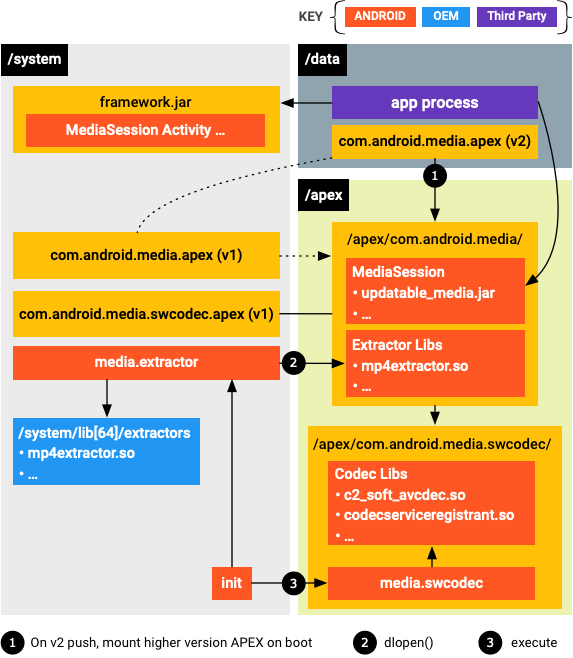

# 模块化系统组件

利用模块化系统组件，Google 和 Android 合作伙伴能够以非侵入方式广泛、快速、无缝地向最终用户设备分发更新。
例如，媒体编解码器碎片和严重错误可能会显著降低应用的采用率和用户互动度。频繁更新媒体相关模块可以减少编解码器碎片，
以使媒体应用在不同 Android 设备上的行为更加一致，并且可以修复严重错误，以建立用户信任。

## 2.0 Overview

Android 10 会将选定的系统组件转换为模块，其中一些模块采用 APEX 容器格式（在 Android 10 中引入），
另一些则采用 APK 格式。借助模块化架构，系统组件能够根据需要以修复严重问题以及做出其他改进的方式进行更新，
而不会影响较低级别的供应商实现或较高级别的应用和服务。


模块更新不会引入新的 API。它们仅使用由兼容性测试套件 (CTS) 保证的 SDK 和系统 API，并且只会彼此之间进行通信，且只使用稳定的 C API 或稳定的 AIDL 接口。

您可以将更新后的模块化系统组件打包在一起，并通过 Google（使用 Google Play 商店基础架构）或 Android 合作伙伴（使用合作伙伴提供的 OTA 机制）将其推送到最终用户设备。
模块软件包会以原子方式安装（和回滚），这意味着所有需要更新的模块都会进行更新，或者所有模块都不会进行更新。
例如，如果某个需要更新的模块出于某种原因无法更新，则设备不会安装软件包中的任何模块。

## 2.1 可用模块

| 					模块名称					|					软件包名称				|  类型      |
| 					:----: 				    |				   :----: 			        |  :----:   |
|	Runtime 								|com.android.runtime.release.apex			|APEX   	|
|	Captive Portal Login					|com.android.captiveportallogin				|APK    	|
|	Conscrypt								|com.android.conscrypt						|APEX   	|
|	DNS Resolver							|com.android.resolv							|APEX   	|
|	DocumentsUI								|com.android.documentsui					|APK    	|
|	ExtServices								|com.android.ext.services					|APK    	|
|	Media Codecs							|com.android.media.swcodec					|APEX   	|
|	Media Extractors and MediaPlayer2		|com.android.media							|APEX   	|
|	ModuleMetadata							|com.android.modulemetadata					|APK    	|
|	Network Stack Permission Configuration	|com.android.networkstack.permissionconfig	|APK    	|
|	Network Components						|com.android.networkstack					|APK    	|
|	PermissionController					|com.android.permissioncontroller			|APK    	|
|	Time Zone Data							|com.android.tzdata							|APEX		|

### 2.1.1 Android Runtime

运行时模块 (com.android.runtime.release.apex) 用于原生和托管式 Android 运行时的 APEX 模块。该模块包含以下组件：

* ART

* Bionic

* 托管核心库（Android 10 中的新组件）

* ICU 库

* libnativebridge

* libnativehelper

* libnativeloader

运行时模块在编译 Android 时生成，包含其组成项目的编译工件。
它与 Conscrypt 模块 (com.android.conscrypt.apex) 以及时区数据模块 (com.android.tzdata.apex) 紧密相关，后者也是 Android 10 中的新模块。

#### 启动序列
启动序列方面的变更
为了支持运行时模块，Android 10 的启动序列更新如下：

1. init 准备引导程序和默认的装载命名空间。tmpfs 装载在 /apex 上，装载点的传播类型设置为 private。
2. apexd 在其他任何进程之前以引导程序模式启动。它会激活 /system/apex 中的 APEX 文件，并将它们装载到引导程序装载命名空间中。
3. 其他预 apexd 进程启动。这些进程位于引导程序装载命名空间中，并随系统 APEX 文件中的库一起提供。
4. /data 执行装载。init 切换到默认的装载命名空间，并将 apexd 作为守护进程启动。
5. apexd 扫描 /data/apex 和 /system/apex，并激活这些目录中最新的 APEX 文件。在此阶段激活的 APEX 文件只能装载在默认命名空间，对预 apexd 进程不可见。


### 2.1.2 Conscrypt

Conscrypt 模块可以加速实现安全改进并提高设备安全性，而无需依赖于 OTA 更新。它使用 Java 代码和原生库来提供 Android TLS 实现以及大部分 Android 加密功能（例如密钥生成器、加密方式和消息摘要）。Conscrypt 作为[开源库](https://github.com/google/conscrypt)提供，但在包含在 Android 平台中时具有一些特化。

Conscrypt 模块使用 [BoringSSL](https://boringssl.googlesource.com/boringssl/)，后者是 Google 在 OpenSSL 基础上派生出的一个原生库，在很多 Google 产品（最值得注意的是 Google Chrome）中用于加密和 TLS。BoringSSL 没有正式版本（所有用户都需要从头构建），并且无法保证 API 或 ABI 稳定性。

#### Android 10 中的变化

Android 9 不包含用于 Conscrypt 的 Android 专有公共 API，而是使用一种安全提供程序。该安全提供程序为 Java 加密架构 (JCA)（包括加密方式和消息摘要）和 Java 安全套接字扩展 (JSSE)（包括 SLSocket 和 SSLEngine）实现了标准类。用户与这些类互动，`libcore` 和框架代码使用了一些非公开的 Conscrypt API。

Android 10 在 `android.net.ssl` 中添加了少量公共 API 方法，以便用户访问 `javax.net.ssl` 下的类未公开的 Conscrypt 功能。此外，Android 10 还包含精简版的 [Bouncy Castle](https://en.wikipedia.org/wiki/Bouncy_Castle_(cryptography))，后者作为 Android Runtime 的一部分提供不太热门的加密工具（未包含在 Conscrypt 模块中）。

#### 格式和依赖项

Conscrypt 模块作为 [APEX](https://source.android.com/devices/tech/ota/apex) 文件进行分发，该文件中包含 Conscrypt Java 代码以及动态链接到 Android NDK 库（例如 `liblog`）的 Conscrypt 原生库。原生库还包含拥有 AArch64 [加密算法验证计划 (CAVP)](https://csrc.nist.gov/projects/cryptographic-algorithm-validation-program) 证书的 BoringSSL 的副本。该副本与[认证测量及验证专家 (CMVP)](https://www.aeecenter.org/certifications/certifications/certified-measurement-verification-professional) 证书**不**兼容。

**注意**：Conscrypt 模块包含 [/external/conscrypt](https://android.googlesource.com/platform/external/conscrypt/) 和 [/external/boringssl](https://android.googlesource.com/platform/external/boringssl/)，但不包含 `/external/bouncycastle`。

Conscrypt 模块公开以下 API：

- **公共 API** 是软件包（位于 `java.*` 和 `javax.*`）中的类和接口以及 `android.net.ssl.*` 下的类的扩展。外部应用代码无法直接调用 Conscrypt。平台 API 标准确保这些 API 保持向后和向前兼容性。
- **核心平台 API** 是框架访问非公开功能时使用的隐藏 API。这些 API 相对有限；最大的用户是 `NetworkSecurityConfig`，它扩展 Conscrypt 信任管理器（用于验证证书的组件）来实现[网络安全配置功能](https://developer.android.com/training/articles/security-config)。
- **核心内 API** 仅限于由 JCA 和 JSEE 机制反射调用的零参数构造函数使用。
- 

### 2.1.3 DNS 解析器

DNS 解析器模块针对 DNS 拦截和配置更新攻击提供用户保护，并且改进了 DNS 解析的网络性能。此模块包含用于实现 DNS 存根解析器的代码，该解析器可将 **www.google.com** 等名称转换为 IP 地址（例如 **2001:db8::1**）。DNS 存根解析器支持 Java API 元素（如 [InetAddress#getAllByName](https://developer.android.com/reference/java/net/InetAddress#getAllByName(java.lang.String)) 和 [Network#getAllByName](https://developer.android.com/reference/android/net/Network#getAllByName(java.lang.String))）以及[原生网络功能](https://developer.android.com/ndk/reference/group/networking)，且可发送和接收 DNS 查询以及缓存结果。

#### Android 10 中的变化

在搭载 Android 9 及更低版本的设备上，DNS 解析器代码分布在 Bionic 和 `netd` 中。DNS 查找集中在 `netd` 守护进程中，以便进行系统级缓存，而应用在 Bionic 中调用函数（例如 `getaddrinfo`）。查询通过 UNIX 套接字发送到 `/dev/socket/dnsproxyd`，再到 `netd` 守护进程，该守护进程会解析请求并再次调用 `getaddrinfo`，以发出 DNS 查找，然后它会缓存结果以便其他应用可以使用它们。DNS 解析器实现主要包含在 `bionic/libc/dns/` 中，部分包含在 `system/netd/server/dns` 中。

Android 10 将 DNS 解析器代码移至 `system/netd/resolv,`将其转换为 C++，然后对代码进行翻新和重构。由于应用兼容性方面的原因，Bionic 中的代码继续存在，但系统不会再调用它们。以下源文件路径受到重构的影响：

- `bionic/libc/dns`
- `system/netd/client`
- `system/netd/server/dns`
- `system/netd/server/DnsProxyListener.*`
- `system/netd/resolv`

#### 格式和依赖项

DNS 解析器模块以 [APEX](https://source.android.com/devices/tech/ota/apex) 文件的形式提供，并由 `netd` 动态链接；但是，`netd` **不是**依赖项，因为模块直接提供本地套接字 `/dev/socket/dnsproxyd`。解析器配置的 Binder 端点从 `netd` 移至解析器，这意味着系统服务可以直接调用解析器模块（无需通过 `netd`）。

DNS 解析器模块依赖 `libc` (Bionic) 并静态链接其依赖项；不需要使用其他库。


### 2.1.4 DocumentsUI

DocumentsUI 模块控制对处理文档权限（例如将文件附加到电子邮件）之组件的特定文件的访问权限。将存储访问权和权限加入可更新模块有助于更好地保障最终用户的隐私和安全，同时使 Android 合作伙伴能够通过运行时资源叠加层 (RRO) 自定义应用的功能和主题。这种模块格式确保所有设备都能提供相同的 DocumentsUI 体验，从而使开发者能够了解用户看到相关 API 的哪些部分。

#### Android 10 中的变化

在 Android 10 中，DocumentsUI 模块实现了 `GET_CONTENT` 操作，该操作使应用能够请求访问用户的其他数据。作为可更新模块，DocumentsUI：

- 仅通过稳定的 `@SystemApi` API（不使用 `@hide` API）与框架进行互动。
- 提供了一种机制，使 Android 合作伙伴能够自定义功能和主题。
- 使用签名权限保护 `MANAGE_DOCUMENTS` 权限。

#### 格式和依赖项

DocumentsUI 模块作为 APK 文件提供。它依赖于签名权限保护的 `MANAGE_DOCUMENTS` 权限，同时另一个权限类可确保设备上只有一个应用具有 `MANAGE_DOCUMENTS` 权限。


### 2.1.7 ExtServices

ExtServices 模块更新了框架组件，例如存储、自动填充、通知助手以及其他持续运行的服务。该模块与 DocumentsUI 以及 PermissionController 一起，确保最终用户获得一致的权限界面，同时启用迭代以响应不断变化的隐私环境和政府法规。

#### Android 10 中的变化

`com.android.ext.services` APK 包含以下服务：

- [`AutofillFieldClassificationService`](https://android.googlesource.com/platform/frameworks/base/+/master/core/java/android/service/autofill/AutofillFieldClassificationService.java)
- [`NotificationAssistantService`](https://android.googlesource.com/platform/frameworks/base/+/master/core/java/android/service/notification/NotificationAssistantService.java)
- [`ResolverRankerService`](https://android.googlesource.com/platform/frameworks/base/+/master/core/java/android/service/resolver/ResolverRankerService.java)
- [`CacheQuotaService`](https://android.googlesource.com/platform/frameworks/base/+/master/core/java/android/app/usage/CacheQuotaService.java)

#### 格式和依赖项

ExtServices 模块作为 APK 文件提供。

### 2.1.8 Media

Android 10 提供可更新的媒体组件，支持通过 Google Play 商店基础架构或通过合作伙伴提供的 OTA 机制更新框架组件。借助该功能，您无需进行完整的系统映像更新，即可提供安全更新和功能更新。

可更新的媒体组件如下：

- 媒体提取器
- Media2 API (`MediaSession2`)
- 媒体编解码器


#### 软件包格式

软件包格式为 Android Pony EXpress (APEX)。


#### 可更新的媒体组件

本部分介绍了为使媒体提取器、Media2 API 和媒体编解码器等媒体组件可更新，Android 10 中引入的更改。

##### 媒体提取器

为了为实现可更新性做准备，媒体提取器已成为单独的组件（而不是像在 Android 9 之前的版本中一样编译到 `libstagefright.so`）。它们进一步更新为仅依赖 NDK API。

每个提取器都有自己的 `.so` 文件。`.so` 有一个入口点，该入口点提供一个嗅探器函数（用于确定提取器是否可以处理给定媒体文件），和一个工厂函数（用于为给定媒体文件创建提取器实例）。每个提取器都会进行命名和版本控制。命名有助于调试，而版本控制可以指示哪个提取器是最新的。由于 Android 会加载所有可用的提取器 `.so` 文件，因此 OEM 只需添加新的 `.so` 文件即可添加自己的提取器，而无需修改 libstagefright 或其他媒体框架库。如果 OEM 更新提取器，Google 会找到并使用它们（如果需要，有多种方法可以确保系统会首选 OEM 的提取器而不是 Google 提供的提取器）。

##### Media2 API (MediaSession2)

本部分介绍了添加到可更新媒体组件的 Media2 组件，具体而言，即 MediaSession2。

Android 10 中添加的 MediaSession2 API 使用了一个进程，该进程可让媒体应用向其他进程（包括 Android 框架和其他应用）公开其传输控件和播放信息。

##### 媒体编解码器

现有的 OMX 编解码器 API 不可更新，但 OEM 仍然可以在 Android 10 的供应商分区中使用它。在 Android 10 中，SW Codec2 组件是可更新的。

#### 自定义选项和更新机制

本部分概述了更新机制以及添加供应商扩展的方法。

##### 更新机制

APEX 是一种新的容器格式，用于通过 Play 商店更新系统组件。更新通过 APEX 软件包提供。该软件包中包含更新的 Java 代码和原生代码，这些代码由设备上已存在的框架组件加载。




安装 APEX 软件包并在启动时装载磁盘映像后，媒体系统进程（`media.extractor` 和 `media.codec`）会从装载点加载更新后的模块。

##### 供应商扩展

###### 媒体提取器

对于媒体提取器，如果合作伙伴认为 Google 的默认提取器不能满足其要求，可以使用他们自己的提取器插件。自定义提取器插件可以放在 `/system/lib[64]/extractors/` 下，提取器进程会从 Google 的 APEX 软件包以及 `/system/lib[64]/extractors/` 加载提取器插件。

###### 媒体编解码器

对于媒体编解码器，合作伙伴需要设置供应商编解码器服务。服务的框架实现在 `frameworks/av/media/codec2/hidl/services/` 中提供。服务需要使用 Codec 2.0 接口（在 `frameworks/av/media/codec2/core/` 中定义）来调用其组件的实现。库的入口点是 C2ComponentStore 接口，您可以引用 `frameworks/av/media/codec2/vndk/C2Store.cpp` 中的 Android 默认软件编解码器存储实现。

合作伙伴可以使用与 mediaswcodec 服务中的加载行为类似的 APEX 加载行为。供应商编解码器服务进程可以采用与 mediaswcodec 类似的方式构建。负责注册所有 C2 组件的顶级共享库可以与传递依赖项一起定义并打包到位于供应商分区上的 APEX 软件包。然后，供应商编解码器服务进程便可以在启动时加载该顶级入口点。

###### Media2 API (MediaSession2)

对于 `MediaSession2`，如果代码已针对 AOSP 设备开源，则不允许进行供应商修改。对于旧版 `MediaPlayer` 和 `MediaSession` API 上的现有修改，供应商应尽可能将其更改上游化。如果无法上游化，Google 会考虑通过逐一查看相应更改，提供扩展。

#### 自定义的生命周期

​	在添加对 AVI 文件中的 Windows Media 视频的支持这一示例中，需要有以下两个主要组件才能在 Android 媒体框架中支持其他媒体类型：AVI [提取器](https://source.android.com/devices/media/updatable-media#extractor)和 Windows Media 视频[解码器](https://source.android.com/devices/media/updatable-media#decoder)。

####### 提取器

提取器应该实现由 `frameworks/av/include/media/MediaExtractorPluginApi.h` 定义的 API，并且可以使用 `frameworks/av/include/media/MediaExtractorPluginHelper.h` 中的 C++ 便捷封装容器。

有关提取器插件 API，请参阅 AOSP 代码中的最新版本。

提取器应仅依赖稳定的 NDK API，不应依赖私有 API。

供应商提取器应位于 `/system/lib/64/extractors` 或供应商 APEX 中，后者会随包含 Google 提取器的 Google APEX 一起打开。

可以检查框架是否加载了您的提取器，方法是运行 `adb shell dumpsys media.extractor`，运行后会生成如下内容。

```
Available extractors:
AAC Extractor: plugin_version(2), uuid(4fd80eae03d24d729eb948fa6bb54613), version(1), path(/system/lib64/extractors/libaacextractor.so)
AMR Extractor: plugin_version(2), uuid(c86639c92f3140aca715fa01b4493aaf), version(1), path(/system/lib64/extractors/libamrextractor.so)
FLAC Extractor: plugin_version(2), uuid(1364b048cc454fda9934327d0ebf9829), version(1), path(/system/lib64/extractors/libflacextractor.so)
MIDI Extractor: plugin_version(2), uuid(ef6cca0af8a243e6ba5fdfcd7c9a7ef2), version(1), path(/system/lib64/extractors/libmidiextractor.so)
MP3 Extractor: plugin_version(2), uuid(812a3f6cc8cf46deb5293774b14103d4), version(1), path(/system/lib64/extractors/libmp3extractor.so)
MP4 Extractor: plugin_version(2), uuid(27575c6744174c548d3d8e626985a164), version(2), path(/system/lib64/extractors/libmp4extractor.so)
MPEG2-PS/TS Extractor: plugin_version(1), uuid(3d1dcfebe40a436da574c2438a555e5f), version(1), path(/system/lib64/extractors/libmpeg2extractor.so)
Matroska Extractor: plugin_version(2), uuid(abbedd9238c44904a4c1b3f45f899980), version(1), path(/system/lib64/extractors/libmkvextractor.so)
Ogg Extractor: plugin_version(2), uuid(8cc5cd06f772495e8a62cba9649374e9), version(1), path(/system/lib64/extractors/liboggextractor.so)
WAV Extractor: plugin_version(3), uuid(7d61385858374a3884c5332d1cddee27), version(1), path(/system/lib64/extractors/libwavextractor.so)
```

Android 10 仅支持最高版本的提取器 API。在查看当前提取器以便之后对您自己的提取器建模时，请使用 API 版本号最高的提取器。

可以扩展现有的提取器（例如，以支持在 MP4 文件中打包的新视频编码格式），而不是为全新格式添加提取器。实现这一目的的首选方式是将更改上游化。这样，您的更改就会成为平台的一部分，您也无需再维护自己的提取器。如果您无法或不愿意将更改上游化，则必须创建一个单独的提取器（如上所述）。唯一的不同之处在于，您的提取器支持的格式已有其他提取器支持。为确保系统会使用您的提取器，相比 Google 提供的提取器，应让其 `Sniff()` 函数返回更高的置信水平。

###### 解码器

当您的提取器就位并由媒体框架加载时，媒体框架可以识别该文件并获取有关其内容的信息。

下一步是针对您要添加支持的格式添加解码器。

> **注意**：仅在相应格式尚不受支持的情况下才需要添加解码器。例如，如果您添加了对包含 MP3 的 AVI 文件的支持，则只需要添加 AVI 提取器，因为 MP3 解码器已经存在。

在我们的 Windows-Media-in-AVI 示例中，需要添加 Windows Media 解码器。

添加新解码器的方式与针对 AVC 或 HEVC（举例来说）添加自己的硬件解码器的方式大致相同。

>  **注意**：虽然提取器会发布它包含的媒体轨道的 MIME 类型，但是也需要存在支持这些 MIME 类型的编解码器，这样，该文件才会完全受支持。严格来说，使用的实际 MIME 类型字符串是提取器和编解码器之间的一种协议。它不一定需要添加到 `MediaDefs.h` 文件中。

###### 媒体扫描器

如果您希望媒体扫描器找出新支持的文件类型并将其添加到媒体数据库，则媒体扫描器必须了解相应文件类型。

从 Android 10 开始，`MediaFile.java` 文件不再包含从 MIME 到扩展的映射。相反，该映射由 `libcore` 中的 `MimeUtils` 维护。MIME 类型列表包含当前映射的列表。

`MediaFile` 仍包含从 MIME 类型到 MTP 格式常量的映射。我们的示例 AVI 已包括在该映射中。

提取器可以导出它们支持的文件扩展名列表（MP3、MP4 等）。但是，仅当使用 `LegacyMediaScanner` 时才会使用该列表。它对默认使用的 `ModernMediaScanner` 没有影响。

### 2.1.9 ModuleMetadata

ModuleMetadata 模块包含指定设备上模块列表的元数据。系统会在系统服务器启动后立即解析并缓存这类元数据。


ModuleMetadata APK 包含用于实现 [`PackageManager`](https://developer.android.com/reference/android/content/pm/PackageManager) API 中 `getModuleInfo` 和 `getInstalledModules` 方法的 `ModuleInfoProvider`。这些方法由从模块元数据提供商软件包解析的 XML元数据提供支持。模块元数据软件包的软件包名称存储在 `config_defaultModuleMetadataProvider` 配置值中。

模块元数据提供商必须包含其 `` 标记的 `` 条目。元数据条目必须包含单个密钥 (`android.content.pm.MODULE_METADATA`)，该密钥的值是对 XML 资源的引用，后者包含指定设备上模块列表的元数据。


##### 格式和依赖项

ModuleMetadata 模块作为 APK 文件提供。在 XML 文档中，元数据包含一个顶级 `` 元素（具有一个或多个子项）。每个子项都是一个 `` 元素，包含以下属性：

- `name` 是对用户可见的软件包名称的资源引用。映射到 `ModuleInfo#getName`。
- `packageName` 是模块的软件包名称。映射到 `ModuleInfo#getPackageName`。
- `isHidden` 表示模块是否已隐藏。映射到 `ModuleInfo#isHidden`。

例如：

```xml
<module-metadata>
    <module name="@string/resource" packageName="package_name" isHidden="false|true" />
    <module .... />
</module-metadata>
```


### 2.1.10 Network

Android 10 包含以下网络模块：

- 网络组件模块，用于提供常见的 IP 服务、网络连接监控和强制登录门户检测。
- 网络堆栈权限配置模块，定义了一种可让模块执行网络相关任务的权限。


#### 网络组件模块

网络组件模块可以确保 Android 能够适应不断完善的网络标准，还支持与新实现进行互操作。例如，通过针对强制门户检测和登录代码的更新，Android 能够及时了解不断变化的强制门户模型；通过针对高级政策防火墙 (APF) 的更新，Android 能够在新型数据包变得常见的同时节省 WLAN 耗电量。

##### Android 10 中的变化

网络组件模块包含以下组件。

- **IP 服务。** IpClient（以前称为 IpManager）组件负责处理 IP 层配置和维护。在 Android 9 中，它被蓝牙等组件用于进程间处理，被 WLAN 等组件用于进程内处理。DhcpClient 组件从 DHCP 服务器获取 IP 地址，以便将它们分配给接口。
- **NetworkMonitor。** NetworkMonitor 组件会在连接到新网络或出现网络故障时、检测强制门户时以及验证网络时测试互联网可达性。
- **强制门户登录应用。** 强制门户登录应用是一款预安装应用，负责管理强制门户的登录操作。自 Android 5.0 开始，此应用一直是一款独立应用，但它会与 NetworkMonitor 交互，以将一些用户选择项转发给系统。

在使用网络组件模块的设备上，系统会将上述服务重构为其他进程，并使用[稳定的 AIDL 接口](https://source.android.com/devices/bootloader/stable-aidl)进行访问。重构路径如下表所示。

###### IP 服务重构路径

| Android 9 及更低版本  | 在 `frameworks/base/services/net/java/android/net/` 中：<br>apf<br>dhcp<br>ip<br>netlink<br>util |
| --------------------- | ------------------------------------------------------------ |
| Android 10 及更高版本 | packages/modules/NetworkStack                                |

#### 格式和依赖项

网络组件模块作为三个 APK 提供：一个用于 IP 服务，一个用于强制门户登录，一个用于[网络堆栈权限配置](https://source.android.com/devices/architecture/modular-system/networking#network-stack-permission-config)。

网络组件模块依赖于以下各项：

- **系统服务器中的特权 `@hide` 方法**（如 `IConnectivityManager.aidl` 中的此类方法）。这些 API 带有 `@SystemApi` 注释并受到适当保护，这样一来，该模块可以访问它们，但其他特权应用（如使用新签名权限的应用）则不能。
- **`INetd.aidl` 中定义的指向 `netd` 的 Binder IPC。** 此接口已转换为稳定的 AIDL，并且需要进行一致性测试。


### 2.1.11 PermissionController

PermissionController 模块启用可更新的隐私权政策和界面元素（例如，围绕授予权限和管理权限的政策和界面）。此模块可处理与权限相关的界面和逻辑（重构自软件包安装程序）以及角色（允许出于特定目的访问应用）。

#### Android 10 中的变化

`com.android.permissioncontroller` APK 可处理与权限相关的界面、逻辑和角色，以允许出于特定目的访问应用。它可以控制以下方面：

- 授予运行时权限（包括向系统应用授予权限）
- 管理运行时权限（包括权限分组）
- 跟踪运行时权限使用情况（Android 10 中的新功能）
- 角色（Android 10 中的新功能）

在 Android 9 中，此类权限为 `com.android.packageinstaller` 的一部分。在 Android 10 及更高版本中，软件包安装程序应用将会被拆分，以确保更新权限逻辑。

作为可更新的 Android 模块，PermissionController：

- 仅通过稳定的 `@SystemApi` API（不使用 `@hide` API）与框架进行互动。
- 处理优先级大于 0 的权限相关 intent。
- 提供了一种机制，使 Android 合作伙伴能够自定义主题。
- 提供系统和应用可以绑定的服务，包括角色管理、权限撤消和基本权限信息（适用于“设置”）。

#### 格式和依赖项

PermissionController 模块作为 APK 文件提供。

### 2.1.12 Timezone

时区数据模块会更新 Android 设备上的夏令时 (DST) 和时区，并将数据（会因宗教、政治和地缘政治而频繁变化）和整个生态系统的更新机制标准化。如需详细了解时区数据，请参阅[时区规则](https://source.android.com/devices/tech/config/timezone-rules)。

#### Android 10 中的变化

Android 10 弃用了[基于 APK 的时区数据更新机制](https://source.android.com/devices/tech/config/timezone-rules)（在 Android 8.1 和 Android 9 中使用），并将其替换为[基于 APEX 的模块更新机制](https://source.android.com/devices/tech/ota/apex)。AOSP 继续包含基于 APK 的更新所需的平台代码，因此升级到 Android 10 的设备仍然可以通过 APK 接收合作伙伴提供的时区数据更新。不过，不能在同时接收模块更新的生产设备上使用 APK 更新机制，因为基于 APK 的更新将取代基于 APEX 的更新（即接收 APK 更新的设备会忽略基于 APEX 的更新）。

#### 格式和依赖项

时区数据模块作为 [APEX](https://source.android.com/devices/tech/ota/apex) 文件进行分发。


