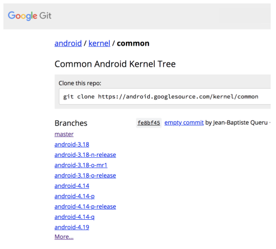

# 内核

Linux 内核是几乎所有的 Android 设备上极其重要的软件组成部分。本部分介绍了 Linux 内核开发和版本模型（如下）、
稳定的长期支持 (LTS) 内核（包括所有 Android 设备都应使用稳定版本而非择优挑选补丁程序的原因）、
内核配置和加固、接口和模块化内核要求（在 Android O 中推出）、内核调试和网络测试以及 SquashFS。4.

## 4.1 Android 通用内核

AOSP 通用内核是长期支持 (LTS) 内核的下游，包含与 Android 社区相关但尚未合并到 LTS 的补丁程序。这些补丁程序可能包括：

* 针对 Android 需求定制的功能（例如交互式 cpufreq 调节器）。

* 由于实现方面的问题而被上游拒绝的功能（例如 MTP/PTP、Paranoid Networking）。

* 可供 Android 设备使用但仍处于开发上游阶段的功能（例如 Energy Aware Scheduling/EAS）。

* 对其他方有用的供应商/OEM 功能（例如 sdcardfs）。

### 4.1.1 通用内核列表

查看 [Android 通用内核列表](https://android.googlesource.com/kernel/common)




### 4.1.2 要求

所有 AOSP 通用内核必须提供以下各项：

* 用于下游合作伙伴及时获取最新更新（包括所有 LTS 补丁程序）的方法。
* 用于确保新功能开发不会影响从 AOSP 通用内核合并的机制（即使之前的 Android 版本也不受影响）。
* 用于下游合作伙伴轻松识别属于 Android 安全公告 (ASB) 范围内的安全补丁程序的方法。如果 OEM 尝试包含公告中未列出的补丁程序，则满足运营商有关全面重新认证的要求。

此外，必须在 AOSP 通用内核上定期执行测试，并且在分支通过测试时对其进行标记。

#### LTS 合并
为确保下游合作伙伴能够及时获取最新更新（包括所有 LTS 补丁程序），
android-X.Y 将从 LTS 获取定期合并，并通过自动 VTS、CTS 和编译/启动测试进行验证。

#### Android-dessert 版本分支

为确保新功能开发不会影响从 AOSP 通用内核合并（即使之前的 Android 版本也不受影响），android-X.Y-androidRel 是从 Android-dessert 最初版本之前的 android-X.Y 克隆的，
它会从 LTS 获取定期合并，并基于相关的 Android 版本进行测试。例如，android-4.4-n 分支从 LTS 4.4.y 分支获取合并。

#### Android-release 版本分支

为确保下游合作伙伴能够轻松识别属于 ASB 范围内的安全补丁程序，android-X.Y-androidRel-type 是从 Android 版本发布时的 android-X.Y-androidRel 克隆的，并且只能获取公告中列出的补丁程序。

在确认与公告相关的补丁程序合并到版本分支之后，相应分支将用 ASB 级别进行标记。例如，标记 ASB-2017-10-05 表示相应版本分支包含 2017 年 10 月 5 日发布的 Android 安全公告中的补丁程序。
父分支包含这些安全补丁程序，因此，如果 android-4.4-o-release 分支标记为 ASB-2017-10-01，则 android-4.4-o 和 android-4.4 也是用相应公告中的补丁程序进行更新的最新版本。例如：

在发布 Android N MR1 之前，android-4.4-n-mr1 是从 android-4.4-n 克隆的。
只有 ASB 中列出的补丁程序才会进行合并，允许 OEM（运营商对其有严格的要求，旨在避免对安全更新进行全面重新认证）查找公告中列出的补丁程序。
android-4.4-n-mr2 将由 android-4.4-n-mr1 以及这两个版本之间合并的 LTS 补丁程序构成。
每个月 ASB 公开发布时，相应版本分支都会使用公告中提及的所有上游补丁程序进行更新（公告中提及的设备特定补丁程序不会应用于通用内核）。


#### 准则

Android 实现应使用以下内核准则：

* 将新的 AOSP 通用内核用作上游合并源。
	* 要从 LTS 获取补丁程序，需从 android-X.Y 合并。
		* 在开发阶段定期合并。
		* 将设备更新至新的 Android 版本时，需从 android-X.Y 分支或目标版本的版本分支合并（例如，要更新至 Nougat MR2，需从 android-4.4-n-mr2 分支合并）。
	* 如果运营商对安全更新补丁程序有限制，则需从版本分支合并，以便进行安全更新。
* 将修复程序发送至上游主线内核、LTS 内核或 AOSP 通用内核。


## 4.2 模块化内核要求

Android 8.0 中引入了模块化内核，将设备内核分为系统芯片 (SoC)、设备和板专属组件。
这一变化使得原始设计制造商 (ODM) 和原始设备制造商 (OEM) 可以在独立的板专属树中使用板专属功能、驱动程序等，使他们可以替换通用的内核配置、以内核模块的形式添加新的驱动程序等。

Android 中的模块化内核支持包括：

* 对于独立 SoC 和 OEM/ODM 内核开发的平台支持。Android 9 及更高版本建议以设备中的内核模块的形式编译和推出所有板专属代码。因此：
	* 所有平台都应支持设备树或高级配置与电源接口 (ACPI)，以便描述所有不可发现的设备。
	* 所有基于设备树的平台都应将板专属设备节点作为叠加层添加到内核设备树中。
	
* 在供应商测试套件 (VTS) 中支持应用二进制接口 (ABI)/应用编程接口 (API) 测试。这些测试能够确保指定内核可以运行 Android 开源项目 (AOSP) 框架。

* 每个 Android 版本的最低内核版本。

* 对于生成 Android 供应商接口 (VINTF) 内核对象的支持。

### 4.2.1 可加载的内核模块

Android 8.0 中引入的模块化内核要求规定，所有系统芯片 (SoC) 内核都必须支持可加载的内核模块。

#### 内核配置选项

为了支持可加载的内核模块，所有常见内核中的 [android-base.cfg](./android-base.cfg) 都包含以下内核配置选项（或其内核版本等效选项）：

```cfg
CONFIG_MODULES=y
CONFIG_MODULE_UNLOAD=y
CONFIG_MODVERSIONS=y
```

所有设备内核都必须启用这些选项。内核模块还应尽可能支持卸载和重新加载。

注意：CONFIG_MODULE_SRCVERSION_ALL 是可选的，并且未经过测试。

#### 模块签名

原始设计制造商 (ODM) 可以选择性启用以下内核配置选项，以在其内核配置中启用模块签名：

```cfg
CONFIG_MODULE_SIG=y
CONFIG_MODULE_SIG_FORCE=y
```

在需要支持验证启动的设备上，Android 要求内核模块位于启用 dm-verity 的分区中。模块签名并非强制性要求，也不会进行测试；不过，如有需要，ODM 也可以启用模块签名，
但前提是 ODM 拥有所需的密钥签名及其他基础架构，以确保未来可进行独立的内核和文件系统 OTA 更新。

#### 文件位置

Android 7.x 及更低版本对内核模块（包括对 insmod 和 rmmod 的支持）没有强制要求，而 Android 8.x 及更高版本建议在生态系统中使用内核模块。

除了按 Android 启动模式的可用情况对内核模块进行分类之外，还可以按照所有者（SoC 供应商或 ODM）进行分类。如果使用了内核模块，则它们在文件系统中的放置位置的要求如下：

* 所有内核都应内置对启动和装载分区的支持。
* 必须从只读分区加载内核模块。
* 对于需要支持验证启动的设备，应从验证分区加载内核模块。
* 内核模块不应位于 /system 中。
* 完整 Android 模式或充电模式所需的 SoC 供应商内核模块应该位于 /vendor/lib/modules 中。
* 如果存在 ODM 分区，则完整 Android 模式或充电模式所需的 ODM 内核模块应该位于 /odm/lib/modules 中。如果不存在，则这些模块应该位于 /vendor/lib/modules 中。
* 来自 SoC 供应商和 ODM 且恢复模式所需的内核模块应该位于 /lib/modules 下的恢复 ramfs 中。
* 恢复模式和完整 Android/充电模式所需的内核模块应同时位于恢复 rootfs 以及 /vendor 或 /odm 分区中（如上所述）。
* 恢复模式所用的内核模块不应依赖仅位于 /vendor 或 /odm 中的模块，因为这些分区在恢复模式下没有装载。
* SoC 供应商内核模块不应依赖 ODM 内核模块。

在 Android 8.x 及更高版本中，为使模块能够从这些分区加载，已进行相关配置，以便为非 A/B 和 A/B 设备提前装载分区。这还确保了在 Android 和充电模式下均装载分区。

#### Android 编译系统支持

在 BoardConfig.mk 中，Android 编译系统定义了 BOARD_VENDOR_KERNEL_MODULES 变量，此变量提供了用于供应商映像的内核模块的完整列表。
此变量中列出的模块会被复制到位于 /lib/modules/ 的供应商映像中，在 Android 中装载后会显示在 /vendor/lib/modules 中（根据上述要求）。下面是一个供应商内核模块的配置示例：

```bash
vendor_lkm_dir := device/$(vendor)/lkm-4.x
BOARD_VENDOR_KERNEL_MODULES := \
  $(vendor_lkm_dir)/vendor_module_a.ko \
  $(vendor_lkm_dir)/vendor_module_b.ko \
  $(vendor_lkm_dir)/vendor_module_c.ko
```

在此示例中，供应商内核模块预编译代码库会映射到 Android 编译系统中的上述位置。

恢复映像可能包含供应商模块的子集。Android 编译系统定义了这些模块的变量 BOARD_RECOVERY_KERNEL_MODULES。示例：

```bash
vendor_lkm_dir := device/$(vendor)/lkm-4.x
BOARD_RECOVERY_KERNEL_MODULES := \
  $(vendor_lkm_dir)/vendor_module_a.ko \
  $(vendor_lkm_dir)/vendor_module_b.ko
```

Android 编译系统负责运行 depmod 以在 /vendor/lib/modules 和 /lib/modules (recovery ramfs) 中生成所需的 modules.dep 文件。

#### 模块加载和版本管理

通过调用 modprobe -a 从 init.rc* 一次加载所有内核模块。这样可以避免重复初始化 modprobe 二进制文件的 C 运行时环境产生的开销。您可以修改 early-init 事件来调用 modprobe：

```
on early-init
    exec u:r:modprobe:s0 -- /vendor/bin/modprobe -a -d \
        /vendor/lib/modules module_a module_b module_c ...
```

通常，内核模块必须使用将与此模块结合使用的内核进行编译，否则，内核会拒绝加载此模块。 CONFIG_MODVERSIONS 通过检测应用二进制接口 (ABI) 中的损坏情况提供一种解决方法。
此功能会为内核中导出的每个符号的原型计算循环冗余校验 (CRC) 值，并将这些值作为内核的一部分存储起来；对于内核模块所使用的符号，相应的值也会存储在内核模块中。模块加载完成后，模块所用符号的值将与内核中的相应值进行比较。如果这些值相互匹配，则加载模块；如果不匹配，则模块加载会失败。

> 注意：如需在比较、跟踪和缓解内核 ABI 更改（会影响与内核模块的兼容性）方面获得帮助，请参阅  监控实用程序中的脚本和实用程序。

要使内核映像的更新独立于供应商映像，请启用 CONFIG_MODVERSIONS。这样做可以在确保与供应商映像中的现有内核模块保持兼容的同时，对内核进行小幅度更新（例如 LTS 提供的问题修复）。不过，CONFIG_MODVERSIONS 本身并不会修复 ABI 损坏。如果内核中某个导出的符号的原型由于源代码的修改或内核配置更改而发生变化，则会破坏与使用此符号的内核模块的兼容性。在此类情况下，必须重新编译内核模块。
例如，内核中的 task_struct 结构（在 include/linux/sched.h 中定义）包含很多字段，具体包含的字段根据相关条件取决于内核配置。sched_info 字段仅在 CONFIG_SCHED_INFO 启用（启用 CONFIG_SCHEDSTATS 或 CONFIG_TASK_DELAY_ACCT 时发生）时才显示。如果这些配置选项的状态发生变化，task_struct 结构的布局也将发生变化，同时，从内核导出的使用 task_struct 的所有接口都会发生变化（如 kernel/sched/core.c 中的 set_cpus_allowed_ptr）。
与使用这些接口的之前编译的内核模块的兼容性将会被破坏，这就需要使用新的内核配置重新编译这些模块。
要详细了解 CONFIG_MODVERSIONS，请参阅位于 Documentation/kbuild/modules.txt 的内核树中的相关文档。


### 4.2.2 DTO支持

[设备树叠加层 (DTO)](https://source.android.com/devices/architecture/dto/) 扩展了现有的[扁平化设备树 (FDT)](https://events.linuxfoundation.org/sites/events/files/slides/petazzoni-device-tree-dummies.pdf) 实现，让用户空间（在运行时）可以通过加载用于修改原始数据的额外叠加层 FDT 来修改内核中的初始设备树数据。Android 不需要在运行时更新用户空间的 DT Blob，而是建议供应商借助 `libfdt` 或 `libufdt` 在引导加载程序中添加设备树补丁程序。


#### Android DTO 支持

Android 对 DTO 的支持因 Android 版本而异：

- Android 7.x 及更早版本不要求提供设备树支持，同时，没有针对供应商如何将 DT Blob 传递给内核或在何处存储这些 Blob 提供建议。
- Android 8.x 建议提供设备树支持，以将内核的板专属部分和仅限 SoC 访问的部分区分开来。
- Android 9 及更高版本要求必须存在设备树 Blob 叠加层 (DTBO) 分区并且至少应用一个 DTO。


#### DTO 分区要求

多数 Android 设备都在编译时将 DT Blob 附加到内核中，并且引导加载程序会从内核加载 Blob。但是，由于 DT Blob 被视为系统芯片 (SoC) 内核的一部分，因此 Android 对如何编译或存储 DT Blob 没有特定要求。设备可以将 DT Blob 附加到内核，也可以将 Blob 存储在单独的分区中；唯一的要求是引导加载程序应该知道如何加载以及从何处加载 DT Blob。

**注意**：要详细了解分区格式，请参阅 [DTB/DTBO 分区](https://source.android.com/devices/architecture/dto/partitions)。

要支持 DTO，设备应具备以下条件：

- 每个适用于板专属 DT 叠加层的内核映像都应具有一个 DTBO 分区，并且引导加载程序必须知道从何处以及如何加载 SoC 专属 DTB。分区大小取决于编译 SoC 内核所需的更改数量；选择分区大小时需要为未来更新留出空间，通常，8 MB 大小的分区已绰绰有余。
- [针对 A/B 设备更新](https://source.android.com/devices/tech/ota/ab_updates)了 DTO 分区。恢复内核与 Android 内核相同，但分区必须针对 A/B 设备设置，因为这样才可以通过无线下载 (GOTA) 更新进行更新。分区大小取决于设备以及主 SoC 内核 DT Blob 上所需的更改数量。


#### DTO 引导加载程序要求

要支持 DTO，引导加载程序应具备以下条件：

- 知道如何以及从何处（考虑使用 A/B 设备的启动槽）以供应商独有的方式加载 SoC 专属 DT Blob（通常是从内核映像的末端提取，因为 Blob 已附加到内核中）。
- 知道如何以及从何处以供应商独有的方式加载叠加层 DT Blob。
- 将组合设备树传递给内核之前，使用叠加层修补主 DT Blob。

要详细了解如何在引导加载程序中增加对 DTO 的支持，请参阅[设备树叠加层](https://source.android.com/devices/architecture/dto/index)。


### 4.2.3 核心内核要求

Android 8.0 及更高版本指定了最低内核版本和内核配置，并由供应商测试套件 (VTS) 和无线下载 (OTA) 更新对其进行验证。Android 设备内核必须启用内核 `.config` 支持以及在运行时通过 `procfs` 读取内核配置的选项。

#### 内核 .config 支持

所有设备内核都必须完整启用 [android-base.cfg](https://android.googlesource.com/kernel/common/+/android-4.4/android/configs/android-fetch-configs.sh)，其中必须包含以下内核配置选项（或其内核版本等效选项）：

```
CONFIG_IKCONFIG=yCONFIG_IKCONFIG_PROC=y
```


#### 内核版本

对于 Android 9，要求的最低长期支持 (LTS) 内核版本是 4.4.107、4.9.84 和 4.14.42。

- 2018 年生产的所有系统芯片 (SoC) 在推出时都必须采用 4.9.84 版或更高版本的内核。
- 所有其他 SoC 在推出搭载 Android 9 的 Android 设备时，都必须使用 4.4.107 版或更高版本的内核。
- 基于 4.14 的设备内核必须包含 4.14.42 或更高版本的 LTS。
- 发布搭载 Android 8.0 及更高版本的设备时，所有 SoC 仍然需要遵循启用 Treble 所需的内核更改要求，无论发布日期是什么时候。
- 要升级到 Android 8.0 或更高版本的早期 Android 设备可以继续使用原来的基础内核版本。

要详细了解 LTS 内核，请参阅[长期稳定的内核](https://source.android.com/devices/architecture/kernel/releases#long-term-stable-kernels)和 [Android 通用内核](https://source.android.com/devices/architecture/kernel/android-common)


#### 设备树支持

如果平台不支持[高级配置与电源接口 (ACPI)](http://www.uefi.org/acpi/specs)，则内核中必须启用设备树支持，且引导加载程序必须将硬件描述以设备树的形式传递给内核。设备树还必须可供 Android 读取，且能够将供应商和 ODM 特有的参数传递给 Android。`CONFIG_OF` 以及所有其他设备和子系统专属的 `CONFIG_OF_*` 内核配置选项都是强制性的选项。


## 4.3 接口要求

介绍了 Android 正常运行所需的一系列 Linux 内核接口。

### 4.3.1 系统调用

所有系统调用提供的签名和语义应与同一版本的上游 Linux 内核中的签名和语义相同。


#### prctl

除了用于受支持的内核版本的上游 prctl 指令外，Android 还依赖于其他 prctl 指令；这些指令的实现可以在 android-common 内核中找到。

```
PR_SET_TIMERSLACK_PID
PR_SET_VMA
```


### 4.3.2 文件系统

Linux 内核可通过多个文件系统导出接口。
Android 要求这些接口以相同的格式传递相同的信息，并且提供的语义与上游 Linux 内核中的语义相同。
对于上游中不存在的接口，相应的行为将由对应的 Android 通用内核分支决定。


#### [procfs](https://source.android.com/devices/architecture/kernel/reqs-interfaces#procfs)


#### dev

| 	接口				|  说明                           |
| ---- | ---- |
| /dev/ashmem		|  匿名的共享内存设备文件。           |
| /dev/binder		|  Binder 设备文件。               |
| /dev/hwbinder		|  硬件 binder 设备文件。           |
| /dev/tun			|  通用 TUN/TAP 设备文件。          |
| /dev/xt_qtaguid	|  QTAGUID netfilter 设备文件。    |


#### [sysfs](https://source.android.com/devices/architecture/kernel/reqs-interfaces#sysfs)


#### [selinuxfs](https://source.android.com/devices/architecture/kernel/reqs-interfaces#selinuxfs)

