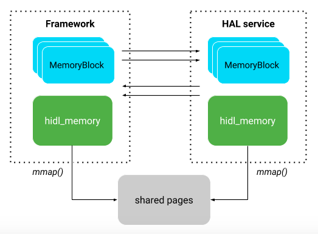

# 5. HIDL

HAL 接口定义语言（简称 HIDL，发音为“hide-l”）是用于指定 HAL 和其用户之间的接口的一种接口描述语言 (IDL)。HIDL 允许指定类型和方法调用（会汇集到接口和软件包中）。从更广泛的意义上来说，HIDL 是用于在可以独立编译的代码库之间进行通信的系统。

HIDL 旨在用于进程间通信 (IPC)。进程之间的通信经过 [*Binder*](https://source.android.com/devices/architecture/hidl/binder-ipc) 化。对于必须与进程相关联的代码库，还可以使用[直通模式](https://source.android.com/devices/architecture/hidl#passthrough)（在 Java 中不受支持）。

HIDL 可指定数据结构和方法签名，这些内容会整理归类到接口（与类相似）中，而接口会汇集到软件包中。尽管 HIDL 具有一系列不同的关键字，但 C++ 和 Java 程序员对 HIDL 的语法并不陌生。此外，HIDL 还使用 Java 样式的注释。

## 5.1 概览

HAL 接口定义语言（简称 HIDL，发音为“hide-l”）是用于指定 HAL 和其用户之间的接口的一种接口描述语言 (IDL)。HIDL 允许指定类型和方法调用（会汇集到接口和软件包中）。从更广泛的意义上来说，HIDL 是用于在可以独立编译的代码库之间进行通信的系统。

HIDL 旨在用于进程间通信 (IPC)。进程之间的通信经过 [*Binder*](https://source.android.com/devices/architecture/hidl/binder-ipc) 化。对于必须与进程相关联的代码库，还可以使用[直通模式](https://source.android.com/devices/architecture/hidl#passthrough)（在 Java 中不受支持）。

HIDL 可指定数据结构和方法签名，这些内容会整理归类到接口（与类相似）中，而接口会汇集到软件包中。尽管 HIDL 具有一系列不同的关键字，但 C++ 和 Java 程序员对 HIDL 的语法并不陌生。此外，HIDL 还使用 Java 样式的注释。

### 5.1.1 HIDL 设计

HIDL 的目标是，框架可以在无需重新构建 HAL 的情况下进行替换。HAL 将由供应商或 SOC 制造商构建，放置在设备的 `/vendor` 分区中，这样一来，框架就可以在其自己的分区中通过 OTA 进行替换，而无需重新编译 HAL。

HIDL 设计在以下方面之间保持了平衡：

- **互操作性**。在可以使用各种架构、工具链和编译配置来编译的进程之间创建可互操作的可靠接口。HIDL 接口是分版本的，发布后不得再进行更改。
- **效率**。HIDL 会尝试尽可能减少复制操作的次数。HIDL 定义的数据以 C++ 标准布局数据结构传递至 C++ 代码，无需解压，可直接使用。此外，HIDL 还提供共享内存接口；由于 RPC 本身有点慢，因此 HIDL 支持两种无需使用 RPC 调用的数据传输方法：共享内存和快速消息队列 (FMQ)。
- **直观**。通过仅针对 RPC 使用 `in` 参数，HIDL 避开了内存所有权这一棘手问题（请参阅 [Android 接口定义语言 (AIDL)](https://developer.android.com/guide/components/aidl.html)）；无法从方法高效返回的值将通过回调函数返回。无论是将数据传递到 HIDL 中以进行传输，还是从 HIDL 接收数据，都不会改变数据的所有权，也就是说，数据所有权始终属于调用函数。数据仅需要在函数被调用期间保留，可在被调用的函数返回数据后立即清除。

### 5.1.2 使用直通模式

要将运行早期版本的 Android 的设备更新为使用 Android O，您可以将惯用的（和旧版）HAL 封装在一个新 HIDL 接口中，该接口将在绑定式模式和同进程（直通）模式提供 HAL。这种封装对于 HAL 和 Android 框架来说都是透明的。

直通模式仅适用于 C++ 客户端和实现。运行早期版本的 Android 的设备没有用 Java 编写的 HAL，因此 Java HAL 自然而然经过 Binder 化。

#### 5.1.2.1 直通式标头文件

编译 `.hal` 文件时，除了用于 Binder 通信的标头之外，`hidl-gen` 还会生成一个额外的直通标头文件 `BsFoo.h`；此标头定义了会被执行 `dlopen` 操作的函数。由于直通式 HAL 在它们被调用的同一进程中运行，因此在大多数情况下，直通方法由直接函数调用（同一线程）来调用。`oneway` 方法在各自的线程中运行，因为它们不需要等待 HAL 来处理它们（这意味着，在直通模式下使用 `oneway` 方法的所有 HAL 对于线程必须是安全的）。

如果有一个 `IFoo.hal`，`BsFoo.h` 会封装 HIDL 生成的方法，以提供额外的功能（例如使 `oneway` 事务在其他线程中运行）。该文件类似于 `BpFoo.h`，不过，所需函数是直接调用的，并未使用 Binder 传递调用 IPC。未来，HAL 的实现**可能提供**多种实现结果，例如 FooFast HAL 和 FooAccurate HAL。在这种情况下，系统会针对每个额外的实现结果创建一个文件（例如 `PTFooFast.cpp` 和 `PTFooAccurate.cpp`）。

#### 5.1.2.2 Binder 化直通式 HAL

您可以将支持直通模式的 HAL 实现 Binder 化。如果有一个 HAL 接口 `a.b.c.d@M.N::IFoo`，系统会创建两个软件包：

- `a.b.c.d@M.N::IFoo-impl`。包含 HAL 的实现，并暴露函数 `IFoo* HIDL_FETCH_IFoo(const char* name)`。在旧版设备上，此软件包经过 `dlopen` 处理，且实现使用 `HIDL_FETCH_IFoo` 进行了实例化。您可以使用 `hidl-gen` 和 `-Lc++-impl` 以及 `-Landroidbp-impl` 来生成基础代码。
- `a.b.c.d@M.N::IFoo-service`。打开直通式 HAL，并将其自身注册为 Binder 化服务，从而使同一 HAL 实现能够同时以直通模式和 Binder 化模式使用。

如果有一个 `IFoo`，您可以调用 `sp IFoo::getService(string name, bool getStub)`，以获取对 `IFoo` 实例的访问权限。如果 `getStub` 为 True，则 `getService` 会尝试仅在直通模式下打开 HAL。如果 `getStub` 为 False，则 `getService` 会尝试找到 Binder 化服务；如果未找到，则它会尝试找到直通式服务。除了在 `defaultPassthroughServiceImplementation` 中，其余情况一律不得使用 `getStub` 参数。（搭载 Android O 的设备是完全 Binder 化的设备，因此不得在直通模式下打开服务。）

### 5.1.3 HIDL 语法

根据设计，HIDL 语言与 C 语言类似（但前者不使用 C 预处理器）。下面未描述的所有标点符号（用途明显的 `=` 和 `|` 除外）都是语法的一部分。

> **注意**：有关 HIDL 代码样式的详细信息，请参阅[代码样式指南](https://source.android.com/devices/architecture/hidl/code-style.html)。

- `/** */` 表示文档注释。此样式只能应用于类型、方法、字段和枚举值声明。
- `/* */` 表示多行注释。
- `//` 表示注释一直持续到行结束。除了 `//`，换行符与任何其他空白一样。
- 在以下示例语法中，从 `//` 到行结束的文本不是语法的一部分，而是对语法的注释。
- `[empty]` 表示该字词可能为空。
- `?` 跟在文本或字词后，表示它是可选的。
- `...` 表示包含零个或多个项、用指定的分隔符号分隔的序列。HIDL 中不含可变参数。
- 逗号用于分隔序列元素。
- 分号用于终止各个元素，包括最后的元素。
- 大写字母是非终止符。
- `*italics*` 是一个令牌系列，如 `*integer*` 或 `*identifier*`（标准 C 解析规则）。
- `*constexpr* `是 C 样式的常量表达式（例如 `1 + 1` 和 `1L << 3`）。
- `*import_name*` 是软件包或接口名称，按 [HIDL 版本编号](https://source.android.com/devices/architecture/hidl/versioning.html)中所述的方式加以限定。
- 小写 `words` 是文本令牌。

例如：

```HIDL
ROOT =
    PACKAGE IMPORTS PREAMBLE { ITEM ITEM ... }  // not for types.hal
  | PACKAGE IMPORTS ITEM ITEM...  // only for types.hal; no method definitions

ITEM =
    ANNOTATIONS? oneway? identifier(FIELD, FIELD ...) GENERATES?;
  |  safe_union identifier { UFIELD; UFIELD; ...};
  |  struct identifier { SFIELD; SFIELD; ...};  // Note - no forward declarations
  |  union identifier { UFIELD; UFIELD; ...};
  |  enum identifier: TYPE { ENUM_ENTRY, ENUM_ENTRY ... }; // TYPE = enum or scalar
  |  typedef TYPE identifier;

VERSION = integer.integer;

PACKAGE = package android.hardware.identifier[.identifier[...]]@VERSION;

PREAMBLE = interface identifier EXTENDS

EXTENDS = <empty> | extends import_name  // must be interface, not package

GENERATES = generates (FIELD, FIELD ...)

// allows the Binder interface to be used as a type
// (similar to typedef'ing the final identifier)
IMPORTS =
   [empty]
  |  IMPORTS import import_name;

TYPE =
  uint8_t | int8_t | uint16_t | int16_t | uint32_t | int32_t | uint64_t | int64_t |
 float | double | bool | string
|  identifier  // must be defined as a typedef, struct, union, enum or import
               // including those defined later in the file
|  memory
|  pointer
|  vec<TYPE>
|  bitfield<TYPE>  // TYPE is user-defined enum
|  fmq_sync<TYPE>
|  fmq_unsync<TYPE>
|  TYPE[SIZE]

FIELD =
   TYPE identifier

UFIELD =
   TYPE identifier
  |  safe_union identifier { FIELD; FIELD; ...} identifier;
  |  struct identifier { FIELD; FIELD; ...} identifier;
  |  union identifier { FIELD; FIELD; ...} identifier;

SFIELD =
   TYPE identifier
  |  safe_union identifier { FIELD; FIELD; ...};
  |  struct identifier { FIELD; FIELD; ...};
  |  union identifier { FIELD; FIELD; ...};
  |  safe_union identifier { FIELD; FIELD; ...} identifier;
  |  struct identifier { FIELD; FIELD; ...} identifier;
  |  union identifier { FIELD; FIELD; ...} identifier;

SIZE =  // Must be greater than zero
     constexpr

ANNOTATIONS =
     [empty]
  |  ANNOTATIONS ANNOTATION

ANNOTATION =
  |  @identifier
  |  @identifier(VALUE)
  |  @identifier(ANNO_ENTRY, ANNO_ENTRY  ...)

ANNO_ENTRY =
     identifier=VALUE

VALUE =
     "any text including \" and other escapes"
  |  constexpr
  |  {VALUE, VALUE ...}  // only in annotations

ENUM_ENTRY =
     identifier
  |  identifier = constexpr
```

### 5.1.3 术语表

| Binder 化 | 表示 HIDL 用于进程之间的远程过程调用，并通过类似 Binder 的机制来实现。另请参阅“直通式”。 |
| :-------- | ------------------------------------------------------------ |
| 异步回调  | 由 HAL 用户提供、传递给 HAL（通过 HIDL 方法）并由 HAL 调用以随时返回数据的接口。 |
| 同步回调  | 将数据从服务器的 HIDL 方法实现返回到客户端。不用于返回无效值或单个原始值的方法。 |
| 客户端    | 调用特定接口的方法的进程。HAL 进程或框架进程可以是一个接口的客户端和另一个接口的服务器。另请参阅“直通式”。 |
| 扩展      | 表示向另一接口添加方法和/或类型的接口。一个接口只能扩展另一个接口。可用于具有相同软件包名称的 Minor 版本递增，也可用于在旧软件包的基础上构建的新软件包（例如，供应商扩展）。 |
| 生成      | 表示将值返回给客户端的接口方法。要返回一个非原始值或多个值，则会生成同步回调函数。 |
| 接口      | 方法和类型的集合。会转换为 C++ 或 Java 中的类。接口中的所有方法均按同一方向调用：客户端进程会调用由服务器进程实现的方法。 |
| 单向      | 应用到 HIDL 方法时，表示该方法既不返回任何值也不会造成阻塞。 |
| 软件包    | 共用一个版本的接口和数据类型的集合。                         |
| 直通式    | HIDL 的一种模式，使用这种模式时，服务器是共享库，由客户端进行 `dlopen` 处理。在直通模式下，客户端和服务器是相同的进程，但代码库不同。此模式仅用于将旧版代码库并入 HIDL 模型。另请参阅“Binder 化”。 |
| 服务器    | 实现接口的方法的进程。另请参阅“直通式”。                     |
| 传输      | 在服务器和客户端之间移动数据的 HIDL 基础架构。               |
| 版本      | 软件包的版本。由两个整数组成：Major 版本和 Minor 版本。Minor 版本递增可以添加（但不会更改）类型和方法。 |


## 5.2 接口和软件包

HIDL 是围绕接口进行编译的，接口是面向对象的语言使用的一种用来定义行为的抽象类型。每个接口都是软件包的一部分。


### 5.2.1 软件包

软件包名称可以具有子级，例如 `package.subpackage`。已发布的 HIDL 软件包的根目录是 `hardware/interfaces` 或 `vendor/vendorName`（例如 Pixel 设备为 `vendor/google`）。软件包名称在根目录下形成一个或多个子目录；定义软件包的所有文件都位于同一目录下。例如，`package android.hardware.example.extension.light@2.0` 可以在 `hardware/interfaces/example/extension/light/2.0` 下找到。

下表列出了软件包前缀和位置：

| 软件包前缀             | 位置                               | 接口类型         |
| :--------------------- | :--------------------------------- | :--------------- |
| `android.hardware.*`   | `hardware/interfaces/*`            | HAL              |
| `android.frameworks.*` | `frameworks/hardware/interfaces/*` | frameworks/ 相关 |
| `android.system.*`     | `system/hardware/interfaces/*`     | system/ 相关     |
| `android.hidl.*`       | `system/libhidl/transport/*`       | core             |

软件包目录中包含扩展名为 `.hal` 的文件。每个文件均必须包含一个指定文件所属的软件包和版本的 `package` 语句。文件 `types.hal`（如果存在）并不定义接口，而是定义软件包中每个接口可以访问的数据类型。

### 5.2.2 接口定义

除了 `types.hal` 之外，其他 `.hal` 文件均定义一个接口。接口通常定义如下：

```c++
interface IBar extends IFoo { // IFoo is another interface
    // embedded types
    struct MyStruct {/*...*/};

    // interface methods
    create(int32_t id) generates (MyStruct s);
    close();
};
```

不含显式 `extends` 声明的接口会从 `android.hidl.base@1.0::IBase`（类似于 Java 中的 `java.lang.Object`）隐式扩展。隐式导入的 IBase 接口声明了多种不应也不能在用户定义的接口中重新声明或以其他方式使用的预留方法。这些方法包括：

- `ping`
- `interfaceChain`
- `interfaceDescriptor`
- `notifySyspropsChanged`
- `linkToDeath`
- `unlinkToDeath`
- `setHALInstrumentation`
- `getDebugInfo`
- `debug`
- `getHashChain`

### 5.2.3 导入

`import` 语句是用于访问其他软件包中的软件包接口和类型的 HIDL 机制。`import` 语句本身涉及两个实体：

- 导入实体：可以是软件包或接口；以及
- 被导入实体：也可以是软件包或接口。

导入实体由 `import` 语句的位置决定。当该语句位于软件包的 `types.hal` 中时，导入的内容对整个软件包是可见的；这是软件包级导入。当该语句位于接口文件中时，导入实体是接口本身；这是接口级导入。

被导入实体由 `import` 关键字后面的值决定。该值不必是完全限定名称；如果某个组成部分被删除了，系统会自动使用当前软件包中的信息填充该组成部分。 对于完全限定值，支持的导入情形有以下几种：

- **完整软件包导入**。如果该值是一个软件包名称和版本（语法见下文），则系统会将整个软件包导入至导入实体中。

- 部分导入, 如果值为：

  - 一个接口，则系统会将该软件包的 `types.hal` 和该接口导入至导入实体中。
- 在 `types.hal` 中定义的 UDT，则系统仅会将该 UDT 导入至导入实体中（不导入 `types.hal` 中的其他类型）。
  
- **仅类型导入**。如果该值将上文所述的“部分导入”的语法与关键字 `types` 而不是接口名称配合使用，则系统仅会导入指定软件包的 `types.hal` 中的 UDT。

导入实体可以访问以下各项的组合：

- `types.hal` 中定义的被导入软件包的常见 UDT；
- 被导入的软件包的接口（完整软件包导入）或指定接口（部分导入），以便调用它们、向其传递句柄和/或从其继承句柄。

导入语句使用完全限定类型名称语法来提供被导入的软件包或接口的名称和版本：

```
import android.hardware.nfc@1.0;            // import a whole package
import android.hardware.example@1.0::IQuux; // import an interface and types.hal
import android.hardware.example@1.0::types; // import just types.hal
```

### 5.2.4 接口继承

接口可以是之前定义的接口的扩展。扩展可以是以下三种类型中的一种：

- 接口可以向其他接口添加功能，并按原样纳入其 API。
- 软件包可以向其他软件包添加功能，并按原样纳入其 API。
- 接口可以从软件包或特定接口导入类型。

接口只能扩展一个其他接口（不支持多重继承）。具有非零 Minor 版本号的软件包中的每个接口必须扩展一个以前版本的软件包中的接口。例如，如果 4.0 版本的软件包 `derivative` 中的接口 `IBar` 是基于（扩展了）1.2 版本的软件包 `original` 中的接口 `IFoo`，并且您又创建了 1.3 版本的软件包 `original`，则 4.1 版本的 `IBar` 不能扩展 1.3 版本的 `IFoo`。相反，4.1 版本的 `IBar` 必须扩展 4.0 版本的 `IBar`，因为后者是与 1.2 版本的 `IFoo` 绑定的。 如果需要，5.0 版本的 `IBar` 可以扩展 1.3 版本的 `IFoo`。

接口扩展并不意味着生成的代码中存在代码库依赖关系或跨 HAL 包含关系，接口扩展只是在 HIDL 级别导入数据结构和方法定义。HAL 中的每个方法必须在相应 HAL 中实现。

### 5.2.5 接口布局总结

总结了如何管理 HIDL 接口软件包（如 `hardware/interfaces`）并整合了整个 HIDL 部分提供的信息。在阅读之前，请务必先熟悉 [HIDL 版本控制](https://source.android.com/devices/architecture/hidl/versioning)、[使用 hidl-gen 添加哈希](https://source.android.com/devices/architecture/hidl/hashing#hidl-gen)中的哈希概念、关于[在一般情况下使用 HIDL](https://source.android.com/devices/architecture/hidl/) 的详细信息以及以下定义：

| 术语                  | 定义                                                         |
| :-------------------- | :----------------------------------------------------------- |
| 应用二进制接口 (ABI)  | 应用编程接口 + 所需的任何二进制链接。                        |
| 完全限定名称 (fqName) | 用于区分 hidl 类型的名称。例如：`android.hardware.foo@1.0::IFoo`。 |
| 软件包                | 包含 HIDL 接口和类型的软件包。例如：`android.hardware.foo@1.0`。 |
| 软件包根目录          | 包含 HIDL 接口的根目录软件包。例如：HIDL 接口 `android.hardware` 在软件包根目录 `android.hardware.foo@1.0` 中。 |
| 软件包根目录路径      | 软件包根目录映射到的 Android 源代码树中的位置。              |

有关更多定义，请参阅 HIDL [术语](https://source.android.com/devices/architecture/hidl/#terms)。

#### 每个文件都可以通过软件包根目录映射及其完全限定名称找到

软件包根目录以参数 `-r android.hardware:hardware/interfaces` 的形式指定给 `hidl-gen`。例如，如果软件包为 `vendor.awesome.foo@1.0::IFoo` 并且向 `hidl-gen` 发送了 `-r vendor.awesome:some/device/independent/path/interfaces`，那么接口文件应该位于 `$ANDROID_BUILD_TOP/some/device/independent/path/interfaces/foo/1.0/IFoo.hal`。

在实践中，建议称为 `awesome` 的供应商或原始设备制造商 (OEM) 将其标准接口放在 `vendor.awesome` 中。在选择了软件包路径之后，不能再更改该路径，因为它已写入接口的 ABI。

#### 软件包路径映射不得重复

例如，如果您有 `-rsome.package:$PATH_A` 和 `-rsome.package:$PATH_B`，则 `$PATH_A` 必须等于 `$PATH_B` 才能实现一致的接口目录（这也能让[接口版本控制起来](https://source.android.com/devices/architecture/hidl/versioning)更简单）。

#### 软件包根目录必须有版本控制文件

如果创建一个软件包路径（如 `-r vendor.awesome:vendor/awesome/interfaces`），则还应创建文件 `$ANDROID_BUILD_TOP/vendor/awesome/interfaces/current.txt`，该文件应包含使用 `hidl-gen`（在[使用 hidl-gen 添加哈希](https://source.android.com/devices/architecture/hidl/hashing#hidl-gen)中广泛进行了讨论）中的 `-Lhash` 选项所创建接口的哈希。


## 5.3 接口哈希

本文档介绍了 HIDL 接口哈希，该哈希是一种旨在防止意外更改接口并确保接口更改经过全面审查的机制。这种机制是必需的，因为 HIDL 接口带有版本编号，也就是说，接口一经发布便不得再更改，但不会影响应用二进制接口 (ABI) 的情况（例如更正备注）除外。

### 5.3.1 布局

每个软件包根目录（即映射到 `hardware/interfaces` 的 `android.hardware` 或映射到 `vendor/foo/hardware/interfaces` 的 `vendor.foo`）都必须包含一个列出所有已发布 HIDL 接口文件的 `current.txt` 文件。

```
# current.txt files support comments starting with a ‘#' character
# this file, for instance, would be vendor/foo/hardware/interfaces/current.txt

# Each line has a SHA-256 hash followed by the name of an interface.
# They have been shortened in this doc for brevity but they are
# 64 characters in length in an actual current.txt file.
d4ed2f0e...995f9ec4 vendor.awesome.foo@1.0::IFoo # comments can also go here

# types.hal files are also noted in types.hal files
c84da9f5...f8ea2648 vendor.awesome.foo@1.0::types

# Multiple hashes can be in the file for the same interface. This can be used
# to note how ABI sustaining changes were made to the interface.
# For instance, here is another hash for IFoo:

# Fixes type where "FooCallback" was misspelled in comment on "FooStruct"
822998d7...74d63b8c vendor.awesome.foo@1.0::IFoo
```

> **注意**：为了便于跟踪各个哈希的来源，Google 会将 HIDL `current.txt` 文件分为不同的部分：第一部分列出在 Android O 中发布的接口文件，第二部分列出在 Android O MR1 中发布的接口文件。我们强烈建议在您的 `current.txt` 文件中使用类似布局。

### 5.3.2 使用 hidl-gen 添加哈希

您可以手动将哈希添加到 `current.txt` 文件中，也可以使用 `hidl-gen` 添加。以下代码段提供了可与 `hidl-gen` 搭配使用来管理 `current.txt` 文件的命令示例（哈希已缩短）：

```
hidl-gen -L hash -r vendor.awesome:vendor/awesome/hardware/interfaces -r android.hardware:hardware/interfaces -r android.hidl:system/libhidl/transport vendor.awesome.nfc@1.0::types
9626fd18...f9d298a6 vendor.awesome.nfc@1.0::types
hidl-gen -L hash -r vendor.awesome:vendor/awesome/hardware/interfaces -r android.hardware:hardware/interfaces -r android.hidl:system/libhidl/transport vendor.awesome.nfc@1.0::INfc
07ac2dc9...11e3cf57 vendor.awesome.nfc@1.0::INfc
hidl-gen -L hash -r vendor.awesome:vendor/awesome/hardware/interfaces -r android.hardware:hardware/interfaces -r android.hidl:system/libhidl/transport vendor.awesome.nfc@1.0
9626fd18...f9d298a6 vendor.awesome.nfc@1.0::types
07ac2dc9...11e3cf57 vendor.awesome.nfc@1.0::INfc
f2fe5442...72655de6 vendor.awesome.nfc@1.0::INfcClientCallback
hidl-gen -L hash -r vendor.awesome:vendor/awesome/hardware/interfaces -r android.hardware:hardware/interfaces -r android.hidl:system/libhidl/transport vendor.awesome.nfc@1.0 >> vendor/awesome/hardware/interfaces/current.txt
```

`hidl-gen` 生成的每个接口定义库都包含哈希，通过调用 `IBase::getHashChain` 可检索这些哈希。`hidl-gen` 编译接口时，会检查 HAL 软件包根目录中的 `current.txt` 文件，以查看 HAL 是否已被更改：

- 如果没有找到 HAL 的哈希，则接口会被视为未发布（处于开发阶段），并且编译会继续进行。
- 如果找到了相应哈希，则会对照当前接口对其进行检查：
  - 如果接口与哈希匹配，则编译会继续进行。
  - 如果接口与哈希不匹配，则编译会暂停，因为这意味着之前发布的接口会被更改。
    - 要在更改的同时不影响 ABI（请参阅 [ABI 稳定性](https://source.android.com/devices/architecture/hidl/hashing#abi-stability)），请务必先修改 `current.txt` 文件，然后编译才能继续进行。
    - 所有其他更改都应在接口的 minor 或 major 版本升级中进行。

### 5.3.3 ABI 稳定性

**要点**：请仔细阅读并理解本部分。

应用二进制接口 (ABI) 包括二进制关联/调用规范/等等。如果 ABI/API 发生更改，则相应接口就不再适用于使用官方接口编译的常规 `system.img`。

确保接口带有版本编号且 ABI 稳定**至关重要**，具体原因有如下几个：

- 可确保您的实现能够通过供应商测试套件 (VTS) 测试，通过该测试后您将能够正常进行仅限框架的 OTA。
- 作为原始设备制造商 (OEM)，您将能够提供简单易用且符合规定的板级支持包 (BSP)。
- 有助于您跟踪哪些接口可以发布。您可以将 `current.txt` 视为接口目录的“地图”，从中了解软件包根目录中提供的所有接口的历史记录和状态。

对于在 `current.txt` 中已有条目的接口，为其添加新的哈希时，请务必仅为可保持 ABI 稳定性的接口添加哈希。请查看以下更改类型：

| 允许的更改   | 更改备注（除非这会更改方法的含义）。更改参数的名称。更改返回参数的名称。更改注释。 |
| :----------- | ------------------------------------------------------------ |
| 不允许的更改 | 重新排列参数、方法等…重命名接口或将其移至新的软件包。重命名软件包。在接口的任意位置添加方法/结构体字段等等…会破坏 C++ vtable 的任何更改。等等… |

## 5.4 服务和数据转移

如何注册和发现服务，以及如何通过调用 `.hal` 文件内的接口中定义的方法将数据发送到服务。

### 5.4.1 注册服务

HIDL 接口服务器（实现接口的对象）可注册为已命名的服务。注册的名称不需要与接口或软件包名称相关。如果没有指定名称，则使用名称“默认”；这应该用于不需要注册同一接口的两个实现的 HAL。例如，在每个接口中定义的服务注册的 C++ 调用是：

```
status_t status = myFoo->registerAsService();
status_t anotherStatus = anotherFoo->registerAsService("another_foo_service");  // if needed
```

HIDL 接口的版本包含在接口本身中。版本自动与服务注册关联，并可通过每个 HIDL 接口上的方法调用 (`android::hardware::IInterface::getInterfaceVersion()`) 进行检索。服务器对象不需要注册，并可通过 HIDL 方法参数传递到其他进程，相应的接收进程会向服务器发送 HIDL 方法调用。

### 5.4.2 发现服务

客户端代码按名称和版本请求指定的接口，并对所需的 HAL 类调用 `getService`：

```
// C++
sp<V1_1::IFooService> service = V1_1::IFooService::getService();
sp<V1_1::IFooService> alternateService = V1_1::IFooService::getService("another_foo_service");
// Java
V1_1.IFooService service = V1_1.IFooService.getService(true /* retry */);
V1_1.IFooService alternateService = V1_1.IFooService.getService("another", true /* retry */);
```

每个版本的 HIDL 接口都会被视为单独的接口。因此，`IFooService` 版本 1.1 和 `IFooService` 版本 2.2 都可以注册为“foo_service”，并且两个接口上的 `getService("foo_service")` 都可获取该接口的已注册服务。因此，在大多数情况下，注册或发现服务均无需提供名称参数（也就是说名称为“默认”）。

供应商接口对象还会影响所返回接口的传输方法。对于软件包 `android.hardware.foo@1.0` 中的接口 `IFoo`，`IFoo::getService` 返回的接口始终使用设备清单中针对 `android.hardware.foo` 声明的传输方法（如果相应条目存在的话）；如果该传输方法不存在，则返回 nullptr。

在某些情况下，即使没有获得相关服务，也可能需要立即继续。例如，当客户端希望自行管理服务通知或者在需要获取所有 hwservice 并检索它们的诊断程序（例如 `atrace`）中时，可能会发生这种情况。在这种情况下，可以使用其他 API，例如 C++ 中的 `tryGetService` 或 Java 中的 `getService("instance-name", false)`。Java 中提供的旧版 API `getService` 也必须与服务通知一起使用。使用此 API 不会避免以下竞态条件：当客户端使用某个非重试 API 请求服务器后，该服务器对自身进行了注册。

### 5.4.3 服务终止通知

想要在服务终止时收到通知的客户端会接收到框架传送的终止通知。要接收通知，客户端必须：

1. 将 HIDL 类/接口 `hidl_death_recipient`（位于 C++ 代码中，而非 HIDL 中）归入子类。
2. 替换其 `serviceDied()` 方法。
3. 实例化 `hidl_death_recipient` 子类的对象。
4. 在要监控的服务上调用 `linkToDeath()` 方法，并传入 `IDeathRecipient` 的接口对象。请注意，此方法并不具备在其上调用它的终止接收方或代理的所有权。

伪代码示例（C++ 和 Java 类似）：

```
class IMyDeathReceiver : hidl_death_recipient {
  virtual void serviceDied(uint64_t cookie,
                           wp<IBase>& service) override {
    log("RIP service %d!", cookie);  // Cookie should be 42
  }
};
....
IMyDeathReceiver deathReceiver = new IMyDeathReceiver();
m_importantService->linkToDeath(deathReceiver, 42);
```

同一终止接收方可能已在多个不同的服务上注册。

### 5.4.4 数据转移

可通过调用 `.hal` 文件内的接口中定义的方法将数据发送到服务。具体方法有两类：

- **阻塞**方法会等到服务器产生结果。
- **单向**方法仅朝一个方向发送数据且不阻塞。如果 RPC 调用中正在传输的数据量超过实现限制，则调用可能会阻塞或返回错误指示（具体行为尚不确定）。

不返回值但未声明为 `oneway` 的方法仍会阻塞。

在 HIDL 接口中声明的所有方法都是单向调用，要么从 HAL 发出，要么到 HAL。该接口没有指定具体调用方向。需要从 HAL 发起调用的架构应该在 HAL 软件包中提供两个（或更多个）接口并从每个进程提供相应的接口。我们根据接口的调用方向来取名“客户端”或“服务器”（即 HAL 可以是一个接口的服务器，也可以是另一个接口的客户端）。

#### 回调

回调”一词可以指代两个不同的概念，可通过“同步回调”和“异步回调”进行区分。

“同步回调”用于返回数据的一些 HIDL 方法。返回多个值（或返回非基元类型的一个值）的 HIDL 方法会通过回调函数返回其结果。如果只返回一个值且该值是基元类型，则不使用回调且该值从方法中返回。服务器实现 HIDL 方法，而客户端实现回调。

“异步回调”允许 HIDL 接口的服务器发起调用。通过第一个接口传递第二个接口的实例即可完成此操作。第一个接口的客户端必须作为第二个接口的服务器。第一个接口的服务器可以在第二个接口对象上调用方法。例如，HAL 实现可以通过在由该进程创建和提供的接口对象上调用方法来将信息异步发送回正在使用它的进程。用于异步回调的接口中的方法可以是阻塞方法（并且可能将值返回到调用程序），也可以是 `oneway` 方法。要查看相关示例，请参阅 [HIDL C++](https://source.android.com/devices/architecture/hidl-cpp/interfaces) 中的“异步回调”。

要简化内存所有权，方法调用和回调只能接受 `in` 参数，并且不支持 `out` 或 `inout` 参数。

#### 每事务限制

每事务限制不会强制限制在 HIDL 方法和回调中发送的数据量。但是，每事务调用 4KB 以上的数据便被视为过度调用。如果发生这种情况，建议重新设计给定 HIDL 接口的架构。另一个限制是可供 HIDL 基础架构处理多个同时进行的事务的资源。由于多个线程或进程向一个进程发送调用或者接收进程未能快速处理多个 `oneway` 调用，因此多个事务可能会同时进行。默认情况下，所有并发事务可用的最大总空间为 1MB。

在设计良好的接口中，不应出现超出这些资源限制的情况；如果超出的话，则超出资源的调用可能会阻塞，直到资源可用或发出传输错误的信号。每当因正在进行的总事务导致出现超出每事务限制或溢出 HIDL 实现资源的情况时，系统都会记录下来以方便调试。

#### 方法实现

HIDL 生成以目标语言（C++ 或 Java）声明必要类型、方法和回调的标头文件。客户端和服务器代码的 HIDL 定义方法和回调的原型是相同的。HIDL 系统提供调用程序端（整理 IPC 传输的数据）的方法**代理**实现，并将代码**存根**到被调用程序端（将数据传递到方法的开发者实现）。

函数的调用程序（HIDL 方法或回调）拥有对传递到该函数的数据结构的所有权，并在调用后保留所有权；被调用程序在所有情况下都无需释放存储。

- 在 C++ 中，数据可能是只读的（尝试写入可能会导致细分错误），并且在调用期间有效。客户端可以深层复制数据，以在调用期间外传播。
- 在 Java 中，代码会接收数据的本地副本（普通 Java 对象），代码可以保留和修改此数据或允许垃圾回收器回收。

#### 非 RPC 数据转移

HIDL 在不使用 RPC 调用的情况下通过两种方法来转移数据：共享内存和快速消息队列 (FMQ)，只有 C++ 同时支持这两种方法。

- **共享内存**。内置 HIDL 类型 `memory` 用于传递表示已分配的共享内存的对象。 可以在接收进程中使用，以映射共享内存。

- 快速消息队列 (FMQ)

  HIDL 提供了一种可实现无等待消息传递的模板化消息队列类型。它在直通式或绑定式模式下不使用内核或调度程序（设备间通信将不具有这些属性）。通常，HAL 会设置其队列的末尾，从而创建可以借助内置 HIDL 类型`MQDescriptorSync`或`MQDescriptorUnsync`的参数通过 RPC 传递的对象。接收进程可使用此对象设置队列的另一端。

  - “已同步”队列不能溢出，且只能有一个读取器。
  - “未同步”队列可以溢出，且可以有多个读取器；每个读取器必须及时读取数据，否则数据就会丢失。

  两种队列都不能下溢（从空队列进行读取将会失败），且都只能有一个写入器。

有关 FMQ 的更多详情，请参阅快速消息队列 .

## 5.5 快速消息转移

HIDL 的远程过程调用 (RPC) 基础架构使用 Binder 机制，这意味着调用涉及开销、需要内核操作，并且可以触发调度程序操作。不过，对于必须在开销较小且无内核参与的进程之间传输数据的情况，则使用快速消息队列 (FMQ) 系统。

FMQ 会创建具有所需属性的消息队列。`MQDescriptorSync` 或 `MQDescriptorUnsync` 对象可通过 HIDL RPC 调用发送，并可供接收进程用于访问消息队列。

### 5.5.1 MessageQueue 类型

#### 未同步

未同步队列只有一个写入器，但可以有任意多个读取器。此类队列有一个写入位置；不过，每个读取器都会跟踪各自的独立读取位置。

对此类队列执行写入操作一定会成功（不会检查是否出现溢出情况），但前提是写入的内容不超出配置的队列容量（如果写入的内容超出队列容量，则操作会立即失败）。由于各个读取器的读取位置可能不同，因此每当新的写入操作需要空间时，系统都允许数据离开队列，而无需等待每个读取器读取每条数据。

读取操作负责在数据离开队列末尾之前对其进行检索。如果读取操作尝试读取的数据超出可用数据量，则该操作要么立即失败（如果非阻塞），要么等到有足够多的可用数据时（如果阻塞）。如果读取操作尝试读取的数据超出队列容量，则读取一定会立即失败。

如果某个读取器的读取速度无法跟上写入器的写入速度，则写入的数据量和该读取器尚未读取的数据量加在一起会超出队列容量，这会导致下一次读取不会返回数据；相反，该读取操作会将读取器的读取位置重置为等于最新的写入位置，然后返回失败。如果在发生溢出后但在下一次读取之前，系统查看可供读取的数据，则会显示可供读取的数据超出了队列容量，这表示发生了溢出。（如果队列溢出发生在系统查看可用数据和尝试读取这些数据之间，则溢出的唯一表征就是读取操作失败。）

#### 已同步

已同步队列有一个写入器和一个读取器，其中写入器有一个写入位置，读取器有一个读取位置。写入的数据量不可能超出队列可提供的空间；读取的数据量不可能超出队列当前存在的数据量。

如果尝试写入的数据量超出可用空间或尝试读取的数据量超出现有数据量，则会立即返回失败，或会阻塞到可以完成所需操作为止，具体取决于调用的是阻塞还是非阻塞写入或读取函数。如果尝试读取或尝试写入的数据量超出队列容量，则读取或写入操作一定会立即失败。

### 5.5.2 设置 FMQ

一个消息队列需要多个 `MessageQueue` 对象：一个对象用作数据写入目标位置，以及一个或多个对象用作数据读取来源。没有关于哪些对象用于写入数据或读取数据的显式配置；用户需负责确保没有对象既用于读取数据又用于写入数据，也就是说最多只有一个写入器，并且对于已同步队列，最多只有一个读取器。

#### 创建第一个 MessageQueue 对象

通过单个调用创建并配置消息队列：

```
#include <fmq/MessageQueue.h>
using android::hardware::kSynchronizedReadWrite;
using android::hardware::kUnsynchronizedWrite;
using android::hardware::MQDescriptorSync;
using android::hardware::MQDescriptorUnsync;
using android::hardware::MessageQueue;
....
// For a synchronized non-blocking FMQ
mFmqSynchronized =
  new (std::nothrow) MessageQueue<uint16_t, kSynchronizedReadWrite>
      (kNumElementsInQueue);
// For an unsynchronized FMQ that supports blocking
mFmqUnsynchronizedBlocking =
  new (std::nothrow) MessageQueue<uint16_t, kUnsynchronizedWrite>
      (kNumElementsInQueue, true /* enable blocking operations */);
```

- `MessageQueue(numElements)` 初始化程序负责创建并初始化支持消息队列功能的对象。
- `MessageQueue(numElements, configureEventFlagWord)` 初始化程序负责创建并初始化支持消息队列功能和阻塞的对象。
- `flavor` 可以是 `kSynchronizedReadWrite`（对于已同步队列）或 `kUnsynchronizedWrite`（对于未同步队列）。
- `uint16_t`（在本示例中）可以是任意不涉及嵌套式缓冲区（无 `string` 或 `vec` 类型）、句柄或接口的 HIDL 定义的类型。
- `kNumElementsInQueue` 表示队列的大小（以条目数表示）；它用于确定将为队列分配的共享内存缓冲区的大小。

#### 创建第二个 MessageQueue 对象

使用从消息队列的第一侧获取的 `MQDescriptor` 对象创建消息队列的第二侧。通过 HIDL RPC 调用将 `MQDescriptor` 对象发送到将容纳消息队列末端的进程。`MQDescriptor` 包含该队列的相关信息，其中包括：

- 用于映射缓冲区和写入指针的信息。
- 用于映射读取指针的信息（如果队列已同步）。
- 用于映射事件标记字词的信息（如果队列是阻塞队列）。
- 对象类型 (``)，其中包含 [HIDL 定义的队列元素类型](https://source.android.com/devices/architecture/hidl-cpp/types)和队列风格（已同步或未同步）。

`MQDescriptor` 对象可用于构建 `MessageQueue` 对象：

```
MessageQueue<T, flavor>::MessageQueue(const MQDescriptor<T, flavor>& Desc, bool resetPointers)
```

`resetPointers` 参数表示是否在创建此 `MessageQueue` 对象时将读取和写入位置重置为 0。在未同步队列中，读取位置（在未同步队列中，是每个 `MessageQueue` 对象的本地位置）在此对象创建过程中始终设为 0。通常，`MQDescriptor` 是在创建第一个消息队列对象过程中初始化的。要对共享内存进行额外的控制，您可以手动设置 `MQDescriptor`（`MQDescriptor` 是在 [`system/libhidl/base/include/hidl/MQDescriptor.h`](https://android.googlesource.com/platform/system/libhidl/+/master/base/include/hidl/MQDescriptor.h) 中定义的），然后按照本部分所述内容创建每个 `MessageQueue` 对象。

#### 阻塞队列和事件标记

默认情况下，队列不支持阻塞读取/写入。有两种类型的阻塞读取/写入调用：

* 短格式：有三个参数（数据指针、项数、超时）。支持阻塞针对单个队列的各个读取/写入操作。在使用这种格式时，队列将在内部处理事件标记和位掩码，并且第一个消息队列对象必须初始化为第二个参数为 `true`。例如：

  ```
  // For an unsynchronized FMQ that supports blocking
  mFmqUnsynchronizedBlocking =
    new (std::nothrow) MessageQueue<uint16_t, kUnsynchronizedWrite>
        (kNumElementsInQueue, true /* enable blocking operations */);
  ```

* 长格式：有六个参数（包括事件标记和位掩码）。支持在多个队列之间使用共享 `EventFlag` 对象，并允许指定要使用的通知位掩码。在这种情况下，必须为每个读取和写入调用提供事件标记和位掩码。

对于长格式，可在每个 `readBlocking()` 和 `writeBlocking()` 调用中显式提供 `EventFlag`。可以将其中一个队列初始化为包含一个内部事件标记，如果是这样，则必须使用 `getEventFlagWord()` 从相应队列的 `MessageQueue` 对象中提取该标记，以用于在每个进程中创建与其他 FMQ 一起使用的 `EventFlag` 对象。或者，可以将 `EventFlag` 对象初始化为具有任何合适的共享内存。

一般来说，每个队列都应只使用以下三项之一：非阻塞、短格式阻塞，或长格式阻塞。混合使用也不算是错误；但要获得理想结果，则需要谨慎地进行编程。

### 5.5.3 使用 MessageQueue

`MessageQueue` 对象的公共 API 是：

```
size_t availableToWrite()  // Space available (number of elements).
size_t availableToRead()  // Number of elements available.
size_t getQuantumSize()  // Size of type T in bytes.
size_t getQuantumCount() // Number of items of type T that fit in the FMQ.
bool isValid() // Whether the FMQ is configured correctly.
const MQDescriptor<T, flavor>* getDesc()  // Return info to send to other process.

bool write(const T* data)  // Write one T to FMQ; true if successful.
bool write(const T* data, size_t count) // Write count T's; no partial writes.

bool read(T* data);  // read one T from FMQ; true if successful.
bool read(T* data, size_t count);  // Read count T's; no partial reads.

bool writeBlocking(const T* data, size_t count, int64_t timeOutNanos = 0);
bool readBlocking(T* data, size_t count, int64_t timeOutNanos = 0);

// Allows multiple queues to share a single event flag word
std::atomic<uint32_t>* getEventFlagWord();

bool writeBlocking(const T* data, size_t count, uint32_t readNotification,
uint32_t writeNotification, int64_t timeOutNanos = 0,
android::hardware::EventFlag* evFlag = nullptr); // Blocking write operation for count Ts.

bool readBlocking(T* data, size_t count, uint32_t readNotification,
uint32_t writeNotification, int64_t timeOutNanos = 0,
android::hardware::EventFlag* evFlag = nullptr) // Blocking read operation for count Ts;

//APIs to allow zero copy read/write operations
bool beginWrite(size_t nMessages, MemTransaction* memTx) const;
bool commitWrite(size_t nMessages);
bool beginRead(size_t nMessages, MemTransaction* memTx) const;
bool commitRead(size_t nMessages);
```

`availableToWrite()` 和 `availableToRead()` 可用于确定在一次操作中可传输的数据量。在未同步队列中：

- `availableToWrite()` 始终返回队列容量。
- 每个读取器都有自己的读取位置，并会针对 `availableToRead()` 进行自己的计算。
- 如果是读取速度缓慢的读取器，队列可以溢出，这可能会导致 `availableToRead()` 返回的值大于队列的大小。发生溢出后进行的第一次读取操作将会失败，并且会导致相应读取器的读取位置被设为等于当前写入指针，无论是否通过 `availableToRead()` 报告了溢出都是如此。

如果所有请求的数据都可以（并已）传输到队列/从队列传出，则 `read()` 和 `write()` 方法会返回 `true`。这些方法不会阻塞；它们要么成功（并返回 `true`），要么立即返回失败 (`false`)。

`readBlocking()` 和 `writeBlocking()` 方法会等到可以完成请求的操作，或等到超时（`timeOutNanos` 值为 0 表示永不超时）。

阻塞操作使用事件标记字词来实现。默认情况下，每个队列都会创建并使用自己的标记字词来支持短格式的 `readBlocking()` 和 `writeBlocking()`。多个队列可以共用一个字词，这样一来，进程就可以等待对任何队列执行写入或读取操作。可以通过调用 `getEventFlagWord()` 获得指向队列事件标记字词的指针，此类指针（或任何指向合适的共享内存位置的指针）可用于创建 `EventFlag` 对象，以传递到其他队列的长格式 `readBlocking()` 和 `writeBlocking()`。`readNotification` 和 `writeNotification` 参数用于指示事件标记中的哪些位应该用于针对相应队列发出读取和写入信号。`readNotification` 和 `writeNotification` 是 32 位的位掩码。

`readBlocking()` 会等待 `writeNotification` 位；如果该参数为 0，则调用一定会失败。如果 `readNotification` 值为 0，则调用不会失败，但成功的读取操作将不会设置任何通知位。在已同步队列中，这意味着相应的 `writeBlocking()` 调用一定不会唤醒，除非已在其他位置对相应的位进行设置。在未同步队列中，`writeBlocking()` 将不会等待（它应仍用于设置写入通知位），而且对于读取操作来说，不适合设置任何通知位。同样，如果 `readNotification` 为 0，`writeblocking()` 将会失败，并且成功的写入操作会设置指定的 `writeNotification` 位。

要一次等待多个队列，请使用 `EventFlag` 对象的 `wait()` 方法来等待通知的位掩码。`wait()` 方法会返回一个状态字词以及导致系统设置唤醒的位。然后，该信息可用于验证相应的队列是否有足够的控件或数据来完成所需的写入/读取操作，并执行非阻塞 `write()`/`read()`。要获取操作后通知，请再次调用 `EventFlag` 的 `wake()` 方法。有关 `EventFlag` 抽象的定义，请参阅 `system/libfmq/include/fmq/EventFlag.h`。

### 5.5.4 零复制操作

`read`/`write`/`readBlocking`/`writeBlocking()` API 会将指向输入/输出缓冲区的指针作为参数，并在内部使用 `memcpy()` 调用，以便在相应缓冲区和 FMQ 环形缓冲区之间复制数据。为了提高性能，Android 8.0 及更高版本包含一组 API，这些 API 可提供对环形缓冲区的直接指针访问，这样便无需使用 `memcpy` 调用。

使用以下公共 API 执行零复制 FMQ 操作：

```
bool beginWrite(size_t nMessages, MemTransaction* memTx) const;
bool commitWrite(size_t nMessages);

bool beginRead(size_t nMessages, MemTransaction* memTx) const;
bool commitRead(size_t nMessages);
```

- `beginWrite` 方法负责提供用于访问 FMQ 环形缓冲区的基址指针。在数据写入之后，使用 `commitWrite()` 提交数据。`beginRead`/`commitRead` 方法的运作方式与之相同。
- `beginRead`/`Write` 方法会将要读取/写入的消息条数视为输入，并会返回一个布尔值来指示是否可以执行读取/写入操作。如果可以执行读取或写入操作，则 `memTx` 结构体中会填入基址指针，这些指针可用于对环形缓冲区共享内存进行直接指针访问。
- `MemRegion` 结构体包含有关内存块的详细信息，其中包括基础指针（内存块的基址）和以 `T` 表示的长度（以 HIDL 定义的消息队列类型表示的内存块长度）。
- `MemTransaction` 结构体包含两个 `MemRegion` 结构体（`first` 和 `second`），因为对环形缓冲区执行读取或写入操作时可能需要绕回到队列开头。这意味着，要对 FMQ 环形缓冲区执行数据读取/写入操作，需要两个基址指针。

从 `MemRegion` 结构体获取基址和长度：

```
T* getAddress(); // gets the base address
size_t getLength(); // gets the length of the memory region in terms of T
size_t getLengthInBytes(); // gets the length of the memory region in bytes
```

获取对 `MemTransaction` 对象内的第一个和第二个 `MemRegion` 的引用：

```
const MemRegion& getFirstRegion(); // get a reference to the first MemRegion
const MemRegion& getSecondRegion(); // get a reference to the second MemRegion
```

使用零复制 API 写入 FMQ 的示例：

```
MessageQueueSync::MemTransaction tx;
if (mQueue->beginRead(dataLen, &tx)) {
    auto first = tx.getFirstRegion();
    auto second = tx.getSecondRegion();

    foo(first.getAddress(), first.getLength()); // method that performs the data write
    foo(second.getAddress(), second.getLength()); // method that performs the data write

    if(commitWrite(dataLen) == false) {
       // report error
    }
} else {
   // report error
}
```

以下辅助方法也是 `MemTransaction` 的一部分：

- `T* getSlot(size_t idx);`
  返回一个指针，该指针指向属于此 `MemTransaction` 对象一部分的 `MemRegions` 内的槽位 `idx`。如果 `MemTransaction` 对象表示要读取/写入 N 个类型为 T 的项目的内存区域，则 `idx` 的有效范围在 0 到 N-1 之间。
- `bool copyTo(const T* data, size_t startIdx, size_t nMessages = 1);`
  将 `nMessages` 个类型为 T 的项目写入到该对象描述的内存区域，从索引 `startIdx` 开始。此方法使用 `memcpy()`，但并非旨在用于零复制操作。如果 `MemTransaction` 对象表示要读取/写入 N 个类型为 T 的项目的内存区域，则 `idx` 的有效范围在 0 到 N-1 之间。
- `bool copyFrom(T* data, size_t startIdx, size_t nMessages = 1);`
  一种辅助方法，用于从该对象描述的内存区域读取 `nMessages` 个类型为 T 的项目，从索引 `startIdx` 开始。此方法使用 `memcpy()`，但并非旨在用于零复制操作。

### 5.5.5 通过 HIDL 发送队列

在创建侧执行的操作：

1. 创建消息队列对象，如上所述。
2. 使用 `isValid()` 验证对象是否有效。
3. 如果您要通过将 `EventFlag` 传递到长格式的 `readBlocking()`/`writeBlocking()` 来等待多个队列，则可以从经过初始化的 `MessageQueue` 对象提取事件标记指针（使用 `getEventFlagWord()`）以创建标记，然后使用该标记创建必需的 `EventFlag` 对象。
4. 使用 `MessageQueue` `getDesc()` 方法获取描述符对象。
5. 在 `.hal` 文件中，为某个方法提供一个类型为 `fmq_sync` 或 `fmq_unsync` 的参数，其中 `T` 是 HIDL 定义的一种合适类型。使用此方法将 `getDesc()` 返回的对象发送到接收进程。

在接收侧执行的操作：

1. 使用描述符对象创建 `MessageQueue` 对象。务必使用相同的队列风格和数据类型，否则将无法编译模板。
2. 如果您已提取事件标记，则在接收进程中从相应的 `MessageQueue` 对象提取该标记。
3. 使用 `MessageQueue` 对象传输数据。

## 5.6 使用Binder IPC

Android 8 中对 Binder 驱动程序进行的更改、提供了有关使用 Binder IPC 的详细信息，并列出了必需的 SELinux 政策。

### 5.6.1 对 Binder 驱动程序进行的更改

从 Android 8 开始，Android 框架和 HAL 现在使用 Binder 互相通信。由于这种通信方式极大地增加了 Binder 流量，因此 Android 8 包含了几项改进，旨在使 Binder IPC 速度很快。SoC 供应商和 OEM 应直接从 android-4.4、android-4.9 和更高版本[内核/通用](https://android.googlesource.com/kernel/common/)项目的相关分支进行合并。

#### 多个 Binder 域（上下文）

*通用 4.4 及更高版本，包括上游*

为了在框架（独立于设备）和供应商（特定于设备）代码之间彻底拆分 Binder 流量，Android 8 引入了“Binder 上下文”的概念。每个 Binder 上下文都有自己的设备节点和上下文（服务）管理器。您只能通过上下文管理器所属的设备节点对其进行访问，并且在通过特定上下文传递 Binder 节点时，只能由另一个进程从相同的上下文访问上下文管理器，从而确保这些域完全互相隔离。如需使用方法的详细信息，请参阅 [vndbinder](https://source.android.com/devices/architecture/hidl/binder-ipc#vndbinder) 和 [vndservicemanager](https://source.android.com/devices/architecture/hidl/binder-ipc#vndservicemanager)。

#### 分散-集中

*通用 4.4 及更高版本，包括上游*

在之前的 Android 版本中，Binder 调用中的每条数据都会被复制 3 次：

- 一次是在调用进程中将数据序列化为 `Parcel`
- 一次是在内核驱动程序中将 `Parcel` 复制到目标进程
- 一次是在目标进程中反序列化 `Parcel`

Android 8 使用分散-集中优化将副本数量从 3 减少到 1。数据保留其原始结构和内存布局，且 Binder 驱动程序会立即将数据复制到目标进程中，而不是先在 `Parcel` 中序列化数据。在目标进程中，这些数据的结构和内存布局保持不变，并且，在无需再次复制的情况下即可读取这些数据。

#### 精细锁定

*通用 4.4 及更高版本，包括上游*

在之前的 Android 版本中，Binder 驱动程序使用全局锁来防范对重要数据结构的并发访问。虽然采用全局锁时出现争用的可能性极低，但主要的问题是，如果低优先级线程获得该锁，然后实现了抢占，则会导致同样需要获得该锁的优先级较高的线程出现严重的延迟。这会导致平台卡顿。

原先尝试解决此问题的方法是在保留全局锁的同时禁止抢占。但是，这更像是一种临时应对手段而非真正的解决方案，最终被上游拒绝并舍弃。后来尝试的解决方法侧重于提升锁定的精细程度，自 2017 年 1 月以来，Pixel 设备上一直采用的是更加精细的锁定。虽然这些更改大部分已公开，但后续版本中还会有一些重大的改进。

在确定了精细锁定实现中的一些小问题后，我们使用不同的锁定架构设计了一种改进的解决方案，并在所有通用内核分支中提交了更改。我们会继续在大量不同的设备上测试这种实现；由于目前我们没有发现这个方案存在什么突出问题，因此建议搭载 Android 8 的设备都使用这种实现。

#### 实时优先级继承

Binder 驱动程序一直支持 nice 优先级继承。随着 Android 中以实时优先级运行的进程日益增加，现在出现以下这种情形也属正常：如果实时线程发出 Binder 调用，则处理该调用的进程中的线程同样会以实时优先级运行。为了支持这些使用情景，Android 8 现在在 Binder 驱动程序中实现了实时优先级继承。

除了事务级优先级继承之外，“节点优先级继承”允许节点（Binder 服务对象）指定执行对该节点的调用所需的最低优先级。之前版本的 Android 已经通过 nice 值支持节点优先级继承，但 Android 8 增加了对实时调度政策节点继承的支持。

>  **注意**：Android 性能团队发现，实时优先级继承会对框架 Binder 域 (`/dev/binder`) 造成负面影响，因此已针对该域**停用**实时优先级继承。

#### userspace 更改

Android 8 包含在通用内核中使用当前 Binder 驱动程序所需的所有 userspace 更改，但有一个例外：针对 `/dev/binder` 停用实时优先级继承的原始实现使用了 [ioctl](https://android.googlesource.com/kernel/msm/+/868f6ee048c6ff51dbd92353dd5c68bea4419c78)。由于后续开发将优先级继承的控制方法改为了更加精细的方法（根据 Binder 模式，而非上下文），因此，ioctl 不存于 Android 通用分支中，而是提交到了我们的通用内核中。

此项更改的影响是，所有节点均默认停用实时优先级继承。Android 性能团队发现，为 `hwbinder` 域中的所有节点启用实时优先级继承会有一定好处。

### 5.6.2 使用 Binder IPC

一直以来，供应商进程都使用 Binder 进程间通信 (IPC) 技术进行通信。在 Android 8 中，`/dev/binder` 设备节点成为框架进程的专有节点，这意味着供应商进程无法再访问此节点。供应商进程可以访问 `/dev/hwbinder`，但必须将其 AIDL 接口转为使用 HIDL。对于想要继续在供应商进程之间使用 AIDL 接口的供应商，Android 会按以下方式支持 Binder IPC。

#### vndbinder

Android 8 支持供供应商服务使用的新 Binder 域，访问此域需要使用 `/dev/vndbinder`（而非 `/dev/binder`）。添加 `/dev/vndbinder` 后，Android 现在拥有以下 3 个 IPC 域：

| IPC 域           | 说明                                                         |
| :--------------- | :----------------------------------------------------------- |
| `/dev/binder`    | 框架/应用进程之间的 IPC，使用 AIDL 接口                      |
| `/dev/hwbinder`  | 框架/供应商进程之间的 IPC，使用 HIDL 接口 供应商进程之间的 IPC，使用 HIDL 接口 |
| `/dev/vndbinder` | 供应商/供应商进程之间的 IPC，使用 AIDL 接口                  |

为了显示 `/dev/vndbinder`，请确保内核配置项 `CONFIG_ANDROID_BINDER_DEVICES` 设为 `"binder,hwbinder,vndbinder"`（这是 Android 通用内核树的默认设置）。

通常，供应商进程不直接打开 Binder 驱动程序，而是链接到打开 Binder 驱动程序的 `libbinder` 用户空间库。为 `::android::ProcessState()` 添加方法可为 `libbinder` 选择 Binder 驱动程序。供应商进程应该在调用 `ProcessState,`、`IPCThreadState` 或发出任何普通 Binder 调用**之前**调用此方法。要使用该方法，请在供应商进程（客户端和服务器）的 `main()` 后放置以下调用：

```
ProcessState::initWithDriver("/dev/vndbinder");
```

#### vndservicemanager

以前，Binder 服务通过 `servicemanager` 注册，其他进程可从中检索这些服务。在 Android 8 中，`servicemanager` 现在专供框架使用，而应用进程和供应商进程无法再对其进行访问。

不过，供应商服务现在可以使用 `vndservicemanager`，这是一个使用 `/dev/vndbinder`（作为编译基础的源代码与框架 `servicemanager` 的相同）而非 `/dev/binder` 的 `servicemanager` 的新实例。供应商进程无需更改即可与 `vndservicemanager` 通信；当供应商进程打开 /`dev/vndbinder` 时，服务查询会自动转至 `vndservicemanager`。

`vndservicemanager` 二进制文件包含在 Android 的默认设备 Makefile 中。


### 5.6.3 SELinux 政策

想要使用 Binder 功能来相互通信的供应商进程需要满足以下要求：

1. 能够访问 `/dev/vndbinder`。
2. 将 Binder `{transfer, call}` 接入 `vndservicemanager`。
3. 针对想要通过供应商 Binder 接口调用供应商域 B 的任何供应商域 A 执行 `binder_call(A, B)` 操作。
4. 有权在 `vndservicemanager` 中对服务执行 `{add, find}` 操作。

要满足要求 1 和 2，请使用 `vndbinder_use()` 宏：

```
vndbinder_use(some_vendor_process_domain);
```

要满足要求 3，需要通过 Binder 通信的供应商进程 A 和 B 的 `binder_call(A, B)` 可以保持不变，且不需要重命名。

要满足要求 4，必须按照处理服务名称、服务标签和规则的方式进行更改。

有关 SELinux 的详细信息，请参阅 [Android 中的安全增强型 Linux](https://source.android.com/security/selinux)。有关 Android 8.0 中 SELinux 的详细信息，请参阅 [SELinux for Android 8.0](https://source.android.com/security/selinux/images/SELinux_Treble.pdf)。

#### 服务名称

以前，供应商进程在 `service_contexts` 文件中注册服务名称并添加用于访问该文件的相应规则。来自 `device/google/marlin/sepolicy` 的 `service_contexts` 文件示例：

```
AtCmdFwd                              u:object_r:atfwd_service:s0
cneservice                            u:object_r:cne_service:s0
qti.ims.connectionmanagerservice      u:object_r:imscm_service:s0
rcs                                   u:object_r:radio_service:s0
uce                                   u:object_r:uce_service:s0
vendor.qcom.PeripheralManager         u:object_r:per_mgr_service:s0
```

在 Android 8 中，`vndservicemanager` 会改为加载 `vndservice_contexts` 文件。迁移到 `vndservicemanager`（且已经在旧的 `service_contexts` 文件中）的供应商服务应该添加到新的 `vndservice_contexts` 文件中。

#### 服务标签

以前，服务标签（例如 `u:object_r:atfwd_service:s0`）在 `service.te` 文件中定义。例如：

```
type atfwd_service,      service_manager_type;
```

在 Android 8 中，您必须将类型更改为 `vndservice_manager_type`，并将规则移至 `vndservice.te` 文件。例如：

```
type atfwd_service,    vndservice_manager_type;
```

#### Servicemanager 规则

以前，规则会授予域访问权限，以向 `servicemanager` 添加服务或在其中查找服务。例如：

```
allow atfwd atfwd_service:service_manager find;
allow some_vendor_app atfwd_service:service_manager add;
```

在 Android 8 中，这样的规则可继续存在并使用相同的类。示例：

```
allow atfwd atfwd_service:service_manager find;allow some_vendor_app atfwd_service:service_manager add;
```

## 5.7 使用MemoryBlock

HIDL MemoryBlock 是构建在 `hidl_memory`、`HIDL @1.0::IAllocator` 和 `HIDL @1.0::IMapper` 之上的抽象层，专为有多个内存块共用单个内存堆的 HIDL 服务而设计。

### 5.7.1 性能提升

在应用中使用 MemoryBlock 可显著减少 `mmap`/`munmap` 数量和用户空间细分错误，从而提升性能。例如：

- 对每个缓冲区分配使用一个 `hidl_memory`，则每次分配平均用时 238 us。
- 使用 `MemoryBlock` 并共享单个 `hidl_memory`，则每次分配平均用时 2.82 us。

### 5.7.2 架构

HIDL MemoryBlock 架构包括一些有多个内存块共用单个内存堆的 HIDL 服务：



### 5.7.3 常规用法

#### 声明 HAL

对于以下示例 IFoo HAL：

```java
import android.hidl.memory.block@1.0::MemoryBlock;
interface IFoo {  
	getSome() generates(MemoryBlock block);
	giveBack(MemoryBlock block);
};
```

`Android.bp` 如下所示：

```
hidl_interface {
    ...
    srcs: [
        "IFoo.hal",
    ],
    interfaces: [
        "android.hidl.memory.block@1.0",
        ...
};
```

#### 实现 HAL

要实现示例 HAL，请执行以下操作：

1. 获取 `hidl_memory`（有关详情，请参阅 [HIDL C++](https://source.android.com/devices/architecture/hidl-cpp)）。

   ```
   #include <android/hidl/allocator/1.0/IAllocator.h>
   
   using ::android::hidl::allocator::V1_0::IAllocator;
   using ::android::hardware::hidl_memory;
   ...
     sp<IAllocator> allocator = IAllocator::getService("ashmem");
     allocator->allocate(2048, [&](bool success, const hidl_memory& mem)
     {
           if (!success) { /* error */ }
           // you can now use the hidl_memory object 'mem' or pass it
     }));
   ```

2. 使用获取的 `hidl_memory` 创建 `HidlMemoryDealer`：

   ```
   #include <hidlmemory/HidlMemoryDealer.h>
   
   using ::android::hardware::HidlMemoryDealer
   /* The mem argument is acquired in the Step1, returned by the ashmemAllocator->allocate */
   sp<HidlMemoryDealer> memory_dealer = HidlMemoryDealer::getInstance(mem);
   ```

3. 分配 `MemoryBlock`（使用 HIDL 定义的结构体）。

   示例 `MemoryBlock`：

   ```
   struct MemoryBlock {
   IMemoryToken token;
   uint64_t size;
   uint64_t offset;
   };
   ```

   使用 `MemoryDealer` 分配 `MemoryBlock` 的示例：

   ```
   #include <android/hidl/memory/block/1.0/types.h>
   
   using ::android::hidl::memory::block::V1_0::MemoryBlock;
   
   Return<void> Foo::getSome(getSome_cb _hidl_cb) {
       MemoryBlock block = memory_dealer->allocate(1024);
       if(HidlMemoryDealer::isOk(block)){
           _hidl_cb(block);
       ...
   ```

4. 解除 `MemoryBlock` 分配：

   ```
   Return<void> Foo::giveBack(const MemoryBlock& block) {
       memory_dealer->deallocate(block.offset);
   ...
   ```

5. 操控数据：

   ```
   #include <hidlmemory/mapping.h>
   #include <android/hidl/memory/1.0/IMemory.h>
   
   using ::android::hidl::memory::V1_0::IMemory;
   
   sp<IMemory> memory = mapMemory(block);
   uint8_t* data =
   
   static_cast<uint8_t*>(static_cast<void*>(memory->getPointer()));
   ```

6. 配置 `Android.bp`：

   ```
   shared_libs: [
           "android.hidl.memory@1.0",
   
           "android.hidl.memory.block@1.0"
   
           "android.hidl.memory.token@1.0",
           "libhidlbase",
           "libhidlmemory",
   ```

7. 查看流程，确定是否需要 `lockMemory`。

   通常，MemoryBlock 使用引用计数来维护共享的 `hidl_memory`：当其中有 `MemoryBlock` 首次被映射时，系统会对该内存执行 `mmap()` 操作；如果没有任何内容引用该内存，则系统会对其执行 `munmap()` 操作。为确保始终映射 `hidl_memory`，您可以使用 `lockMemory`，这是一种 RAII 样式的对象，可使相应的 `hidl_memory` 在整个锁定生命周期内保持映射状态。示例：

   ```c++
   #include <hidlmemory/mapping.h>
   
   sp<RefBase> lockMemory(const sp<IMemoryToken> key);
   ```

### 5.7.4 扩展用法

#### 使用引用计数来管理 Memoryblock

在大多数情况下，要使用 MemoryBlock，最高效的方法是明确分配/解除分配。不过，在复杂应用中，使用引用计数进行垃圾回收可能会更好。要获得 MemoryBlock 的引用计数，您可以将 MemoryBlock 与 binder 对象绑定，这有助于对引用进行计数，并在计数降至零时解除 MemoryBlock 分配。

#### 声明 HAL

声明 HAL 时，请描述包含 MemoryBlock 和 IBase 的 HIDL 结构体：

```
import android.hidl.memory.block@1.0::MemoryBlock;

struct MemoryBlockAllocation {
    MemoryBlock block;
    IBase refcnt;
};
```

使用 `MemoryBlockAllocation` 替换 `MemoryBlock` 并移除相应方法，以返回 `MemoryBlock`。该内存块将由引用计数功能通过 `MemoryBlockAllocation` 解除分配。示例：

```
interface IFoo {  
	allocateSome() generates(MemoryBlockAllocation allocation);
};
```

#### 实现 HAL

HAL 服务端实现示例：

```
class MemoryBlockRefCnt: public virtual IBase {
   MemoryBlockRefCnt(uint64_t offset, sp<MemoryDealer> dealer)
     : mOffset(offset), mDealer(dealer) {}
   ~MemoryBlockRefCnt() {
       mDealer->deallocate(mOffset);
   }
 private:
   uint64_t mOffset;
   sp<MemoryDealer> mDealer;
};

Return<void> Foo::allocateSome(allocateSome_cb _hidl_cb) {
    MemoryBlockAllocation allocation;
    allocation.block = memory_dealer->allocate(1024);
    if(HidlMemoryDealer::isOk(block)){
        allocation.refcnt= new MemoryBlockRefCnt(...);
        _hidl_cb(allocation);
```

HAL 客户端实现示例：

```
ifoo->allocateSome([&](const MemoryBlockAllocation& allocation){  ...
);
```

#### 附加/检索元数据

某些应用需要额外的数据才能与所分配的 `MemoryBlock` 绑定。可以使用以下两种方法来附加/检索元数据：

- 如果应用访问元数据的频率与访问内存块本身的频率相同，请附加元数据并以结构体的形式传递所有元数据。示例：

  ```
  import android.hidl.memory.block@1.0::MemoryBlock;
  
  struct MemoryBlockWithMetaData{
      MemoryBlock block;
      MetaDataStruct metaData;
  };
  ```

- 如果应用访问元数据的频率远低于访问内存块的频率，则使用接口被动传递元数据会更加高效。示例：

  ```
  import android.hidl.memory.block@1.0::MemoryBlock;
  
  struct MemoryBlockWithMetaData{
      MemoryBlock block;
      IMetaData metaData;
  };
  ```

  接下来，使用 Memory Dealer 将元数据和 MemoryBlock 绑定在一起。示例：

  `MemoryBlockWithMetaData memory_block;memory_block.block = dealer->allocate(size);if(HidlMemoryDealer::isOk(block)){  memory_block.metaData = new MetaData(...);`

## 5.8 网络堆栈配置工具

Android 操作系统中包含标准的 Linux 网络实用程序，例如 `ifconfig`、`ip` 和 `ip6tables`。这些实用程序位于系统映像中，并支持对整个 Linux 网络堆栈进行配置。在搭载 Android 7.x 及更低版本的设备上，供应商代码可以直接调用此类二进制文件，这会导致出现以下问题：

- 由于网络实用程序在系统映像中更新，因此无法提供稳定的实现。
- 网络实用程序的范围非常广泛，因此难以在保证行为可预测的同时不断改进系统映像。

在搭载 Android 8.0 及更高版本的设备上，供应商分区会在系统分区接收更新时保持不变。为了实现这一点，Android 8.0 不仅提供了定义稳定的版本化接口的功能，同时还使用了 SELinux 限制，以便在供应商映像与系统映像之间保持已知的良好相互依赖关系。

供应商可以使用平台提供的网络配置实用程序来配置 Linux 网络堆栈，但这些实用程序并未包含 HIDL 接口封装容器。为定义这类接口，Android 8.0 中纳入了 `netutils-wrapper-1.0` 工具。

### 5.8.1 Netutils 封装容器

`netutils` 封装容器实用程序提供了一部分未受系统分区更新影响的 Linux 网络堆栈配置。Android 8.0 中包含版本 1.0 的封装容器，借助它，您可以传递与所封装的实用程序（安装在系统分区的 `/system/bin` 中）相同的参数，如下所示：

```
u:object_r:system_file:s0           /system/bin/ip-wrapper-1.0 -> netutils-wrapper-1.0
u:object_r:system_file:s0           /system/bin/ip6tables-wrapper-1.0 -> netutils-wrapper-1.0
u:object_r:system_file:s0           /system/bin/iptables-wrapper-1.0 -> netutils-wrapper-1.0
u:object_r:system_file:s0           /system/bin/ndc-wrapper-1.0 -> netutils-wrapper-1.0
u:object_r:netutils_wrapper_exec:s0 /system/bin/netutils-wrapper-1.0
u:object_r:system_file:s0           /system/bin/tc-wrapper-1.0 -> netutils-wrapper-1.0
```

符号链接显示由 `netutils` 封装容器封装的网络实用程序，其中包括：

- `ip`
- `iptables`
- `ip6tables`
- `ndc`
- `tc`

要在 Android 8.0 及更高版本中使用这些实用程序，供应商实现必须遵循以下规则：

- 供应商进程不得直接执行 `/system/bin/netutils-wrapper-1.0`，否则会导致错误。
- `netutils-wrapper-1.0` 封装的所有实用程序必须使用其符号链接启动。例如，将以前执行该操作的供应商代码 (`/system/bin/ip  `) 更改为 `/system/bin/ip-wrapper-1.0  `。
- 平台 SELinux 政策禁止执行不包含网域转换的封装容器。此规则不得更改，可在 [Android 兼容性测试套件 (CTS)](https://source.android.com/compatibility/cts) 中进行测试。
- 平台 SELinux 政策还禁止直接执行来自供应商进程的实用程序（例如，`/system/bin/ip  `）。此规则不得更改，可在 CTS 中进行测试。
- 任何需要启动封装容器的供应商网域（进程）必须在 SELinux 政策中添加以下网域转换规则：`domain_auto_trans(VENDOR-DOMAIN-NAME, netutils_wrapper_exec, netutils_wrapper)`。

> **注意**：要详细了解 Android 8.0 及更高版本中的 SELinux，请参阅[在 Android 8.0 及更高版本中自定义 SEPolicy](https://source.android.com/security/selinux/customize#android-o)。

### 5.8.2 Netutils 封装容器过滤器

封装的实用程序几乎可用于配置 Linux 网络堆栈的任何方面。不过，为了确保可以维护稳定的接口并允许对系统分区进行更新，只能执行某些命令行参数组合；其他命令将被拒绝。

#### 供应商接口和链

封装容器有一个概念称为“供应商接口”。供应商接口通常是指由供应商代码管理的接口，例如移动数据网络接口。通常，其他类型的接口（如 WLAN）由 HAL 和框架管理。封装容器按名称（使用正则表达式）识别供应商接口，且允许供应商代码对其执行多种操作。目前，供应商接口包括以下接口：

- 名称以“oem”后跟数字结尾的接口，例如 `oem0` 或 `r_oem1234`。
- 当前 SOC 和 OEM 实现使用的接口，如 `rmnet_data[0-9]`。

通常由框架管理的接口的名称（例如 `wlan0`）一律不是供应商接口。

封装容器还有一个相似的概念称为“供应商链”。供应商链在 `iptables` 命令中使用，也按名称识别。目前，供应商链包括以下链：

- 以 `oem_` 开头的链。
- 当前 SOC 和 OEM 实现使用的链，例如以 `nm_` 或 `qcom_` 开头的链。

#### 允许执行的命令

下面列出了当前允许执行的命令。系统通过一组正则表达式对执行的命令行实施限制。有关详情，请参阅 `system/netd/netutils_wrappers/NetUtilsWrapper-1.0.cpp`。

ip

`ip` 命令用于配置 IP 地址、路由、IPsec 加密以及多种其他网络参数。封装容器允许执行以下命令：

- 从供应商管理的接口添加和移除 IP 地址。
- 配置 IPsec 加密。

#### iptables/ip6tables

`iptables` 和 `ip6tables` 命令用于配置防火墙、数据包处理、NAT 和其他按数据包处理。封装容器允许执行以下命令：

- 添加和删除供应商链。
- 在引用进入 (`-i`) 或离开 (`-o`) 供应商接口的数据包的任何链中添加和删除规则。
- 从任何其他链的任意一点跳转到供应商链。

#### ndc

`ndc` 用于与在 Android 设备上执行大部分网络配置的 `netd` 守护进程通信。封装容器允许执行以下命令：

- 创建和销毁 OEM 网络 (`oemXX`)。
- 向 OEM 网络添加供应商管理的接口。
- 向 OEM 网络添加路由。
- 在全局范围内和供应商接口上启用或停用 IP 转发。

#### tc

`tc` 命令用于配置供应商接口上的流量队列和调整。


## 5.9 线程模型

标记为 `oneway` 的方法不会阻塞。对于未标记为 `oneway` 的方法，在服务器完成执行任务或调用同步回调（以先发生者为准）之前，客户端的方法调用将一直处于阻塞状态。服务器方法实现最多可以调用一个同步回调；多出的回调调用会被舍弃并记录为错误。如果方法应通过回调返回值，但未调用其回调，系统会将这种情况记录为错误，并作为传输错误报告给客户端。

### 5.9.1 直通模式下的线程

在直通模式下，大多数调用都是同步的。不过，为确保 `oneway` 调用不会阻塞客户端这一预期行为，系统会分别为每个进程创建线程。要了解详情，请参阅 [HIDL 概览](https://source.android.com/devices/architecture/hidl#passthrough)。

### 5.9.2 绑定式 HAL 中的线程

为了处理传入的 RPC 调用（包括从 HAL 到 HAL 用户的异步回调）和终止通知，系统会为使用 HIDL 的每个进程关联一个线程池。如果单个进程实现了多个 HIDL 接口和/或终止通知处理程序，则所有这些接口和/或处理程序会共享其线程池。当进程接收从客户端传入的方法调用时，它会从线程池中选择一个空闲线程，并在该线程上执行调用。如果没有空闲的线程，它将会阻塞，直到有可用线程为止。

如果服务器只有一个线程，则传入服务器的调用将按顺序完成。具有多个线程的服务器可以不按顺序完成调用，即使客户端只有一个线程也是如此。不过，对于特定的接口对象，`oneway` 调用会保证按顺序进行（请参阅[服务器线程模型](https://source.android.com/devices/architecture/hidl/threading#model)）。对于托管了多个界面的多线程服务器，对不同界面的多项 `oneway` 调用可能会并行处理，也可能会与其他阻塞调用并行处理。

系统会在同一个 hwbinder 线程中发送多个嵌套调用。例如，如果进程 (A) 通过 hwbinder 线程对进程 (B) 进行同步调用，然后进程 (B) 对进程 (A) 进行同步回调，则系统会在 (A) 中的原始 hwbinder 线程（在原始调用中已被屏蔽）上执行该调用。这种优化使单个线程服务器能够处理嵌套调用，但是对于需要在其他 IPC 调用序列中传输调用的情况，这种优化并不适用。例如，如果进程 (B) 进行了 binder/vndbinder 调用，并在此过程中调用了进程 (C)，然后进程 (C) 回调进程 (A)，则系统无法在进程 (A) 中的原始线程上处理该调用。

### 5.9.3 服务器线程模型

（直通模式除外）HIDL 接口的服务器实现位于不同于客户端的进程中，并且需要一个或多个线程等待传入的方法调用。这些线程构成服务器的线程池；服务器可以决定它希望在其线程池中运行多少线程，并且可以利用一个线程大小的线程池来按顺序处理其接口上的所有调用。如果服务器的线程池中有多个线程，则服务器可以在其任何接口上接收同时传入的调用（在 C++ 中，这意味着必须小心锁定共享数据）。

传入同一接口的单向调用会按顺序进行处理。如果多线程客户端在接口 `IFoo` 上调用 `method1` 和 `method2`，并在接口 `IBar` 上调用 `method3`，则 `method1` 和 `method2` 将始终按顺序运行，但 `method3` 可以与 `method1` 和 `method2` 并行运行。

单一客户端执行线程可能会通过以下两种方式在具有多个线程的服务器上引发并行运行：

- `oneway` 调用不会阻塞。如果执行 `oneway` 调用，然后调用非 `oneway`，则服务器可以同时执行 `oneway` 调用和非 `oneway` 调用。
- 当系统从服务器调用回调时，通过同步回调传回数据的服务器方法可以立即解除对客户端的阻塞。

对于第二种方式，在调用回调之后执行的服务器函数中的任何代码都可以并行运行，同时服务器会处理来自客户端的后续调用。这包括服务器函数中的代码，以及在函数结束时执行的自动析构函数中的代码。如果服务器的线程池中有多个线程，那么即使仅从一个单一客户端线程传入调用，也会出现并行处理问题。（如果一个进程提供的任意 HAL 需要多个线程，则所有 HAL 都将具有多个线程，因为线程池是按进程共享的。）

当服务器调用所提供的回调时，transport 可以立即调用客户端上已实现的回调，并解除对客户端的阻塞。客户端会继续与服务器实现在调用回调之后所执行的任何任务（可能包括正在运行的析构函数）并行运行。回调后，只要服务器线程池中有足够多的线程来处理传入的调用，服务器函数中的代码就不会再阻塞客户端，但可以与来自客户端的未来调用并行执行（除非服务器线程池中只有一个线程）。

除了同步回调外，来自单线程客户端的 `oneway` 调用也可以由线程池中具有多个线程的服务器并行处理，但前提是要在不同的接口上执行这些 `oneway` 调用。同一接口上的 `oneway` 调用一律按顺序处理。

> **注意**：我们强烈建议服务器函数在调用回调函数后立即返回。

例如（在 C++ 中）：

```
Return<void> someMethod(someMethod_cb _cb) {
    // Do some processing, then call callback with return data
    hidl_vec<uint32_t> vec = ...
    _cb(vec);
    // At this point, the client's callback will be called,
    // and the client will resume execution.
    ...
    return Void(); // is basically a no-op
};
```

### 5.9.3 客户端线程模型

非阻塞调用（带有 `oneway` 关键字标记的函数）与阻塞调用（未指定 `oneway` 关键字的函数）的客户端线程模型有所不同。

#### 阻塞调用

对于阻塞调用来说，除非发生以下情况之一，否则客户端将一直处于阻塞状态：

- 出现传输错误；`Return` 对象包含可通过 `Return::isOk()` 检索的错误状态。
- 服务器实现调用回调（如果有）。
- 服务器实现返回值（如果没有回调参数）。

如果成功的话，客户端以参数形式传递的回调函数始终会在函数本身返回之前被服务器调用。回调是在进行函数调用的同一线程上执行，所以在函数调用期间，实现人员必须谨慎地持有锁（并尽可能彻底避免持有锁）。不含 `generates` 语句或 `oneway` 关键字的函数仍处于阻塞状态；在服务器返回 `Return` 对象之前，客户端将一直处于阻塞状态。

#### 单向调用

如果某个函数标记有 `oneway`，则客户端会立即返回，而不会等待服务器完成其函数调用。从表面（整体）上看，这意味着函数调用只用了一半的时间，因为它执行了一半的代码，但是当编写性能敏感型实现时，这会带来一些调度方面的影响。通常，使用单向调用会导致调用程序继续被调度，而使用正常的同步调用会使调度程序立即从调用程序转移到被调用程序进程。这就是 binder 中的性能优化。对于必须在具有高优先级的目标进程中执行单向调用的服务，可以更改接收服务的调度策略。在 C++ 中，使用 `libhidltransport` 的 `setMinSchedulerPolicy` 方法，并在 `sched.h` 中定义调度程序优先级和策略可确保所有对服务的调用至少以设置的调度策略和优先级运行。

## 5.10 转换模块

可以通过转换 `hardware/libhardware/include/hardware` 中的标头将预装的 HAL 模块更新为 HIDL HAL 模块。

### 5.10.1 使用 c2hal

`c2hal` 工具可处理大部分转换工作，从而减少所需进行的手动更改次数。例如，要为 NFC HAL 生成 HIDL `.hal` 文件，请使用以下命令：

```
make c2hal
c2hal -r android.hardware:hardware/interfaces -randroid.hidl:system/libhidl/transport -p android.hardware.nfc@1.0 hardware/libhardware/include/hardware/nfc.h
```

这些命令会在 `hardware/interfaces/nfc/1.0/` 中添加文件。从 $ANDROID_BUILD_TOP 目录运行 `hardware/interfaces/update-makefiles.sh` 还会向 HAL 添加所需的 makefile。在这里，您可以进行手动更改，以完全转换 HAL。

### 5.10.2 c2hal 操作

当您运行 `c2hal` 时，标头文件中的所有内容都会转移到 `.hal` 文件。

`c2hal` 会识别在提供的标头文件中包含函数指针的结构体，并将每个结构体转换为单独的接口文件。 例如，`alloc_device_t` 会转换为 `IAllocDevice` HAL 模块（位于文件 `IAllocDevice.hal` 中）。

所有其他数据类型都会复制到 `types.hal` 文件。 磅定义已移到枚举中，不属于 HIDL 的项或不可转换的项（例如静态函数声明）会复制到标记有文字“`NOTE`”的备注中。

### 5.10.3 手动操作

`c2hal` 工具在遇到某些构造时不知该如何应对。例如，HIDL 没有原始指针的概念；因此，当 `c2hal` 遇到标头文件中的指针时，不知道应将指针解读为数组还是对其他对象的引用。它同样不理解无类型指针。

在转换到 HIDL 期间，必须手动移除 `int reserved[7]` 等字段。应将返回值的名称等项更新为更有意义的内容；例如，将方法的返回参数（例如，NFC 中的 `write`）从自动生成的 `int32_t write_ret` 转换为 `Status status`（其中 `Status` 是包含可能的 NFC 状态的新枚举）。

### 5.10.4 实现 HAL

创建 `.hal` 文件以表示您的 HAL 后，您必须生成在 C++ 和 Java 中创建语言支持的 makefile（Make 或 Soong），除非 HAL 使用的功能在 Java 中不受支持。`./hardware/interfaces/update-makefiles.sh` 脚本可以为 `hardware/interfaces` 目录中的 HAL 自动生成 makefile（对于其他位置的 HAL，只需更新脚本即可）。

如果 makefile 是最新版本，则表示您已准备好生成标头文件和实现方法了。要详细了解如何实现生成的接口，请参阅 [HIDL C++](https://source.android.com/devices/architecture/hidl-cpp)（用于 C++ 实现）或 [HIDL Java](https://source.android.com/devices/architecture/hidl-java)（用于 Java 实现）。

## 5.11 数据类型

介绍了 HIDL 数据类型。如需了解实现详情，请参阅 [HIDL C++](https://source.android.com/devices/architecture/hidl-cpp)（如果是 C++ 实现）或 [HIDL Java](https://source.android.com/devices/architecture/hidl-java)（如果是 Java 实现）。

与 C++ 的相似之处包括：

- `structs` 使用 C++ 语法；`unions` 默认支持 C++ 语法。结构体和联合都必须具有名称；不支持匿名结构体和联合。
- HIDL 中允许使用 typedef（和在 C++ 中一样）。
- 允许使用 C++ 样式的备注，并且此类备注会被复制到生成的标头文件中。

与 Java 的相似之处包括：

- 对于每个文件，HIDL 都会定义一个 Java 样式的命名空间，并且这些命名空间必须以 `android.hardware.` 开头。生成的 C++ 命名空间为 `::android::hardware::…`。

- 文件的所有定义都包含在一个 Java 样式的 `interface` 封装容器中。

- HIDL 数组声明遵循 Java 样式，而非 C++ 样式。例如：

  ```
  struct Point {
      int32_t x;
      int32_t y;
  };
  Point[3] triangle;   // sized array
  ```

- 备注类似于 javadoc 格式。

### 5.11.1 数据表示法

采用[标准布局](http://en.cppreference.com/w/cpp/language/data_members#Standard_layout)（plain-old-data 类型要求的子集）的 `struct` 或 `union` 在生成的 C++ 代码中具有一致的内存布局，这是依靠 `struct` 和 `union` 成员上的显式对齐属性实现的。

基本 HIDL 类型以及 `enum` 和 `bitfield` 类型（一律从基本类型派生而来）会映射到标准 C++ 类型，例如 [cstdint](http://en.cppreference.com/w/cpp/types/integer) 中的 `std::uint32_t`。

由于 Java 不支持无符号的类型，因此无符号的 HIDL 类型会映射到相应的有符号 Java 类型。结构体会映射到 Java 类；数组会映射到 Java 数组；Java 目前不支持联合。字符串在内部以 UTF8 格式存储。由于 Java 仅支持 UTF16 字符串，因此发送到或来自 Java 实现的字符串值会进行转换；在重新转换回来后，字符串值可能不会与原来的值完全相同，这是因为字符集并非总能顺畅映射。

在 C++ 中通过 IPC 接收的数据会被标记为 `const`，并存储在仅在函数调用期间存在的只读内存中。在 Java 中通过 IPC 接收的数据已被复制到 Java 对象中，因此无需额外的复制操作即可保留下来（可以对其进行修改）。

### 5.11.2 注释

可以将 Java 样式的注释添加到类型声明中。注释由 HIDL 编译器的供应商测试套件 (VTS) 后端解析，但 HIDL 编译器实际上并不理解任何此类经过解析的注释。经过解析的 VTS 注释将由 VTS 编译器 (VTSC) 处理。

注释使用 Java 语法：`@annotation`、`@annotation(value)` 或 `@annotation(id=value, id=value…)`，其中值可以是常量表达式、字符串或在 `{}` 中列出的一系列值，正如在 Java 中一样。可以将多个名称相同的注释附加到同一项内容。

### 5.11.2 前向声明

在 HIDL 中，结构体不能采用前向声明，因此无法实现用户定义的自指数据类型（例如，您不能在 HIDL 中描述关联的列表，也不能描述树）。大多数现有（Android 8.x 之前的）HAL 都对使用前向声明有限制，这种限制可以通过重新排列数据结构声明来移除。

由于存在这种限制，因此可以通过简单的深层复制按值复制数据结构，而无需跟踪可以在一个自指数据结构中出现多次的指针值。如果将同一项数据传递两次（例如，使用两个方法参数或使用两个指向该数据的 `vec`），则会生成并传送两个单独的副本。

### 5.11.3 嵌套式声明

HIDL 支持根据需要嵌套任意多层的声明（有一种例外情况，请见下方的备注）。例如：

```
interface IFoo {
    uint32_t[3][4][5][6] multidimArray;

    vec<vec<vec<int8_t>>> multidimVector;

    vec<bool[4]> arrayVec;

    struct foo {
        struct bar {
            uint32_t val;
        };
        bar b;
    }
    struct baz {
        foo f;
        foo.bar fb; // HIDL uses dots to access nested type names
    }
    …
```

例外情况是：接口类型只能嵌入到 `vec` 中，并且只能嵌套一层（不能出现 `vec>` 这样的情况）。

### 5.11.4 原始指针语法

HIDL 语言不使用 *****，并且不支持 C/C++ 原始指针的全面灵活性。要详细了解 HIDL 如何封装指针和数组/向量，请参阅 [vec  模板](https://source.android.com/devices/architecture/hidl/types#vec)。

### 5.11.5 接口

`interface` 关键字有以下两种用途。

- 打开 .hal 文件中接口的定义。
- 可用作结构体/联合字段、方法参数和返回项中的特殊类型。该关键字被视为一般接口，与 `android.hidl.base@1.0::IBase` 同义。

例如，`IServiceManager` 具有以下方法：

```
get(string fqName, string name) generates (interface service);
```

该方法可按名称查找某个接口。此外，该方法与使用 `android.hidl.base@1.0::IBase` 替换接口完全一样。

接口只能以两种方式传递：作为顶级参数，或作为 `vec` 的成员。它们不能是嵌套式向量、结构体、数组或联合的成员。

### 5.11.6 MQDescriptorSync 和 MQDescriptorUnsync

`MQDescriptorSync` 和 `MQDescriptorUnsync` 类型用于在 HIDL 接口内传递已同步或未同步的快速消息队列 (FMQ) 描述符。要了解详情，请参阅 [HIDL C++](https://source.android.com/devices/architecture/hidl-cpp)（Java 中不支持 FMQ）。

### 5.11.7 memory 类型

`memory` 类型用于表示 HIDL 中未映射的共享内存。只有 C++ 支持该类型。可以在接收端使用这种类型的值来初始化 `IMemory` 对象，从而映射内存并使其可用。要了解详情，请参阅 [HIDL C++](https://source.android.com/devices/architecture/hidl-cpp)。

> ** 警告**：位于共享内存中的结构化数据所属的类型必须符合以下条件：其格式在传递 `memory` 的接口版本的生命周期内绝不会改变。否则，HAL 可能会发生严重的兼容性问题。

### 5.11.8 pointer 类型

`pointer` 类型仅供 HIDL 内部使用。

### 5.11.9 bitfield <T> 类型模板

`bitfield`（其中 `T` 是[用户定义的枚举](https://source.android.com/devices/architecture/hidl/types#enum)）表明该值是在 `T` 中定义的枚举值的按位“或”值。在生成的代码中，`bitfield` 显示为 T 的基础类型。例如：

```
enum Flag : uint8_t {
    HAS_FOO = 1 << 0,
    HAS_BAR = 1 << 1,
    HAS_BAZ = 1 << 2
};
typedef bitfield<Flag> Flags;
setFlags(Flags flags) generates (bool success);
```

编译器会按照处理 `uint8_t` 的相同方式处理 Flag 类型。

为什么不使用 `(u)int8_t`/`(u)int16_t`/`(u)int32_t`/`(u)int64_t`？使用 `bitfield` 可向读取器提供额外的 HAL 信息，读取器现在知道 `setFlags` 采用 Flag 的按位“或”值（即知道使用 int16_t 调用 `setFlags` 是无效的）。如果没有 `bitfield`，则该信息仅通过文档传达。此外，VTS 实际上可以检查标记的值是否为 Flag 的按位“或”值。

### 5.11.10 句柄基本类型

> **警告**：任何类型的地址（即使是物理设备地址）都不能是原生句柄的一部分。在进程之间传递该信息很危险，会导致进程容易受到攻击。在进程之间传递的任何值都必须先经过验证，然后才能用于在进程内查找分配的内存。否则，错误的句柄可能会导致内存访问错误或内存损坏。

HIDL 语义是按值复制，这意味着参数会被复制。所有大型数据或需要在进程之间共享的数据（例如同步栅栏）都是通过传递指向以下持久对象的文件描述符进行处理：针对共享内存的 `ashmem`、实际文件或可隐藏在文件描述符后的任何其他内容。Binder 驱动程序会将文件描述符复制到其他进程。

#### native_handle_t

Android 支持 `native_handle_t`（在 `libcutils` 中定义的一般句柄概念）。

```
typedef struct native_handle
{
  int version;        /* sizeof(native_handle_t) */
  int numFds;         /* number of file-descriptors at &data[0] */
  int numInts;        /* number of ints at &data[numFds] */
  int data[0];        /* numFds + numInts ints */
} native_handle_t;
```

原生句柄是整数和文件描述符的集合（按值传递）。单个文件描述符可存储在没有整数、包含单个文件描述符的原生句柄中。使用封装有 `handle` 基本类型之原生句柄的传递句柄可确保相应的原生句柄直接包含在 HIDL 中。

`native_handle_t` 的大小可变，因此无法直接包含在结构体中。句柄字段会生成指向单独分配的 `native_handle_t` 的指针。

在早期版本的 Android 中，原生句柄是使用 [libcutils](https://android.googlesource.com/platform/system/core/+/master/libcutils/native_handle.cpp) 中的相同函数创建的。在 Android 8.0 中，这些函数现在被复制到了 `android::hardware::hidl` 命名空间或移到了 NDK 中。HIDL 自动生成的代码会自动对这些函数进行序列化和反序列化，而无需用户编写的代码参与。

#### 句柄和文件描述符所有权

当您调用传递（或返回）`hidl_handle` 对象（复合类型的顶级或一部分）的 HIDL 接口方法时，其中包含的文件描述符的所有权如下所述：

- 将 `hidl_handle` 对象作为参数传递的**调用程序**会保留对其封装的 `native_handle_t` 中包含的文件描述符的所有权；该调用程序在完成对这些文件描述符的操作后，必须将这些文件描述符关闭。
- 通过将 `hidl_handle` 对象传递到 `_cb` 函数来返回该对象的**进程**会保留对该对象封装的 `native_handle_t` 中包含的文件描述符的所有权；该进程在完成对这些文件描述符的操作后，必须将这些文件描述符关闭。
- 接收 `hidl_handle` 的**传输**拥有对相应对象封装的 `native_handle_t` 中的文件描述符的所有权；接收器可在事务回调期间按原样使用这些文件描述符，但如果想在回调完成后继续使用这些文件描述符，则必须克隆原生句柄。事务完成时，传输将自动对文件描述符执行 `close()` 操作。

HIDL 不支持在 Java 中使用句柄（因为 Java 根本不支持句柄）。

### 5.11.11 有大小的数组

对于 HIDL 结构体中有大小的数组，其元素可以是结构体可包含的任何类型：

```
struct foo { 
	uint32_t[3] x; // array is contained in foo
};
```

### 5.11.12 字符串

字符串在 C++ 和 Java 中的显示方式不同，但基础传输存储类型是 C++ 结构。如需了解详情，请参阅 [HIDL C++ 数据类型](https://source.android.com/devices/architecture/hidl-cpp/types)或 [HIDL Java 数据类型](https://source.android.com/devices/architecture/hidl-java/types)。

>  **注意**：通过 HIDL 接口将字符串传递到 Java 或从 Java 传递字符串（包括从 Java 传递到 Java）将会导致字符集转换，而此项转换可能无法精确保留原始编码。

### 5.11.13 vec<T> 类型模板

`vec` 模板表示包含 `T` 实例的可变大小的缓冲区。

`T` 可以是以下项之一：

- 基本类型（例如 uint32_t）
- 字符串
- 用户定义的枚举
- 用户定义的结构体
- 接口，或 `interface` 关键字（`vec`，`vec` 仅在作为顶级参数时受支持）
- 句柄
- bitfield<U>
- vec<U>，其中 U 可以是此列表中的任何一项，接口除外（例如，`vec>` 不受支持）
- U[]（有大小的 U 数组），其中 U 可以是此列表中的任何一项，接口除外

### 5.11.14 用户定义的类型

本部分介绍了用户定义的类型。

#### 枚举

HIDL 不支持匿名枚举。另一方面，HIDL 中的枚举与 C++11 类似：

```c++
enum name : type { enumerator , enumerator = constexpr , …  }
```

基本枚举是根据 HIDL 中的某个整数类型而定义的。如果没有为基于整数类型的枚举的第一个枚举器指定值，则此值默认为 0。如果没有为后面的枚举器指定值，则此值默认为先前的值加 1。例如：

```c++
// RED == 0
// BLUE == 4 (GREEN + 1)
enum Color : uint32_t { RED, GREEN = 3, BLUE }
```

枚举也可以从先前定义的枚举继承。如果没有为子枚举的第一个枚举器指定值（在本例中为 `FullSpectrumColor`），则此值默认为父枚举的最后一个枚举器的值加 1。例如：

```c++
// ULTRAVIOLET == 5 (Color:BLUE + 1)
enum FullSpectrumColor : Color { ULTRAVIOLET }
```

> **警告**：枚举继承的作用顺序与大多数其他类型的集成是相反的。子枚举值不可用作父枚举值。这是因为子枚举包含的值多于父枚举。不过，父枚举值可以安全地用作子枚举值，因为根据定义，子枚举值是父枚举值的超集。在设计接口时请注意这一点，因为这意味着在以后的接口迭代中，引用父枚举的类型无法引用子枚举。

枚举的值通过冒号语法（而不是像嵌套式类型一样使用点语法）引用。语法是 `Type:VALUE_NAME`。如果在相同的枚举类型或子类型中引用枚举的值，则无需指定类型。示例：

```c++
enum Grayscale : uint32_t { BLACK = 0, WHITE = BLACK + 1 };
enum Color : Grayscale { RED = WHITE + 1 };
enum Unrelated : uint32_t { FOO = Color:RED + 1 };
```

从 Android 10 开始，枚举具有可以在常量表达式中使用的 `len` 属性。 `MyEnum::len` 是相应枚举中条目的总数。这不同于值的总数，当值重复时，值的总数可能会较小。

#### 结构体

HIDL 不支持匿名结构体。另一方面，HIDL 中的结构体与 C 非常类似。

HIDL 不支持完全包含在结构体内且长度可变的数据结构。这包括 C/C++ 中有时用作结构体最后一个字段且长度不定的数组（有时会看到其大小为 `[0]`）。HIDL `vec` 表示数据存储在单独的缓冲区中且大小动态变化的数组；此类实例由 `struct` 中的 `vec` 的实例表示。

同样，`string` 可包含在 `struct` 中（关联的缓冲区是相互独立的）。在生成的 C++ 代码中，HIDL 句柄类型的实例通过指向实际原生句柄的指针来表示，因为基础数据类型的实例的长度可变。

#### 联合

HIDL 不支持匿名联合。另一方面，联合与 C 类似。

联合不能包含修正类型（指针、文件描述符、Binder 对象，等等）。它们不需要特殊字段或关联的类型，只需通过 `memcpy()` 或等效函数即可复制。联合不能直接包含（或通过其他数据结构包含）需要设置 Binder 偏移量（即句柄或 Binder 接口引用）的任何内容。例如：

```c++
union UnionType {
	uint32_t a;
//  vec<uint32_t> r;  // Error: can't contain a vec<T>
	uint8_t b;1
};
fun8(UnionType info); // Legal
```

联合还可以在结构体中进行声明。例如：

```c++
struct MyStruct {
	union MyUnion {
		uint32_t a;
		uint8_t b;
	}; // declares type but not member  
	union MyUnion2 {
		uint32_t a;
		uint8_t b;
	} data; // declares type but not member 
}
```

## 5.12 Sfae Union

HIDL 中的 `safe_union` 表示一种显式标记联合类型。它类似于 `union`，但 `safe_union` 会跟踪基础类型且与 Java 兼容。`safe_union` 类型适用于搭载 Android 10 及更高版本的新设备和升级设备。

### 5.12.1 语法

`safe_union` 在 HIDL 中的表示方式与 `union` 或 `struct` 完全相同。

```c++
safe_union MySafeUnion {   
	TypeA a;
	TypeB b; 
	...
};
```

### 5.12.2 用法

在运行时中，`safe_union` 只是一种类型。默认情况下，它将是联合中的第一个类型。例如，在上面的示例中，`MySafeUnion` 默认为 `TypeA`。

在 C++ 和 Java 中，`hidl-gen` 会为 `safe_union` 生成一个自定义类或结构。该类包括每个成员的判别器（位于 `hidl_discriminator` 中），一个用于获取当前判别器的方法 (`getDiscriminator`)，以及每个成员的 setter 和 getter。每个 setter 和 getter 的名称都与其成员完全一样。例如，`TypeA a` 的 getter 名为“a”，它将返回 `TypeA` 的内容。对应的 setter 也命名为“a”，它会采用 `TypeA` 的参数。在 `safe_union` 中设置值会更新 `getDiscriminator` 返回的判别器的值。从当前判别器以外的判别器访问值会中止该程序。例如，如果在 `MySafeUnion` 实例上调用 `getDiscriminator` 会返回 `hidl_discriminator::b`，则尝试检索 `a` 会中止该程序。

### 5.12.3 Monostate

`safe_union` 始终有一个值，但如果希望它没有值，请使用 `android.hidl.safe_union@1.0::Monostate` 作为占位符。例如，以下联合可以是 `noinit`（空）或 `foo`：

```java
import android.hidl.safe_union@1.0::Monostate;safe_union OptionalFoo {
    Monostate noinit;
    Foo foo;
};
```

## 5.13 版本编号

HIDL 要求每个使用 HIDL 编写的接口均必须带有版本编号。HAL 接口一经发布便会被冻结，如果要做任何进一步的更改，都只能在接口的新版本中进行。虽然无法对指定的已发布接口进行修改，但可通过其他接口对其进行扩展。

### 5.13.1 HIDL 代码结构

[HIDL 代码按用户定义的类型、接口和软件包进行整理](https://source.android.com/reference/hidl)：

- **用户定义的类型 (UDT)**。HIDL 能够提供对一组基本数据类型的访问权限，这些数据类型可用于通过结构、联合和枚举组成更复杂的类型。UDT 会被传递到接口的方法。可以在软件包级定义 UDT（针对所有接口的通用 UDT），也可以在本地针对某个接口定义 UDT。

- **接口**。作为 HIDL 的基本构造块，接口由 UDT 和方法声明组成。接口也可以继承自其他接口。

- 软件包

  。整理相关 HIDL 接口及其操作的数据类型。软件包通过名称和版本进行标识，包括以下内容：

  - 称为 `types.hal` 的数据类型定义文件。
  - 零个或多个接口，每个都位于各自的 `.hal` 文件中。

数据类型定义文件 `types.hal` 中仅包含 UDT（所有软件包级 UDT 都保存在一个文件中）。采用目标语言的表示法可用于软件包中的所有接口。

### 5.13.2 版本编号理念

针对指定版本（如 `1.0`）发布后，HIDL 软件包（如 `android.hardware.nfc`）便不可再改变；您无法对其进行更改。如果要对已发布软件包中的接口进行修改，或要对其 UDT 进行任何更改，都只能在另一个软件包中进行。

在 HIDL 中，版本编号是在软件包级而非接口级应用，并且软件包中的所有接口和 UDT 共用同一个版本。软件包版本遵循[语义化版本编号](http://semver.org/)规则，不含补丁程序级别和编译元数据组成部分。在指定的软件包中，**minor 版本**更新意味着新版本的软件包向后兼容旧软件包，而 **major 版本**更新意味着新版本的软件包不向后兼容旧软件包。

从概念上来讲，软件包可通过以下方式之一与另一个软件包相关：

- **完全不相关**。

- 软件包级向后兼容的可扩展性

  软件包的新 minor 版本升级（下一个递增的修订版本）中会出现这种情况；新软件包拥有与旧软件包一样的名称和 major 版本，但其 minor 版本会更高。从功能上来讲，新软件包是旧软件包的超集，也就是说：

  - 父级软件包的顶级接口会包含在新的软件包中，不过这些接口可以在 `types.hal` 中有新的方法、新的接口本地 UDT（下文所述的接口级扩展）和新的 UDT。
  - 新接口也可以添加到新软件包中。
  - 父级软件包的所有数据类型均会包含在新软件包中，并且可由来自旧软件包中的方法（可能经过了重新实现）来处理。
  - 新数据类型也可以添加到新软件包中，以供升级的现有接口的新方法使用，或供新接口使用。

- 接口级向后兼容的可扩展性

  新软件包还可以扩展原始软件包，方法是包含逻辑上独立的接口，这些接口仅提供附加功能，并不提供核心功能。要实现这一目的，可能需要满足以下条件：

  - 新软件包中的接口需要依赖于旧软件包的数据类型。
  - 新软件包中的接口可以扩展一个或多个旧软件包中的接口。

- **扩展原始的向后不兼容性**。这是软件包的一种 major 版本升级，并且新旧两个版本之间不需要存在任何关联。如果存在关联，则这种关联可以通过以下方式来表示：组合旧版本软件包中的类型，以及继承旧软件包中的部分接口。

### 5.13.3 构建接口

对于结构合理的接口，要添加不属于原始设计的新类型的功能，应该需要修改 HIDL 接口。反过来，如果您可以或想对接口两侧进行更改以引入新功能，而无需更改接口本身，则说明接口未进行结构化。

Treble 支持单独编译的供应商组件和系统组件，其中设备上的 `vendor.img` 以及 `system.img` 可单独编译。`vendor.img` 和 `system.img` 之间的所有互动都必须具有明确且详尽的定义，以便其能够继续运行多年。这包括许多 API 表面，但主要表面是 HIDL 在 `system.img`/`vendor.img` 边界上进行进程间通信时所使用的 IPC 机制。

#### 要求

所有通过 HIDL 传递的数据都必须进行明确的定义。要确保实现和客户端可以继续协同工作（即使进行单独编译或独立开发也不受影响），数据必须符合以下要求：

- 可使用有语义的名称和含义直接以 HIDL 进行描述（使用结构体枚举等）。
- 可依照 ISO/IEC 7816 等公共标准进行描述。
- 可依照硬件标准或硬件物理布局进行描述。
- 如有必要，可以是不透明数据（如公钥、ID 等）。

如果使用不透明数据，则只能在 HIDL 接口的一侧读取相关数据。例如，如果 `vendor.img` 代码为 `system.img` 上的某个组件提供了一项字符串消息或 `vec` 数据，则这项数据不能由 `system.img` 自行解析，只能传回到 `vendor.img` 进行解读。**将 `vendor.img` 中的值传递给 `system.img` 上的供应商代码或传递给其他设备时，相关数据的格式及其解读方式必须准确描述，并且仍是相应接口的一部分**。

#### 准则

您应该只需使用 .hal 文件即可编写 HAL 实现或客户端（即，您无需查看 Android 源代码或公共标准）。我们建议您指定确切的所需行为。“一个实现可以执行 A 或 B”之类的语句会导致实现与开发实现所使用的客户端之间互相交织。

### 5.13.4 HIDL 代码布局

HIDL 包括核心软件包和供应商软件包。

核心 HIDL 接口是指由 Google 指定的接口。此类接口所属的软件包以 `android.hardware.` 开头，并以子系统命名（可能采用嵌套层命名方式）。例如，NFC 软件包命名为 `android.hardware.nfc`，而摄像头软件包命名为 `android.hardware.camera`。一般来说，核心软件包的名称为 `android.hardware.`[`name1`].[`name2`]…。HIDL 软件包除了其名称之外，还有版本。例如，软件包 `android.hardware.camera` 的版本可以是 `3.4`；这一点非常重要，因为软件包的版本会影响其在源代码树中的位置。

所有核心软件包都位于编译系统中的 `hardware/interfaces/` 下。`$m.$n` 版本的软件包 `android.hardware.`[`name1`].[`name2`]… 位于 `hardware/interfaces/name1/name2/`…`/$m.$n/` 下；`3.4` 版本的软件包 `android.hardware.camera` 位于目录 `hardware/interfaces/camera/3.4/.` 下。 软件包前缀 `android.hardware.` 和路径 `hardware/interfaces/` 之间存在硬编码映射。

非核心（供应商）软件包是指由 SoC 供应商或 ODM 开发的软件包。非核心软件包的前缀是 `vendor.$(VENDOR).hardware.`，其中 `$(VENDOR)` 是指 SoC 供应商或 OEM/ODM。此前缀会映射到源代码树中的路径 `vendor/$(VENDOR)/interfaces`（此映射也属于硬编码映射）。

### 5.13.5 用户定义的类型的完全限定名称

在 HIDL 中，每个 UDT 都有一个完全限定名称，该名称由 UDT 名称、定义 UDT 的软件包名称，以及软件包版本组成。完全限定名称仅在声明类型的实例时使用，在定义类型本身时不使用。例如，假设 `1.0` 版本的软件包 `android.hardware.nfc,` 定义了一个名为 `NfcData` 的结构体。在声明位置（无论是在 `types.hal` 中，还是在接口的声明中），声明中仅注明：

```
struct NfcData {
    vec<uint8_t> data;
};
```

声明此类型的实例（无论是在数据结构中，还是作为方法参数）时，请使用完全限定类型名称：

```
android.hardware.nfc@1.0::NfcData
```

一般语法是 `PACKAGE@VERSION::UDT`，其中：

- `PACKAGE` 是 HIDL 软件包的点分隔名称（例如，`android.hardware.nfc`）。
- `VERSION` 是软件包的点分隔 major.minor 版本格式（例如，`1.0`）。
- `UDT` 是 HIDL UDT 的点分隔名称。由于 HIDL 支持嵌套式 UDT，并且 HIDL 接口可以包含 UDT（一种嵌套式声明），因此用点访问名称。

例如，如果以下嵌套式声明是在 `1.0` 版本的软件包 `android.hardware.example` 内的通用类型文件中定义的：

```
// types.hal
package android.hardware.example@1.0;
struct Foo {
    struct Bar {
        // …
    };
    Bar cheers;
};
```

`Bar` 的完全限定名称为 `android.hardware.example@1.0::Foo.Bar`。如果嵌套式声明除了位于上述软件包中之外，还位于名为 `IQuux` 的接口中：

```
// IQuux.hal
package android.hardware.example@1.0;
interface IQuux {
    struct Foo {
        struct Bar {
            // …
        };
        Bar cheers;
    };
    doSomething(Foo f) generates (Foo.Bar fb);
};
```

`Bar` 的完全限定名称为 `android.hardware.example@1.0::IQuux.Foo.Bar`。

在上述两种情况下，只有在 `Foo` 的声明范围内才能使用 `Bar` 来引用 `Bar`。在软件包级或接口级，必须通过 `Foo`:`Foo.Bar 来引用 Bar`（如上述方法 `doSomething` 的声明中所示）。或者，您可以更详细地将该方法声明为：

```
// IQuux.hal
doSomething(android.hardware.example@1.0::IQuux.Foo f) generates (android.hardware.example@1.0::IQuux.Foo.Bar fb);
```

### 5.13.6 完全限定的枚举值

如果 UDT 是一种枚举类型，则该枚举类型的每个值都会有一个完全限定名称，这些名称以该枚举类型的完全限定名称开头，后跟一个冒号，然后是相应枚举值的名称。例如，假设 `1.0` 版本的软件包 `android.hardware.nfc,` 定义了一个枚举类型 `NfcStatus`：

```
enum NfcStatus {
    STATUS_OK,
    STATUS_FAILED
};
```

则引用 `STATUS_OK` 时，完全限定名称为：

```
android.hardware.nfc@1.0::NfcStatus:STATUS_OK
```

一般语法是 `PACKAGE@VERSION::UDT:VALUE`，其中：

- `PACKAGE@VERSION::UDT` 与枚举类型的完全限定名称完全相同。
- `VALUE` 是值的名称。

### 5.13.7 自动推理规则

无需指定完全限定的 UDT 名称。UDT 名称可以安全地省略以下各项：

- 软件包，例如 `@1.0::IFoo.Type`
- 软件包和版本，例如 `IFoo.Type`

> **注意**：不允许使用缺少版本但指定了存在软件包的 UDT 名称。

HIDL 会尝试使用自动推理规则补全名称（规则号越低，优先级越高）。

#### 规则 1

如果未提供任何软件包和版本，则系统会尝试在本地查找名称。例如：

```
interface Nfc {
    typedef string NfcErrorMessage;
    send(NfcData d) generates (@1.0::NfcStatus s, NfcErrorMessage m);
};
```

系统在本地查找 `NfcErrorMessage`，并发现了其上方的 `typedef`。系统还会在本地查找 `NfcData`，但由于它未在本地定义，因此系统会使用规则 2 和 3。`@1.0::NfcStatus` 提供了版本，所以规则 1 并不适用。

#### 规则 2

如果规则 1 失败，并且完全限定名称的某个组成部分（软件包、版本，或软件包和版本）缺失，则系统会自动使用当前软件包中的信息填充该组成部分。然后，HIDL 编译器会在当前文件（和所有导入内容）中查找自动填充的完全限定名称。以上面的示例来说，假设 `ExtendedNfcData` 是在声明 `NfcData` 的同一版本 (`1.0`) 的同一软件包 (`android.hardware.nfc`) 中声明的，如下所示：

```
struct ExtendedNfcData {
    NfcData base;
    // … additional members
};
```

HIDL 编译器会填上当前软件包中的软件包名称和版本名称，以生成完全限定的 UDT 名称 `android.hardware.nfc@1.0::NfcData`。由于该名称在当前软件包中已存在（假设它已正确导入），因此它会用于声明。

仅当以下条件之一为 true 时，才会导入当前软件包中的名称：

- 使用 `import` 语句显式导入相应名称。
- 相应名称是在当前软件包中的 `types.hal` 内定义的。

如果 `NfcData` 仅由版本号限定，则遵循相同的过程：

```
struct ExtendedNfcData {  // autofill the current package name (android.hardware.nfc)  @1.0::NfcData base;  // … additional members};
```

#### 规则 3

如果规则 2 未能生成匹配项（UDT 未在当前软件包中定义），HIDL 编译器会扫描所有导入的软件包，查找是否有匹配项。以上面的示例来说，假设 `ExtendedNfcData` 是在 `1.1` 版软件包 `android.hardware.nfc` 中声明的，则 `1.1` 版会按预期导入 `1.0` 版（请参阅[软件包级扩展](https://source.android.com/devices/architecture/hidl/versioning#package-ext)），且定义只会指定 UDT 名称：

```
struct ExtendedNfcData {
    NfcData base;
    // … additional members
};
```

编译器查找名称为 `NfcData` 的所有 UDT，并在 `1.0` 版本的 `android.hardware.nfc` 中找到一个，从而生成 `android.hardware.nfc@1.0::NfcData` 这一完全限定的 UDT。如果针对指定的部分限定 UDT 找到多个匹配项，则 HIDL 编译器会抛出错误。

#### 示例

如果使用规则 2，则与来自其他软件包的导入式类型相比，更倾向于当前软件包中定义的导入式类型：

```
// hardware/interfaces/foo/1.0/types.hal
package android.hardware.foo@1.0;
struct S {};

// hardware/interfaces/foo/1.0/IFooCallback.hal
package android.hardware.foo@1.0;
interface IFooCallback {};

// hardware/interfaces/bar/1.0/types.hal
package android.hardware.bar@1.0;
typedef string S;

// hardware/interfaces/bar/1.0/IFooCallback.hal
package android.hardware.bar@1.0;
interface IFooCallback {};

// hardware/interfaces/bar/1.0/IBar.hal
package android.hardware.bar@1.0;
import android.hardware.foo@1.0;
interface IBar {
    baz1(S s); // android.hardware.bar@1.0::S
    baz2(IFooCallback s); // android.hardware.foo@1.0::IFooCallback
};
```

- 内插 **`S`** 后得到 `android.hardware.bar@1.0::S`，并可在 `bar/1.0/types.hal` 中找到它（因为 `types.hal` 是自动导入的）。
- 使用规则 2 内插 **`IFooCallback`** 后得到 `android.hardware.bar@1.0::IFooCallback`，但无法找到它，因为 `bar/1.0/IFooCallback.hal` 不是自动导入的（`types.hal` 是自动导入的）。因此，规则 3 会将其解析为 `android.hardware.foo@1.0::IFooCallback`（通过 `import android.hardware.foo@1.0;` 导入）。

### 5.13.8 types.hal

每个 HIDL 软件包都包含一个 `types.hal` 文件，该文件中包含参与相应软件包的所有接口共享的 UDT。不论 UDT 是在 `types.hal` 中还是在接口声明中声明的，HIDL 类型始终是公开的，您可以在这些类型的定义范围之外访问它们。`types.hal` 并非为了描述软件包的公共 API，而是为了托管软件包内的所有接口使用的 UDT。HIDL 的性质决定了所有 UDT 都是接口的一部分。

`types.hal` 由 UDT 和 `import` 语句组成。因为 `types.hal` 可供软件包的每个接口使用（它是一种隐式导入），所以按照定义，这些 `import` 语句是软件包级的。此外，`types.hal` 中的 UDT 还可以整合导入的 UDT 和接口。

例如，对于 `IFoo.hal`：

```
package android.hardware.foo@1.0;
// whole package import
import android.hardware.bar@1.0;
// types only import
import android.hardware.baz@1.0::types;
// partial imports
import android.hardware.qux@1.0::IQux.Quux;
// partial imports
import android.hardware.quuz@1.0::Quuz;
```

会导入以下内容：

- `android.hidl.base@1.0::IBase`（隐式）
- `android.hardware.foo@1.0::types`（隐式）
- `android.hardware.bar@1.0` 中的所有内容（包括所有接口及其 `types.hal`）
- `android.hardware.baz@1.0::types` 中的 `types.hal`（`android.hardware.baz@1.0` 中的接口不会被导入）
- `android.hardware.qux@1.0` 中的 `IQux.hal` 和 `types.hal`
- `android.hardware.quuz@1.0` 中的 `Quuz`（假设 `Quuz` 是在 `types.hal` 中定义的，整个 `types.hal` 文件经过解析，但除 `Quuz` 之外的类型都不会被导入）。

### 5.13.9 接口级版本编号

软件包中的每个接口都位于各自的文件中。接口所属的软件包是使用 `package` 语句在接口的顶部声明的。在软件包声明之后，可以列出零个或多个接口级导入（部分或完整软件包）。例如：

```
package android.hardware.nfc@1.0;
```

在 HIDL 中，接口可以使用 `extends` 关键字从其他接口继承。如果一个接口要扩展另一个接口，那么前者必须有权通过 `import` 语句访问后者。被扩展的接口（基接口）的名称遵循以上所述的类型名称限定规则。接口只能从一个接口继承；HIDL 不支持多重继承。

下面的升级版本编号示例使用的是以下软件包：

```
// types.halpackage android.hardware.example@1.0struct Foo {  struct Bar {    vec val;  };};// IQuux.halpackage android.hardware.example@1.0interface IQuux {  fromFooToBar(Foo f) generates (Foo.Bar b);}
```

#### 升级规则

要定义软件包 `package@major.minor`，则 A 必须为 true，或 B 中的所有项必须为 true：

| 规则 A | “是起始 minor 版本”：所有之前的 minor 版本（`package@major.0`、`package@major.1`…`package@major.(minor-1)`）必须均未定义。 |
| :----- | ------------------------------------------------------------ |
| 规则 B | 以下各项均为 true：<br/>1.“以前的 minor 版本有效”：`package@major.(minor-1)` 必须已定义，并且遵循相同的规则 A（从 `package@major.0` 到 `package@major.(minor-2)` 均未定义）或规则 B（如果它是从 `@major.(minor-2)` 升级而来）；<br/> 2. “继承至少一个具有相同名称的接口”：存在扩展 `package@major.(minor-1)::IFoo` 的接口 `package@major.minor::IFoo`（如果前一个软件包具有接口）；<br/> 3.没有具有不同名称的继承接口”：不得存在扩展 `package@major.(minor-1)::IBaz` 的 `package@major.minor::IBar`，其中 `IBar` 和 `IBaz` 是两个不同的名称。如果存在具有相同名称的接口，则 `package@major.minor::IBar` 必须扩展 `package@major.(minor-k)::IBar`，以确保不存在 k 较小的 IBar。 |

由于规则 A：

- 软件包可以使用任何起始 minor 版本号（例如，`android.hardware.biometrics.fingerprint` 的起始版本号是 `@2.1`）。
- “`android.hardware.foo@1.0` 未定义”这项要求意味着目录 `hardware/interfaces/foo/1.0` 甚至不应存在。

不过，规则 A 不会影响软件包名称相同但 major 版本不同的软件包（例如，`android.hardware.camera.device` 定义了 `@1.0` 和 `@3.2`；`@3.2` 无需与 `@1.0` 进行交互）。因此，`@3.2::IExtFoo` 可扩展 `@1.0::IFoo`。

如果软件包名称不同，则 `package@major.minor::IBar` 可从名称不同的接口进行扩展（例如，`android.hardware.bar@1.0::IBar` 可扩展 `android.hardware.baz@2.2::IBaz`）。如果接口未使用 `extend` 关键字显式声明超类型，它将扩展 `android.hidl.base@1.0::IBase`（`IBase` 本身除外）。

必须同时遵循 B.2 和 B.3。例如，即使 `android.hardware.foo@1.1::IFoo` 扩展 `android.hardware.foo@1.0::IFoo`，以通过规则 B.2，但如果 `android.hardware.foo@1.1::IExtBar` 扩展 `android.hardware.foo@1.0::IBar`，那么这仍不是一次有效的升级。

#### 升级接口

将 `android.hardware.example@1.0`（在上文中进行了定义）升级到 `@1.1`：

```
// types.hal
package android.hardware.example@1.1;
import android.hardware.example@1.0;

// IQuux.hal
package android.hardware.example@1.1
interface IQuux extends @1.0::IQuux {
    fromBarToFoo(Foo.Bar b) generates (Foo f);
}
```

这是 `types.hal` 中 `1.0` 版本的 `android.hardware.example` 的软件包级 `import`。虽然 `1.1` 版本的软件包中没有添加新的 UDT，但仍需引用 `1.0` 版本中的 UDT，因此是 `types.hal` 中的软件包级导入。（借助 `IQuux.hal` 中的接口级导入可以实现相同的效果。）

在 `IQuux` 声明中的 `extends @1.0::IQuux` 内，我们指定了被继承的 `IQuux` 的版本（需要澄清说明，因为 `IQuux` 用于声明接口和从接口继承）。由于声明只是名称（会继承位于声明位置处的所有软件包和版本属性），因此澄清说明必须位于基接口的名称中；我们可能也使用了完全限定的 UDT，但这样做是多余的。

新接口 `IQuux` 不会重新声明它从 `@1.0::IQuux` 继承的方法 `fromFooToBar()`；它只会列出它添加的新方法 `fromBarToFoo()`。在 HIDL 中，**不得**在子接口中重新声明继承的方法，因此 `IQuux` 接口无法显式声明 `fromFooToBar()` 方法。

#### 升级规范

有时接口名称必须重新命名扩展接口。我们建议枚举扩展、结构体和联合采用与其扩展的内容相同的名称，除非它们有足够多的不同之处，有必要使用新名称。例如：

```
// in parent hal file
enum Brightness : uint32_t { NONE, WHITE };

// in child hal file extending the existing set with additional similar values
enum Brightness : @1.0::Brightness { AUTOMATIC };

// extending the existing set with values that require a new, more descriptive name:
enum Color : @1.0::Brightness { HW_GREEN, RAINBOW };
```

如果方法可以有新的语义名称（例如 `fooWithLocation`），则首选该名称。否则，它应采用与其扩展的内容相似的名称。例如，如果没有更好的备用名称，则 `@1.1::IFoo` 中的方法 `foo_1_1` 可以取代 `@1.0::IFoo` 中 `foo` 方法的功能。

 #### 软件包级版本编号


### 5.13.10 软件包级版本编号HIDL 版本编号在软件包级进行；软件包一经发布，便不可再改变（它的一套接口和 UDT 无法更改）。软件包可通过多种方式彼此建立关系，所有这些关系都可通过接口级继承和构建 UDT 的组合（按构成）来表示。

不过，有一种类型的关系经过严格定义，且必须强制执行，即软件包级向后兼容的继承。在这种情况下，父级软件包是被继承的软件包，而子软件包是扩展父级的软件包。软件包级向后兼容的继承规则如下：

1. 父级软件包的所有顶级接口都会被子级软件包中的接口继承。
2. 新接口也可以添加到新软件包中（与其他软件包中其他接口的关系不受限制）。
3. 新数据类型也可以添加到新软件包中，以供升级的现有接口的新方法使用，或供新接口使用。

这些规则可以使用 HIDL 接口级继承和 UDT 构成来实现，但需要元级知识才能了解这些关系如何构成向后兼容的软件包扩展。元级知识按以下方式推断：

>  **要点**：对于 `major.minor` 版本的软件包 `package`，如果存在 `major.(minor-1)` 版本的 `package`，则 `package@major.minor` 属于 minor 版本升级，并且必须遵循向后兼容性规则。

如果软件包符合这一要求，则 `hidl-gen` 会强制执行向后兼容性规则。

## 5.14 代码样式指南

HIDL 代码样式类似于 Android 框架中的 C++ 代码，缩进 4 个空格，并且采用混用大小写的文件名。软件包声明、导入和文档字符串与 Java 中的类似，只有些微差别。

下面针对 `IFoo.hal` 和 `types.hal` 的示例展示了 HIDL 代码样式，并提供了指向每种样式（`IFooClientCallback.hal`、`IBar.hal` 和 `IBaz.hal` 已省略）详细信息的快速链接。

##### hardware/interfaces/foo/1.0/IFoo.hal

```java
/*
 * (License Notice)
 */

package android.hardware.foo@1.0;

import android.hardware.bar@1.0::IBar;

import IBaz;
import IFooClientCallback;

/**
 * IFoo is an interface that…
 */
interface IFoo {

    /**
     * This is a multiline docstring.
     *
     * @return result 0 if successful, nonzero otherwise.
     */
     foo() generates (FooStatus result);

    /**
     * Restart controller by power cycle.
     *
     * @param bar callback interface that…
     * @return result 0 if successful, nonzero otherwise.
     */
    powerCycle(IBar bar) generates (FooStatus result);

    /** Single line docstring. */
    baz();

    /**
     * The bar function.
     *
     * @param clientCallback callback after function is called
     * @param baz related baz object
     * @param data input data blob
     */
    bar(IFooClientCallback clientCallback,
        IBaz baz,
        FooData data);

};
```

##### hardware/interfaces/foo/1.0/types.hal

```java
/*
 * (License Notice)
 */

package android.hardware.foo@1.0;

/** Replied status. */
enum Status : int32_t {
    OK,
    /* invalid arguments */
    ERR_ARG,
    /* note, no transport related errors */
    ERR_UNKNOWN = -1,
};

struct ArgData {
    int32_t[20]  someArray;
    vec<uint8_t> data;
};
```

### 5.14.1 命名规范

函数名称、变量名称和文件名应该是描述性名称；避免过度缩写。将首字母缩略词视为字词（例如，请使用 `INfc`，而非 `INFC`）。

目录结构和文件命名

目录结构应如下所示：

- `ROOT-DIRECTORY`
  - `MODULE`
    - `SUBMODULE`（可选，可以有多层）
      - VERSION
        - `Android.mk`
        - `IINTERFACE_1.hal`
        - `IINTERFACE_2.hal`
        - `…`
        - `IINTERFACE_N.hal`
        - `types.hal`（可选）

其中：

- `ROOT-DIRECTORY`为：
  - `hardware/interfaces`（如果是核心 HIDL 软件包）。
  - `vendor/VENDOR/interfaces`（如果是供应商软件包），其中 `VENDOR` 是指 SoC 供应商或原始设备制造商 (OEM)/原始设计制造商 (ODM)。
- `MODULE` 应该是一个描述子系统的小写字词（例如 `nfc`）。如果需要多个字词，请使用嵌套式 `SUBMODULE`。可以嵌套多层。
- `VERSION` 应该与[版本](https://source.android.com/devices/architecture/hidl/code-style#versions)中所述的版本 (major.minor) 完全相同。
- 如[接口名称](https://source.android.com/devices/architecture/hidl/code-style#interface-names)中所述，`IINTERFACE_X` 应该是含有 `UpperCamelCase`/`PascalCase` 的接口名称（例如 `INfc`）。

例如：

- `hardware/interfaces`
  - `nfc`
    - `1.0`
      - `Android.mk`
      - `INfc.hal`
      - `INfcClientCallback.hal`
      - `types.hal`

> 所有文件都必须采用不可执行的权限（在 Git 中）。

#### 软件包名称

软件包名称必须采用以下[完全限定名称 (FQN)](https://source.android.com/devices/architecture/hidl/code-style#fqn) 格式（称为 `PACKAGE-NAME`）：

```
PACKAGE.MODULE[.SUBMODULE[.SUBMODULE[…]]]@VERSION
```

其中：

* `PACKAGE`是映射到`ROOT-DIRECTORY`的软件包。具体来说，`PACKAGE`是：
  * `android.hardware`（如果是核心 HIDL 软件包）（映射到 `hardware/interfaces`）。
  *  `vendor.VENDOR.hardware`（如果是供应商软件包），其中 `VENDOR` 是指 SoC 供应商或 OEM/ODM（映射到 `vendor/VENDOR/interfaces`）。
  * `MODULE[.SUBMODULE[.SUBMODULE[…]]]@VERSION` 与[目录结构](https://source.android.com/devices/architecture/hidl/code-style#dir-structure)中所述结构内的文件夹名称完全相同。
  * 软件包名称应为小写。如果软件包名称包含多个字词，则这些字词应用作子模块或以 `snake_case` 形式书写。
  * 不允许使用空格。

软件包声明中始终使用 FQN。

#### 版本

版本应具有以下格式：

```
MAJOR.MINOR
```

MAJOR 和 MINOR 版本都应该是一个整数。HIDL 使用[语义化版本编号](http://semver.org/)规则。

#### 导入

导入采用以下 3 种格式之一：

- 完整软件包导入：`import PACKAGE-NAME;`
- 部分导入：`import PACKAGE-NAME::UDT;`（或者，如果导入的类型在同一个软件包中，则为 `import UDT;`）
- 仅类型导入：`import PACKAGE-NAME::types;`

`PACKAGE-NAME` 遵循[软件包名称](https://source.android.com/devices/architecture/hidl/code-style#package-names)中的格式。当前软件包的 `types.hal`（如果存在）是自动导入的（请勿对其进行显式导入）。

#### 完全限定名称 (FQN)

仅在必要时对用户定义的类型导入使用完全限定名称。如果导入类型在同一个软件包中，则省略 `PACKAGE-NAME`。FQN 不得含有空格。完全限定名称示例：

```
android.hardware.nfc@1.0::INfcClientCallback
```

如果是在 `android.hardware.nfc@1.0` 下的另一个文件中，可以使用 `INfcClientCallback` 引用上述接口。否则，只能使用完全限定名称。

#### 对导入进行分组和排序

在软件包声明之后（在导入之前）添加一个空行。每个导入都应占用一行，且不应缩进。按以下顺序对导入进行分组：

1. 其他 `android.hardware` 软件包（使用完全限定名称）。
2. 其他`vendor.VENDOR`软件包（使用完全限定名称）。
   - 每个供应商都应是一个组。
   - 按字母顺序对供应商排序。
3. 源自同一个软件包中其他接口的导入（使用简单名称）。

在组与组之间添加一个空行。在每个组内，按字母顺序对导入排序。例如：

```java
import android.hardware.nfc@1.0::INfc;
import android.hardware.nfc@1.0::INfcClientCallback;

/* Importing the whole module. */
import vendor.barvendor.bar@3.1;

import vendor.foovendor.foo@2.2::IFooBar;
import vendor.foovendor.foo@2.2::IFooFoo;

import IBar;
import IFoo;
```

#### 接口名称

接口名称必须以 `I` 开头，后跟 `UpperCamelCase`/`PascalCase` 名称。名称为 `IFoo` 的接口必须在文件 `IFoo.hal` 中定义。此文件只能包含 `IFoo` 接口的定义（接口 `INAME` 应位于 `INAME.hal` 中）。

#### 函数

对于函数名称、参数和返回变量名称，请使用 `lowerCamelCase`。例如：

```
open(INfcClientCallback clientCallback) generates (int32_t retVal);oneway pingAlive(IFooCallback cb);
```

#### 结构体/联合字段名称

对于结构体/联合字段名称，请使用 `lowerCamelCase`。例如：

```
struct FooReply {
    vec<uint8_t> replyData;
}
```

#### 类型名称

类型名称指结构体/联合定义、枚举类型定义和 `typedef`。对于这些名称，请使用 `UpperCamelCase`/`PascalCase`。例如：

```
enum NfcStatus : int32_t {  /*...*/};struct NfcData {  /*...*/};
```

#### 枚举值

枚举值应为 `UPPER_CASE_WITH_UNDERSCORES`。将枚举值作为函数参数传递以及作为函数返回项返回时，请使用实际枚举类型（而不是基础整数类型）。例如：

```
enum NfcStatus : int32_t {
    HAL_NFC_STATUS_OK               = 0,
    HAL_NFC_STATUS_FAILED           = 1,
    HAL_NFC_STATUS_ERR_TRANSPORT    = 2,
    HAL_NFC_STATUS_ERR_CMD_TIMEOUT  = 3,
    HAL_NFC_STATUS_REFUSED          = 4
};
```

> **注意**：枚举类型的基础类型是在冒号后显式声明的。因为它不依赖于编译器，所以使用实际枚举类型会更明晰。

对于枚举值的完全限定名称，请在枚举类型名称和枚举值名称之间使用**冒号**：

```
PACKAGE-NAME::UDT[.UDT[.UDT[…]]:ENUM_VALUE_NAME
```

完全限定名称内不得含有空格。仅在必要时使用完全限定名称，其他情况下可以省略不必要的部分。例如：

```
android.hardware.foo@1.0::IFoo.IFooInternal.FooEnum:ENUM_OK
```

#### 

### 5.14.2 备注

对于单行备注，使用 `//`、`/* */` 和 `/** */` 都可以。

```
// This is a single line comment
/* This is also single line comment */
/** This is documentation comment */
```

- 使用 `/* */` 进行备注。虽然 HIDL 支持使用 `//` 进行备注，但我们不建议这么做，因为它们不会出现在生成的输出中。

- 针对生成的文档使用`/** */`。此样式只能应用于类型、方法、字段和枚举值声明。示例：

  ```
  /** Replied status */
  enum TeleportStatus {
      /** Object entirely teleported. */
      OK              = 0,
      /** Methods return this if teleportation is not completed. */
      ERROR_TELEPORT  = 1,
      /**
       * Teleportation could not be completed due to an object
       * obstructing the path.
       */
      ERROR_OBJECT    = 2,
      ...
  }
  ```

- 另起一行使用`/**`开始书写多行备注。每行都使用`*`开头。用`*/`为备注结尾，并要单独占一行且与星号对齐。例如：

  ```
  /**
   * My multi-line
   * comment
   */
  ```

- 许可通知和变更日志的第一行应为 `/*`（一个星号），每行的开头应使用 `*`，并且应将 `*/` 单独放在最后一行（各行的星号应对齐）。例如：

  ```
  /*
   * Copyright (C) 2017 The Android Open Source Project
   * ...
   */
  
  /*
   * Changelog:
   * ...
   */
  ```

#### 文件备注

每个文件的开头都应为相应的许可通知。对于核心 HAL，该通知应为 [`development/docs/copyright-templates/c.txt`](https://android.googlesource.com/platform/development/+/master/docs/copyright-templates/c.txt) 中的 AOSP Apache 许可。请务必更新年份，并使用 `/* */` 样式的多行备注（如上所述）。

可以视需要在许可通知后空一行，后跟变更日志/版本编号信息。使用 `/* */` 样式的多行备注（如上所述），在变更日志后空一行，后跟软件包声明。

#### TODO 备注

TODO 备注应包含全部大写的字符串 `TODO`，后跟一个冒号。例如：

```
// TODO: remove this code before foo is checked in.
```

只有在开发期间才允许使用 TODO 备注；TODO 备注不得存在于已发布的接口中。

#### 接口/函数备注（文档字符串）

对于多行和单行文档字符串，请使用 `/** */`。对于文档字符串，请勿使用 `//`。

接口的文档字符串应描述接口的一般机制、设计原理、目的等。函数的文档字符串应针对特定函数（软件包级文档位于软件包目录下的 README 文件中）。

```
/**
 * IFooController is the controller for foos.
 */
interface IFooController {
    /**
     * Opens the controller.
     *
     * @return status HAL_FOO_OK if successful.
     */
    open() generates (FooStatus status);

    /** Close the controller. */
    close();
};
```

必须为每个参数/返回值添加 `@param` 和 `@return`：

- 必须为每个参数添加 `@param`。其后应跟参数的名称，然后是文档字符串。
- 必须为每个返回值添加 `@return`。其后应跟返回值的名称，然后是文档字符串。

例如：

```
/**
 * Explain what foo does.
 *
 * @param arg1 explain what arg1 is
 * @param arg2 explain what arg2 is
 * @return ret1 explain what ret1 is
 * @return ret2 explain what ret2 is
 */
foo(T arg1, T arg2) generates (S ret1, S ret2);
```

### 5.14.3 格式

一般格式规则包括：

- **行长**：每行文字最长不应超过 **100** 列。

- **空格**：各行不得包含尾随空格；空行不得包含空格。

- **空格与制表符**：仅使用空格。

- **缩进大小**：数据块缩进 **4** 个空格，换行缩进 **8** 个空格。

- 大括号:（注释值除外）左大括号与前面的代码在同一行，右大括号与后面的分号占一整行。例如：

  ```
  interface INfc {
      close();
  };
  ```

#### 软件包声明

软件包声明应位于文件顶部，在许可通知之后，应占一整行，并且不应缩进。声明软件包时需采用以下格式（有关名称格式，请参阅[软件包名称](https://source.android.com/devices/architecture/hidl/code-style#package-names)）：

```
package PACKAGE-NAME;
```

例如：

```
package android.hardware.nfc@1.0;
```

#### 函数声明

函数名称、参数、`generates` 和返回值应在同一行中（如果放得下）。例如：

```
interface IFoo {
    /** ... */
    easyMethod(int32_t data) generates (int32_t result);
};
```

如果一行中放不下，则尝试按相同的缩进量放置参数和返回值，并突出 `generate`，以便读取器快速看到参数和返回值。例如：

```
interface IFoo {
    suchALongMethodThatCannotFitInOneLine(int32_t theFirstVeryLongParameter,
                                          int32_t anotherVeryLongParameter);
    anEvenLongerMethodThatCannotFitInOneLine(int32_t theFirstLongParameter,
                                             int32_t anotherVeryLongParameter)
                                  generates (int32_t theFirstReturnValue,
                                             int32_t anotherReturnValue);
    superSuperSuperSuperSuperSuperSuperLongMethodThatYouWillHateToType(
            int32_t theFirstVeryLongParameter, // 8 spaces
            int32_t anotherVeryLongParameter
        ) generates (
            int32_t theFirstReturnValue,
            int32_t anotherReturnValue
        );
    /* method name is even shorter than 'generates' */
    foobar(AReallyReallyLongType aReallyReallyLongParameter,
           AReallyReallyLongType anotherReallyReallyLongParameter)
        generates (ASuperLongType aSuperLongReturnValue, // 4 spaces
                   ASuperLongType anotherSuperLongReturnValue);
}
```

其他细节：

- 左括号始终与函数名称在同一行。
- 函数名称和左括号之间不能有空格。
- 括号和参数之间不能有空格，它们之间出现换行时除外。
- 如果 `generates` 与前面的右括号在同一行，则前面加一个空格。如果 `generates` 与接下来的左括号在同一行，则后面加一个空格。
- 将所有参数和返回值对齐（如果可能）。
- 默认缩进 4 个空格。
- 将换行的参数与上一行的第一个参数对齐，如果不能对齐，则这些参数缩进 8 个空格。

#### 注释

对于注释，请采用以下格式：

```java
@annotate(
	keyword = value,
	keyword = {
		value,
		value,
		value
		}
)
```

按字母顺序对注释进行排序，并在等号两边加空格。例如：

```java
@callflow(key = value)
@entry
@exit
```

确保注释占一整行。例如：

```java
/* Good */
@entry
@exit

/* Bad */
@entry @exit
```

如果注释在同一行中放不下，则缩进 8 个空格。例如：

```java
@annotate(
        keyword = value,
        keyword = {
                value,
                value
        },
        keyword = value)
```

如果整个值数组在同一行中放不下，则在左大括号 `{` 后和数组内的每个逗号后换行。在最后一个值后紧跟着添加一个右括号。如果只有一个值，请勿使用大括号。

如果整个值数组可以放到同一行，则请勿在左大括号后和右大括号前加空格，并在每个逗号后加一个空格。例如：

```java
/* Good */
@callflow(key = {"val", "val"})

/* Bad */
@callflow(key = { "val","val" })
```

注释和函数声明之间不得有空行。例如：

```java
/* Good */
@entryfoo();

/* Bad */
@entryfoo();
```

#### 枚举声明

对于枚举声明，请遵循以下规则：

- 如果与其他软件包共用枚举声明，则将声明放在 `types.hal` 中，而不是嵌入到接口内。
- 在冒号前后加空格，并在基础类型后和左大括号前加空格。
- 最后一个枚举值可以有也可以没有额外的逗号。

#### 结构体声明

对于结构体声明，请遵循以下规则：

- 如果与其他软件包共用结构体声明，则将声明放在 `types.hal` 中，而不是嵌入到接口内。

- 在结构体类型名称后和左大括号前加空格。

- 对齐字段名称（可选）。例如：

  ```
  struct MyStruct {
      vec<uint8_t>   data;
      int32_t        someInt;
  }
  ```

#### 数组声明

请勿在以下内容之间加空格：

- 元素类型和左方括号。
- 左方括号和数组大小。
- 数组大小和右方括号。
- 右方括号和接下来的左方括号（如果存在多个维度）。

例如：

```
/* Good */int32_t[5] array;/* Good */int32_t[5][6] multiDimArray;/* Bad */int32_t [ 5 ] [ 6 ] array;
```

#### 矢量

请勿在以下内容之间加空格：

- `vec` 和左尖括号。
- 左尖括号和元素类型（例外情况：元素类型也是 `vec`）。
- 元素类型和右尖括号（例外情况：元素类型也是 `vec`）。

例如：

```java
/* Good */
vec array;

/* Good */
vec> array;

/* Good */
vec< vec > array;

/* Bad */
vec < int32_t > array;

/* Bad */
vec < vec < int32_t > > array;
```


