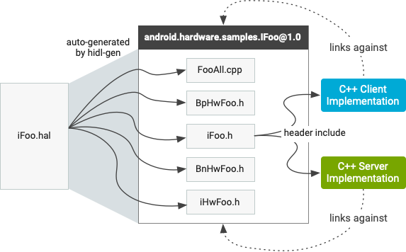

# HIDL C++

Android O 对 Android 操作系统的架构重新进行了设计，以在独立于设备的 Android 平台与特定于设备和供应商的代码之间定义清晰的接口。Android 已经以 HAL 接口的形式（在 `hardware/libhardware` 中定义为 C 标头）定义了许多此类接口。

HIDL 将这些 HAL 接口替换为稳定的带版本接口，它们可以是采用 C++（如下所述）或 [Java](https://source.android.com/devices/architecture/hidl-java) 的客户端和服务器端 HIDL 接口。

## 概览


### 客户端和服务器实现

HIDL 接口具有客户端和服务器实现：

- HIDL 接口的**客户端**实现是指通过在该接口上调用方法来使用该接口的代码。
- **服务器**实现是指 HIDL 接口的实现，它可接收来自客户端的调用并返回结果（如有必要）。

在从 `libhardware` HAL 转换为 HIDL HAL 的过程中，HAL 实现成为服务器，而调用 HAL 的进程则成为客户端。默认实现可提供直通和绑定式 HAL，并可能会随着时间而发生变化：


### 创建 HAL 客户端

首先将 HAL 库添加到 makefile 中：

- Make：`LOCAL_SHARED_LIBRARIES += android.hardware.nfc@1.0`
- Soong：`shared_libs: [ …, android.hardware.nfc@1.0 ]`

接下来，添加 HAL 头文件：

```
#include <android/hardware/nfc/1.0/IFoo.h>
…
// in code:
sp<IFoo> client = IFoo::getService();
client->doThing();
```

### 创建 HAL 服务器

要创建 HAL 实现，必须具有表示 HAL 的 `.hal` 文件并已在 `hidl-gen` 上使用 `-Lmakefile` 或 `-Landroidbp` 为 HAL 生成 makefile（`./hardware/interfaces/update-makefiles.sh` 会为内部 HAL 文件执行这项操作，这是一个很好的参考）。从 `libhardware` 通过 HAL 传输时，可以使用 c2hal 轻松完成许多此类工作。

```
PACKAGE=android.hardware.nfc@1.0
LOC=hardware/interfaces/nfc/1.0/default/
m -j hidl-gen
hidl-gen -o $LOC -Lc++-impl -randroid.hardware:hardware/interfaces \
    -randroid.hidl:system/libhidl/transport $PACKAGE
hidl-gen -o $LOC -Landroidbp-impl -randroid.hardware:hardware/interfaces \
    -randroid.hidl:system/libhidl/transport $PACKAGE
```

`/(system|vendor|...)/lib(64)?/hw/android.hardware.package@3.0-impl($OPTIONAL_IDENTIFIER).so` 下），其中 `$OPTIONAL_IDENTIFIER` 是一个标识直通实现的字符串。直通模式要求会通过上述命令自动满足，这些命令也会创建 `android.hardware.nfc@1.0-impl` 目标，但是可以使用任何扩展。例如，`android.hardware.nfc@1.0-impl-foo` 就是使用 `-foo` 区分自身。

接下来，使用相应功能填写存根并设置守护进程。守护进程代码（支持直通）示例：

```
#include <hidl/LegacySupport.h>

int main(int /* argc */, char* /* argv */ []) {
    return defaultPassthroughServiceImplementation<INfc>("nfc");
}
```

`defaultPassthroughServiceImplementation` 将对提供的 `-impl` 库执行 `dlopen()` 操作，并将其作为绑定式服务提供。守护进程代码（对于纯绑定式服务）示例：

```
int main(int /* argc */, char* /* argv */ []) {
    // This function must be called before you join to ensure the proper
    // number of threads are created. The threadpool will never exceed
    // size one because of this call.
    ::android::hardware::configureRpcThreadpool(1 /*threads*/, true /*willJoin*/);

    sp nfc = new Nfc();
    const status_t status = nfc->registerAsService();
    if (status != ::android::OK) {
        return 1; // or handle error
    }

    // Adds this thread to the threadpool, resulting in one total
    // thread in the threadpool. We could also do other things, but
    // would have to specify 'false' to willJoin in configureRpcThreadpool.
    ::android::hardware::joinRpcThreadpool();
    return 1; // joinRpcThreadpool should never return
}
```

此守护进程通常存在于 `$PACKAGE + "-service-suffix"`（例如 `android.hardware.nfc@1.0-service`）中，但也可以位于任何位置。HAL 的特定类的 [sepolicy](https://source.android.com/security/selinux/device-policy) 是属性 `hal_`（例如 `hal_nfc)`）。必须将此属性应用到运行特定 HAL 的守护进程（如果同一进程提供多个 HAL，则可以将多个属性应用到该进程）。

## 软件包

> **注意**：本部分使用 `.hal` 示例文件来说明 HIDL 语言结构如何映射到 C++。

HIDL 接口软件包位于 `hardware/interfaces` 或 `vendor/` 目录下（少数例外情况除外）。`hardware/interfaces` 顶层会直接映射到 `android.hardware` 软件包命名空间；版本是软件包（而不是接口）命名空间下的子目录。

`hidl-gen` 编译器会将 `.hal` 文件编译成一组 `.h` 和 `.cpp` 文件。这些自动生成的文件可用来编译客户端/服务器实现链接到的共享库。用于编译此共享库的 `Android.bp` 文件由 `hardware/interfaces/update-makefiles.sh` 脚本自动生成。每次将新软件包添加到 `hardware/interfaces` 或在现有软件包中添加/移除 `.hal` 文件时，您都必须重新运行该脚本，以确保生成的共享库是最新的。

例如，`IFoo.hal` 示例文件应该位于 `hardware/interfaces/samples/1.0` 下。`**IFoo.hal**` 示例文件会在**示例**软件包中创建一个 IFoo 接口：

```
package android.hardware.samples@1.0;
interface IFoo {
    struct Foo {
       int64_t someValue;
       handle  myHandle;
    };

    someMethod() generates (vec<uint32_t>);
    anotherMethod(Foo foo) generates (int32_t ret);
};
```

#### 生成的文件

HIDL 软件包中自动生成的文件会链接到与软件包同名的单个共享库（例如 `android.hardware.samples@1.0`）。该共享库还会导出单个标头 `IFoo.h`，用于包含在客户端和服务器中。绑定式模式使用 `hidl-gen` 编译器并以 `IFoo.hal` 接口文件作为输入，它具有以下自动生成的文件：




- `**IFoo.h**`。描述 C++ 类中的纯 `IFoo` 接口；它包含 `IFoo.hal` 文件中的 `IFoo` 接口中所定义的方法和类型，必要时会转换为 C++ 类型。**不包含**与用于实现此接口的 RPC 机制（例如 `HwBinder`）相关的详细信息。类的命名空间包含软件包名称和版本号，例如 `::android::hardware::samples::IFoo::V1_0`。客户端和服务器都包含此标头：客户端用它来调用方法，服务器用它来实现这些方法。
- `**IHwFoo.h**`。头文件，其中包含用于对接口中使用的数据类型进行序列化的函数的声明。开发者不得直接包含其标头（它不包含任何类）。
- `**BpFoo.h**`。从 `IFoo` 继承的类，可描述接口的 `HwBinder` 代理（客户端）实现。开发者不得直接引用此类。
- **`\**BnFoo.h\**`**。保存对 `IFoo` 实现的引用的类，可描述接口的 `HwBinder` 存根（服务器端）实现。开发者不得直接引用此类。
- `**FooAll.cpp**`。包含 `HwBinder` 代理和 `HwBinder` 存根的实现的类。当客户端调用接口方法时，代理会自动从客户端封送参数，并将事务发送到绑定内核驱动程序，该内核驱动程序会将事务传送到另一端的存根（该存根随后会调用实际的服务器实现）。

这些文件的结构类似于由 `aidl-cpp` 生成的文件（如需了解详细信息，请参阅 [HIDL 概览](https://source.android.com/devices/architecture/hidl)中的“直通模式”）。独立于 HIDL 使用的 RPC 机制的唯一一个自动生成的文件是 `IFoo.h`；其他所有文件都与 HIDL 使用的 HwBinder RPC 机制相关联。因此，客户端和服务器实现**不得直接引用除 `IFoo` 之外的任何内容**。为了满足这项要求，请只包含 `IFoo.h` 并链接到生成的共享库。

> **注意**：HwBinder 只是一种可能的传输机制，未来可能会添加新的传输机制。

#### 链接到共享库

使用软件包中的任何接口的客户端或服务器必须在下面的**其中一 (1) 个**位置包含该软件包的共享库：

- 在`Android.mk`中：

  ```
  LOCAL_SHARED_LIBRARIES += android.hardware.samples@1.0
  ```

- 在`Android.bp`中：

  ```
  shared_libs: [
      /* ... */
      "android.hardware.samples@1.0",
  ],
  ```

可能需要包含的其他库：

| `libhidlbase`      | 包含标准 HIDL 数据类型。从 Android 10 开始，该库还包含先前在 `libhidltransport` 和 `libhwbinder` 中的所有符号。 |
| :----------------- | ------------------------------------------------------------ |
| `libhidltransport` | 通过不同的 RPC/IPC 机制处理 HIDL 调用的传输。**Android 10 弃用了该库。** |
| `libhwbinder`      | 特定于 Binder 的符号。**Android 10 弃用了该库。**            |
| `libfmq`           | 快速消息队列 IPC。                                           |

#### 命名空间

HIDL 函数和类型（如 `Return` 和 `Void()`）已在命名空间 `::android::hardware` 中进行声明。软件包的 C++ 命名空间由软件包的名称和版本号确定。例如，`hardware/interfaces` 下版本为 1.2 的软件包 **mypackage** 具有以下特质：

- **C++ 命名空间**是 `::android::hardware::mypackage::V1_2`
- 该软件包中 `IMyInterface` 的**完全限定名称**是：`::android::hardware::mypackage::V1_2::IMyInterface`。（`IMyInterface` 是一个标识符，而不是命名空间的一部分）。
- 在软件包的 `types.hal` 文件中定义的**类型**标识为：`::android::hardware::mypackage::V1_2::MyPackageType`

## 接口

HIDL 软件包中定义的每个接口在其软件包的命名空间内都有自己的自动生成的 C++ 类。客户端和服务器会通过不同的方式处理接口：

- **服务器**实现接口。
- **客户端**在接口上调用方法。

接口可以由服务器按名称注册，也可以作为参数传递到以 HIDL 定义的方法。例如，框架代码可设定一个从 HAL 接收异步消息的接口，并将该接口直接传递到 HAL（无需注册该接口）。

#### 服务器实现

实现 `IFoo` 接口的服务器必须包含自动生成的 `IFoo` 头文件：

```
#include <android/hardware/samples/1.0/IFoo.h>
```

该标头由 `IFoo` 接口的共享库自动导出以进行链接。`IFoo.hal` 示例：

```
// IFoo.hal
interface IFoo {
    someMethod() generates (vec<uint32_t>);
    ...
}
```

IFoo 接口的服务器实现的示例框架：

```
// From the IFoo.h header
using android::hardware::samples::V1_0::IFoo;

class FooImpl : public IFoo {
    Return<void> someMethod(foo my_foo, someMethod_cb _cb) {
        vec<uint32_t> return_data;
        // Compute return_data
        _cb(return_data);
        return Void();
    }
    ...
};
```

要使服务器接口的实现可供客户端使用，您可以：

1. 向 `hwservicemanager` **注册**接口实现（详情见下文），
2. 将接口实现作为接口方法的参数进行**传递**（详情见[异步回调](https://source.android.com/devices/architecture/hidl-cpp/interfaces#asynchronous)部分）。

注册接口实现时，`hwservicemanager` 进程会按名称和版本号跟踪设备上正在运行的已注册 HIDL 接口。服务器可以按名称注册 HIDL 接口实现，而客户端则可以按名称和版本号请求服务实现。该进程可提供 HIDL 接口 `android.hidl.manager@1.0::IServiceManager`。

每个自动生成的 HIDL 接口头文件（如 `IFoo.h`）都有一个 `registerAsService()` 方法，可用于向 `hwservicemanager` 注册接口实现。唯一一个必需的参数是接口实现的名称，因为稍后客户端将使用此名称从 `hwservicemanager` 检索接口：

```
::android::sp<IFoo> myFoo = new FooImpl();
::android::sp<IFoo> mySecondFoo = new FooAnotherImpl();
status_t status = myFoo->registerAsService();
status_t anotherStatus = mySecondFoo->registerAsService("another_foo");
```

`hwservicemanager` 会将 `[package@version::interface, instance_name]` 组合视为唯一，以使不同的接口（或同一接口的不同版本）能够采用完全相同的实例名称无冲突地注册。如果您调用的 `registerAsService()` 具有完全相同的软件包版本、接口和实例名称，则 `hwservicemanager` 将丢弃对先前注册的服务的引用，并使用新的服务。

#### 客户端实现

和服务器一样，客户端也必须 `#include` 其引用的每个接口：

```
#include <android/hardware/samples/1.0/IFoo.h>
```

客户端可以通过两种方式获取接口：

- 通过 `I::getService`（借助 `hwservicemanager`）
- 通过接口方法

每个自动生成的接口头文件都有一个静态 `getService` 方法，可用于从 `hwservicemanager` 检索服务实例：

```
// getService will return nullptr if the service can't be found
sp<IFoo> myFoo = IFoo::getService();
sp<IFoo> myAlternateFoo = IFoo::getService("another_foo");
```

现在，客户端有一个 `IFoo` 接口，并可以向其（将其当作本地类实现）调用方法。实际上，实现可以在同一个进程中运行，也可以在不同的进程中运行，甚至还可以在另一个设备上运行（通过 HAL 远程处理）。由于客户端在 `1.0 `版软件包中包含的 `IFoo` 对象上调用 `getService`，因此仅当服务器实现与 `1.0` 客户端兼容时，`hwservicemanager` 才会返回该实现。实际上，这意味着系统只会返回版本为 `1.n` 的服务器实现（`x.(y+1)` 版本的接口必须扩展（继承自）`x.y`）。

此外，您也可以使用 `castFrom` 方法，在不同的接口之间进行类型转换。该方法会通过以下方式发挥作用：对远程接口进行 IPC 调用，以确保底层类型与正在请求的类型相同。如果请求的类型不可用，则返回 `nullptr`。

```
sp foo1_0 = V1_0::IFoo::getService();sp foo1_1 = V1_1::IFoo::castFrom(foo1_0);
```

#### 异步回调

很多现有的 HAL 实现会与异步硬件通信，这意味着它们需要以异步方式通知客户端已发生的新事件。HIDL 接口可以用作异步回调，因为 HIDL 接口函数可以将 HIDL 接口对象用作参数。

`IFooCallback.hal` 接口文件示例：

```
package android.hardware.samples@1.0;
interface IFooCallback {
    sendEvent(uint32_t event_id);
    sendData(vec<uint8_t> data);
}
```

`IFoo` 中采用 `IFooCallback` 参数的新方法示例：

```
package android.hardware.samples@1.0;
interface IFoo {
    struct Foo {
       int64_t someValue;
       handle myHandle;
    };

    someMethod(Foo foo) generates (int32_t ret);
    anotherMethod() generates (vec<uint32_t>);
    registerCallback(IFooCallback callback);
};
```

使用 `IFoo` 接口的客户端是 `IFooCallback` 接口的服务器；它会提供 `IFooCallback` 的实现：

```
class FooCallback : public IFooCallback {
    Return<void> sendEvent(uint32_t event_id) {
        // process the event from the HAL
    }
    Return<void> sendData(const hidl_vec<uint8_t>& data) {
        // process data from the HAL
    }
};
```

它也可以简单地通过 `IFoo` 接口的现有实例来传递该实现：

```
sp<IFooCallback> myFooCallback = new FooCallback();
myFoo.registerCallback(myFooCallback);
```

实现 `IFoo` 的服务器会将此作为 `sp` 对象进行接收。它可以存储该回调，而且只要它想使用此接口，均可回调到客户端。

#### 服务终止通知接收方

由于服务实现可以在不同的进程中运行，因此可能会出现实现接口的进程已终止但客户端仍保持活动状态的情况。对托管在已终止进程中的接口对象的任何调用都将失败，并会返回相应的传输错误（`isOK()` 将返回 false）。要从这类故障中恢复正常，唯一的方法是通过调用 `I::getService()` 来请求服务的新实例。仅当崩溃的进程已重新启动且已向 `servicemanager` 重新注册其服务时，这种方法才有效（对 HAL 实现而言通常如此）。

接口的客户端也可以注册为服务终止通知接收方，以便在服务终止时收到通知，而不是被动地应对这种情况。要在检索的 `IFoo` 接口上注册此类通知，客户端可以执行以下操作：

```
foo->linkToDeath(recipient, 1481 /* cookie */);
```

`recipient` 参数必须是由 HIDL 提供的 `android::hardware::hidl_death_recipient` 接口的实现，该接口中包含在托管接口的进程终止时从 RPC 线程池中的线程调用的单个 `serviceDied()` 方法：

```
class MyDeathRecipient : public android::hardware::hidl_death_recipient {
    virtual void serviceDied(uint64_t cookie, const android::wp<::android::hidl::base::V1_0::IBase>& who) {
       // Deal with the fact that the service died
    }
}
```

`cookie` 参数包含通过 `linkToDeath()` 传入的 Cookie，而 `who` 参数则包含一个弱指针，它指向表示客户端中的服务的对象。在上面给出的调用示例中，`cookie` 等于 1481，`who` 等于 `foo`。

您也可以在注册服务终止通知接收方后将其取消注册：

```
foo->unlinkToDeath(recipient);
```

## 数据类型

HIDL 数据声明可生成 C++ 标准布局数据结构。您可以将这些结构放置在任何合适的位置（可以放在堆栈上，放在文件或全局范围内，也可以放在堆区上），而且这些结构能以相同的方式构成。客户端代码会调用传入常量引用和基元类型的 HIDL 代理代码，而存根和代理代码会隐藏序列化的细节。

> **注意**：在任何情况下，开发者编写的代码都不需要对数据结构进行显式序列化或反序列化。

下表说明 HIDL 基元与 C++ 数据类型之间的对应关系：

| **HIDL 类型**       | **C++ 类型**         | **头文件/库** |
| :------------------ | :------------------- | :------------ |
| `enum`              | `enum class`         |               |
| `uint8_t..uint64_t` | `uint8_t..uint64_t`  | `<stdint.h>`  |
| `int8_t..int64_t`   | `int8_t..int64_t`    | `<stdint.h>`  |
| `float`             | `float`              |               |
| `double`            | `double`             |               |
| `vec`               | `hidl_vec`           | `libhidlbase` |
| `T[S1][S2]...[SN]`  | `T[S1][S2]...[SN]`   |               |
| `string`            | `hidl_string`        | `libhidlbase` |
| `handle`            | `hidl_handle`        | `libhidlbase` |
| `safe_union`        | `(custom) struct`    |               |
| `struct`            | `struct`             |               |
| `union`             | `union`              |               |
| `fmq_sync`          | `MQDescriptorSync`   | `libhidlbase` |
| `fmq_unsync`        | `MQDescriptorUnsync` | `libhidlbase` |

下面几部分详细介绍了这些数据类型。

#### 枚举

HIDL 形式的枚举会变成 C++ 形式的枚举。例如：

```
enum Mode : uint8_t { WRITE = 1 << 0, READ = 1 << 1 };
enum SpecialMode : Mode { NONE = 0, COMPARE = 1 << 2 };
```

…会变为：

```
enum class Mode : uint8_t { WRITE = 1, READ = 2 };
enum class SpecialMode : uint8_t { WRITE = 1, READ = 2, NONE = 0, COMPARE = 4 };
```

从 Android 10 开始，可以使用 `::android::hardware::hidl_enum_range` 迭代枚举。此范围包括每个枚举（按照在 HIDL 源代码中显示的顺序迭代），从父级枚举开始到最后一个子级。例如，此代码按这样的顺序迭代 `WRITE`、`READ`、`NONE` 和 `COMPARE`。根据上述 `SpecialMode`：

```
template <typename T>
using hidl_enum_range = ::android::hardware::hidl_enum_range<T>

for (SpecialMode mode : hidl_enum_range<SpecialMode>) {...}
```

`hidl_enum_range` 还实现了反向迭代，可以在 `constexpr` 上下文中使用。如果某个值在枚举中多次出现，则该值会多次出现在该范围内。

#### bitfield<T>

`bitfield`（其中 `T` 是用户定义的枚举）会变为 C++ 形式的该枚举的底层类型。在上述示例中，`bitfield` 会变为 `uint8_t`。

#### vec<T>

`hidl_vec` 类模板是 `libhidlbase` 的一部分，可用于传递具备任意大小的任何 HIDL 类型的矢量。与之相当的具有固定大小的容器是 `hidl_array`。此外，您也可以使用 `hidl_vec::setToExternal()` 函数将 `hidl_vec` 初始化为指向 `T` 类型的外部数据缓冲区。

除了在生成的 C++ 头文件中适当地发出/插入结构之外，您还可以使用 `vec` 生成一些便利函数，用于转换到 `std::vector` 和 `T` 裸指针或从它们进行转换。如果您将 `vec` 用作参数，则使用它的函数将过载（将生成两个原型），以接受并传递该参数的 HIDL 结构和 `std::vector` 类型。

#### 数组

hidl 中的常量数组由 `libhidlbase` 中的 `hidl_array` 类表示。`hidl_array` 表示具有固定大小的 N 维数组 `T[S1][S2]…[SN]`。

#### 字符串

`hidl_string` 类（`libhidlbase` 的一部分）可用于通过 HIDL 接口传递字符串，并在 `/system/libhidl/base/include/hidl/HidlSupport.h` 下进行定义。该类中的第一个存储位置是指向其字符缓冲区的指针。

`hidl_string` 知道如何使用 `operator=`、隐式类型转换和 `.c_str()` 函数转换自或转换到 `std::string and char*`（C 样式的字符串）。HIDL 字符串结构具有适当的复制构造函数和赋值运算符，可用于：

- 从 `std::string` 或 C 字符串加载 HIDL 字符串。
- 从 HIDL 字符串创建新的 `std::string`。

此外，HIDL 字符串还有转换构造函数，因此 C 字符串 (`char *`) 和 C++ 字符串 (`std::string`) 可用于采用 HIDL 字符串的方法。

#### 结构

HIDL 形式的 `struct` 只能包含固定大小的数据类型，不能包含任何函数。HIDL 结构定义会直接映射到 C++ 形式的标准布局 `struct`，从而确保 `struct` 具有一致的内存布局。一个结构可以包括多种指向单独的可变长度缓冲区的 HIDL 类型（包括 `handle`、`string` 和 `vec`）。

#### 句柄

> **警告**：任何类型的地址（即使是物理设备地址）都不得是原生句柄的一部分。在进程之间传递该信息很危险，会导致进程容易受到攻击。在进程之间传递的任何值都必须先经过验证，然后才能用于在进程内查找分配的内存。否则，错误的句柄可能会导致内存访问错误或内存损坏。

`handle` 类型由 C++ 形式的 `hidl_handle` 结构表示，该结构是一个简单的封装容器，用于封装指向 `const native_handle_t` 对象的指针（该对象已经在 Android 中存在了很长时间）。

```
typedef struct native_handle
{
    int version;        /* sizeof(native_handle_t) */
    int numFds;         /* number of file descriptors at &data[0] */
    int numInts;        /* number of ints at &data[numFds] */
    int data[0];        /* numFds + numInts ints */
} native_handle_t;
```

默认情况下，`hidl_handle` 并**不**具备对它所封装的 `native_handle_t` 指针的所有权。它的存在只是为了安全地存储指向 `native_handle_t` 的指针，以使其在 32 位和 64 位进程中均可使用。

在以下情况下，`hidl_handle` 会拥有对其所封装文件描述符的所有权：

- 在调用 `setTo(native_handle_t* handle, bool shouldOwn)` 方法（`shouldOwn` 参数已设置为 `true`）后
- 当通过复制其他 `hidl_handle` 对象的构造创建 `hidl_handle` 对象时
- 当 `hidl_handle` 对象从其他 `hidl_handle` 对象复制赋值时

`hidl_handle` 可提供到/从 `native_handle_t* `对象的隐式和显式转换。在 HIDL 中，`handle` 类型的主要用途是通过 HIDL 接口传递文件描述符。因此，单个文件描述符由没有 `int` 的 `native_handle_t` 和单个 `fd` 表示。如果客户端和服务器在不同的进程中运行，则 RPC 实现将自动处理文件描述符，以确保这两个进程可对同一个文件执行操作。

尽管由某个进程在 `hidl_handle` 中接收的文件描述符在该进程中有效，但超出接收函数范围后该描述符将不会持续存在（该函数返回后描述符将会关闭）。要持续访问文件描述符，进程必须对所封装的文件描述符执行 `dup()` 操作或复制整个 `hidl_handle` 对象。

#### 内存

HIDL `memory` 类型会映射到 `libhidlbase` 中的 `hidl_memory` 类，该类表示未映射的共享内存。这是要在 HIDL 中共享内存而必须在进程之间传递的对象。要使用共享内存，需满足以下条件：

1. 获取 `IAllocator` 的实例（当前只有“ashmem”实例可用）并使用该实例分配共享内存。
2. `IAllocator::allocate()` 返回 `hidl_memory` 对象，该对象可通过 HIDL RPC 传递，并能使用 `libhidlmemory` 的 `mapMemory` 函数映射到某个进程。
3. `mapMemory` 返回对可用于访问内存的 `sp` 对象的引用（`IMemory` 和 `IAllocator` 在 `android.hidl.memory@1.0` 中定义）。

`IAllocator` 的实例可用于分配内存：

```c++
#include <android/hidl/allocator/1.0/IAllocator.h>
#include <android/hidl/memory/1.0/IMemory.h>
#include <hidlmemory/mapping.h>
using ::android::hidl::allocator::V1_0::IAllocator;
using ::android::hidl::memory::V1_0::IMemory;
using ::android::hardware::hidl_memory;
....
  sp<IAllocator> ashmemAllocator = IAllocator::getService("ashmem");
  ashmemAllocator->allocate(2048, [&](bool success, const hidl_memory& mem) {
        if (!success) { /* error */ }
        // now you can use the hidl_memory object 'mem' or pass it around
  }));
```

对内存的实际更改必须通过 `IMemory` 对象完成（在创建 `mem` 的一端或在通过 HIDL RPC 接收更改的一端完成）。

```
// Same includes as abovesp 

memory = mapMemory(mem);
void* data = memory->getPointer();
memory->update();
// update memory however you wish after calling update and before calling commit

data[0] = 42;
memory->commit();

// …
memory->update(); // the same memory can be updated multiple times

// …
memory->commit();
```

#### 接口

接口可作为对象传递。“接口”一词可用作 `android.hidl.base@1.0::IBase` 类型的语法糖；此外，当前的接口以及任何导入的接口都将被定义为一个类型。

存储接口的变量应该是强指针：`sp`。接受接口参数的 HIDL 函数会将原始指针转换为强指针，从而导致不可预料的行为（可能会意外清除指针）。为避免出现问题，请务必将 HIDL 接口存储为 `sp<>`。

## 函数

HIDL 接口中的函数会映射到自动生成的 `IFoo` C++ 类声明中的方法。每个函数的名称在 C++ 中都将保持不变；下面几部分介绍了 HIDL 参数和返回值如何转换为 C++。

#### 函数参数

`.hal` 文件中列出的参数会映射到 C++ 数据类型。未映射到基元 C++ 类型的参数会通过常量引用进行传递。

对于具有返回值（具有 `generates` 语句）的每个 HIDL 函数，该函数的 C++ 参数列表中都有一个附加参数：使用 HIDL 函数的返回值调用的回调函数。有**一种情况例外**：如果 `generates` 子句包含直接映射到 C++ 基元的单个参数，则使用回调省略（回调会被移除，而返回值则会通过正常的 `return` 语句从函数返回）。

#### 函数返回值

以下函数具有返回值。

传输错误和返回类型

`generates` 语句可以产生三种类型的函数签名：

- 如果只有一个作为 C++ 基元的返回值，`generates` 返回值会由 `Return` 对象中函数的值返回。
- 如果情况更复杂，`generates` 返回值则会通过随函数调用本身一起提供的回调参数返回，而函数则返回 `Return`。
- 如果不存在 `generates` 语句，函数则会返回 `Return`。

RPC 调用可能偶尔会遇到传输错误，例如服务器终止，传输资源不足以完成调用，或传递的参数不允许完成调用（例如缺少必需的回调函数）。`Return` 对象会存储传输错误指示以及 `T` 值（`Return` 除外）。

由于客户端和服务器端函数具有相同的签名，因此服务器端函数必须返回 `Return` 类型（即使其实现并不会指出传输错误）。`Return` 对象会使用 `Return(myTValue)` 进行构建（也可以通过 `mTValue` 隐式构建，例如在 `return` 语句中），而 `Return` 对象则使用 `Void()` 进行构建。

`Return` 对象可以从其 `T` 值执行隐式转换，也可以执行到该值的隐式转换。您可以检查 `Return` 对象是否存在传输错误，只需调用其 `isOk()` 方法即可。这项检查不是必需的；不过，如果发生了一个错误，而您未在 `Return` 对象销毁前对该错误进行检查，或尝试进行了 `T` 值转换，则客户端进程将会终止并记录一个错误。如果 `isOk()` 表明存在由开发者代码中的逻辑错误（例如将 `nullptr` 作为同步回调进行传递）导致的传输错误或失败调用，则可以对 Return 对象调用 `description()` 以返回适合日志记录的字符串。在这种情况下，您无法确定因调用失败而在服务器上执行的代码可能有多少。另外，您还可以使用 `isDeadObject()` 方法。此方法表明，之所以会显示 `!isOk()`，是因为远程对象已崩溃或已不存在。`isDeadObject()` 一律表示 `!isOk()`。

#### 由值返回

如果 `generates` 语句映射到单个 C++ 基元，则参数列表中不会有任何回调参数，而实现会在 `Return` 对象中提供返回值 `T`，该值可以从基元类型 `T` 隐式生成。例如：

```
Return<uint32_t> someMethod() {
    uint32_t return_data = ...; // Compute return_data
    return return_data;
};
```

另外，您还可以使用 `Return<*>::withDefault` 方法。此方法会在返回值为 `!isOk()` 的情况下提供一个值。此方法还会自动将返回对象标记为正常，以免客户端进程遭到终止。

#### 使用回调参数返回

回调可以将 HIDL 函数的返回值回传给调用方。回调的原型是 `std::function` 对象，其参数（从 `generates` 语句中获取）会映射到 C++ 类型。它的返回值为 void（回调本身并不会返回任何值）。

具有回调参数的 C++ 函数的返回值具有 `Return` 类型。服务器实现仅负责提供返回值。由于返回值已使用回调传输，因此 `T` 模板参数为 `void`：

```
Return<void> someMethod(someMethod_cb _cb);
```

服务器实现应从其 C++ 实现中返回 `Void()`（这是一个可返回 `Return` 对象的静态内嵌函数）。具有回调参数的典型服务器方法实现示例：

```
Return someMethod(someMethod_cb _cb) { 
    // Do some processing, then call callback with return data  
    hidl_vec vec = ...  _cb(vec);
    return Void();
};
```

#### 没有返回值的函数

没有 `generates` 语句的函数的 C++ 签名将不会在参数列表中有任何回调参数。它的返回类型将为 `Return.`

#### 单向函数

以 `oneway` 关键字标记的函数是异步函数（其执行不会阻塞客户端），而且没有任何返回值。`oneway` 函数的 C++ 签名将不会在参数列表中有任何回调参数，而且其 C++ 返回值将为 `Return`。