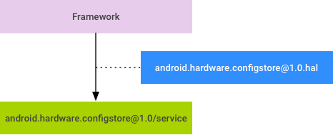

# 配置

## 概览

Android 10 因 ConfigStore HAL 内存耗用量高且难以使用而将其弃用，并用系统属性替换了这个 HAL。在 Android 10 中：

- ConfigStore 使用编译标记在供应商分区中存储配置值，系统分区中的服务使用 HIDL 访问这些值（在 Android 9 中也是如此）。
- 系统属性使用 `PRODUCT_DEFAULT_PROPERTY_OVERRIDES` 在供应商分区的 `default.prop` 中存储系统属性，而该服务使用 `sysprop` 读取这些属性。

ConfigStore HAL 保留在 AOSP 中以支持旧版供应商分区。在搭载 Android 10 的设备上，`surfaceflinger` 首先读取系统属性；如果没有为 `SurfaceFlingerProperties.sysprop` 中的配置项定义任何系统属性，则 `surfaceflinger` 会回退到 ConfigStore HAL。

### 编译标记和系统属性

ConfigStore 中的每个编译标记都有一个匹配的系统属性，如下表所示。

| 编译标记                                | 系统属性                                                 |
| :-------------------------------------- | :------------------------------------------------------- |
| `TARGET_FORCE_HWC_FOR_VIRTUAL_DISPLAYS` | `ro.surface_flinger.force_hwc_copy_for_virtual_displays` |
| `TARGET_HAS_HDR_DISPLAY`                | `ro.surface_flinger.has_HDR_display`                     |
| `TARGET_HAS_WIDE_COLOR_DISPLAY`         | `ro.surface_flinger.has_wide_color_display`              |
| `NUM_FRAMEBUFFER_SURFACE_BUFFERS`       | `ro.surface_flinger.max_frame_buffer_acquired_buffers`   |
| `MAX_VIRTUAL_DISPLAY_DIMENSION`         | `ro.surface_flinger.max_virtual_display_dimension`       |
| `PRIMARY_DISPLAY_ORIENTATION`           | `ro.surface_flinger.primary_display_orientation`         |
| `PRESENT_TIME_OFFSET_FROM_VSYNC_NS`     | `ro.surface_flinger.present_time_offset_from_vsync_ns`   |
| `TARGET_RUNNING_WITHOUT_SYNC_FRAMEWORK` | `ro.surface_flinger.running_without_sync_framework`      |
| `SF_START_GRAPHICS_ALLOCATOR_SERVICE`   | `ro.surface_flinger.start_graphics_allocator_service`    |
| `TARGET_USE_CONTEXT_PRIORITY`           | `ro.surface_flinger.use_context_priority`                |
| `USE_VR_FLINGER`                        | `ro.surface_flinger.use_vr_flinger`                      |
| `VSYNC_EVENT_PHASE_OFFSET_NS`           | `ro.surface_flinger.vsync_event_phase_offset_ns`         |
| `SF_VSYNC_EVENT_PHASE_OFFSET_NS`        | `ro.surface_flinger.vsync_sf_event_phase_offset_ns`      |

### 新系统属性

Android 10 包含以下新系统属性：

- `ro.surface_flinger.default_composition_dataspace`
- `ro.surface_flinger.default_composition_pixel_format`
- `ro.surface_flinger.use_color_management`
- `ro.surface_flinger.wcg_composition_dataspace`
- `ro.surface_flinger.wcg_composition_pixel_format`
- `ro.surface_flinger.display_primary_red`
- `ro.surface_flinger.display_primary_green`
- `ro.surface_flinger.display_primary_blue`
- `ro.surface_flinger.display_primary_white`
- `ro.surface_flinger.protected_contents`
- `ro.surface_flinger.set_idle_timer_ms`
- `ro.surface_flinger.set_touch_timer_ms`
- `ro.surface_flinger.use_smart_90_for_video`
- `ro.surface_flinger.protected_contents`
- `ro.surface_flinger.support_kernel_idle_timer`

如需详细了解这些属性，请参阅 `frameworks/native/services/surfaceflinger/sysprop/SurfaceFlingerProperties.sysprop`

## 系统属性API

系统属性是在系统范围内共享信息（通常是配置）的一种便捷方式。每个分区都可以在内部使用自己的系统属性。跨分区访问属性时可能会出现问题，例如 `/vendor` 访问 `/system` 定义的属性。从 Android 8.0 开始，可以升级某些分区（如 `/system`），而 `/vendor` 保持不变。由于系统属性只是不具有架构的字符串键/值对的全局字典，因此很难稳定属性。`/system` 分区可以更改或移除 `/vendor` 分区所依赖的属性，而不会另行通知。

从 Android 10 版本开始，跨分区访问的系统属性系统化为 Sysprop 说明文件，并且访问属性的 API 会生成为 C++ 具体函数和 Java 类。这些 API 便于使用，因为访问不需要 magic 字符串（如 `ro.build.date`），它们可以静态输入。在编译时也需要检查 ABI 稳定性；如果发生不兼容的更改，则编译会中断。此检查充当各个分区之间明确定义的接口。这些 API 还可以在 Java 和 C ++ 之间实现一致性。

### 将系统属性定义为 API

使用 Sysprop 说明文件 (`.sysprop`) 将系统属性定义为 API，该文件使用 protobuf 的 TextFormat，其架构如下：

```protobuf
// File: sysprop.proto
syntax = "proto3";

package sysprop;
enum Access { 
	Readonly = 0; 
	Writeonce = 1; 
	ReadWrite = 2;
}

enum Owner { 
	Platform = 0; 
	Vendor = 1; 
	Odm = 2;
}

enum Scope { 
	Public = 0; 
	System = 1; 
	Internal = 2;
}

enum Type { 
	Boolean = 0; 
	Integer = 1; 
	Long = 2; 
	Double = 3; 
	String = 4; 
	Enum = 5; 
	BooleanList = 20; 
	IntegerList = 21; 
	LongList = 22; 
	DoubleList = 23; 
	StringList = 24; 
	EnumList = 25;
}

message Property { 
	string api_name = 1; 
	Type type = 2; 
	Access access = 3; 
	Scope scope = 4; 
	string prop_name = 5; 
	string enum_values = 6; 
	bool integer_as_bool = 7;
}

message Properties { 
	Owner owner = 1; 
	string module = 2; 
	repeated Property prop = 3;
}
```

一个 Sysprop 说明文件包含一个属性消息，该消息描述一组属性。其字段的含义如下。

| 字段     | 含义                                                         |
| :------- | :----------------------------------------------------------- |
| `owner`  | 设置为具有以下属性的分区：`Platform`、`Vendor` 或 `Odm`。    |
| `module` | 用于创建放置生成的 API 的命名空间 (C++) 或静态最终类 (Java)。例如，`com.android.sysprop.BuildProperties` 将是 C ++ 中的命名空间 `com::android::sysprop::BuildProperties`，并且也是 Java 中 `com.android.sysprop` 中的软件包中的 `BuildProperties` 类。 |
| `prop`   | 属性列表。                                                   |

`Property` 消息字段的含义如下。

| 字段              | 含义                                                         |
| :---------------- | :----------------------------------------------------------- |
| `api_name`        | 生成的 API 的名称。                                          |
| `type`            | 此属性的类型。                                               |
| `access`          | `Readonly`：仅生成 getter API`Writeonce`、`ReadWrite`：生成具有内部范围的 setter API注意：前缀为 `ro.` 的属性可能不会使用 `ReadWrite` 访问权限。 |
| `scope`           | `Internal`：只有所有者才能访问。`System`：仅捆绑模块（不是针对 SDK 或 NDK 编译的）才能访问。`Public`：除 NDK 模块外的所有人都可以访问。 |
| `prop_name`       | 底层系统属性的名称，例如 `ro.build.date`。                   |
| `enum_values`     | （仅 `Enum`、`EnumList`）一个竖条 (|) 分隔的字符串，包含可能的枚举值。例如，`value1\|value2`。 |
| `integer_as_bool` | （仅 `Boolean`、`BooleanList`）允许 setter 使用 `0` 和 `1` 而不是 `false` 和 true。 |

每种类型的属性都映射到 C ++ 和 Java 中的以下类型。

| 类型    | C++                                | Java                          |
| :------ | :--------------------------------- | :---------------------------- |
| Boolean | `std::optional`                    | `Optional`                    |
| Integer | `std::optional`                    | `Optional`                    |
| Long    | `std::optional`                    | `Optional`                    |
| Double  | `std::optional`                    | `Optional`                    |
| String  | `std::optional`                    | `Optional`                    |
| Enum    | `std::optional<{api_name}_values>` | `Optional<{api_name}_values>` |
| T List  | `std::vector`                      | `List`                        |

下面的示例展示了定义三个属性的 Sysprop 说明文件：

```protobuf
# File: android/sysprop/PlatformProperties.sysprop

owner: Platform

module: "android.sysprop.PlatformProperties"

prop {  
	api_name: "build_date"  
	type: String  
	prop_name: "ro.build.date"  
	scope: System  
	access: Readonly
}
prop {  
	api_name: "date_utc"  
	type: Integer  
	prop_name: "ro.build.date_utc"  
	scope: Internal  
	access: Readonly
}
prop {  
	api_name: "device_status"  
	type: Enum  
	enum_values: "on|off|unknown"  
	
	prop_name: "device.status"  
	scope: Public  
	access: ReadWrite
}
```

### 定义系统属性库

现在可以使用 Sysprop 说明文件定义 `sysprop_library` 模块。 `sysprop_library` 用作 C ++ 和 Java 的 API。编译系统在内部为 `cc_library` 的每个实例生成一个 `java_sdk_library` 和一个 `sysprop_library`。

```protobuf
// File: Android.bp
sysprop_library {
    name: "PlatformProperties",
    srcs: ["android/sysprop/PlatformProperties.sysprop"],
    property_owner: "Platform",
    api_packages: ["android.sysprop"],
    vendor_available: true,
}
```

必须在源代码中包含 API 列表文件以进行 API 检查。为此，请创建 API 文件和一个 `api` 目录。将 `api` 目录放到与 `Android.bp` 相同的目录中。API 文件名包括 `current.txt`、`removed.txt`、`system-current.txt`、`system-removed.txt`、`test-current.txt` 和 `test-removed.txt`。您可以通过运行 `make update-api` 命令来更新 API 文件。编译系统通过在编译时将这些 API 文件与生成的 API 文件进行比较来检查 API 是否发生更改。下面是一个目录和文件单位示例：

```bash
├── api
│   ├── current.txt
│   ├── removed.txt
│   ├── system-current.txt
│   ├── system-removed.txt
│   ├── test-current.txt
│   └── test-removed.txt
└── Android.bp
```

Java 和 C ++ 客户端模块都可以链接到 `sysprop_library` 以使用生成的 API。编译系统会创建从客户端到生成的 C ++ 和 Java 库的链接，从而使客户端能够访问生成的 API。

```properties
java_library {  
	name: "JavaClient",  
	srcs: ["foo/bar.java"],  
	libs: ["PlatformProperties"],
}

cc_binary {  
	name: "cc_client",  
	srcs: ["baz.cpp"],  
	shared_libs: ["PlatformProperties"],
}
```

在上面的示例中，您可以按如下方式访问定义的属性。

Java 示例：

```java
import android.sysprop.PlatformProperties;

…

static void foo() {
    …
    Integer dateUtc = PlatformProperties.date_utc().orElse(-1);
    …
}
…
```

C ++ 示例：

```c++
#include <android/sysprop/PlatformProperties.sysprop.h>
using namespace android::sysprop;

…void bar() {  …  
    std::string build_date = PlatformProperties::build_date().value_or("(unknown)");
    …
}
…
```


## Config File Schema API

Android 平台包含大量用于存储配置数据（例如，音频配置）的 XML 文件。很多 XML 文件都位于 `vendor` 分区中，但读取它们的操作在 `system` 分区进行。在这种情况下，XML 文件的架构充当这两个分区之间的接口，因此您必须明确指定架构，并且必须以向后兼容的方式改进该架构。

在 Android 10 之前的版本中，Android 平台没有提供需要指定和使用 XML 架构的机制，也没有提供防止架构中发生不兼容更改的机制。Android 10 提供了这种机制，称为 Config File Schema API。该机制由一个名为 `xsdc` 的工具和一个名为 `xsd_config` 的编译规则组成。

`xsdc` 工具是一种 XML 架构文档 (XSD) 编译器。它用于解析描述 XML 文件架构的 XSD 文件，并生成 Java 和 C++ 代码。生成的代码会将符合 XSD 架构的 XML 文件解析到对象树，其中的每个对象均会为一个 XML 标记建模。XML 属性会建模为对象的字段。

`xsd_config` 编译规则会将 `xsdc` 工具集成到编译系统中。对于给定的 XSD 输入文件，该编辑规则会生成 Java 和 C++ 库。您可以将这些库与在其中读取和使用符合 XSD 的 XML 文件的模块相关联。您可以将该编译规则用于跨 `system` 和 `vendor` 分区使用的 XML 文件。

### 构建Config File Schema API

本部分介绍了如何构建 Config File Schema API。

#### 在 Android.bp 中配置 xsd_config 编译规则

`xsd_config` 编译规则使用 `xsdc` 工具生成解析器代码。`xsd_config` 编译规则的 `package_name` 属性决定了生成的 Java 代码的数据包名称。

`Android.bp` 中的 `xsd_config` 编译规则示例：

```
xsd_config {
    name: "hal_manifest",
    srcs: ["hal_manifest.xsd"],
    package_name: "hal.manifest",
}
```

目录结构示例：

```
├── Android.bp
├── api
│   ├── current.txt
│   ├── last_current.txt
│   ├── last_removed.txt
│   └── removed.txt
└── hal_manifest.xsd
```

编译系统使用生成的 Java 代码生成 API 列表，并根据该列表检查 API。此项 API 检查已添加到 DroidCore 并在 `m -j` 处执行。

创建 API 列表文件

要执行 API 检查，需要使用源代码创建 API 列表文件。

API 列表文件包括以下内容：

- `current.txt` 和 `removed.txt`：通过在编译时与生成的 API 文件进行比较来检查 API 是否发生更改。
- `last_current.txt` 和 `last_removed.txt`：通过与 API 文件进行比较来检查 API 是否向后兼容。

要创建 API 列表文件，请执行以下操作：

1. 创建空列表文件。
2. 运行命令 `make update-api`。

### 使用生成的解析器代码

要使用生成的 Java 代码，请在 Java `srcs` 属性中添加 `:` 作为 `xsd_config` 模块名称的前缀。生成的 Java 代码的数据包与 `package_name` 属性相同。

```protobuf
java_library {
    name: "vintf_test_java",
    srcs: [
        "srcs/**/*.java"
        ":hal_manifest"
    ],
}
```

要使用生成的 C++ 代码，请将 `xsd_config` 模块名称添加到 `generated_sources` 和 `generated_headers` 属性中。生成的 C++ 代码的命名空间与 `package_name` 属性相同。例如，如果 `xsd_config` 模块名称为 `hal.manifest`，则命名空间为 `hal::manifest`。

```protobuf
cc_library{
    name: "vintf_test_cpp",
    srcs: ["main.cpp"],
    generated_sources: ["hal_manifest"],
    generated_headers: ["hal_manifest"],
}
```

#### 使用解析器

要使用 Java 解析器代码，请使用 `read` 或 `read{class-name}` 方法返回根元素的类。此时会进行解析。

```Java
import hal.manifest;

…

class HalInfo {
    public String name;
    public String format;
    public String optional;
    …
}

void readHalManifestFromXml(File file) {
    …
    try (InputStream str = new BufferedInputStream(new FileInputStream(file))) {
        Manifest manifest = read(str);
        for (Hal hal : manifest.getHal()) {
            HalInfor halinfo;
            HalInfo.name = hal.getName();
            HalInfo.format = hal.getFormat();
            HalInfor.optional = hal.getOptional();
            …
        }
    }
    …
}
```

要使用 C++ 解析器代码，请先添加头文件。将数据包名称中的句点 (.) 转换为下划线 (_)，该名称即是头文件的名称。然后，使用 `read` 或 `read{class-name}` 方法返回根元素的类。此时会进行解析。返回值是 `std::optional<>`。

```c++
include "hal_manifest.h"

…
using namespace hal::manifest

struct HalInfor {
    public std::string name;
    public std::string format;
    public std::string optional;
    …
};

void readHalManifestFromXml(std::string file_name) {
    …
    Manifest manifest = *read(file_name.c_str());
    for (Hal hal : manifest.getHal()) {
        struct HalInfor halinfo;
        HalInfo.name = hal.getName();
        HalInfo.format = hal.getFormat();
        HalInfor.optional = hal.getOptional();
        …
    }
    …
}
```

提供的所有可以使用解析器的 API 均位于 `api/current.txt` 中。为保持统一，所有元素和属性名称均会转换为驼峰式大小写形式（例如，`ElementName`），并用作相应的变量、方法和类名称。可以使用 `read{class-name}` 函数获取已解析的根元素的类。如果只有一个根元素，则函数名称为 `read`。可以使用 `get{variable-name}` 函数获取已解析的子元素或属性的值。

### 生成解析器代码

在大多数情况下，不需要直接运行 `xsdc`。可以改为使用 `xsd_config` 编译规则，如[在 Android.bp 中配置 xsd_config 编译规则](https://source.android.com/devices/architecture/config-file-schema-api#config-build-rule)中所述。本部分介绍 `xsdc` 命令行界面只是为了本文档的完整性。它对于调试可能很有用。

必须为 `xsdc` 工具提供 XSD 文件的路径和一个数据包。该数据包是指 Java 代码中的数据包名称和 C++ 代码中的命名空间。`-j` 和 `-c` 选项分别用于确定生成的代码是否是 Java 代码和 C 代码。`-o` 选项表示输出目录的路径。

```bash
usage: xsdc path/to/xsd_file.xsd [-c] [-j] [-o <arg>] [-p]
 -c,--cpp           Generate C++ code.
 -j,--java          Generate Java code.
 -o,--outDir <arg>  Out Directory
 -p,--package       Package name of the generated java file. file name of
                    generated C++ file and header
```

命令示例：

```bash
$ xsdc audio_policy_configuration.xsd -p audio.policy -j
```

## ConfigStore HAL

### 概览

Android 8.0 将整个 Android 操作系统拆分为通用分区 (`system.img`) 和特定于硬件的分区（`vendor.img` 和 `odm.img`）。受这种变更的影响，您必须从安装到系统分区的模块中移除条件式编译，而且此类模块必须在运行时确定系统配置（并根据相应配置采取不同的行为）。

ConfigStore HAL 提供了一组 API，可供访问用于配置 Android 框架的只读配置项。本页面介绍了 ConfigStore HAL 的设计（以及不使用系统属性来访问只读配置项的原因）；其他页面详细介绍了 HAL 接口、服务实现和客户端使用情况，所有这些均以 `surfaceflinger` 为例。如需获得 ConfigStore 接口类的相关帮助，请参阅[添加接口类和项](https://source.android.com/devices/architecture/configstore/add-class-item)。

#### 为什么不使用系统属性？

Google考虑过使用系统属性，但发现了以下几个重大问题，例如：

- **值的长度受限。** 系统属性对其值的长度具有严格限制（92 个字节）。此外，由于这些限制已作为 C 宏直接提供给 Android 应用，增加长度会导致出现向后兼容性问题。
- **无类型支持。** 所有值本质上都是字符串，而 API 仅仅是将字符串解析为 `int` 或 `bool`。其他复合数据类型（如数组和结构体）应由客户端进行编码/解码（例如，`"aaa,bbb,ccc"` 可以解码为由三个字符串组成的数组）。
- **覆盖。** 由于只读系统属性是以一次写入属性的形式实现的，因此如果供应商/原始设计制造商 (ODM) 想要覆盖 AOSP 定义的只读值，则必须先导入自己的只读值，然后再导入 AOSP 定义的只读值。这反过来会导致供应商定义的可重写值被 AOSP 定义的值覆盖。
- **地址空间要求。** 系统属性在每个进程中都会占用较大的地址空间。系统属性在 `prop_area` 单元中以 128KB 的固定大小进行分组，即使目前只访问该单元中的一个系统属性，其中的所有属性也将会分配到进程地址空间。这可能会导致对地址空间需求较高的 32 位设备出现问题。

Google曾尝试在不牺牲兼容性的情况下克服这些限制，但依然会担心系统属性的设计不支持访问只读配置项。最终，判定系统属性更适合在所有 Android 中实时共享一些动态更新内容，因此需要采用一个专用于访问只读配置项的新系统。

#### ConfigStore HAL设计

基本设计：



- 以 HIDL 描述编译标记（目前用于对框架进行条件式编译）。
- 供应商和原始设备制造商 (OEM) 通过实现 HAL 服务为编译标记提供 SoC 和设备特定值。
- 修改框架，以使用 HAL 服务在运行时查找配置项的值。

当前由框架引用的配置项会包含在具有版本号的 HIDL 软件包 (`android.hardware.configstore@1.0`) 中。供应商/原始设备制造商 (OEM) 通过实现此软件包中的接口为配置项提供值，而框架会在需要获取配置项的值时使用这些接口。

! > 在同一接口中定义的编译标记会受到相同 SELinux 政策的影响。如果一个或多个编译标记应具有不同的 SELinux 政策，则**必须将这些标记分隔到其他接口**。这可能需要对 `android.hardware.configstore package` 进行重大修订，因为被分隔的接口不再向后兼容。

### 创建HAL接口

必须使用 HIDL 来描述用于对框架进行条件式编译的所有编译标记。相关编译标记必须分组并包含在单个 `.hal` 文件中。使用 HIDL 指定配置项具有以下优势：

- 可实施版本控制（为了添加新配置项，供应商/OEM 必须明确扩展 HAL）
- 记录详尽
- 可使用 SELinux 实现访问控制
- 可通过[供应商测试套件](https://source.android.com/devices/tech/test_infra/tradefed/fundamentals/vts)对配置项进行全面检查（范围检查、各项内容之间的相互依赖性检查等）
- 在 C++ 和 Java 中自动生成 API

#### 确定框架使用的编译标记

首先，请确定用于对框架进行条件式编译的编译标记，然后舍弃过时的配置以缩小编译标记集的范围。例如，下列编译标记集已确定用于 `surfaceflinger`：

- `TARGET_USES_HWC2`
- `TARGET_BOARD_PLATFORM`
- `TARGET_DISABLE_TRIPLE_BUFFERING`
- `TARGET_FORCE_HWC_FOR_VIRTUAL_DISPLAYS`
- `NUM_FRAMEBUFFER_SURFACE_BUFFERS`
- `TARGET_RUNNING_WITHOUT_SYNC_FRAMEWORK`
- `VSYNC_EVENT_PHASE_OFFSET_NS`
- `SF_VSYNC_EVENT_PHASE_OFFSET_NS`
- `PRESENT_TIME_OFFSET_FROM_VSYNC_NS`
- `MAX_VIRTUAL_DISPLAY_DIMENSION`

#### 创建 HAL 接口

子系统的编译配置是通过 HAL 接口访问的，而用于提供配置值的接口会在 HAL 软件包 `android.hardware.configstore`（目前为 1.0 版）中进行分组。例如，要为 `surfaceflinger` 创建 HAL 接口，请在 `hardware/interfaces/configstore/1.0/ISurfaceFlingerConfigs.hal` 中运行以下命令：

```java
package android.hardware.configstore@1.0;

interface ISurfaceFlingerConfigs {
    // TO-BE-FILLED-BELOW
};
```

创建 `.hal` 文件后，请运行 `hardware/interfaces/update-makefiles.sh` 以将新的 `.hal` 文件添加到 `Android.bp` 和 `Android.mk` 文件中。

#### 为编译标记添加函数

对于每个编译标记，请向相应接口各添加一个新函数。例如，在 `hardware/interfaces/configstore/1.0/ISurfaceFlingerConfigs.hal` 中运行以下命令：

```java
interface ISurfaceFlingerConfigs {
    disableTripleBuffering() generates(OptionalBool ret);
    forceHwcForVirtualDisplays() generates(OptionalBool ret);
    enum NumBuffers: uint8_t {
        USE_DEFAULT = 0,
        TWO = 2,
        THREE = 3,
    };
    numFramebufferSurfaceBuffers() generates(NumBuffers ret);
    runWithoutSyncFramework() generates(OptionalBool ret);
    vsyncEventPhaseOffsetNs generates (OptionalUInt64 ret);
    presentTimeOffsetFromSyncNs generates (OptionalUInt64 ret);
    maxVirtualDisplayDimension() generates(OptionalInt32 ret);
};
```

添加函数时，请注意以下事项：

- **采用简洁的名称。** 请避免将 makefile 变量名称转换为函数名称，并切记 `TARGET_` 和 `BOARD_` 前缀不再是必需的。
- **添加注释。** 帮助开发者了解配置项的用途，配置项如何改变框架行为、有效值以及其他相关信息。

函数返回类型可以是 `Optional[Bool|String|Int32|UInt32|Int64|UInt64]`。类型会在同一目录中的 `types.hal` 中进行定义，并使用字段（可表明原始值是否是由 HAL 指定）来封装原始值；如果原始值不是由 HAL 指定，则使用默认值。

```c++
struct OptionalString {
    bool specified;
    string value;
};
```

在适当的情况下，请定义最能代表配置项类型的枚举，并将该枚举用作返回类型。在上述示例中，`NumBuffers` 枚举会被定义为限制有效值的数量。在定义此类自定义数据类型时，请添加字段或枚举值（例如，`USE_DEFAULT`）来表示该值是否由 HAL 指定。

在 HIDL 中，单个编译标记并不一定要变成单个函数。模块所有者也可以将密切相关的编译标记汇总为一个结构体，并通过某个函数返回该结构体（这样做可以减少函数调用的次数）。

例如，用于在 `hardware/interfaces/configstore/1.0/ISurfaceFlingerConfigs.hal` 中将两个编译标记汇总到单个结构体的选项如下：

```c++
 interface ISurfaceFlingerConfigs {    
     // other functions here    
     struct SyncConfigs {        
         OptionalInt64 vsyncEventPhaseoffsetNs;
         OptionalInt64 presentTimeoffsetFromSyncNs;
     };    
     getSyncConfigs() generates (SyncConfigs ret);    
     // other functions here };
```

#### 单个 HAL 函数的替代函数

作为针对所有编译标记使用单个 HAL 函数的替代函数，HAL 接口还提供了 `getBoolean(string key)` 和 `getInteger(string key)` 等简单函数。实际的 `key=value` 对会存储在单独的文件中，而 HAL 服务会通过读取/解析这些文件来提供值。

虽然这种方法很容易定义，但它不具备 HIDL 提供的优势（强制实施版本控制、便于记录、实现访问控制），因此不推荐使用。

>  **注意：**在使用简单函数时，几乎不可能实现访问控制，因为 HAL 自身无法识别客户端。

#### 单个接口与多个接口

面向配置项设计的 HAL 接口提供了以下两种选择：

- 单个接口；涵盖所有配置项
- 多个接口；每个接口分别涵盖一组相关配置项

单个接口更易于使用，但随着更多的配置项添加到单个文件中，单个接口可能会越来越难以维护。此外，由于访问控制不够精细，获得接口访问权限的进程可能会读取所有配置项（无法授予对部分配置项的访问权限）。此外，如果未授予访问权限，则无法读取任何配置项。

由于存在这些问题，Android 会针对一组相关配置项将多个接口与单个 HAL 接口搭配使用。例如，对 `surfaceflinger` 相关配置项使用 `ISurfaceflingerConfigs`，对蓝牙相关配置项使用 `IBluetoothConfigs` 等等。

### 实现服务

为了准备 HAL 实现，可以先生成基本的 ConfigStore 接口代码，然后再对其进行修改以满足自己的需求。

#### 生成接口代码

要为接口生成样板代码，请运行 `hidl-gen`。 例如，要为 `surfaceflinger` 生成代码，请运行以下命令：

```bash
hidl-gen -o hardware/interfaces/configstore/1.0/default \
    -Lc++-impl \
    -randroid.hardware:hardware/interfaces \
    -randroid.hidl:system/libhidl/transport \
    android.hardware.config@1.0::ISurfaceFlingerConfigs
```

>  **注意**：请勿使用 `-Landroidbp-impl` 运行 `hidl-gen`，因为这么做会生成 `Android.bp`。该模块必须通过 `Android.mk` 进行编译才能访问编译标记。

#### 修改 Android.mk

接下来，请修改 `Android.mk` 文件，以便将实现文件 (`Configs.cpp`) 添加到 `LOCAL_SRC_FILES`，并将编译标记映射到宏定义中。例如，您可以在 `hardware/interface/configstore/1.0/default/Android.mk` 中修改 `surfaceflinger`：

```makefile
LOCAL_SRC_FILES += SurfaceFlingerConfigs.cpp
ifneq ($(NUM_FRAMEBUFFER_SURFACE_BUFFERS),)
    LOCAL_CFLAGS += -DNUM_FRAMEBUFFER_SURFACE_BUFFERS=$(NUM_FRAMEBUFFER_SURFACE_BUFFERS)
endif

ifeq ($(TARGET_RUNNING_WITHOUT_SYNC_FRAMEWORK),true)
    LOCAL_CFLAGS += -DRUNNING_WITHOUT_SYNC_FRAMEWORK
endif
```

如果 `Android.mk` 包含几个 `ifeq-endif` 块，请考虑将代码移动到新文件（即 `surfaceflinger.mk`）中，然后从 `Android.mk` 中引用该文件。

#### 实现函数

要填充函数以实现 HAL，请以不同的值回调 `_hidl_cb` 函数（以编译标记为条件）。例如，您可以在 `hardware/interfaces/configstore/1.0/default/SurfaceFlingerConfigs.cpp` 中填充 `surfaceflinger` 的函数：

```c++
Return<void> SurfaceFlingerConfigs::numFramebufferSurfaceBuffers(
        numFramebufferSurfaceBuffers_cb _hidl_cb) {
    #if NUM_FRAMEBUFFER_SURFACE_BUFFERS 2
    _hidl_cb(NumBuffers.TWO);
    #else if NUM_FRAMEBUFFER_SURFACE_BUFFERS 3
    _hidl_cb(NumBuffers.THREE);
    #else
    _hidl_cb(NumBuffers.USE_DEFAULT);
    #endif
}

Return<void> SurfaceFlingerConfigs::runWithoutSyncFramework(
        runWithoutSyncFramework_cb _hidl_cb) {
    #ifdef RUNNING_WITHOUT_SYNC_FRAMEWORK
    _hidl_cb({true /* specified */, true /* value */});
    #else
    // when macro not defined, we can give any value to the second argument.
    // It will simply be ignored in the framework side.
    _hidl_cb({false /* specified */, false /* value */});
    #endif
}
```

请确保该实现不包含名为 `HIDL_FETCH_interface-name` 的函数（例如 `HIDL_FETCH_ISurfaceFlingerConfigs`）。这是 HIDL 直通模式所需的函数，`configstore` 不使用（且被禁止使用）该函数。ConfigStore 必须始终在绑定模式下运行。

#### 注册为服务

最后，将所有接口实现注册为 `configstore` 服务。例如，您可以在 `hardware/interfaces/configstore/1.0/default/service.cpp` 中注册 `surfaceflinger` 实现：

```
configureRpcThreadpool(maxThreads, true);
sp<ISurfaceFlingerConfigs> surfaceFlingerConfigs = new SurfaceFlingerConfigs;
status_t status = surfaceFlingerConfigs->registerAsService();

sp<IBluetoothConfigs> bluetoothConfigs = new BluetoothConfigs;
status = bluetoothConfigs->registerAsService();

// register more interfaces here
joinRpcThreadpool();
```

#### 确保可尽早访问

为了确保框架模块可以尽早访问 HAL 服务，config HAL 服务应该在 `hwservicemanager` 准备就绪之后尽早启动。由于 config HAL 服务不会读取外部文件，因此在启动之后预计很快就能准备就绪。

### 客户端使用情况

可以重构经过条件式编译的代码，以便从 HAL 接口动态读取值。例如：

```c++
#ifdef TARGET_FORCE_HWC_FOR_VIRTUAL_DISPLAYS
//some code fragment
#endif
```

随后，框架代码便可以调用一个在 `` 中定义的适当效用函数（根据其类型）。

#### ConfigStore 示例

以下示例显示了读取 `TARGET_FORCE_HWC_FOR_VIRTUAL_DISPLAYS`（在 ConfigStore HAL 中定义为 `forceHwcForVirtualDisplays()`，返回类型为 `OptionalBool`）的情形：

```
#include <configstore/Utils.h>
using namespace android::hardware::configstore;
using namespace android::hardware::configstore::V1_0;

static bool vsyncPhaseOffsetNs = getBool<ISurfaceFlingerConfigs,
        ISurfaceFlingerConfigs::forceHwcForVirtualDisplays>(false);
```

效用函数（上例中的 `getBool`）会与 `configstore` 服务进行通信以获取接口函数代理的句柄，然后通过 HIDL/hwbinder 来调用句柄，从而检索该值。

#### 效用函数

`` (`configstore/1.0/include/configstore/Utils.h`) 会为每个原始返回类型（包括 `Optional[Bool|String|Int32|UInt32|Int64|UInt64]`）提供效用函数，如下所示：

| 类型             | 函数（已省略模板参数）                               |
| :--------------- | :--------------------------------------------------- |
| `OptionalBool`   | `bool getBool(const bool defValue)`                  |
| `OptionalInt32`  | `int32_t getInt32(const int32_t defValue)`           |
| `OptionalUInt32` | `uint32_t getUInt32(const uint32_t defValue)`        |
| `OptionalInt64`  | `int64_t getInt64(const int64_t defValue)`           |
| `OptionalUInt64` | `uint64_t getUInt64(const uint64_t defValue)`        |
| `OptionalString` | `std::string getString(const std::string &defValue)` |

`defValue` 是在 HAL 实现没有为配置项指定值时返回的默认值。每个函数都需要使用两个模板参数：

- **I** 是接口类名称。
- **Func** 是用于获取配置项的成员函数指针。

由于配置值是只读属性且不会发生更改，因此效用函数会在内部缓存配置值。使用同一链接单元中的缓存值可以更有效地执行后续调用。

#### 使用 configstore-utils

ConfigStore HAL 旨在向前兼容次要版本升级，这意味着当 HAL 进行修订并且某些框架代码使用新引入的项时，您仍然可以使用 `/vendor` 中旧的次要版本的 ConfigStore 服务。

为了实现向前兼容性，请确保在实现过程中遵循以下准则：

1. 当只有旧版服务可用时，新项使用默认值。例如：

   ```c++
   service = V1_1::IConfig::getService(); // null if V1_0 is installed
   value = DEFAULT_VALUE;
     if(service) {
       value = service->v1_1API(DEFAULT_VALUE);
     }
   ```

2. 客户端使用包含 ConfigStore 项的第一个接口。例如：

   ```c++
   V1_1::IConfig::getService()->v1_0API(); // NOT ALLOWED
   
   V1_0::IConfig::getService()->v1_0API(); // OK
   ```

3. 可以为旧版接口检索新版服务。在以下示例中，如果已安装版本为 v1_1，则必须为 `getService()`返回 v1_1 服务：

   ```c++
   V1_0::IConfig::getService()->v1_0API();
   ```

   >  **注意**：[当前 AOSP 实现](https://android-review.googlesource.com/c/393736/)符合此要求。

当 `configstore-utils` 库中的访问函数用于访问 ConfigStore 项时，#1 由实现保证，#2 由编译器错误保证。基于这些原因，我们强烈建议尽量使用 `configstore-utils`。

### 添加类和项

可以为现有接口类添加新的 ConfigStore 项（即接口方法）。如果您未定义接口类，则必须先添加一个新类，然后才能为该接口类添加 ConfigStore 项。本部分使用 `disableInitBlank` 配置项示例来演示将 `healthd` 添加到 `IChargerConfigs` 接口类的过程。

>  **注意**：请务必先熟悉常规 `HIDL` 概念、`HIDL C++` 开发工作流程、`HIDL` 代码样式和 `ConfigStore` 设计，然后再继续操作。

#### 添加接口类

如果没有为要添加的接口方法定义接口类，则必须先添加接口类，然后才能添加相关联的 ConfigStore 项。

1. 创建 HAL 接口文件。ConfigStore 版本为 1.0，因此在`hardware/interfaces/configstore/1.0`中定义 ConfigStore 接口。例如，在`hardware/interfaces/configstore/1.0/IChargerConfigs.hal`中运行以下命令：

   ```java
   package android.hardware.configstore@1.0;
   
   interface IChargerConfigs {
       // TO-BE-FILLED-BELOW
   };
   ```

2. 为 ConfigStore 共享库和头文件更新`Android.bp`和`Android.mk`，以包含新的接口 HAL。例如：

   ```bash
   hidl-gen -o hardware/interfaces/configstore/1.0/default -Lmakefile -randroid.hardware:hardware/interfaces -randroid.hidl:system/libhidl/transport android.hardware.configstore@1.0::IChargerConfigs
   
   hidl-gen -o hardware/interfaces/configstore/1.0/default -Landroidbp -randroid.hardware:hardware/interfaces -randroid.hidl:system/libhidl/transport android.hardware.configstore@1.0::IChargerConfigs
   ```

   这些命令可在`hardware/interfaces/configstore/1.0`中更新`Android.bp`和`Android.mk`。

3. 生成用于实现服务器代码的 C++ 存根。例如：

   ```bash
   hidl-gen -o hardware/interfaces/configstore/1.0/default -Lc++-impl -randroid.hardware:hardware/interfaces -randroid.hidl:system/libhidl/transport android.hardware.configstore@1.0::IChargerConfigs
   ```

   此命令可在`hardware/interfaces/configstore/1.0/default`中创建两个文件：`ChargerConfigs.h`和

    `ChargerConfigs.cpp`。

4. 打开 `.h` 和 `.cpp` 实现文件，并移除与函数 `HIDL_FETCH_name`（例如，`HIDL_FETCH_IChargerConfigs`）相关的代码。这是 HIDL 直通模式所需的函数，ConfigStore 不使用该模式。

5. 将实现注册为 ConfigStore 服务。例如，在`hardware/interfaces/configstore/1.0/default/service.cpp`中运行以下命令：

   ```c++
   #include <android/hardware/configstore/1.0/IChargerConfigs.h>
   #include "ChargerConfigs.h"
   
   using android::hardware::configstore::V1_0::IChargerConfigs;
   using android::hardware::configstore::V1_0::implementation::ChargerConfigs;
   
   int main() {
       ... // other code
       sp<IChargerConfigs> chargerConfigs = new ChargerConfigs;
       status = chargerConfigs->registerAsService();
       LOG_ALWAYS_FATAL_IF(status != OK, "Could not register IChargerConfigs");
       ... // other code
   }
   ```

6. 修改`Android.mk`文件，以便将实现文件 (`modulenameConfigs.cpp`) 添加到`LOCAL_SRC_FILES`并将编译标记映射到宏定义中。例如，在`hardware/interfaces/configstore/1.0/default/Android.mk`中运行以下命令：

   ```bash
   LOCAL_SRC_FILES += ChargerConfigs.cpp
   
   ifeq ($(strip $(BOARD_CHARGER_DISABLE_INIT_BLANK)),true)
   LOCAL_CFLAGS += -DCHARGER_DISABLE_INIT_BLANK
   endif
   ```

7. （可选）添加清单条目。如果清单条目不存在，则默认添加 ConfigStore 的“default”实例名称。例如，`device/google/marlin/manifest.xml`中运行以下命令：

   ```xml
   <hal format="hidl">
   	<name>android.hardware.configstore</name>
    ...
   	<interface>
   		<name>IChargerConfigs</name>
   		<instance>default</instance>
   	</interface>
   </hal>
   ```

8. 视需要（即如果客户端没有向 `hal_configstore` 进行 hwbinder 调用的权限）添加 sepolicy 规则。例如，在 `system/sepolicy/private/healthd.te` 中运行以下命令：

   ```c++
   ... // other rules 
   binder_call(healthd, hal_configstore)
   ```

#### 添加新的ConfigStore项

要添加新的 ConfigStore 项，请执行以下操作：

1. 打开 HAL 文件，并为该项添加所需的接口方法（ConfigStore 的`.hal`文件位于`hardware/interfaces/configstore/1.0`中）。例如，在`hardware/interfaces/configstore/1.0/IChargerConfigs.hal`中运行以下命令：

   ```java
   package android.hardware.configstore@1.0;
   
   interface IChargerConfigs {
       ... // Other interfaces
       disableInitBlank() generates(OptionalBool value);
   };
   ```

2. 在相应的接口 HAL 实现文件（`.h`和`.cpp`）中实现该方法。将默认实现放置在`hardware/interfaces/configstore/1.0/default`中。

   > **注意**：使用 `-Lc++-impl` 运行 `hidl-gen` 将为新添加的接口方法生成框架代码。不过，由于该方法也会覆盖所有现有接口方法的实现，因此请酌情使用 `-o` 选项。

   例如，在`hardware/interfaces/configstore/1.0/default/ChargerConfigs.h`中运行以下命令：

   ```c++
   struct ChargerConfigs : public IChargerConfigs {
       ... // Other interfaces
       Return<void> disableInitBlank(disableInitBlank_cb _hidl_cb) override;
   };
   ```

   在`hardware/interfaces/configstore/1.0/default/ChargerConfigs.cpp`中运行以下命令：

   ```c++
   Return ChargerConfigs::disableInitBlank(disableInitBlank_cb _hidl_cb) 
   {    
   	bool value = false; 
   #ifdef CHARGER_DISABLE_INIT_BLANK    
   	value = true; 
   #endif    
   	_hidl_cb({true, value});
   	return Void(); 
   }
   ```

#### 使用ConfigStore项

要使用 ConfigStore 项，请执行以下操作：

1. 添加所需的头文件。例如，在`system/core/healthd/healthd.cpp`中运行以下命令：

   ```c++
   #include <android/hardware/configstore/1.0/IChargerConfigs.h>
   #include <configstore/Utils.h>
   ```

2. 使用`android.hardware.configstore-utils`中相应的模板函数访问 ConfigStore 项。例如，在`system/core/healthd/healthd.cpp`中运行以下命令：

   ```c++
   using namespace android::hardware::configstore;
   using namespace android::hardware::configstore::V1_0;
   
   static int64_t disableInitBlank = getBool<
           IChargerConfigs,
           &IChargerConfigs::disableInitBlank>(false);
   ```

   在本例中，系统检索了 ConfigStore 项`disableInitBlank`并将其存储到某个变量中（在需要多次访问该变量时，这样做非常有帮助）。从 ConfigStore 检索的值会缓存到实例化的模板函数内，这样系统就可以快速从缓存值中检索到该值，而无需与 ConfigStore 服务通信以便稍后调用实例化的模板函数。

3. 在 `Android.mk` 或 `Android.bp` 中添加对 ConfigStore 和 `configstore-utils` 库的依赖关系。例如，在 `system/core/healthd/Android.mk` 中运行以下命令：

   ```bash
   LOCAL_SHARED_LIBRARIES := \
   	android.hardware.configstore@1.0 \
   	android.hardware.configstore-utils \ 
   	... (other libraries) \
   ```

   

