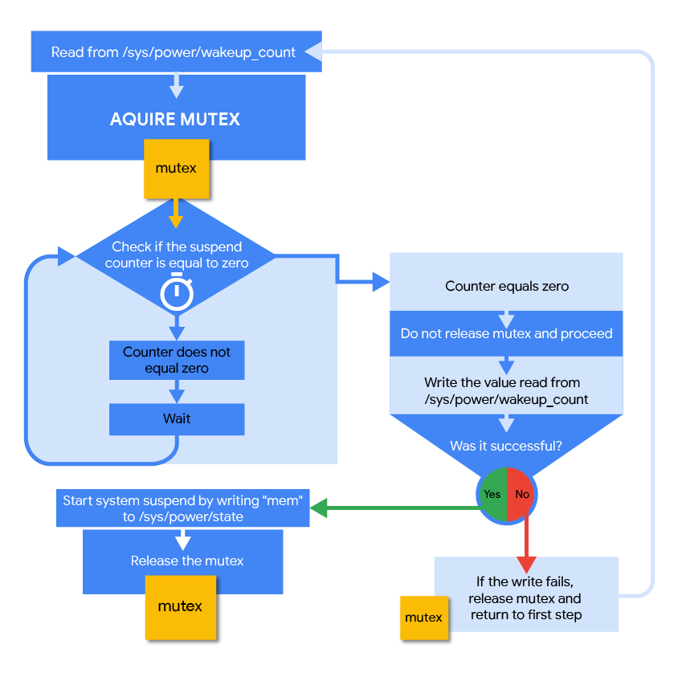

# SystemSuspend 服务

在 Android 9 及更低版本中，[libsuspend](https://android.googlesource.com/platform/system/core/+/pie-dev/libsuspend/autosuspend_wakeup_count.cpp#65) 中有一个负责发起系统挂起的线程。Android 10 在 SystemSuspend HIDL 服务中引入了等效功能。此服务位于系统映像中，由 Android 平台提供。`libsuspend` 的逻辑基本保持不变，除了阻止系统挂起的每个用户空间进程都需要与 SystemSuspend 进行通信。

## libsuspend 和 libpower

在 Android 10 中，SystemSuspend 服务取代了 `libsuspend`。`libpower` 经过重新实现，依赖于 SystemSuspend 服务（而不是 `/sys/**power**/wake[un]lock`），而无需更改 C API。

下面的伪代码显示了如何实现 `acquire_wake_lock` 和 `release_wake_lock`。

```c++
static std::unordered_map<std::string, sp<IWakeLock>> gWakeLockMap;

int acquire_wake_lock(int, const char* id) {
    ...
    if (!gWakeLockMap[id]) {
        gWakeLockMap[id] = suspendService->acquireWakeLock(WakeLockType::PARTIAL, id);
    }
    ...
    return 0;
}

int release_wake_lock(const char* id) {
    ...
    if (gWakeLockMap[id]) {
        auto ret = gWakeLockMap[id]->release();
        gWakeLockMap[id].clear();
        return 0;
    }
    ...
    return -1;
}
```

## 执行线程

SystemSuspend 服务使用挂起计数器跟踪发出的唤醒锁数量。它有两个执行线程：

- **主**线程响应 binder 调用。
- **挂起**线程控制系统挂起。

### 主线程

主线程响应来自客户端的请求以分配新的唤醒锁，从而递增/递减挂起计数器。

### 挂起线程

挂起线程循环执行以下操作：

1. 从 `/sys/**power**/wakeup_count` 读取。
2. 获取互斥量。这可确保挂起线程在**主**线程尝试递增或递减挂起计数器时不会触发挂起计数器。如果挂起计数器达到零，并且**挂起**线程尝试运行，则系统会在发出或移除唤醒锁时阻止**主**线程。
3. 等到计数器等于零。
4. 将从 `/sys/**power** /wakeup_count`（第 1 步中）读取的值写入此文件。如果写入失败，则返回到循环的开头
5. 通过将 `mem` 写入 `/sys/power/**state**` 来发起系统挂起。
6. 释放互斥量。

成功返回唤醒锁的请求后，挂起线程会被阻止。



### SystemSuspend API

SystemSuspend API 包含两个接口。HIDL 接口由原生进程用于获取唤醒锁，AIDL 接口用于在 SystemServer 和 SystemSuspend 之间通信。

### ISystemSuspend HIDL 接口

```java
enum WakeLockType : uint32_t {
    PARTIAL,
    FULL
};

interface IWakeLock {
    oneway release();
};

interface ISystemSuspend {
    acquireWakeLock(WakeLockType type, string debugName)
        generates (IWakeLock lock);
};
```

请求唤醒锁的每个客户端都会收到唯一的 `IWakeLock` 实例。这与 `/sys/**power**/wake_lock` 不同，后者允许多个客户端使用相同名称的唤醒锁。如果拥有 `IWakeLock` 实例的客户端终止，则 binder 驱动程序和 SystemSuspend 服务会将其清除。

### ISuspendControlService AIDL 接口

ISuspendControlService 仅供 SystemServer 使用。

```java
interface ISuspendCallback {
     void notifyWakeup(boolean success);
}

interface ISuspendControlService {
    boolean enableAutosuspend();
    boolean registerCallback(ISuspendCallback callback);
    boolean forceSuspend();
}
```

利用 Android HIDL 可带来以下好处：

- 如果挂起阻止进程终止，则可以通知 SystemSuspend。
- 可以为负责系统挂起的线程提供回调。