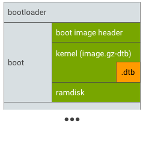
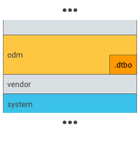
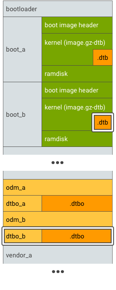
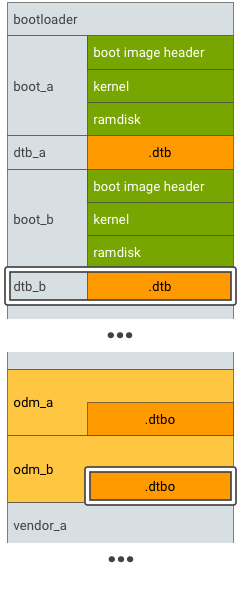
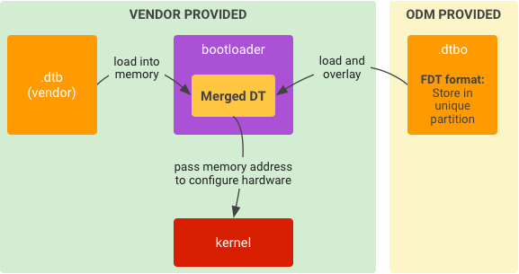
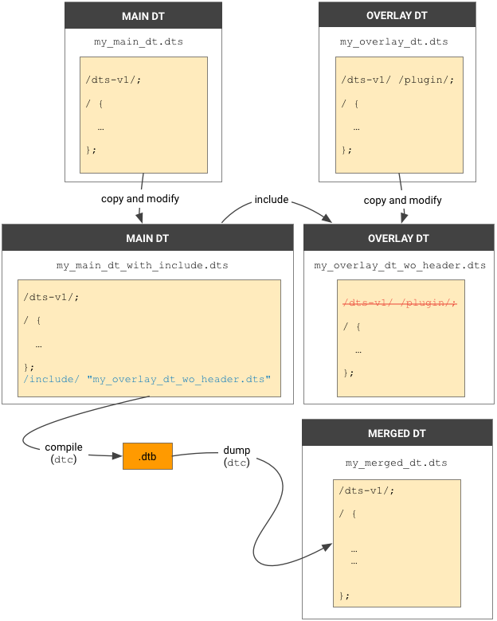
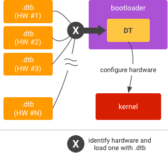
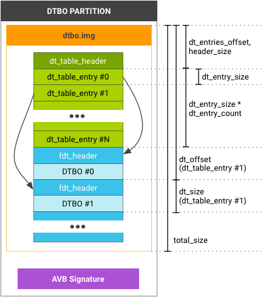
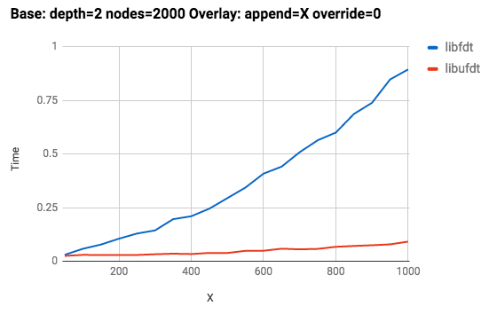
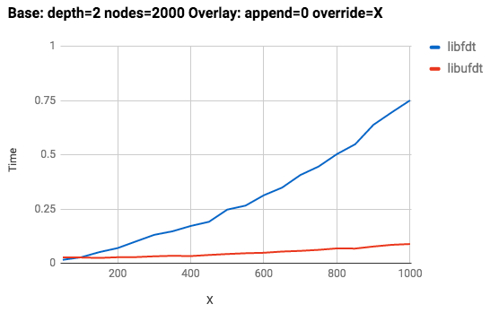

# 设备树叠加层

设备树 (DT) 是用于描述“不可发现”硬件的命名节点和属性的数据结构。操作系统（例如在 Android 中使用的 Linux 内核）会使用 DT 来支持 Android 设备使用的各种硬件配置。硬件供应商会提供自己的 DT 源文件，接下来 Linux 会将这些文件编译到引导加载程序使用的设备树 Blob (DTB) 文件中。

[设备树叠加层](https://lkml.org/lkml/2012/11/5/615) (DTO) 可让主要的设备树 Blob (DTB) 叠加在设备树上。使用 DTO 的引导加载程序可以维护系统芯片 (SoC) DT，并动态叠加针对特定设备的 DT，从而向树中添加节点并对现有树中的属性进行更改。

本页详细介绍了引导加载程序加载 DT 的典型工作流程，并列出了常见的 DT 术语。本节的其他页面介绍了如何[为 DTO 实现引导加载程序支持](https://source.android.com/devices/architecture/dto/implement)，如何[编译](https://source.android.com/devices/architecture/dto/compile)、验证和[优化 DTO 实现](https://source.android.com/devices/architecture/dto/optimize)以及如何[使用多个 DT](https://source.android.com/devices/architecture/dto/multiple)。您还可以获取关于 [DTO 语法](https://source.android.com/devices/architecture/dto/syntax)和必需的 [DTO/DTBO 分区格式](https://source.android.com/devices/architecture/dto/partitions)的详细信息。

## 概览

在 Android 9 中，在将统一设备树 Blob 传递给内核之前，引导加载程序不得修改设备树叠加层中定义的属性。

### 加载设备树

在引导加载程序中加载设备树会涉及到编译、分区和运行。


上图用于在引导加载程序中加载设备树的典型实现。

1. 要进行编译，请执行以下操作：

   - 使用设备树编译器 (`dtc`) 将设备树源 (`.dts`) 编译为设备树 blob (`.dtb`)（格式化为扁平化设备树）。
   - 将 `.dtb` 文件刷写到引导加载程序在运行时可访问的位置（详见下文）。

2. 要进行分区，请确定闪存中引导加载程序在运行时可访问和可信的位置以放入 `.dtb`。

   位置示例：

   * 启动分区

     将 `.dtb` 附加到 `image.gz` 并作为“`kernel`”传递到 `mkbootimg`，从而将其放入启动分区。

     

   * 唯一的分区

     将 `.dtb` 放在唯一的分区（例如 `dtb` 分区）中。

     

3. 要运行，请执行以下操作：
   * 将 `.dtb` 从存储加载到内存中。
   * 启动内核（已给定所加载 DT 的内存地址）。

### 术语

本节使用以下设备树术语：

| DT   | 设备树                                                  |
| :--- | ------------------------------------------------------- |
| DTB  | 设备树 Blob                                             |
| DTBO | 用于叠加的设备树 Blob                                   |
| DTC  | 设备树编译器                                            |
| DTO  | 设备树叠加层                                            |
| DTS  | 设备树源                                                |
| FDT  | 扁平化设备树，一种包含在 `.dtb` blob 文件中的二进制格式 |

## 实现DTO

实现 DTO 包括分割设备树、编译、分区和运行。在实现可以正常工作之后，您还必须保持两个 DT 之间的兼容性，并确定用于确保每个 DT 分区安全性的策略。

### 分割 DT

首先将设备树分割成两 (2) 部分：

- **主 DT**。由 SoC 供应商提供的 SoC 公用部分和默认配置。
- **叠加 DT**。由原始设计制造商 (ODM)/原始设备制造商 (OEM) 提供的设备专属配置。

分割设备树之后，必须确保主 DT 和叠加 DT 之间的兼容性，以便通过合并主 DT 和叠加 DT 为设备生成完整的 DT。有关 DTO 格式和规则的详细信息，请参阅 [DTO 语法](https://source.android.com/devices/architecture/dto/syntax)。有关多个设备树的详细信息，请参阅[多个 DT](https://source.android.com/devices/architecture/dto/multiple)。

### 编译主 DT 和叠加 DT

要编译主 DT，请执行以下操作：

1. 将主 `.dts` 编译为 `.dtb` 文件。
2. 将 `.dtb` 文件刷写到引导加载程序在运行时可访问的分区（详见下文）。

要编译叠加 DT，请执行以下操作：

1. 将叠加 DT `.dts` 编译为 `.dtbo` 文件。虽然此文件格式与已格式化为扁平化设备树的 `.dtb` 文件相同，但是用不同的文件扩展名可以将其与主 DT 区分开来。
2. 将 `.dtbo` 文件刷写到引导加载程序在运行时可访问的分区（详见下文）。

要详细了解如何使用 DTC 进行编译并在主机上验证 DTO 结果，请参阅[编译和验证](https://source.android.com/devices/architecture/dto/compile)。

### 对 DT 进行分区

在闪存中确定引导加载程序在运行时可访问和可信的位置信息以放入 `.dtb` 和 `.dtbo`。

主 DT 的示例位置：

- 引导分区的一部分，已附加到内核 (`image.gz`)。
- 单独的 DT blob (`.dtb`)，位于专用分区 (`dtb`) 中。

叠加 DT 的示例位置：

* 唯一分区

  将 `.dtbo` 放在独一无二的分区（例如 `dtbo` 分区）中。


* ODM分区

  将 `.dtbo` 放入 `odm` 分区中（仅在的引导加载程序能够从 `odm` 分区的文件系统中加载数据时才这样做）。

  

  对于支持[无缝 (A/B) 更新](https://source.android.com/devices/tech/ota/ab_updates)的设备，请用 A/B 来标识主 DT 和叠加 DT 分区：

  *  DTBO 分区 A/B，示例 1

  

  * DTBO 分区 A/B，示例 2

  

  ### 在引导加载程序中运行

  要运行，请执行以下操作：

  

  引导加载程序中设备树叠加层的典型运行时实现:

  1. 将 `.dtb` 从存储加载到内存中。
  2. 将 `.dtbo` 从存储加载到内存中。
  3. 用 `.dtbo` 叠加 `.dtb` 以形成合并的 DT。
  4. 启动内核（已给定合并 DT 的内存地址）。

  ### 保持兼容性

  主 DTB（来自 SoC 供应商）会被视为 DTBO 的 API 表面。将设备树分离为 SoC 通用部件和设备专用部件后，您必须确保这两个部件以后相互兼容，包括：

  - **主 DT 中的 DT 定义**（例如，节点、属性、标签）。主 DT 中的任何定义更改都可能会触发叠加 DT 中的更改。例如，要更正主 DT 中的某个节点名称，请定义映射到原始节点名称的“别名”标签（以避免更改叠加 DT）。
  - **叠加 DT 的存储位置**（例如，分区名称、存储格式）。

  ### 确保安全

  引导加载程序必须确保 DTB/DTBO 安全无虞、未被修改且未被损坏。您可以使用任何解决方案来保护 DTB/DTBO，例如，VBoot 1.0 中的[启动映像签名](https://source.android.com/security/verifiedboot/verified-boot#signature_format)或 [AVB 哈希页脚](https://android.googlesource.com/platform/external/avb/+/master/README.md#The-VBMeta-struct) (VBoot 2.0)。

  - 如果 DTB/DTBO 位于唯一的分区中，则可以将该分区添加到 AVB 的信任链。信任链从硬件保护的信任根开始，并进入引导加载程序，从而验证 DTB/DTBO 分区的完整性和真实性。
  - 如果 DTB/DTBO 位于现有分区（如 `odm` 分区）中，则该分区应位于 AVB 的信任链中。（DTBO 分区可以与 `odm` 分区共享一个公共密钥）。

## DTO语法

设备树源 (DTS) 格式是设备树的文本表示形式。设备树编译器 (DTC) 可将这种格式处理为二进制设备树，这是 Linux 内核要求的形式。

### 使用引用

[DTC](https://github.com/pantoniou/dtc)（设备树编译器 + 叠加补丁程序）项目在 [dtc-format.txt](https://android.googlesource.com/platform/external/dtc/+/refs/heads/master/Documentation/dts-format.txt) 和 [manual.txt](https://android.googlesource.com/platform/external/dtc/+/refs/heads/master/Documentation/manual.txt) 中说明了 DTS 格式。DTO 格式和规则在 [dt-object-internal.txt](https://android.googlesource.com/platform/external/dtc/+/refs/heads/master/Documentation/dt-object-internal.txt) 中有相关说明。这些文档描述了如何使用叠加 DT 中的节点 `fragment@x` 和语法 `__overlay__` 来更新主 DT。例如：

```properties
/ {
  fragment@0 {
    target = <&some_node>;
      __overlay__ {
        some_prop = "okay";
        ...
      };
  };
};
```

不过，Google 强烈建议您**不要**使用 `fragment@x` 和语法 `__overlay__`，而是使用引用语法。例如：

```properties
&some_node {
  some_prop = "okay";
  ...
};
```

`dtc` 会将引用语法编译成与使用语法 `__overlay__` 所生成的上述对象相同的对象。此语法不强制您对片段进行编号，让您能够轻松地读取和写入叠加 DTS。如果 `dtc` 不支持此语法糖，请使用 [AOSP 中的 dtc ](https://android.googlesource.com/platform/external/dtc)。

### 使用标签

为了允许在编译时不编译针对节点的未定义引用，叠加 DT `.dts` 文件必须在其头文件中具有标签 `/plugin/`。例如：

```
/dts-v1/;
/plugin/;
```

在这里，您可以使用引用来定位要叠加的节点，该引用是以和符号 (＆) 作为前缀的绝对节点路径。例如，对于主 DT 中的 `node@0`：

| 在主 DT 中定义标签...                                        | ...然后使用标签。                                            |
| :----------------------------------------------------------- | :----------------------------------------------------------- |
| [my_main_dt.dts]<br>/dts-v1/;<br>/ { my_node: node@0 { <br>    status = "disabled";<br/>my_child: child@0 {<br/>   value = <0xffffffff>;  }; <br/>};<br/>}; | [my_overlay_dt.dts]<br/>/dts-v1/;<br/>/plugin/;<br/>&my_node { <br/>status = "okay";<br/>};<br/>&my_child {<br/>    value = <0x1>;<br/>}; |

### 叠加

如果引用目标属性存在于主 DT 中，则在 DTO 之后被叠加；否则，系统会对其进行附加。例如：

| main.dts                                                     | overlay.dts                                                  | 合并结果                                                     |
| :----------------------------------------------------------- | :----------------------------------------------------------- | :----------------------------------------------------------- |
| [my_main_dt.dts]<br/>/dts-v1/;<br/>/ { <br/>compatible = "corp,foo"; <br/>my_node: node@0 {  <br/>status = "disabled"; <br/>};<br/>}; | [my_overlay_dt.dts]<br/>/dts-v1/;<br/>/plugin/;<br/>&my_node { <br/>status = "okay";<br/>}; | /dts-v1/;<br/>/ { compatible = "corp,foo";<br/> ...<br/> node@0 {  <br/>linux,phandle = <0x1>;<br/>  phandle = <0x1>;<br/>  status = "okay"; <br/>};<br/>}; |

### 附加

如果引用目标属性不存在于主 DT 中，则在 DTO 之后被附加。例如：

| main.dts                                                     | overlay.dts                                                  | 合并结果                                                     |
| :----------------------------------------------------------- | :----------------------------------------------------------- | :----------------------------------------------------------- |
| [my_main_dt.dts]<br/>/dts-v1/;<br/>/ { <br/>compatible = "corp,foo"; <br/>my_node: node@0 {  status = "okay"; <br/>};<br/>}; | [my_overlay_dt.dts]<br/>/dts-v1/;<br/>/plugin/;<br/>&my_node { <br/>new_prop = "bar";<br/>}; | /dts-v1/;<br/>/ { compatible = "corp,foo";<br/> ... <br/>node@0 {<br/>  linux,phandle = <0x1>;  <br/>phandle = <0x1>;  <br/>status = "okay"; <br/> new_prop = "bar";<br/> };<br/>}; |

### 子节点

子节点语法示例：

| main.dts                                                     | overlay.dts                                                  | 合并结果                                                     |
| :----------------------------------------------------------- | :----------------------------------------------------------- | :----------------------------------------------------------- |
| [my_main_dt.dts]<br/>/dts-v1/;<br/>/ { compatible = "corp,foo";<br/> my_nodes: nodes {  <br/>compatible = "corp,bar";<br/>  node@0 {   <br/>status = "disabled"; <br/> }; <br/>};<br/>}; | [my_overlay_dt.dts]<br/>/dts-v1/;<br/>/plugin/;<br/>&my_nodes { <br/>new_prop1 = "abc"; <br/>node@0 {  <br/>status = "okay";  <br/>new_prop2 = "xyz";<br/> };<br/>}; | /dts-v1/;<br/>/ {<br/> compatible = "corp,foo";<br/><br/> ...<br/> nodes {  <br/>linux,phandle = <0x1>; <br/> phandle = <0x1>; <br/> compatible = "corp,bar"; <br/> new_prop1 = "abc"; <br/> node@0 {   <br/>linux,phandle = <0x2>; <br/>  phandle = <0x2>; <br/>  status = "okay";  <br/> new_prop2 = "xyz"; <br/> }; <br/>};<br/>}; |


## 编译和验证

可以使用设备树编译器 (DTC) 来编译设备树源文件。不过，在将叠加层 DT 应用于目标主 DT 之前，还应该通过模拟 DTO 的行为来验证结果。

### 通过 DTC 进行编译

使用 `dtc` 编译 `.dts` 时，您必须添加选项 `-@` 以在生成的 `.dtbo` 中添加 `__symbols__` 节点。`__symbols__` 节点包含带标签的所有节点的列表，DTO 库可使用这个列表作为参考。

编译主 `.dts` 的示例命令：

```bash
dtc -@ -O dtb -o my_main_dt.dtb my_main_dt.dts
```

编译叠加层 DT `.dts` 的示例命令：

```bash
dtc -@ -O dtb -o my_overlay_dt.dtbo my_overlay_dt.dts
```

> **注意**：如果您遇到 DTC 编译错误：`invalid option --'@'`，则可能需要更新 DTC 版本。在 AOSP 上游，官方 DTC 对 DTO 的支持从[版本 1.4.4](https://github.com/dgibson/dtc/tree/v1.4.4) 开始，而且大部分补丁程序在 2016 年 12 月后就完成了合并。为了支持 DTO，建议您使用 AOSP 中的 `external/dtc`，它已与最新的 DTC 同步（已视需要合并 DTO 补丁程序）。

在主机上验证 DTO 结果

验证流程可以帮助您识别将叠加层 DT 放在主 DT 上时可能发生的错误。更新目标之前，您可以通过在 `.dts` 中使用 `/include/` 来模拟 DTO 行为，从而在主机上验证叠加 DT 的结果。

> **注意**：`/include/` 不支持在叠加层 DT 源中使用 `__overlay__`。



使用语法 `/include/` 来模拟主机上的 DTO:

1. 创建叠加层`.dts`的副本。在副本中，移除第一行头文件。示例：

   ```bash
   /dts-v1/;
   /plugin/;
   ```

   将文件另存为`my_overlay_dt_wo_header.dts`

   （或您希望的任何文件名）。

2. 创建主`.dts`的副本。在副本中的最后一行后，为您在第 1 步中创建的文件附加 include 语法。例如：

   ```bash
   /include/ "my_overlay_dt_wo_header.dts"
   ```

   将文件另存为`my_main_dt_with_include.dts`（希望的任何文件名）。

3. 使用`dtc`编译`my_main_dt_with_include.dts`以获得合并的 DT，这应该与使用 DTO 进行编译所得到的结果相同。例如：

   ```bash
   dtc -@ -O dtb -o my_merged_dt.dtb my_main_dt_with_include.dts
   ```

4. 使用 `dtc` 转储 `my_merged_dt.dto`。

   ```bash
   dtc -O dts -o my_merged_dt.dts my_merged_dt.dtb
   ```

   ### 在 Android 9 中验证 DTO

Android 9 需要具有设备树 Blob 叠加层 (DTBO) 分区。要在 SoC DT 中添加节点或更改属性，引导加载程序必须在 SoC DT 之上动态叠加设备专用的 DT。

#### 指示已应用的叠加层

要使[供应商测试套件 (VTS)](https://source.android.com/compatibility/vts) 能够评估叠加层应用的准确性，供应商必须添加新的内核命令行参数 `androidboot.dtbo_idx`，用于指示从 DTBO 分区中选择哪些叠加层。例如，参数 `androidboot. dtbo_idx=x,y,z` 将 `x`、`y` 和 `z` 报告为 DTBO 分区中已由引导加载程序按相同顺序应用于基础设备树 (DT) 的设备树叠加层 (DTO) 的索引，这些索引以零为起点。

叠加层可以应用于主设备树中的节点，也可以添加新节点，但**不能**引用之前叠加层中添加的节点。这种限制是必要的，因为叠加层应用不会将叠加层符号表与主 DT 符号表合并（不合并的做法既可避免符号名称出现冲突，也可避免叠加层之间的依赖关系复杂化）。

##### 示例：无效叠加层

在此示例中，`overlay_2.dts` 引用了由 `overlay_1.dts` 添加的节点 **`e`**。在将 `overlay_1` 应用于主 DT 之后，如果尝试将 `overlay_2` 应用于生成的 DT，则叠加层应用将运行失败，并显示基础 DT 的符号表中不存在符号 **`e`** 的错误。

| main.dts                                                     | overlay_1.dts                                                | overlay_2.dts                                                |
| :----------------------------------------------------------- | :----------------------------------------------------------- | :----------------------------------------------------------- |
| [main.dts]<br><br/>/dts-v1/; <br/><br/>/ {  <br/>a: a {};  <br/>b: b {}; <br/> c: c {}; <br/>}; | [overlay_1.dts]<br/><br/> /dts-v1/; <br/>/plugin/; <br/><br/>&b { ref1 =  <&a>;   <br/> e: e {<br/> prop = <0x0a>;<br/> phandle = <0x04>;    };<br/>}; | [overlay_2.dts]<br/><br/>/dts-v1/; <br/>/plugin/; <br/><br/>/* invalid! */ <br/>&e { <br/> prop = <0x0b>;<br/> }; |

##### 示例：有效叠加层

在此示例中，`overlay_2.dts` 仅引用了主 DTS 中的节点 **`b`**。将 `overlay_1` 和 `overlay_2` 依次应用于基础 DT 之后，节点 **`e`** 中属性 **`prop`** 的值（由 `overlay_1.dts` 设置）将被 `overlay_2.dts` 设置的值覆盖。

| main.dts                                                     | overlay_1.dts                                                | overlay_2.dts                                                |
| :----------------------------------------------------------- | :----------------------------------------------------------- | :----------------------------------------------------------- |
| `**[final.dts]** /dts-v1/; / {  a: a {};  b: b {};  c: c {}; }; ` | `**[overlay_1.dts]** /dts-v1/; /plugin/; &b { ref1 =  <&a>;     e {          prop = <0x0c>;      }; }; ` | `**[overlay_2.dts]** /dts-v1/; /plugin/; /* valid */ &b { ref1 =  <&c>;     e {          prop = <0x0d>;      }; }; ` |

#### 实现 DTBO 分区

要实现所需的 DTBO 分区，请确保引导加载程序可以执行以下操作：

1. 识别它正在哪个开发板上运行，并选择要应用的相应叠加层。

2. 将`androidboot.dtbo_idx`

   参数附加到内核命令行。

   - 该参数必须指示 DTBO 分区映像中由引导加载程序按相同顺序应用于基础 DT 的 DTO 的索引，这些索引以零为起点。
   - 这些索引必须引用叠加层在 DTBO 分区中的位置。

要详细了解 DTBO 分区结构，请访问 source.android.com 上的[设备树叠加层](https://source.android.com/devices/architecture/dto/)。

#### 验证 DTBO 分区

可以使用 VTS 来验证以下内容：

- 内核命令行参数 `androidboot.dtbo_idx` 是否存在（方法：检查 `Init` 是否已自动设置相应的 `ro.boot.dtbo_idx` 系统属性）。
- `ro.boot.dtbo_idx` 系统属性的有效性（方法：检查该属性是否至少指定了一个有效的 DTBO 映像索引）。
- DTBO 分区的有效性（还应验证 DTBO 分区中应用于基础 DT 的叠加层的有效性）。
- 生成的 DT 中的其他节点或属性更改是否已呈现给 Linux 内核。

例如，在以下叠加层和最终 DT 中，将 `androidboot.dtbo_idx=5,3` 添加到内核命令行可通过验证，而将 `androidboot.dtbo_idx=3,5` 添加到内核命令行则不能通过验证。

| 索引 3 处的叠加层 DT                                         | 索引 5 处的叠加层 DT                                         |
| :----------------------------------------------------------- | :----------------------------------------------------------- |
| [overlay_1.dts]<br/><br/> /dts-v1/; <br/>/plugin/;<br/> &c { <br/>prop = <0xfe>;<br/> }; | [overlay_2.dts]<br/><br/> /dts-v1/; <br/>/plugin/; <br/><br/>&c { <br/>prop = <0xff>;<br/> }; |

最终 DT

```
/dts-v1/;
/ {

	a {
		phandle = <0x1>;
	};

	b {
		phandle = <0x2>;
	};

	c {
		phandle = <0x3>;
		prop = <0xfe>;
	};

	__symbols__ {
		a = "/a";
		b = "/b";
		c = "/c";
	};
};

```

## 使用多个DT

很多 SoC 供应商和 ODM 都支持在一台设备上使用多个 DT，从而使一个映像能够为多个 SKU/配置提供支持。在这种情况下，引导加载程序会在运行时识别硬件，并加载相应的 DT：

引导加载程序中的多个设备树叠加层:




> **注意**：使用多个 DT 不是强制性要求。

### 设置

要向 DTO 模型添加对多个 DT 的支持，请设置一个主 DT 列表和另一个叠加 DT 列表。


多个 DT 的运行时 DTO 实现。

引导加载程序应该能够：

- 读取 SoC ID 并选择相应的主设备树，并
- 读取板 ID 并选择相应的叠加设备树。

只能选择一个主 DT 供在运行时使用。可选择多个叠加 DT，但它们必须与选定的主 DT 兼容。使用多个叠加层有助于避免 DTBO 分区内的每块板上都存储一个叠加层，并能让引导加载程序根据板 ID 或通过探测外设来确定所需叠加层的子集。例如，板 A 可能需要通过叠加层 1、3 和 5 添加的设备，而板 B 可能需要通过叠加层 1、4 和 5 添加的设备。

### 分区

要进行分区，请在闪存中确定引导加载程序在运行时可访问和可信的位置，以存储 DTB 和 DTBO（引导加载程序必须能够在匹配的进程中找到这些文件）。请记住，DTB 和 DTBO 不能存在于同一个分区中。如果DTB/DTBO 位于 `dtb`/`dtbo` 分区中，请使用 [DTB/DTBO 分区格式](https://source.android.com/devices/architecture/dto/partitions)中详细列出的表结构和头文件格式。

### 在引导加载程序中运行

要运行，请执行以下操作：

1. **标识 SoC** 并将相应的 .dtb 从存储加载到内存中。
2. **标识板**并将相应的 `.dtbo` 从存储加载到内存中。
3. 用 `.dtbo` 叠加 `.dtb` 以形成合并的 DT。
4. 启动内核（已给定合并 DT 的内存地址）。

## DTB/DTBO分区格式

如果 DTB/DTBO 位于专属的分区（例如 `dtb` 和 `dtbo` 分区）中，请使用以下表格结构和头文件格式：



### 数据结构

`dt_table_header` **仅**适用于 `dtb`/`dtbo` 分区；您不能在 `image.gz` 末尾处附加此格式。如果您有一个 DTB/DTBO，则仍必须使用此格式（并且，`dt_table_header` 中的 `dt_entry_count` 为 1）。

```c
#define DT_TABLE_MAGIC 0xd7b7ab1e

struct dt_table_header {
  uint32_t magic;             // DT_TABLE_MAGIC
  uint32_t total_size;        // includes dt_table_header + all dt_table_entry
                              // and all dtb/dtbo
  uint32_t header_size;       // sizeof(dt_table_header)

  uint32_t dt_entry_size;     // sizeof(dt_table_entry)
  uint32_t dt_entry_count;    // number of dt_table_entry
  uint32_t dt_entries_offset; // offset to the first dt_table_entry
                              // from head of dt_table_header

  uint32_t page_size;         // flash page size we assume
  uint32_t version;       // DTBO image version, the current version is 0.
                          // The version will be incremented when the
                          // dt_table_header struct is updated.
};

struct dt_table_entry {
  uint32_t dt_size;
  uint32_t dt_offset;         // offset from head of dt_table_header

  uint32_t id;                // optional, must be zero if unused
  uint32_t rev;               // optional, must be zero if unused
  uint32_t custom[4];         // optional, must be zero if unused
};
```

要读取所有 `dt_table_entry`，请使用 `dt_entry_size`、`dt_entry_count` 和 `dt_entries_offset`。示例：

```c
my_read(entries_buf,
        header_addr + header->dt_entries_offset,
        header->dt_entry_size * header->dt_entry_count);
```

`dt_table_entry` 中的 `id`、`rev`、`custom` 是设备树的可选硬件标识，引导加载程序可以使用这些标识有效地识别要加载的 DTB/DTBO。如果引导加载程序需要获取更多信息，请将其放在 DTB/DTBO 中，引导加载程序可在这里解析 DTB/DTBO，从而读取这些信息（参见下面的示例代码）。

### 示例代码

以下示例代码可检查引导加载程序中的硬件标识。

- `check_dtbo()` 函数用于检查硬件标识。首先它会检查结构 `dt_table_entry` 中的数据（`id`、`rev` 等）。如果这种数据未能提供充足的信息，它会将 `dtb` 数据加载到内存中，并检查 `dtb` 中的值。

- `my_hw_information` 和 `soc_id` 属性的值会在根节点进行解析（请参见 `my_dtbo_1.dts` 中的示例）。

  ```dtd
  [my_dtbo_1.dts]
  /dts-v1/;
  /plugin/;
  
  / {
    /* As DTS design, these properties only for loader, won't overlay */
    compatible = "board_manufacturer,board_model";
  
    /* These properties are examples */
    board_id = <0x00010000>;
    board_rev = <0x00010001>;
    another_hw_information = "some_data";
    soc_id = <0x68000000>;
    ...
  };
  
  &device@0 {
    value = <0x1>;
    status = "okay";
  };
  
  [my_bootloader.c]
  int check_dtbo(const dt_table_entry *entry, uint32_t header_addr) {
    ...
    if (entry->id != ... || entry->rev != ...) {
      ...
    }
    ...
    void * fdt_buf = my_load_dtb(header_addr + entry->dt_offset, entry->dt_size);
    int root_node_off = fdt_path_offset(fdt_buf, "/");
    ...
    const char *my_hw_information =
      (const char *)fdt_getprop(fdt_buf, root_node_off, "my_hw_information", NULL);
    if (my_hw_information != NULL && strcmp(my_hw_information, ...) != 0) {
      ...
    }
    const fdt32_t *soc_id = fdt_getprop(fdt_buf, root_node_off, "soc_id", NULL);
    if (soc_id != NULL && *soc_id != ...) {
      ...
    }
    ...
  }
  ```

#### mkdtimg

`mkdtimg` 是用于创建 `dtb`/`dtbo` 映像的工具（[源代码](https://android-review.googlesource.com/#/q/topic:mkdtimg+(status:open+OR+status:merged+OR+status:pending))位于 AOSP 中的 `system/libufdt` 下）。`mkdtimg` 支持多个命令，包括 `create`、`cfg_create` 和 `dump`。

#### create

使用 `create` 命令创建 `dtb`/`dtbo` 映像：

```bash
mkdtimg create <image_filename> (<global-option>...) \
    <ftb1_filename> (<entry1_option>...) \
    <ftb2_filename> (<entry2_option>...) \
    ...
```

`ftbX_filename` 会在映像中生成一个 `dt_table_entry`。`entryX_option` 是分配给 `dt_table_entry` 的值。这些值可以是以下任一值：

```bash
--id=<number|path>
--rev=<number|path>
--custom0=<number|path>
--custom1=<number|path>
--custom2=<number|path>
--custom3=<number|path>
```

数字值可以是 32 位数字（如 68000）或十六进制数字（如 0x6800）。或者，您也可以使用以下格式指定路径：

```bash
<full_node_path>:<property_name>
```

例如，`/board/:id`。`mkdtimg` 从 DTB/DTBO 文件中的路径读取值，并将值（32 位）分配给 `dt_table_entry` 中的相对属性。或者，您也可以将 `global_option` 作为所有条目的默认选项。`dt_table_header` 中 `page_size` 的默认值为 2048；可使用 `global_option --page_size=` 分配不同的值。

示例：

```dtd
[board1.dts]
/dts-v1/;
/plugin/;

/ {
  compatible = "board_manufacturer,board_model";
  board_id = <0x00010000>;
  board_rev = <0x00010001>;
  another_hw_information = "some_data";
  ...
};

&device@0 {
  value = <0x1>;
  status = "okay";
};

mkdtimg create dtbo.img --id=/:board_id --custom0=0xabc \
  board1.dtbo \
  board2.dtbo --id=0x6800 \
  board3.dtbo --id=0x6801 --custom0=0x123
```

- 第一个 `dt_table_entry` (`board1.dtbo`) `id` 为 `0x00010000`，`custom[0]` 为 `0x00000abc`。
- 第二个 `id` 为 `0x00006800`，`custom[0]` 为 `0x00000abc`。
- 第三个 `id` 为 `0x00006801`，`custom[0]` 为 `0x00000123`。
- 所有其他项均使用默认值 (`0`)。

#### cfg_create

`cfg_create` 命令可创建具有采用以下格式的配置文件的映像：

```c
# global options
  <global_option>
  ...
# entries
<ftb1_filename>     # comment
  <entry1_option>   # comment
  ...
<ftb2_filename>
  <entry2_option>
  ...
...
```

选项 `global_option` 和 `entryX_option` 必须以一个或多个空格字符开头（这些选项与 `create` 选项相同，不带 `--` 前缀）。空行或者以 `#` 开头的行将被忽略。

示例：

```cfg
[dtboimg.cfg]
# global options
  id=/:board_id
  rev=/:board_rev
  custom0=0xabc

board1.dtbo

board2.dtbo
  id=0x6800       # override the value of id in global options

board2.dtbo
  id=0x6801       # override the value of id in global options
  custom0=0x123   # override the value of custom0 in global options

mkdtimg cfg_create dtbo.img dtboimg.cfg
```

`mkdtimg` 不会处理 `.dtb`/`.dtbo` 文件的对齐方式，而是将它们附加到映像上。当您使用 `dtc` 将 `.dts` 编译为 `.dtb`/`.dtbo` 时，必须添加选项 `-a`。例如，添加选项 `-a 4` 会添加内边距，因此 `.dtb`/`.dtbo` 的大小将调整为 4 个字节。

多个 DT 表格条目可以共享一个 `.dtb`/`.dtbo`。如果您为不同的条目使用同一个文件名，则系统只会在具有相同 `dt_offset` 和 `dt_size` 的映像中存储一份内容。使用具有相同 DT 的不同硬件时，这种方式非常有用。

#### 转储

对于 `dtb`/`dtbo` 映像，请使用 `dump` 命令打印映像中的信息。示例：

```bash
mkdtimg dump dtbo.img
dt_table_header:
               magic = d7b7ab1e
          total_size = 1300
         header_size = 32
       dt_entry_size = 32
      dt_entry_count = 3
   dt_entries_offset = 32
           page_size = 2048
             version = 0
dt_table_entry[0]:
             dt_size = 380
           dt_offset = 128
                  id = 00010000
                 rev = 00010001
           custom[0] = 00000abc
           custom[1] = 00000000
           custom[2] = 00000000
           custom[3] = 00000000
           (FDT)size = 380
     (FDT)compatible = board_manufacturer,board_model
...
```

## 优化DTO

介绍了可以对 DTO 实现进行哪些优化，描述了针对叠加根节点的限制，并详细介绍了如何在 DTBO 映像中配置经过压缩的叠加层。此外，还提供了示例实现说明和代码。

### 内核命令行

设备树中的原始内核命令行位于 `chosen/bootargs` 节点中。引导加载程序必须将此位置与内核命令行的其他源位置进行连接：

```cfg
/dts-v1/;

/ {
  chosen: chosen {
    bootargs = "...";
  };
};
```

DTO **无法**连接主 DT 和叠加 DT 的值，因此您必须将主 DT 的内核命令行置入 `chosen/bootargs` 中，并将叠加 DT 的内核命令行置入 `chosen/bootargs_ext` 中。接下来，引导加载程序会连接这些位置，并将结果传递给内核。

##### main.dts

```
/dts-v1/;

/ {
  chosen: chosen {
    bootargs = "...";
  };
};
```

##### overlay.dts

```
/dts-v1/;
/plugin/;

&chosen {
  bootargs_ext = "...";
};
```

#### libufdt

虽然最新的 `libfdt` 支持 DTO，但我们还是建议使用 `libufdt` 实现 DTO（AOSP 源代码位于 `platform/system/libufdt` 下）。 `libufdt` 可通过扁平化设备树 (FDT) 编译真实的树结构（非扁平化设备树，简称“ufdt”），从而改善合并两个 `.dtb` 文件的效果（从 O(N2) 到 O(N)，其中 N 是树中的节点数）。

##### 性能测试

在 Google 的内部测试中，进行编译后，在 2405 个 `.dtb` 和 283 个 `.dtbo` DT 节点上使用 `libufdt` 生成了 70618 字节和 8566 字节的文件。从 FreeBSD 移植的 [DTO 实现](http://fxr.watson.org/fxr/source/boot/fdt/)的运行时为 124 毫秒，相比之下 `libufdt` DTO 的运行时为 10 毫秒，差异非常明显。

Pixel 设备的性能测试比较了 `libufdt` 和 `libfdt`。基本节点数量带来的影响相似，但包含以下差异：

- 500 次叠加（附加或覆盖）操作具有 6-8 倍的时间差异
- 1000 次叠加（附加或覆盖）操作具有 8-10 倍的时间差异

附加计数设置为 X 的示例：



覆盖计数设置为 X 的示例：



`libufdt` 是用一些 `libfdt` API 和数据结构开发的。使用 `libufdt` 时，必须包含并关联 `libfdt`（不过，您可以在代码中使用 `libfdt` API 来操作 DTB 或 DTBO）。

#### libufdt DTO API

`libufdt` 中适用于 DTO 的主要 API 如下：

```
struct fdt_header *ufdt_apply_overlay(
        struct fdt_header *main_fdt_header,
        size_t main_fdt_size,
        void *overlay_fdt,
        size_t overlay_size);
```

参数 `main_fdt_header` 是主 DT，`overlay_fdt` 是包含 `.dtbo` 文件内容的缓冲区。返回值是一个包含合并的 DT 的新缓冲区（如果出现错误，则返回 `null`）。合并的 DT 采用 FDT 格式，您可以在启动内核时将其传递给内核。

来自返回值的新缓冲区由 `dto_malloc()`（您应在将 `libufdt` 移植到引导加载程序时加以实现）创建。有关参考实现，请参阅 `sysdeps/libufdt_sysdeps_*.c`。

### 根节点限制

不能将新节点或属性叠加到主 DT 的根节点，因为叠加操作依赖于标签。由于主 DT 必须定义一个标签，而叠加 DT 则会分配要叠加标签的节点，因此，您无法为根节点提供标签（因而不能叠加根节点）。

SoC 供应商必须定义主 DT 的叠加能力；ODM/OEM 只能使用由 SoC 供应商定义的标签附加或覆盖节点。要解决这个问题，您可以在基础 DT 中的根节点下定义一个 **`odm`** 节点，使叠加 DT 中的所有 ODM 节点都能够添加新节点。或者，您也可以将基础 DT 中的所有 SoC 相关节点放在根节点下的 **`soc`** 节点中，如下所述：

##### main.dts

```
/dts-v1/;

/ {
    compatible = "corp,bar";
    ...

    chosen: chosen {
        bootargs = "...";
    };

    /* nodes for all soc nodes */
    soc {
        ...
        soc_device@0: soc_device@0 {
            compatible = "corp,bar";
            ...
        };
        ...
    };

    odm: odm {
        /* reserved for overlay by odm */
    };
};
```

##### overlay.dts

```
/dts-v1/;
/plugin/;

/ {
};

&chosen {
    bootargs_ex = "...";
};

&odm {
    odm_device@0 {
        ...
    };
    ...
};
```

### 使用经过压缩的叠加层

Android 9 增加了以下支持：在使用第 1 版设备树表格表头时，在 DTBO 映像中使用经过压缩的叠加层。使用 DTBO 标头 v1 时，dt_table_entry 中标记字段的四个最不重要的有效位会指明 DT 条目的压缩格式。

```c
struct dt_table_entry_v1 {
  uint32_t dt_size;
  uint32_t dt_offset;  /* offset from head of dt_table_header */
  uint32_t id;         /* optional, must be zero if unused */
  uint32_t rev;        /* optional, must be zero if unused */
  uint32_t flags;      /* For version 1 of dt_table_header, the 4 least significant bits
                        of 'flags' will be used to indicate the compression
                        format of the DT entry as per the enum 'dt_compression_info' */
  uint32_t custom[3];  /* optional, must be zero if unused */
};
```

目前，系统支持 `zlib` 和 `gzip` 压缩。

```c
enum dt_compression_info {
    NO_COMPRESSION,
    ZLIB_COMPRESSION,
    GZIP_COMPRESSION
};
```

Android 9 增加了在 `VtsFirmwareDtboVerification` 测试中测试经过压缩的叠加层的支持，以帮助您验证叠加应用的正确性。

### DTO 实现示例

以下说明介绍了使用 `libufdt` 进行 DTO 实现的示例过程（示例代码如下）。

#### 示例 DTO 说明

1. 包含库。要使用`libufdt`，请包含`libfdt`

    以用于数据结构和 API：

   ```c
   #include <libfdt.h>
   #include <ufdt_overlay.h>
   ```

2. 加载主 DT 和叠加 DT。将`.dtb`和`.dtbo`从存储空间加载到内存中（确切的步骤取决于您的设计）。此时，应该设置`.dtb`/`.dtbo`的缓冲区和大小：

   ```
   main_size = my_load_main_dtb(main_buf, main_buf_size)
   ```

   ```
   overlay_size = my_load_overlay_dtb(overlay_buf, overlay_buf_size);
   ```

3. 叠加 DT：

   1. 使用`ufdt_install_blob()`获取主 DT 的 FDT 标头：

      ```c
      main_fdt_header = ufdt_install_blob(main_buf, main_size);
      main_fdt_size = main_size;
      ```

   2. 对 DTO 调用`ufdt_apply_overlay()`以获取采用 FDT 格式的合并 DT：

      ```c
      merged_fdt = ufdt_apply_overlay(main_fdt_header, main_fdt_size,
                                      overlay_buf, overlay_size);
      ```

   3. 使用`merged_fdt`获取`dtc_totalsize()`的大小：

      ```
      merged_fdt_size = dtc_totalsize(merged_fdt);
      ```

   4. 传递合并的 DT 以启动内核：

      ```c
      my_kernel_entry(0, machine_type, merged_fdt);
      ```

#### 示例 DTO 代码

```c
#include <libfdt.h>
#include <ufdt_overlay.h>

…

{
  struct fdt_header *main_fdt_header;
  struct fdt_header *merged_fdt;

  /* load main dtb into memory and get the size */
  main_size = my_load_main_dtb(main_buf, main_buf_size);

  /* load overlay dtb into memory and get the size */
  overlay_size = my_load_overlay_dtb(overlay_buf, overlay_buf_size);

  /* overlay */
  main_fdt_header = ufdt_install_blob(main_buf, main_size);
  main_fdt_size = main_size;
  merged_fdt = ufdt_apply_overlay(main_fdt_header, main_fdt_size,
                                  overlay_buf, overlay_size);
  merged_fdt_size = dtc_totalsize(merged_fdt);

  /* pass to kernel */
  my_kernel_entry(0, machine_type, merged_fdt);
}
```

