# 供应商原生开发套件 (VNDK)

供应商原生开发套件 (VNDK) 是专门用来让供应商实现其 HAL 的一组库。VNDK 包含在 `system.img` 中，并在运行时与供应商代码动态关联。

## 概览

### 为何要使用 VNDK？

Android 8.0 及更高版本支持框架专用更新，在此类更新中，系统分区可以升级到最新版本，而供应商分区保持不变。这意味着在不同时间编译的二进制文件必须能够相互配合使用；VNDK 为 Android 版本迭代时发生的 API/ABI 变更所导致的问题提供了解决途径。

框架专用更新面临着以下挑战：

- **框架模块与供应商模块之间的依赖关系**。在 Android 8.0 之前的版本中，两种模块可以互相关联。但是，来自供应商模块的依赖关系对框架模块开发施加了不必要的限制。
- **AOSP 库的扩展**。Android 8.0 及更高版本要求所有 Android 设备在系统分区被替换为标准常规系统映像 (GSI) 时，都可以通过 CTS 测试。不过，当供应商扩展 AOSP 库以提高性能或为其 HIDL 实现添加额外的功能时，使用标准 GSI 来刷写系统分区可能会破坏供应商的 HIDL 实现（有关如何防止此类破坏的指南，请参阅 [VNDK 扩展](https://source.android.com/devices/architecture/vndk/extensions)）。

为了克服这些挑战，Android 8.0 引入了一些技术，例如 VNDK（本部分对其进行了介绍）、[HIDL](https://source.android.com/devices/architecture/hidl)、hwbinder、[设备树叠加层](https://source.android.com/devices/architecture/dto)和 sepolicy 叠加层。

### VNDK 资源

本部分包含以下 VNDK 资源：

- *[VNDK 概念](https://source.android.com/devices/architecture/vndk#vndk-concepts)*：（请参阅下文）介绍了框架共享库、Same-Process HAL (SP-HAL) 和 VNDK 术语。
- *[VNDK 扩展](https://source.android.com/devices/architecture/vndk/extensions)*：对专门针对供应商的更改进行了分类。例如，具有供应商模块所依赖的扩展功能的库必须复制到供应商分区中，但禁止进行 ABI 不兼容的更改。
- *[VNDK 编译系统支持](https://source.android.com/devices/architecture/vndk/build-system)*：介绍了与 VNDK 相关的编译系统配置和模块定义语法。
- *[VNDK 定义工具](https://source.android.com/devices/architecture/vndk/deftool)*：可协助您将源代码树迁移到 Android 8.0 及更高版本。
- *[链接器命名空间](https://source.android.com/devices/architecture/vndk/linker-namespace)*：提供对共享库关联的精细控制。
- *[目录、规则和 sepolicy](https://source.android.com/devices/architecture/vndk/dir-rules-sepolicy)*：定义了搭载 Android 8.0 及更高版本的设备的目录结构，以及 VNDK 规则和关联的 sepolicy。
- *[VK 设计](https://source.android.com/devices/architecture/images/VNDK.pdf)*演示文稿：阐述了 Android 8.0 及更高版本中使用的 VDNK 基本概念。

### VNDK 概念

在理想的 Android 8.0 及更高版本环境中，框架进程不加载供应商共享库，所有供应商进程仅加载供应商共享库（和一部分框架共享库），而框架进程与供应商进程之间的通信由 HIDL 和硬件 binder 控制。

这样的环境存在以下可能：来自框架共享库的稳定、公共 API 可能不足以满足供应商模块开发者的需求（尽管 API 在不同的 Android 版本之间会有所变化），要防止出现这种情况，供应商进程需要能够访问一部分框架共享库。此外，由于性能要求可能会导致折中方案，因此必须区别对待某些对响应时间要求严格的 HAL。

以下部分详细介绍了 VNDK 如何处理适用于供应商的框架共享库以及 Same-Process HAL (SP-HAL)。

#### 适用于供应商的框架共享库

本部分介绍了供应商进程可访问的共享库的分类标准。要让供应商模块在多个 Android 版本上皆可正常工作，有以下两种方法：

1. **让框架共享库的 ABI/API 保持稳定**。新的框架模块和旧的供应商模块可以使用同一共享库，以减少内存占用和存储空间占用。此外，通过使用同一共享库，还可以避免一些双重加载问题。不过，保持稳定的 ABI/API 的开发成本很高，因此让每个框架共享库导出的所有 ABI/API 都保持稳定是不现实的。
2. **复制旧的框架共享库**。此方法会严重限制边信道，即在框架模块与供应商模块之间进行通信的所有机制，包括（但不限于）binder、套接字、管道、共享内存、共享文件和系统属性。除非通信协议被冻结且保持稳定（例如通过 hwbinder 的 HIDL），否则不能进行通信。双重加载共享库也可能会导致出现问题；例如，如果将新库创建的对象传递到旧库的函数中，则可能会出错，因为这些库可能会以不同的方式解读该对象。

根据共享库的特性不同，使用的方法也有差异。因此，框架共享库可分为以下三个子类别：

- LL-NDK 库是已知稳定的框架共享库。它们的开发者致力于保持其 API/ABI 稳定性。

  - LL-NDK 包含以下库：`libEGL.so`、`libGLESv1_CM.so`、`libGLESv2.so`、`libGLESv3.so`、`libandroid_net.so`、`libc.so`、`libdl.so`、`liblog.so`、`libm.so`、`libnativewindow.so`、`libneuralnetworks.so`、`libsync.so`、`libvndksupport.so` 和 `libvulkan.so`。

- 符合条件的 VNDK 库 (VNDK) 是指可以安全复制两次的框架共享库。

  框架模块和供应商模块可以与其各自的库副本相关联。框架共享库只有满足以下条件才能成为符合条件的 VNDK 库：

  - 不向框架发送或从框架接收 IPC。
  - 与 ART 虚拟机无关。
  - 不读取/写入文件格式不稳定的文件/分区。
  - 没有需要法律审查的特殊软件许可。
  - 其代码所有者不反对供应商使用该库。

- 框架专用库 (FWK-ONLY) 是指不属于上述类别的框架共享库。此类库具有以下特点：

  - 被视为框架内部实现细节。
  - 不得由供应商模块访问。
  - 具有不稳定的 ABI/API，无 API/ABI 兼容性保证。
  - 不会被复制。

#### Same-Process HAL (SP-HAL)

Same-Process HAL (SP-HAL) 是一组预先确定的 HAL，作为供应商共享库进行实现，并被加载到框架进程中。SP-HAL 由链接器命名空间（控制共享库可见的库和符号）进行隔离。SP-HAL 必须仅依赖于 LL-NDK 和 VNDK-SP。

VNDK-SP 是一部分预定义的符合条件的 VNDK 库。我们会仔细审查 VNDK-SP 库，以确保将 VNDK-SP 库双重加载到框架进程中不会导致问题。SP-HAL 和 VNDK-SP 均由 Google 定义。

以下库是经过批准的 SP-HAL：

- `libGLESv1_CM_${driver}.so`
- `libGLESv2_${driver}.so`
- `libGLESv3_${driver}.so`
- `libEGL_${driver}.so`
- `vulkan.${driver}.so`
- `android.hardware.renderscript@1.0-impl.so`
- `android.hardware.graphics.mapper@2.0-impl.so`

以下库是 SP-HAL 可以访问的 VNDK-SP 库：

- `android.hardware.graphics.common@1.0.so`
- `android.hardware.graphics.mapper@2.0.so`
- `android.hardware.renderscript@1.0.so` (Renderscript)
- `libRS_internal.so` (Renderscript)
- `libbase.so`
- `libc++.so`
- `libcutils.so`
- `libhardware.so`
- `libhidlbase.so`
- `libhidltransport.so`
- `libhwbinder.so`
- `libion.so`
- `libutils.so`
- `libz.so`

以下 VNDK-SP 依赖项 (VNDK-SP-Private) 对 SP-HAL 来说是不可见的：

- `libRSCpuRef.so` (Renderscript)
- `libRSDriver.so` (Renderscript)
- `libbacktrace.so`
- `libblas.so` (Renderscript)
- `libbcinfo.so` (Renderscript)
- `liblzma.so`
- `libunwind.so`

以下是具有 RS 例外的框架专用库 (FWK-ONLY-RS)：

- `libft2.so` (Renderscript)
- `libmediandk.so` (Renderscript)

### VNDK 术语

- 模块是指共享库或可执行文件。
- 进程是指可执行文件产生的操作系统任务。
- 以“框架”打头的术语是指与**系统**分区相关的概念。
- 以“供应商”打头的术语是指与**供应商**分区相关的概念。

例如：

- 框架可执行文件是指 `/system/bin` 或 `/system/xbin` 中的可执行文件。
- 框架共享库是指 `/system/lib[64]` 下的共享库。
- 框架模块是指框架共享库和框架可执行文件。
- 框架进程是指从框架可执行文件衍生而来的进程（例如 `/system/bin/app_process`）。
- 供应商可执行文件是指 `/vendor/bin` 中的可执行文件。
- 供应商共享库是指 `/vendor/lib[64]` 下的共享库。
- 供应商模块是指供应商可执行文件和供应商共享库。
- 供应商进程是指供应商可执行文件（例`/vendor/bin/android.hardware.camera.provider@2.4-service`）产生的进程。

**注意**：通用系统映像 (GSI) 是指根据相应分支（与版本分支类似，但更正了一些错误或进行了一些泛化）编译并由 Google 发布的标准 Android 系统映像

### VNDK 版本控制

在 Android 9 中，VNDK 共享库带有版本编号：

- `ro.vndk.version` 系统属性将自动添加到 `/vendor/default.prop`。
- VNDK 共享库将安装到 `/system/lib[64]/vndk-${ro.vndk.version}` 中。
- VNDK-SP 共享库将安装到 `/system/lib[64]/vndk-sp-${ro.vndk.version}` 中。
- 动态链接器配置文件将安装到 `/system/etc/ld.config.${ro.vndk.version}.txt` 中。

系统将按以下算法选择 `ro.vndk.version` 的值：

- 如果 `BOARD_VNDK_VERSION` 不等于 `current`，则使用 `BOARD_VNDK_VERSION`。

- 如果 `BOARD_VNDK_VERSION` 等于 `current`：

- - 如果 `PLATFORM_VERSION_CODENAME` 为 `REL`，则使用 `PLATFORM_SDK_VERSION`（例如 `28`）。
  - 否则使用 `PLATFORM_VERSION_CODENAME`（例如 `P`）。

#### 升级设备

如果 Android 8.x 设备停用了 VNDK 运行时增强功能（即，编译时未使用 `BOARD_VNDK_VERSION` 或使用了 `BOARD_VNDK_RUNTIME_DISABLE`），则在升级到 Android 9 时，可能会将 `PRODUCT_USE_VNDK_OVERRIDE := false` 添加到 `BoardConfig.mk`。

如果 `PRODUCT_USE_VNDK_OVERRIDE` 为 `false`，则 `ro.vndk.lite` 属性将自动添加到 `/vendor/default.prop`，且其值将为 `true`。因此，动态链接器将加载 `/system/etc/ld.config.vndk_lite.txt` 中的链接器命名空间配置，这仅会隔离 SP-HAL 和 VNDK-SP。

要将 Android 7.0 或更低版本的设备升级到 Android 9，请将 `PRODUCT_TREBLE_LINKER_NAMESPACES_OVERRIDE := false` 添加到 `BoardConfig.mk`。

#### 供应商测试套件 (VTS)

Android 9 供应商测试套件 (VTS) 强制要求存在非空 `ro.vndk.version` 属性。新发布的设备和升级设备都必须定义 `ro.vndk.version`。一些 VNDK 测试用例（例如 `VtsVndkFilesTest` 和 `VtsVndkDependencyTest`）依赖于 `ro.vndk.version` 属性来加载符合条件且匹配的 VNDK 库数据集。

如果 `ro.product.first_api_level` 属性大于 27，则不能定义 `ro.vndk.lite` 属性。 如果在新推出的 Android 9 设备中定义了 `ro.vndk.lite`，则 `VtsTreblePlatformVersionTest` 将失败。

### 文档历史记录

本部分跟踪了对 VNDK 文档进行的更改。

Android 9 的变化

- 添加了“VNDK 版本编号”部分。

- 添加了“VTS”部分。

- 更改了部分 VNDK 类别的名称：

- - LL-NDK-Indirect 已改名为 LL-NDK-Private。
  - VNDK-Indirect 已改名为 VNDK-Private。
  - VNDK-SP-Indirect-Private 已改名为 VNDK-SP-Private。
  - 移除了 VNDK-SP-Indirect。

Android 8.1 的变化

- SP-NDK 库已合并到 LL-NDK 库中。
- 在 RS 命名空间部分中将 `libui.so` 替换为 `libft2.so`。包含 `libui.so` 会出错。
- 将 `libGLESv3.so` 和 `libandroid_net.so` 添加到 LL-NDK 库中。
- 将 `libion.so` 添加到 VNDK-SP 库中。
- 从 LL-NDK 库中移除 `libstdc++.so`。改用 `libc++.so`。某些版本的独立工具链可以将 `-lstdc++` 添加到默认链接器标记中。要停用默认设置，请将 `-nodefaultlibs -lc -lm -ldl` 添加到 `LDFLAGS` 中。
- 将 `libz.so` 从 LL-NDK 移到 VNDK-SP 库中。在某些配置中，`libz.so` 可能仍是 LL-NDK。但是，应该没有明显的差异。

## 启用VNDK

为了区隔供应商模块与系统模块，在启用 VNDK 前需要对代码库进行一些更改。请按照以下指南在供应商/OEM 代码库中启用 VNDK。

### 编译系统库

编译系统包含多种类型的对象，其中包括库（共享、静态或标头）和二进制文件：

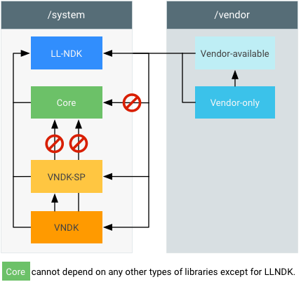

编译系统库。

- core：位于系统映像中，由系统映像使用。`vendor`,`vendor_available`,`vndk`或`vndk-sp`库不能使用此类库。

  ```protobuf
  cc_library {
      name: "libThatIsCore",
      ...
  }
  ```

- vendor-only（或`proprietary`）。位于供应商映像中，由供应商映像使用。

  ```properties
  cc_library {
      name: "libThatIsVendorOnly",
      proprietary: true,
      # or: vendor: true, # (for things in AOSP)
      ...
  }
  ```

- vendor_available：位于供应商映像中，由供应商映像使用（可能包含`core`的重复项）。

  ```properties
  cc_library {
      name: "libThatIsVendorAvailable",
      vendor_available: true,
      ...
  }
  ```

- vndk：位于系统映像中，由供应商映像使用（`vendor_available`的子集）。

  ```properties
  cc_library {
      name: "libThatIsVndk",
      vendor_available: true,
      vndk: {
          enabled: true,
      }
      ...
  }
  ```

- vndk-sp：位于系统映像中，由系统映像间接使用（`core`的子集）。

  ```properties
  cc_library {
      name: "libThatIsVndkSp",
      vendor_available: true,
      vndk: {
          enabled: true,
          support_system_process: true,
      }
      ...
  }
  ```

- **llndk**：同时由系统映像和供应商映像使用。`llndk_library {  name: "libThasIsLlndk",}`

当一个库被标记为 `vendor_available:true` 时，它将编译两次：

- 一次是为平台编译（因此被安装到 `/system/lib` 中）。
- 一次是为供应商编译（因此被安装到 `/vendor/lib`、`/system/lib/vndk` 或 `/system/lib/vndk-sp` 中）。

库的供应商版本使用 `-D__ANDROID_VNDK__` 标记编译。您可以使用此标记停用在 Android 未来版本中可能会发生显著变化的专用系统组件。此外，不同的库会导出一组不同的标头（例如 `liblog`）。可以在 `Android.bp` 文件中指定相应目标的供应商变体特有的选项：

```
target: { vendor: { … } }
```

### 为代码库启用 VNDK

要为代码库启用 VNDK，请执行以下操作：

1. 通过计算 `vendor.img` 和 `system.img` 分区的所需大小来确定是否符合条件。
2. 启用 `BOARD_VNDK_VERSION=current`。您可以将其添加到 `BoardConfig.mk`，也可以直接使用此选项编译组件（即 `m -j BOARD_VNDK_VERSION=current MY-LIB`）。

启用 `BOARD_VNDK_VERSION=current` 后，编译系统会强制执行以下依赖项和标头要求。

#### 管理依赖项

如果 `vendor` 对象依赖的 `core` 组件在 `vndk` 中不存在或未以 `vendor` 对象的形式存在，则必须通过以下某种方式解决该问题：

- 可以移除该依赖项。
- 如果该 `core` 组件归 `vendor` 所有，则可将其标记为 `vendor_available` 或 `vendor`。
- 可以在上游向 Google 提交更改请求，以便将此核心对象列入 `vndk`。

此外，如果有 `core` 组件依赖于 `vendor` 组件，则必须使此 `vendor` 组件成为 `core` 组件，**或者**以其他方式移除此依赖项（例如，通过移除依赖项或将其移到 `vendor` 组件中）。

#### 管理标头

必须移除全局标头依赖项，编译系统才能知道在编译标头时是否带 `-D__ANDROID_VNDK__`。例如，您仍然可以使用标头库 [`libutils_headers`](https://android.googlesource.com/platform/system/core/+/master/libutils/include/utils) 访问 `utils/StrongPointer.h` 等 libutils 标头。

某些标头（例如 `unistd.h`）无法再以传递方式包含在内，但可以包含在本地。

最后，`private/android_filesystem_config.h` 的公共部分已移至 `cutils/android_filesystem_config.h`。要管理这些标头，请执行下列操作之一：

- 通过将所有`AID_*`宏替换为`getgrnam`/`getpwnam`调用（如果可能），移除对`private/android_filesystem_config.h`的依赖。例如：

  - `(uid_t)AID_WIFI` 会变为 `getpwnam("wifi")->pw_uid`。
  - `(gid_t)AID_SDCARD_R` 会变为 `getgrnam("sdcard_r")->gr_gid`。

  如需了解详情，请参阅`private/android_filesystem_config.h`

- 对于硬编码的 AIS，请包含 `cutils/android_filesystem_config.h`。

## VNDK编译系统支持

在 Android 8.1 及更高版本中，编译系统具有内置的 VNDK 支持。如果启用了 VNDK 支持，编译系统就会检查各模块之间的依赖关系，为供应商模块编译特定于供应商的变体，并自动将这些模块安装到指定目录中。

### VNDK 编译支持示例

### 配置编译支持

### 模块定义


## VNDK扩展

Android 设备制造商会出于各种原因而更改 AOSP 库的源代码。一些供应商会为了提高性能而重新实现 AOSP 库中的函数，另一些供应商则会向 AOSP 库添加新钩子、新 API 或新功能。本部分将介绍一些准则，以说明如何在不破坏 CTS/VTS 的前提下扩展 AOSP 库。

### 简易替换

所有修改后的共享库都必须与其 AOSP 副本保持**二进制兼容**，且可以**简易替换**该副本。所有现有的 AOSP 用户都必须能在不进行重新编译的情况下使用修改后的共享库。此要求有以下几点含义：

- 不得移除 AOSP 函数。
- 不得更改面向用户提供的结构。
- 不得强化函数的前提条件。
- 函数必须提供等效功能。
- 不得削弱函数的后置条件。

### 扩展后的模块分类

按模块所**定义**和**使用**的功能对其进行分类。

> **注意**：此处之所以使用“功能”一词而未使用 API/ABI，是因为可在不更改任何 API/ABI 的情况下添加功能。

根据模块中定义的功能，可将模块分为 **DA 模块**和 **DX 模块**：

- Defining-only-AOSP 模块（DA 模块）不会定义 AOSP 副本中未包含的新功能。
  - *示例 1：* 一个未经修改且完整无缺的 AOSP 库即是一个 DA 模块。
  - *示例 2：* 如果供应商使用 SIMD 指令重写 `libcrypto.so` 中的函数（不添加新函数），那么修改后的 `libcrypto.so` 将是一个 DA 模块。
- Defining-Extension 模块（DX 模块）要么会定义新功能，要么没有 AOSP 副本。
  - *示例 1：* 如果供应商向 `libjpeg.so` 添加一个 helper 函数以访问某些内部数据，那么修改后的 `libjpeg.so` 将是一个 DX 库，而这个新增函数将是该库的扩展部分。
  - *示例 2：* 如果供应商定义了一个名为 `libfoo.so` 的非 AOSP 库，那么 `libfoo.so` 将是一个 DX 库。

根据模块所使用的功能，可将模块分为 **UA 模块**和 **UX 模块**。

- Using-only-AOSP（UA 模块）仅会在其实现过程中使用 AOSP 功能。它们不依赖任何非 AOSP 扩展功能。
  - *示例 1：* 一个未经修改且完整无缺的 AOSP 库即是一个 UA 模块。
  - *示例 2：* 如果修改后的共享库 `libjpeg.so` 仅依赖于其他 AOSP API，那么它将是一个 UA 模块。
- Using-Extension 模块（UX 模块）会在其实现过程中依赖某些非 AOSP 功能。
  - *示例 1：* 如果修改后的 `libjpeg.so` 依赖另一个名为 `libjpeg_turbo2.so` 的非 AOSP 库，那么修改后的 `libjpeg.so` 将是一个 UX 模块。
  - *示例 2：* 如果供应商向其修改后的 `libexif.so` 添加了一个新函数，并且其修改后的 `libjpeg.so` 使用 `libexif.so` 中的这个新增函数，那么修改后的 `libjpeg.so` 将是一个 UX 模块。

定义的功能和使用的功能相互独立：


### VNDK 扩展机制

由于同名的 AOSP 库不包含扩展功能，因此依赖扩展功能的供应商模块将无法正常工作。如果供应商模块直接或间接依赖扩展功能，则供应商应将 DAUX、DXUA 和 DXUX 共享库复制到供应商分区（供应商进程始终都会先在供应商分区中查找共享库）。但是，由于不得复制 LL-NDK 库，因此供应商模块不得依赖由修改后的 LL-NDK 库定义的扩展功能。

当系统分区被常规系统映像 (GSI) 覆盖时，如果相应的 AOSP 库可以提供相同的功能，且供应商模块可以继续正常工作，DAUA 共享库便可保留在系统分区上。

简易替换非常重要，因为 GSI 中未经修改的 VNDK 库将会在名称冲突时与修改后的共享库关联。如果以 API/ABI 不兼容的方式修改 AOSP 库，那么 GSI 中的 AOSP 库可能会无法进行关联或会出现未定义的行为。

## VNDK定义工具

VNDK 定义工具可帮助供应商将其源代码树迁移到 Android 8.0 环境。该工具会先扫描系统映像及供应商映像中的二进制文件，然后解析依赖项。若有模块依赖项图为依据，该工具还可检测出不符合 VNDK 概念的行为，以及为在分区之间移动模块提供分析数据/建议。如果指定了常规系统映像 (GSI)，VNDK 定义工具便可将您的系统映像与 GSI 进行比较，从而确定扩展后的库。

本部分将介绍 VNDK 定义工具常用的 3 个命令：

- `vndk`：为 Android 8.0 及更高版本中的编译系统临时解决方法计算 VNDK_SP_LIBRARIES、VNDK_SP_EXT_LIBRARIES 和 EXTRA_VENDOR_LIBRARIES。
- `check-dep`：检查是否有违规模块依赖项（从供应商模块指向不符合条件的框架共享库）。
- `deps`：显示共享库与可执行文件之间的依赖关系。

要详细了解高级命令用法，请参阅 VNDK 定义工具代码库中的 [README.md](https://android.googlesource.com/platform/development/+/master/vndk/tools/definition-tool/README.md) 文件。

### vndk

`vndk` 子命令会从系统分区和供应商分区加载共享库和可执行文件，然后解析模块依赖项，从而确定必须被复制到 `/system/lib[64]/vndk-sp-${VER}` 和 `/vendor/lib[64]` 的库。`vndk` 子命令包含以下选项：

| 选项                | 说明                                                      |
| :------------------ | :-------------------------------------------------------- |
| `--system`          | 指向一个包含将会存放在系统分区中的文件的目录。            |
| `--vendor`          | 指向一个包含将会存放在供应商分区中的文件的目录。          |
| `--aosp-system`     | 指向一个包含将会存放在常规系统映像 (GSI) 中的文件的目录。 |
| `--load-extra-deps` | 指向一个描述隐式依赖项（例如 `dlopen()`）的文件。         |

例如，要计算 VNDK 库集，请运行以下 `vndk` 子命令：

```bash
./vndk_definition_tool.py vndk \
    --system ${ANDROID_PRODUCT_OUT}/system \
    --vendor ${ANDROID_PRODUCT_OUT}/vendor \
    --aosp-system ${ANDROID_PRODUCT_OUT}/../generic_arm64_ab/system\
    --load-extra-deps dlopen.dep
```

请使用简单的文件格式指定额外的依赖关系。每行表示一项依赖关系，其中冒号前面的文件依赖冒号后面的文件。例如：

```bash
/system/lib/libart.so: /system/lib/libart-compiler.so
```

通过此行，VNDK 定义工具可得知 `libart.so` 依赖 `libart-compiler.so`。

#### 安装目标位置

VNDK 定义工具会列出以下类别的库及相应的安装目录：

| 类别              | 目录                                        |
| :---------------- | :------------------------------------------ |
| vndk_sp           | 必须安装到 `/system/lib[64]/vndk-sp-${VER}` |
| vndk_sp_ext       | 必须安装到 `/vendor/lib[64]/vndk-sp`        |
| extra_vendor_libs | 必须安装到 `/vendor/lib[64]`                |

编译系统模板

在收集了 VNDK 定义工具的输出信息之后，供应商可以创建一个 `Android.mk` 并填充 `VNDK_SP_LIBRARIES`、`VNDK_SP_EXT_LIBRARIES` 和 `EXTRA_VENDOR_LIBRARIES`，以自动执行相应进程，将库复制到指定的安装目标位置。

```c
ifneq ($(filter $(YOUR_DEVICE_NAME),$(TARGET_DEVICE)),)
VNDK_SP_LIBRARIES := ##_VNDK_SP_##
VNDK_SP_EXT_LIBRARIES := ##_VNDK_SP_EXT_##
EXTRA_VENDOR_LIBRARIES := ##_EXTRA_VENDOR_LIBS_##

#-------------------------------------------------------------------------------
# VNDK Modules
#-------------------------------------------------------------------------------
LOCAL_PATH := $(call my-dir)

define define-vndk-lib
include $$(CLEAR_VARS)
LOCAL_MODULE := $1.$2
LOCAL_MODULE_CLASS := SHARED_LIBRARIES
LOCAL_PREBUILT_MODULE_FILE := $$(TARGET_OUT_INTERMEDIATE_LIBRARIES)/$1.so
LOCAL_STRIP_MODULE := false
LOCAL_MULTILIB := first
LOCAL_MODULE_TAGS := optional
LOCAL_INSTALLED_MODULE_STEM := $1.so
LOCAL_MODULE_SUFFIX := .so
LOCAL_MODULE_RELATIVE_PATH := $3
LOCAL_VENDOR_MODULE := $4
include $$(BUILD_PREBUILT)

ifneq ($$(TARGET_2ND_ARCH),)
ifneq ($$(TARGET_TRANSLATE_2ND_ARCH),true)
include $$(CLEAR_VARS)
LOCAL_MODULE := $1.$2
LOCAL_MODULE_CLASS := SHARED_LIBRARIES
LOCAL_PREBUILT_MODULE_FILE := $$($$(TARGET_2ND_ARCH_VAR_PREFIX)TARGET_OUT_INTERMEDIATE_LIBRARIES)/$1.so
LOCAL_STRIP_MODULE := false
LOCAL_MULTILIB := 32
LOCAL_MODULE_TAGS := optional
LOCAL_INSTALLED_MODULE_STEM := $1.so
LOCAL_MODULE_SUFFIX := .so
LOCAL_MODULE_RELATIVE_PATH := $3
LOCAL_VENDOR_MODULE := $4
include $$(BUILD_PREBUILT)
endif  # TARGET_TRANSLATE_2ND_ARCH is not true
endif  # TARGET_2ND_ARCH is not empty
endef

$(foreach lib,$(VNDK_SP_LIBRARIES),\
    $(eval $(call define-vndk-lib,$(lib),vndk-sp-gen,vndk-sp,)))
$(foreach lib,$(VNDK_SP_EXT_LIBRARIES),\
    $(eval $(call define-vndk-lib,$(lib),vndk-sp-ext-gen,vndk-sp,true)))
$(foreach lib,$(EXTRA_VENDOR_LIBRARIES),\
    $(eval $(call define-vndk-lib,$(lib),vndk-ext-gen,,true)))

#-------------------------------------------------------------------------------
# Phony Package
#-------------------------------------------------------------------------------

include $(CLEAR_VARS)
LOCAL_MODULE := $(YOUR_DEVICE_NAME)-vndk
LOCAL_MODULE_TAGS := optional
LOCAL_REQUIRED_MODULES := \
    $(addsuffix .vndk-sp-gen,$(VNDK_SP_LIBRARIES)) \
    $(addsuffix .vndk-sp-ext-gen,$(VNDK_SP_EXT_LIBRARIES)) \
    $(addsuffix .vndk-ext-gen,$(EXTRA_VENDOR_LIBRARIES))
include $(BUILD_PHONY_PACKAGE)

endif  # ifneq ($(filter $(YOUR_DEVICE_NAME),$(TARGET_DEVICE)),)
```

### check-dep

`check-dep` 子命令会扫描供应商模块并检查其依赖关系。如果它检测到违规行为，就会显示违规的依赖库和符号用法：

```c
./vndk_definition_tool.py check-dep \
    --system ${ANDROID_PRODUCT_OUT}/system \
    --vendor ${ANDROID_PRODUCT_OUT}/vendor \
    --tag-file eligible-list.csv \
    --module-info ${ANDROID_PRODUCT_OUT}/module-info.json \
    1> check_dep.txt \
    2> check_dep_err.txt
```

例如，下方的输出信息示例表明，存在一项从 `libRS_internal.so` 指向 `libmediandk.so` 的违规依赖关系：

```c
/system/lib/libRS_internal.so
        MODULE_PATH: frameworks/rs
        /system/lib/libmediandk.so
                AImageReader_acquireNextImage
                AImageReader_delete
                AImageReader_getWindow
                AImageReader_new
                AImageReader_setImageListener
```

`check-dep` 子命令包含以下选项：

| 选项            | 说明                                                         |
| :-------------- | :----------------------------------------------------------- |
| `--tag-file`    | 必须引用一个符合条件的库标记文件（如下文所述），即一个由 Google 提供的描述框架共享库类别的电子表格。 |
| `--module-info` | 指向由 Android 编译系统生成的 `module-info.json`。该选项可帮助 VNDK 定义工具将二进制模块与源代码关联。 |

#### 符合条件的库标记文件

Google 会提供一个符合条件的 VNDK 电子表格（例如 `eligible-list.csv`），该电子表格会标记可由供应商模块使用的框架共享库：

| 标记            | 说明                                                         |
| :-------------- | :----------------------------------------------------------- |
| LL-NDK          | 可由框架模块和供应商模块使用的共享库（具有稳定的 ABI/API）。 |
| LL-NDK-Private  | LL-NDK 库的私有依赖项。供应商模块不得直接访问此类库。        |
| VNDK-SP         | SP-HAL 框架共享库依赖项。                                    |
| VNDK-SP-Private | 所有供应商模块都无法直接访问的 VNDK-SP 依赖项。              |
| VNDK            | 面向供应商模块（SP-HAL 和 SP-HAL-Dep 除外）提供的框架共享库。 |
| VNDK-Private    | 所有供应商模块都无法直接访问的 VNDK 依赖项。                 |
| FWK-ONLY        | 供应商模块不得（直接或间接）访问、仅限框架使用的共享库。     |
| FWK-ONLY-RS     | 供应商模块不得访问（RS 用途除外）、仅限框架使用的共享库。    |

下表描述了适用于供应商共享库的标记：

| 标记       | 说明                                                         |
| :--------- | :----------------------------------------------------------- |
| SP-HAL     | Same-Process HAL 实现共享库。                                |
| SP-HAL-Dep | SP-HAL 供应商共享库依赖项（也称为 SP-HAL 依赖项，不包括 LL-NDK 和 VNDK-SP）。 |
| VND-ONLY   | 框架模块不可见且不得访问的共享库。所复制的扩展后 VNDK 库也将被标记为 VND-ONLY。 |

标记之间的关系：

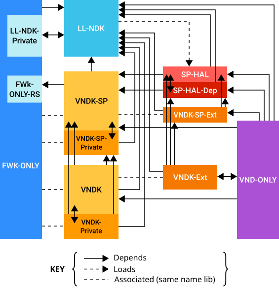

### deps

为了对库依赖项进行调试，`deps` 子命令会显示以下模块依赖关系：

```bash
./vndk_definition_tool.py deps \
    --system ${ANDROID_PRODUCT_OUT}/system \
    --vendor ${ANDROID_PRODUCT_OUT}/vendor
```

输出信息由多行内容组成。不含制表符的行会另起一部分。包含制表符的行则依赖前一部分。例如：

```bash
/system/lib/ld-android.so
/system/lib/libc.so
        /system/lib/libdl.so
```

此输出信息表明：`ld-android.so` 没有依赖项，而 `libc.so` 依赖 `libdl.so`。

如果指定了 `--revert` 选项，`deps` 子命令就会显示**库的使用情况**（反向依赖项）：

```bash
./vndk_definition_tool.py deps \
    --revert \
    --system ${ANDROID_PRODUCT_OUT}/system \
    --vendor ${ANDROID_PRODUCT_OUT}/vendor
```

例如：

```bash
/system/lib/ld-android.so
        /system/lib/libdl.so
        
```

此输出信息表明：`libdl.so` 使用了 `ld-android.so`，即 `libdl.so` 依赖 `ld-android.so`。另外，此输出信息还表明 `libdl.so` 是 `ld-android.so` 的唯一使用者。

如果指定了 `--symbol` 选项，`deps` 子命令便会显示用到的符号：

```bash
./vndk_definition_tool.py deps \
    --symbol \
    --system ${ANDROID_PRODUCT_OUT}/system \
    --vendor ${ANDROID_PRODUCT_OUT}/vendor
    
```

例如：

```bash
/system/lib/libc.so
        /system/lib/libdl.so
                android_get_application_target_sdk_version
                dl_unwind_find_exidx
                dlclose
                dlerror
                dlopen
                dlsym
```

此输出信息表明 `libc.so` 依赖从 `libdl.so` 导出的 6 个函数。如果同时指定了 `--symbol` 选项和 `--revert` 选项，该子命令则会显示使用者所用的符号。

## VNDK 快照设计

系统映像可以使用 VNDK 快照为供应商映像提供正确的 VNDK 库，即使系统映像和供应商映像是基于不同版本的 Android 编译的也是如此。创建 VNDK 快照需要以快照形式捕获 VNDK 库，并使用版本号标记它们。供应商映像可以与特定的 VNDK 版本相关联，由此版本为供应商映像中的模块提供所需 ABI。不过，在同一 VNDK 版本内，VNDK 库必须具有[稳定的 ABI](https://source.android.com/devices/architecture/hidl/hashing#abi-stability)。

VNDK 快照设计包括用于执行以下两项操作的方法：从当前系统映像[生成预编译的 VNDK 快照](https://source.android.com/devices/architecture/vndk/snapshot-generate)和[将这些预编译的库安装](https://source.android.com/devices/architecture/vndk/snapshot-generate#install-vndk-snapshot)到更高 Android 版本的系统分区。

### VNDK 库简介

Android 8.0 中引入的 [HIDL-HAL](https://source.android.com/devices/architecture#hidl) 支持单独升级系统分区和供应商分区。VNDK 定义了可与供应商代码相关联的库集（VNDK-core、VNDK-SP 和 LL-NDK），并阻止供应商使用不在 VNDK 集内的库。因此，如果将系统映像上合适的 VNDK 集提供给供应商映像，则可以编译并运行供应商映像。

**注意**：有关这些库的详细信息，请参阅 [VNDK 概念](https://source.android.com/devices/architecture/vndk#concepts)。

#### VNDK-core

VNDK-core 库集安装在 `/system/lib[64]/vndk-${VER}` 中，**仅**适用于 API 级别为 `${VER}` 的供应商进程。系统进程不得使用这些库，而必须使用安装在 `/system/lib[64]` 中的库。由于每个进程都具有严格的命名空间限制，因此不会造成重复加载 VNDK-core 库。

要在 VNDK-core 中添加库，请将以下内容添加到 `Android.bp` 中：

```
vendor_available: true,
vndk: {
    enabled: true,
},
```

**注意**：如果系统进程从 `system/lib` 加载库 `foo.so`，并从 `system/lib/vndk` 加载另一个 `foo.so`，这种情况就属于重复加载 `foo.so`。通常，在一个进程中两次加载同一个库是不安全的。

#### VNDK-SP

VNDK-SP 库安装在 `/system/lib[64]/vndk-sp-${VER}` 中，适用于供应商进程和系统进程（通过安装在供应商分区中的 SP-HAL 库）。VNDK-SP 库可以重复加载。

要在 VNDK-SP 中添加库，请将以下内容添加到 `Android.bp` 中：

```
vendor_available: true,
vndk: {
    enabled: true,
    support_system_process: true,
},
```

#### LL-NDK

LL-NDK 库安装在 `/system/lib[64]` 中。供应商模块可以使用 LL-NDK 存根库访问 LL-NDK 库的预选符号。LL-NDK 库必须支持向后兼容且具有 ABI 稳定性，以便旧版供应商模块使用新版 LL-NDK 库。由于 LL-NDK 具有 ABI 稳定特性，VNDK 快照无需包含旧版供应商映像的 LL-NDK 库。

### VNDK 快照简介

Android 8.1 包含[根据源代码编译的 VNDK 库](https://source.android.com/devices/architecture/vndk/build-system)。不过，对于更高版本的 Android，必须以快照形式捕获每个 VNDK 版本，并作为预编译版本提供，以便关联到较旧版本的供应商映像。

从 Android 9 开始，新版 Android 将在 Android 源代码中包含较低版本 Android 的 VNDK-core 和 VNDK-SP 目录的至少一个快照。编译时，所需快照将安装到 `/system/lib[64]/vndk-${VER}` 和 `/system/lib[64]/vndk-sp-${VER}`（供应商分区可以使用的目录），其中 `${VER}` 是表示 VNDK 快照版本名称的字符串变量。

由于每个 VNDK 版本的 VNDK 快照库可能各不相同，因此 VNDK 快照还包含按以下格式安装的链接器命名空间配置：`etc/ld.config.${VER}.txt`、`/etc/llndk.libraries.${VER}.txt` 和 `/etc/vndksp.libraries.${VER}.txt`。

#### 示例：升级系统映像和供应商映像

无需快照；无需针对 VNDK 快照进行其他配置即可编译。

#### 示例：仅升级系统映像

必须在系统映像中包含供应商映像的 VNDK 快照和链接器命名空间配置文件。系统会自动配置链接器命名空间配置文件，以在 `/system/lib[64]/vndk-${VER}` 和 `/system/lib[64]/vndk-sp-${VER}` 中搜索 VNDK 库。

##### 仅升级系统映像

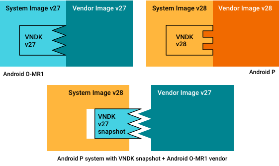

#### 示例：升级系统映像，少量更改供应商映像

根据 VNDK 快照编译供应商映像尚不受支持，因此您必须使用原始源代码单独编译供应商映像，然后按上一示例中所述升级系统映像。

### VNDK 快照架构

要使 Android 9 系统映像与 Android 8.1 供应商映像兼容，必须为 Android 9 系统映像提供与 Android 8.1 供应商映像匹配的 VNDK 快照，如下所示：

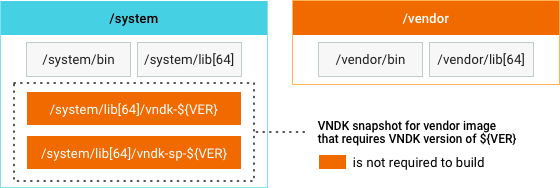

VNDK 快照设计包括以下方法：

- **为 VNDK-core 和 VNDK-SP 库生成快照**。Android 9 包含一个脚本，您可以使用它来制作当前 VNDK 版本的快照。此脚本将 `/system/lib[64]/vndk-28` 和 `/system/lib[64]/vndk-sp-28` 中的所有库组合在一起，这些库是采用当前源代码以 VNDK 快照形式编译的，其中 `28` 是 Android 9 的 VNDK 版本。快照还包含链接器命名空间配置文件 `/etc/ld.config.28.txt`、`/etc/llndk.libraries.28.txt` 和 `/etc/vndksp.libraries.28.txt`。生成的快照将用于较新的 Android 版本（高于 Android 9 的版本）。
- **从快照安装预编译的 VNDK-core 和 VNDK-SP 库**。在 Android 9 中，VNDK 快照具有一组预编译的 VNDK-core 库和一组 VNDK-SP 库，以及链接器命名空间配置文件。如果您提供了要安装的 VNDK 快照版本列表，系统映像会在编译时将 VNDK 快照库安装到 `/system/lib[64]/vndk-${VER}` 和 `/system/lib[64]/vndk-sp-${VER}` 目录，并将这些 VNDK 快照的链接器命名空间配置文件安装到 `/etc` 目录。

#### VNDK 版本控制

每个 Android 版本都只有一个 VNDK 快照，并且 SDK 版本用作 VNDK 版本（这意味着 VNDK 版本必须采用整数，例如 Android 8.1 的 VNDK 版本为 27）。Android 版本发布时，VNDK 版本已确定。供应商分区使用的 VNDK 版本自动存储在 `ro.vndk.version` 属性中，可在运行时读取。然后，此版本用于识别一些库的供应商 VNDK 版本及命名空间配置的 VNDK 快照版本。

#### 编译 VNDK 库

`make vndk` 命令可用于编译具有 `vndk: { enabled: true, … }` 的库，包括依赖项和命名空间配置文件。如果设置了 `BOARD_VNDK_VERSION := current`，则可使用 `make` 命令编译这些库。

由于这种编译方法不会从快照安装 VNDK 库，安装的 VNDK 库不具有 ABI 稳定性。不过，Android 版本发布时，当前 VNDK 版本的 ABI 已确定。此时，任何 ABI 损坏都属于编译错误，因此 Android 版本的补丁程序不得更改 VNDK 库的 ABI。


##  生成VNDK快照

VNDK 快照是一组适用于 Android 版本的 VNDK-core 和 VNDK-SP 库。如果 system.img 包含 vendor.img 所需的相应 VNDK 快照，那么，只能升级系统分区。

> **注意**：本页提供了关于编译和更新 VNDK 快照的设计细节。要详细了解 VNDK 快照的背景、定义和用例，请参阅 [VNDK 快照设计](https://source.android.com/devices/architecture/vndk/snapshot-design)。

正式的 VNDK 快照是在 Android 编译服务器上自动编译而成，并签入 Android 源代码树的 `/prebuilts/vndk` 中。为了便于开发，您可以在本地编译 VNDK 快照。arm、arm64、x86 和 x86_64 TARGET_ARCH 架构支持 VNDK 快照。

### 快照编译工件

Android 编译服务器使用以下编译参数和编译命令，生成适用于 VNDK 快照的编译工件。

#### 编译参数

编译目标名称为 `vndk`，编译目标配置如下所示：

- TARGET_PRODUCT=aosp_{TARGET_ARCH}_ab
- TARGET_BUILD_VARIANT=user
- TARGET_ARCH。与常规系统映像 (GSI) 目标架构（arm、arm64、x86、x86_64）相同。
- TARGET_ARCH_VARIANT。对于快照 v27 (Android 8.1)，变体包含热门配置（如下所示）；未来版本可能会包含其他 arch/cpu 变体。

| TARGET_PRODUCT | TARGET_ARCH | TARGET_ARCH_VARIANT |
| :------------- | :---------- | :------------------ |
| aosp_arm_ab    | arm         | armv7-a-neon        |
| aosp_arm64_ab  | arm64       | armv8-a             |
| aosp_x86_ab    | x86         | x86                 |
| aosp_x86_64_ab | x86_64      | x86_64              |

#### 编译命令

对于正式快照，Android 9 在 [vndk.mk](https://android.googlesource.com/platform/build/+/master/core/tasks/vndk.mk) 中引入了新的虚拟目标 (`vndk`)，该目标会编译 VNDK 快照并将其输出到 `$DIST_DIR` 中。快照的 ZIP 文件采用 `android-vndk-{TARGET_ARCH}.zip` 格式。例如：

```
$ lunch aosp_<ARCH>_ab-user
$ make -j vndk dist [BOARD_VNDK_VERSION=current]
```

Android 编译服务器通过以下命令使用 [build.sh](https://android.googlesource.com/platform/development/+/master/vndk/snapshot/build.sh) 脚本来编译所有受支持的架构类型：

```
$ DIST_DIR=%dist_dir% development/vndk/snapshot/build.sh
```

Android 版本的 VNDK 快照由 `-release` 分支生成。

#### 在本地编译

在开发过程中，您可以通过以下命令，从本地源代码树中编译 VNDK 快照：

- 要一次编译所有受支持的架构，请通过以下命令执行编译脚本 (

  ```
  build.sh
  ```

  )：

  ```
  $ cd $ANDROID_BUILD_TOP
  $ development/vndk/snapshot/build.sh
  ```

- 要编译某个特定的 TARGET_ARCH，请执行以下命令：

  ```
  $ lunch aosp_<ARCH>_ab-user
  $ m -j vndk dist
  ```

相应的 `android-vndk-.zip` 文件会在 `$DIST_DIR` 下创建。

#### 快照文件

VNDK 快照包含以下文件：

- VNDK-core 和 VNDK-SP 共享库的供应商变体。
  - 无需 LL-NDK 共享库，因为这类库是向后兼容的。
  - 对于 64 位目标，TARGET_ARCH 和 TARGET_2ND_ARCH 库都将被编译并包含在内。
- VNDK-core、VNDK-SP、LL-NDK 和 VNDK-private 库的列表位于 `[vndkcore|vndksp|llndk|vndkprivate].libraries.txt`。
- 链接器配置文件为 `ld.config.txt`。
- 许可文件。
- `module_paths.txt`。记录所有 VNDK 库的模块路径；检查 GPL 项目是否已在指定 Android 源代码树中发布源代码时，需要用到这种文件。

对于指定 VNDK 快照 ZIP 文件 `android-vndk-{TARGET_ARCH}.zip`，系统会根据 ABI 位数将 VNDK 预编译库分组到名为 `arch-{TARGET_ARCH}-{TARGET_ARCH_VARIANT}` 的单独目录中。例如，对于 `android-vndk-arm64.zip`，64 位库会位于 `arch-arm64-armv8-a` 下，而 32 位库则位于 `arch-arm-armv8-a` 下。

#### 示例：VNDK 快照目录结构

以下示例展示了 arm64 (`TARGET_ARCH=arm64`) VNDK 快照 ZIP 文件 (`android-vndk-arm64.zip`) 的目录结构。

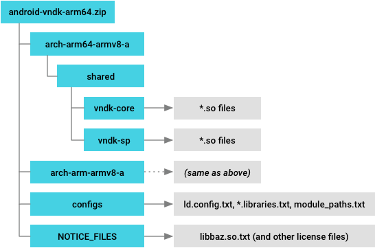

### 上传 VNDK 快照

VNDK 快照将签入 `/prebuilts/vndk/v` 下的源代码树，其中 `` 为 VNDK 快照的版本（遵循相应 Android 版本的 SDK 版本）。例如，O MR1 VNDK 快照的版本为 27。

#### 使用 update.py 脚本

`update.py` 脚本 (`/development/vndk/snapshot/update.py)` 可自动将预编译的 VNDK 快照添加到源代码树中。此脚本将执行以下任务：

1. 在 `/prebuilts/vndk/v` 中，使用 `repo start` 创建新的 git 分支。
2. 获取 VNDK 快照编译软件工件并将其解压缩。
3. 运行 `gen_buildfiles.py` 以自动生成编译文件（`Android.mk`、`Android.bp`）。
4. 运行 `check_gpl_license.py` 以验证根据通用公共许可证 (GPL) 获得许可的预编译库是否在当前源代码树中发布了源代码。
5. 使用 `git commit` 提交新的更改。

#### 使用本地编译的 VNDK 快照

在开发过程中，您可以使用本地编译的 VNDK 快照进行测试。在指定 `--local` 选项的情况下，`update.py` 会从本地 `$DIST_DIR`（而非 Android 编译服务器中）提取 VNDK 快照编译工件。用法如下：

```bash
$ python update.py <VER> --local
```

例如，要使用本地编译软件工件更新 O MR1 VNDK 快照，请运行以下命令：

```bash
$ python update.py 27 --local
```

由于本地模式仅用于测试，因此该脚本将跳过 GPL 许可检查和 git commit 步骤。

#### prebuilts/vndk 的目录结构

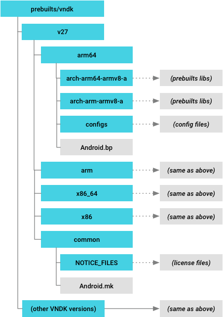

### 安装 VNDK 快照

系统映像在编译时使用 `BOARD_VNDK_VERSION`、`PRODUCT_EXTRA_VNDK_VERSIONS` 和 `ro.vndk.version` 中的信息安装 VNDK 快照库。您可以使用以下选项之一控制从 `/prebuilts/vndk/v` 中安装哪些 VNDK 快照：

- **选项 1**：`BOARD_VNDK_VERSION`。使用快照模块编译当前供应商模块，并仅安装供应商模块所需的快照模块。
- **选项 2**：`PRODUCT_EXTRA_VNDK_VERSIONS`。无论当前供应商模块有哪些，都安装 VNDK 快照模块。这将安装 `PRODUCT_EXTRA_VNDK_VERSIONS` 中列出的预编译 VNDK 快照，而不会在编译时将其与任何其他模块相关联。

#### 设置 BOARD_VNDK_VERSION

`BOARD_VNDK_VERSION` 显示的是当前供应商模块需要编译的 VNDK 版本。如果 `BOARD_VNDK_VERSION` 在 `/prebuilts/vndk` 目录中有可用的 VNDK 快照版本，则系统会安装 `BOARD_VNDK_VERSION` 中指明的 VNDK 快照。如果目录中的 VNDK 快照不可用，则会出现编译错误。

定义 `BOARD_VNDK_VERSION` 也会启用要安装的 VNDK 模块。供应商模块会在编译时与 `BOARD_VNDK_VERSION` 中定义的 VNDK 快照版本相关联（此操作不会在系统源代码中编译当前的 VNDK 模块）。从代码库中下载完整的源代码树时，系统源代码和供应商源代码均基于相同的 Android 版本。

**注意**：供应商模块使用的是系统源代码树的当前 VNDK 版本，因此，您必须将 `BOARD_VNDK_VERSION` 设置为 `current`。

#### 设置 PRODUCT_EXTRA_VNDK_VERSIONS

`PRODUCT_EXTRA_VNDK_VERSIONS` 列出了要安装的其他 VNDK 版本。正常情况下，当前的供应商分区只需一个 VNDK 快照就足够了。不过，在某些情况下，您可能需要在一个系统映像中提供多个快照。例如，常规系统映像 (GSI) 具有多个快照，以通过一个系统映像支持多个供应商版本。设置 `PRODUCT_EXTRA_VNDK_VERSIONS` 后，除了 `BOARD_VNDK_VERSION` 中的 VNDK 版本之外，您还可以安装 VNDK 快照模块。

如果 `PRODUCT_EXTRA_VNDK_VERSIONS` 具有特定的版本列表，则编译系统会在 `prebuilts/vndk` 目录中查找版本列表的预编译快照。如果编译系统找到所有列出的快照，便会将这些快照文件安装到每个 `out/target/product//system/lib[64]/vndk[-sp]-${VER}` 中。缺少某些版本会导致出现编译错误。

VNDK 模块将不会在编译时与供应商模块相关联，但在运行时可能会使用该模块（如果供应商分区中的供应商模块需要某个已安装的 VNDK 版本）。`PRODUCT_EXTRA_VNDK_VERSIONS` 仅在指定了 `BOARD_VNDK_VERSION` 的情况下才有效。例如，要将 O MR1 VNDK 快照安装到 system.img 中，请运行以下命令：

```
$ m -j PRODUCT_EXTRA_VNDK_VERSIONS=27
```

#### PLATFORM_VNDK_VERSION

`PLATFORM_VNDK_VERSION` 在系统源代码中指定了当前 VNDK 模块的 VNDK 版本。系统会通过以下方式自动设置该值：

- 在版本发布之前，将 `PLATFORM_VNDK_VERSION` 设置为 `PLATFORM_VERSION_CODENAME`。
- 在发布时，将 `PLATFORM_SDK_VERSION` 复制到 `PLATFORM_VNDK_VERSION` 中。

发布 Android 版本后，当前的 VNDK 库会被安装到 `/system/lib[64]/vndk-$SDK_VER` 和 `/system/lib[64]/vndk-sp-$SDK_VER`，其中 `$SDK_VER` 是存储在 `PLATFORM_VNDK_VERSION` 中的版本。

#### 命名空间配置

供应商模块使用 `/etc/ld.config.${VER}.txt`（其中 `${VER}` 是从 `ro.vndk.version` 属性中获得的）中的命名空间配置来搜索所需的共享库。命名空间配置中包含带有版本编号的 VNDK 目录，该目录使用以下语法：

- `/system/${LIB}/vndk-%VNDK_VER%`
- `/system/${LIB}/vndk-sp-%VNDK_VER%`

`%VNDK_VER%` 在编译时会被替换为 `PLATFORM_VNDK_VERSION`，这样一来，系统映像便能够为每个 VNDK 版本提供多个快照。

如果将 `BOARD_VNDK_VERSION` 设置为 `current`，则 `PLATFORM_VNDK_VERSION` 将存储在 `ro.vndk.version` 中；否则，`BOARD_VNDK_VERSION `将存储在 `ro.vndk.version` 中。`PLATFORM_VNDK_VERSION` 在 Android 版本发布时会被设置为 SDK 版本；在发布之前，由字母和数字组成的 Android 代码名称会用于 `PLATFORM_VNDK_VERSION`。

#### VNDK 版本设置摘要

下表总结了 VNDK 版本设置。

| 供应商 版本      | 开发板 版本             | SDK 版本   | 平台 版本                           | 版本 属性   | 安装目录                              |
| :--------------- | :---------------------- | :--------- | :---------------------------------- | :---------- | :------------------------------------ |
| 当前的 VNDK 模块 | `current`               | 之前       | <CODE_NAME>                         | <CODE_NAME> | /system/lib[64]/vndk[-sp]-<CODE_NAME> |
| 之后             | <SDK_ver>               | <SDK_ver>  | /system/lib[64]/vndk[-sp]-<SDK_ver> |             |                                       |
| 预编译的快照模块 | <VNDK_ver> （用于快照） | 之前或之后 | <CODE_NAME> 或 <SDK_ver>            | <VNDK_ver>  | /system/lib[64]/vndk[-sp]-<VNDK_ver>  |

- **开发板版本** (`BOARD_VNDK_VERSION`)：供应商模块需要编译的 VNDK 版本。如果供应商模块可与当前系统模块相关联，则将其设置为 `current`。
- **平台版本** (`PLATFORM_VNDK_VERSION`)：当前系统模块正在编译的 VNDK 版本（仅在 `BOARD_VNDK_VERSION` 为当前版本时编译）。
- **版本属性** (`ro.vndk.version`)：一种属性，用于指定 vendor.img 中的二进制文件和库需要运行的 VNDK 版本。该属性存储在` /vendor/default.prop` 下的 vendor.img 中。


## 链接器命名空间

动态链接器解决了 Treble VNDK 设计中的两个难题：

- 将 SP-HAL 共享库及其依赖项（包括 VNDK-SP 库）加载到框架进程中。这种情况下应该有一些防止出现符号冲突的机制。
- `dlopen()` 和 `android_dlopen_ext()` 可能会引入一些在编译时不可见的运行时依赖项，这些依赖项使用静态分析很难检测到。

这两个难题可以通过链接器命名空间机制来解决。链接器命名空间机制由动态链接器提供，可以隔离不同链接器命名空间中的共享库，以确保具有相同库名称和不同符号的库不会发生冲突。

另一方面，链接器命名空间机制可提供相应的灵活性，从而将由一个链接器命名空间导出的某些共享库用于另一个链接器命名空间。这些导出的共享库可能会成为对其他程序公开的应用编程接口，同时在其链接器命名空间中隐藏实现细节。

例如，`/system/lib[64]/libcutils.so` 和 `/system/lib[64]/vndk-sp-${VER}/libcutils.so` 是两个共享库。这两个库可能有不同的符号。它们会加载到不同的链接器命名空间中，以便框架模块可以依赖于 `/system/lib[64]/libcutils.so`，而 SP-HAL 共享库则可以依赖于 `/system/lib[64]/vndk-sp-${VER}/libcutils.so`。

另一方面，`/system/lib[64]/libc.so` 是由一个链接器命名空间导出而后又被导入到许多链接器命名空间中的公共库。`/system/lib[64]/libc.so` 的依赖项（例如 `libnetd_client.so`）将被加载到 `/system/lib[64]/libc.so` 所在的命名空间中。其他命名空间将无法访问这些依赖项。这种机制会在提供公共接口的同时封装实现细节。

### 工作原理

动态链接器负责加载 `DT_NEEDED` 条目中指定的共享库，或由 `dlopen()` 或 `android_dlopen_ext()` 的参数指定的共享库。在这两种情况下，动态链接器都会找出调用程序所在的链接器命名空间，并尝试将相关依赖项加载到同一个链接器命名空间中。如果动态链接器无法将共享库加载到指定的链接器命名空间中，它会向关联的链接器命名空间索取导出的共享库。

### 配置文件格式

配置文件格式取决于 INI 文件格式。典型的配置文件如下所示：

```
dir.system = /system/bin
dir.system = /system/xbin
dir.vendor = /vendor/bin

[system]
additional.namespaces = sphal,vndk

namespace.default.isolated = true
namespace.default.search.paths = /system/${LIB}
namespace.default.permitted.paths = /system/${LIB}/hw
namespace.default.asan.search.paths = /data/asan/system/${LIB}:/system/${LIB}
namespace.default.asan.permitted.paths = /data/asan/system/${LIB}/hw:/system/${LIB}/hw

namespace.sphal.isolated = true
namespace.sphal.visible = true
namespace.sphal.search.paths = /odm/${LIB}:/vendor/${LIB}
namespace.sphal.permitted.paths = /odm/${LIB}:/vendor/${LIB}
namespace.sphal.asan.search.paths  = /data/asan/odm/${LIB}:/odm/${LIB}
namespace.sphal.asan.search.paths += /data/asan/vendor/${LIB}:/vendor/${LIB}
namespace.sphal.asan.permitted.paths  = /data/asan/odm/${LIB}:/odm/${LIB}
namespace.sphal.asan.permitted.paths += /data/asan/vendor/${LIB}:/vendor/${LIB}
namespace.sphal.links = default,vndk
namespace.sphal.link.default.shared_libs = libc.so:libm.so
namespace.sphal.link.vndk.shared_libs = libbase.so:libcutils.so

namespace.vndk.isolated = true
namespace.vndk.search.paths = /system/${LIB}/vndk-sp-29
namespace.vndk.permitted.paths = /system/${LIB}/vndk-sp-29
namespace.vndk.links = default
namespace.vndk.link.default.shared_libs = libc.so:libm.so

[vendor]
namespace.default.isolated = false
namespace.default.search.paths = /vendor/${LIB}:/system/${LIB}
```

配置文件包含以下内容：

- 多个“目录-区段”映射属性（位于动态链接器的开头），用于选择有效的区段。
- 多个链接器命名空间配置区段：
  - 每个区段都包含多个命名空间（圆形顶点）以及各命名空间之间的多个回退链接（图形弧）。
  - 每个命名空间都具有自己的隔离、搜索路径、允许的路径以及可见性设置。

下表详细介绍了各属性的含义。

#### “目录-区段”映射属性

| 属性       | 说明                                                         | 示例                                                         |
| :--------- | :----------------------------------------------------------- | :----------------------------------------------------------- |
| `dir.name` | 指向 `[name]` 区段所应用到的目录的路径。每个属性都会将目录下的可执行文件映射到链接器命名空间配置区段。可能会有 2 个（或 2 个以上）属性具有相同的 `name`，却指向不同的目录。 | `dir.system = /system/bin` `dir.system = /system/xbin` `dir.vendor = /vendor/bin` 这表示在 `[system]` 区段中指定的配置适用于从 `/system/bin` 或 `/system/xbin` 加载的可执行文件。在 `[vendor]` 区段中指定的配置适用于从 `/vendor/bin` 加载的可执行文件。 |

#### 关系属性

| 属性                                              | 说明                                                         | 示例                                                         |
| :------------------------------------------------ | :----------------------------------------------------------- | :----------------------------------------------------------- |
| `additional.namespaces`                           | 相应区段的其他命名空间的逗号分隔列表（`default` 命名空间除外）。 | `additional.namespaces = sphal,vndk`这表示 `[system]` 配置中有 3 个命名空间（`default`、`sphal` 和 `vndk`）。 |
| `namespace.name.links`                            | 回退命名空间的逗号分隔列表。如果在当前命名空间中找不到共享库，则动态链接器会尝试从回退命名空间加载共享库。在列表开头指定的命名空间优先级较高。注意：回退命名空间没有传递特性。例如，命名空间 A 链接到命名空间 B，命名空间 B 链接到命名空间 C。如果动态链接器在命名空间 A 中找不到相应的库，则它仅会搜索命名空间 B，而不会搜索命名空间 C。 | `namespace.sphal.links = default,vndk`如果某个共享库或可执行文件请求另一个共享库，而后者无法加载到 `sphal` 命名空间，则动态链接器会尝试从 `default` 命名空间加载此共享库。然后，如果此共享库也无法从 `default` 命名空间加载，则动态链接器会尝试从 `vndk` 命名空间加载此共享库。最后，如果所有尝试都失败，则动态链接器会返回一个错误。 |
| `namespace.name.link.other.shared_libs`           | 用冒号分隔的共享库列表（如果在 `other` 命名空间中找不到这些共享库，则可以在 `name` 命名空间中搜索）。此属性无法与 `namespace.name.link.other.allow_all_shared_libs` 一起使用。注意：此属性与 [public.libraries.txt](https://source.android.com/devices/tech/config/namespaces_libraries) 文件在底层实现上是相同的。这两种机制都通过使用库名称过滤器指定链接的方式来控制导入的共享库。不同之处在于，`ld.config.txt` 由动态链接器进行加载，并且所有命名空间都是在程序启动时创建的。相反，`libnativeloader` 会在 Zygote 进程针对某个应用进行分岔和专门化操作时创建链接器命名空间。应用原生库的命名空间具有一个仅允许使用在 `public.libraries.txt` 中指定的库名称的链接。 | `namespace.sphal.link.default.shared_libs = libc.so:libm.so`这表示回退链接仅接受 `libc.so` 或 `libm.so` 作为请求的库名称。如果请求的库名称不是 `libc.so`，也不是 `libm.so`，则动态链接器会忽略从 `sphal` 到 `default` 命名空间的回退链接。 |
| `namespace.name.link.other.allow_all_shared_libs` | 一个布尔值，用于指示是否能在 `other` 命名空间中搜索到所有共享库（当无法在 `name` 命名空间中找到这些共享库时）。此属性无法与 `namespace.name.link.other.shared_libs` 一起使用。 | `namespace.vndk.link.sphal.allow_all_shared_libs = true`这表示所有库名称都可以遍历从 `vndk` 到 `sphal` 命名空间的回退链接。 |

#### 命名空间属性

| 属性                                  | 说明                                                         | 示例                                                         |
| :------------------------------------ | :----------------------------------------------------------- | :----------------------------------------------------------- |
| `namespace.name.isolated`             | 一个布尔值，用于指示动态链接器是否应该检查共享库在什么位置。如果 `isolated` 为 `true`，则系统只能加载某个 `search.paths` 目录（不包含子目录）中的共享库或某个 `permitted.paths` 目录（包含子目录）下的共享库。如果 `isolated` 为 `false`，则动态链接器不会检查共享库的路径。 | `namespace.sphal.isolated = true`这表示只有 `search.paths` 中或 `permitted.paths` 下的共享库才能加载到 `sphal` 命名空间。 |
| `namespace.name.search.paths`         | 以冒号分隔的目录列表，用于搜索共享库。如果函数调用 `dlopen()` 或 `DT_NEEDED` 条目时未指定完整路径，则在 `search.paths` 中指定的目录将附加到请求的库名称前面。在列表开头指定的目录优先级较高。如果 `isolated` 为 `true`，则系统可加载某个 `search.paths` 目录（不包含子目录）中的共享库（无论 `permitted.paths` 属性为何）。例如，如果 `search.paths` 为 `/system/${LIB}`，并且 `permitted.paths` 为空，则 `/system/${LIB}/libc.so` 可以加载，但 `/system/${LIB}/vndk/libutils.so` 无法加载。注意：`${LIB}` 是内置占位符。对于 32 位进程，此占位符将替换为 `lib`；对于 64 位进程，此占位符将替换为 `lib64`。 | `namespace.default.search.paths = /system/${LIB}`这表示动态链接器会在 `/system/${LIB}` 中搜索共享库。 |
| `namespace.name.asan.search.paths`    | 以冒号分隔的目录列表，用于在启用 [Address Sanitizer](https://source.android.com/devices/tech/debug/asan) 后搜索共享库。在启用 [Address Sanitizer](https://source.android.com/devices/tech/debug/asan) 后，系统会忽略 `namespace.name.search.paths`。 | `namespace.default.asan.search.paths = /data/asan/system/${LIB}:/system/${LIB}`这表示在启用 [Address Sanitizer](https://source.android.com/devices/tech/debug/asan) 后，动态链接器会先搜索 `/data/asan/system/${LIB}`，然后再搜索 `/system/${LIB}`。 |
| `namespace.name.permitted.paths`      | 以冒号分隔的目录列表（包含子目录），当 `isolated` 为 `true` 时，动态链接器可在其中加载共享库（除了 `search.paths` 以外）。`permitted.paths` 的子目录下的共享库也可以加载。例如，如果 `permitted.paths` 为 `/system/${LIB}`，则 `/system/${LIB}/libc.so` 和 `/system/${LIB}/vndk/libutils.so` 均可加载。如果 `isolated` 为 `false`，则系统会忽略 `permitted.paths` 并发出相应警告。注意：在动态链接器搜索共享库时，`permitted.paths` 不会附加到请求的库名称前面。其主要目的是让程序员能够通过指定共享库的完整路径将共享库加载到隔离的命名空间。 | `namespace.default.permitted.paths = /system/${LIB}/hw`这表示 `/system/${LIB}/hw` 下的共享库可以加载到隔离的 `default` 命名空间。例如，如果没有 `permitted.paths`，则 `libaudiohal.so` 无法将 `/system/${LIB}/hw/audio.a2dp.default.so` 加载到 `default` 命名空间。 |
| `namespace.name.asan.permitted.paths` | 以冒号分隔的目录列表，在启用 [Address Sanitizer](https://source.android.com/devices/tech/debug/asan) 后，动态链接器可在其中加载共享库。在启用 [Address Sanitizer](https://source.android.com/devices/tech/debug/asan) 后，系统会忽略 `namespace.name.permitted.paths`。 | `namespace.default.asan.permitted.paths = /data/asan/system/${LIB}/hw:/system/${LIB}/hw`这表示在启用 [Address Sanitizer](https://source.android.com/devices/tech/debug/asan) 后，`/data/asan/system/${LIB}/hw` 或 `/system/${LIB}/hw` 下的共享库可以加载到隔离的 `default` 命名空间。 |
| `namespace.name.visible`              | 一个布尔值，用于指示程序（不包括 `libc`）是否可以包含带有 `android_get_exported_namespace()` 的链接器命名空间句柄，以及通过将此句柄传递到 `android_dlopen_ext()` 打开链接器命名空间中的共享库。如果 `visible` 为 `true`，则 `android_get_exported_namespace()` 在命名空间存在时始终返回此句柄。如果 `visible` 为 `false`（默认值），则无论命名空间是否存在，`android_get_exported_namespace()` 始终返回 `NULL`。仅当符合以下条件时，共享库才能加载到此命名空间：(1) 具有指向此命名空间的回退链接的其他链接器命名空间请求这些共享库，或者 (2) 此命名空间中的其他共享库或可执行文件请求这些共享库。 | `namespace.sphal.visible = true`这表示 `android_get_exported_namespace("sphal")` 可以返回有效的链接器命名空间句柄。 |

### 链接器命名空间隔离

`${android-src}/system/core/rootdir/etc` 中有 3 个配置文件。系统会根据 `BoardConfig.mk` 中 `PRODUCT_TREBLE_LINKER_NAMESPACES`、`BOARD_VNDK_VERSION` 和 `BOARD_VNDK_RUNTIME_DISABLE` 的值选择不同的配置：

| `PRODUCT_TREBLE_` `LINKER_NAMESPACES` | `BOARD_VNDK_` `VERSION`   | `BOARD_VNDK_` `RUNTIME_DISABLE`     | 选择的配置             | VTS 要求                          |
| :------------------------------------ | :------------------------ | :---------------------------------- | :--------------------- | :-------------------------------- |
| `true`                                | `current`                 | *empty*                             | `ld.config.txt`        | 搭载 Android P 的设备的必要配置。 |
| `true`                                | `ld.config.vndk_lite.txt` | 搭载 Android 8.x 的设备的必要配置。 |                        |                                   |
| *empty*                               | *any*                     |                                     |                        |                                   |
| `false`                               | *any*                     | *any*                               | `ld.config.legacy.txt` | 适用于不支持 Treble 的设备        |

`${android-src}/system/core/rootdir/etc/ld.config.vndk_lite.txt` 会隔离 SP-HAL 和 VNDK-SP 共享库。在 Android 8.0 及更高版本中，当 `PRODUCT_TREBLE_LINKER_NAMESPACES` 为 `true` 时，该配置必须是动态链接器的配置文件。

`${android-src}/system/core/rootdir/etc/ld.config.txt` 也会隔离 SP-HAL 和 VNDK-SP 共享库。此外，`ld.config.txt` 还会提供全面的动态链接器隔离。它可确保系统分区中的模块不依赖于供应商分区中的共享库，反之亦然。

在 Android 8.1 中，`ld.config.txt` 是默认配置文件，强烈建议您启用全面的动态链接器隔离。但是，如果在 Android 8.1 中需要清理的依赖项太多，您可以将 `BOARD_VNDK_RUNTIME_DISABLE` 添加到 `BoardConfig.mk` 中：

```
BOARD_VNDK_RUNTIME_DISABLE := true
```

如果 `BOARD_VNDK_RUNTIME_DISABLE` 为 `true`，则会安装 `${android-src}/system/core/rootdir/etc/ld.config.vndk_lite.txt`。

#### ld.config.txt

`ld.config.txt` 会隔离系统分区和供应商分区之间的共享库依赖项。下文概述了该配置文件与上一小节中提到的 `ld.config.txt` 相比有哪些不同：

- 框架进程
  - 创建了四个命名空间（`default`、`vndk`、`sphal` 和 `rs`）。
  - 系统会隔离所有命名空间。
  - 将系统共享库加载到 `default` 命名空间中。
  - 将 SP-HAL 加载到 `sphal` 命名空间中。
  - 将 VNDK-SP 共享库加载到 `vndk` 命名空间中。
- 供应商进程
  - 创建了三个命名空间（`default`、`vndk` 和 `system`）。
  - 系统会隔离 `default` 命名空间。
  - 将供应商共享库加载到 `default` 命名空间中。
  - 将 VNDK 和 VNDK-SP 共享库加载到 `vndk` 命名空间中。
  - 将 LL-NDK 及其依赖项加载到 `system` 命名空间中。

链接器命名空间之间的关系如下图所示：

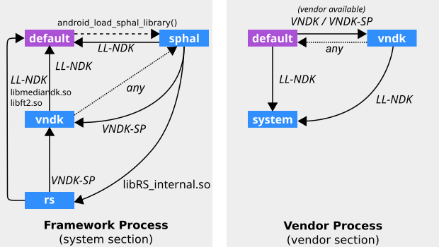

在上图中，LL-NDK 和 VNDK-SP 代表以下共享库：

- LL-NDK
  - `libEGL.so`
  - `libGLESv1_CM.so`
  - `libGLESv2.so`
  - `libGLESv3.so`
  - `libandroid_net.so`
  - `libc.so`
  - `libdl.so`
  - `liblog.so`
  - `libm.so`
  - `libnativewindow.so`
  - `libneuralnetworks.so`
  - `libsync.so`
  - `libvndksupport.so`
  - `libvulkan.so`
- VNDK-SP
  - `android.hardware.graphics.common@1.0.so`
  - `android.hardware.graphics.mapper@2.0.so`
  - `android.hardware.renderscript@1.0.so`
  - `android.hidl.memory@1.0.so`
  - `libRSCpuRef.so`
  - `libRSDriver.so`
  - `libRS_internal.so`
  - `libbase.so`
  - `libbcinfo.so`
  - `libc++.so`
  - `libcutils.so`
  - `libhardware.so`
  - `libhidlbase.so`
  - `libhidlmemory.so`
  - `libhidltransport.so`
  - `libhwbinder.so`
  - `libion.so`
  - `libutils.so`
  - `libz.so`

下表列出了框架进程的命名空间配置（摘自 `ld.config.txt` 中的 `[system]` 部分）：

| 命名空间                             | 属性                                                         | 值                                                           |
| :----------------------------------- | :----------------------------------------------------------- | :----------------------------------------------------------- |
| `default`                            | `search.paths`                                               | `/system/${LIB}` `/product/${LIB}`                           |
| `permitted.paths`                    | `/system/${LIB}/drm` `/system/${LIB}/extractors` `/system/${LIB}/hw` `/product/${LIB}` `/system/framework` `/system/app` `/system/priv-app` `/vendor/app` `/vendor/priv-app` `/odm/app` `/odm/priv-app` `/oem/app` `/product/framework` `/product/app` `/product/priv-app` `/data` `/mnt/expand` |                                                              |
| `isolated`                           | `true`                                                       |                                                              |
| `sphal`                              | `search.paths`                                               | `/odm/${LIB}` `/vendor/${LIB}`                               |
| `permitted.paths`                    | `/odm/${LIB}` `/vendor/${LIB}`                               |                                                              |
| `isolated`                           | `true`                                                       |                                                              |
| `visible`                            | `true`                                                       |                                                              |
| `links`                              | `default,vndk,rs`                                            |                                                              |
| `link.default.shared_libs`           | *LL-NDK*                                                     |                                                              |
| `link.vndk.shared_libs`              | *VNDK-SP*                                                    |                                                              |
| `link.rs.shared_libs`                | `libRS_internal.so`                                          |                                                              |
| `vndk`（适用于 VNDK-SP）             | `search.paths`                                               | `/odm/${LIB}/vndk-sp` `/vendor/${LIB}/vndk-sp` `/system/${LIB}/vndk-sp-${VER}` |
| `permitted.paths`                    | `/odm/${LIB}/hw` `/odm/${LIB}/egl` `/vendor/${LIB}/hw` `/vendor/${LIB}/egl` `/system/${LIB}/vndk-sp-${VER}/hw` |                                                              |
| `isolated`                           | `true`                                                       |                                                              |
| `visible`                            | `true`                                                       |                                                              |
| `links`                              | `default`、`sphal`                                           |                                                              |
| `link.default.shared_libs`           | *LL-NDK*                                                     |                                                              |
| `link.default.allow_all_shared_libs` | `true`                                                       |                                                              |
| `rs`（适用于 Renderscript）          | `search.paths`                                               | `/odm/${LIB}/vndk-sp` `/vendor/${LIB}/vndk-sp` `/system/${LIB}/vndk-sp-${VER}` `/odm/${LIB}` `/vendor/${LIB}` |
| `permitted.paths`                    | `/odm/${LIB}` `/vendor/${LIB}` `/data`（适用于已编译的 RS 内核） |                                                              |
| `isolated`                           | `true`                                                       |                                                              |
| `visible`                            | `true`                                                       |                                                              |
| `links`                              | `default,vndk`                                               |                                                              |
| `link.default.shared_libs`           | *LL-NDK* `libmediandk.so` `libft2.so`                        |                                                              |
| `link.vndk.shared_libs`              | *VNDK-SP*                                                    |                                                              |

下表列出了供应商进程的命名空间配置（摘自 `ld.config.txt` 中的 `[vendor]` 部分）：

| 命名空间                             | 属性                            | 值                                                           |
| :----------------------------------- | :------------------------------ | :----------------------------------------------------------- |
| `default`                            | `search.paths`                  | `/odm/${LIB}` `/vendor/${LIB}`                               |
| `permitted.paths`                    | `/odm` `/vendor`                |                                                              |
| `isolated`                           | `true`                          |                                                              |
| `visible`                            | `true`                          |                                                              |
| `links`                              | `system`、`vndk`                |                                                              |
| `link.system.shared_libs`            | *LL-NDK*                        |                                                              |
| `link.vndk.shared_libs`              | *VNDK*、*VNDK-SP*（供应商可用） |                                                              |
| `vndk`                               | `search.paths`                  | `/odm/${LIB}/vndk` `/odm/${LIB}/vndk-sp` `/vendor/${LIB}/vndk` `/vendor/${LIB}/vndk-sp` `/system/${LIB}/vndk-${VER}` `/system/${LIB}/vndk-sp-${VER}` |
| `isolated`                           | `true`                          |                                                              |
| `links`                              | `system`、`default`             |                                                              |
| `link.system.shared_libs`            | *LL-NDK*                        |                                                              |
| `link.default.allow_all_shared_libs` | `true`                          |                                                              |
| `system`                             | `search.paths`                  | `/system/${LIB}`                                             |
| `isolated`                           | `false`                         |                                                              |

更多详情请见 `${android-src}/system/core/rootdir/etc/ld.config.txt`。

#### ld.config.vndk_lite.txt

从 Android 8.0 开始，动态链接器将配置为隔离 SP-HAL 和 VNDK-SP 共享库，以使其符号不会与其他框架共享库发生冲突。链接器命名空间之间的关系如下所示：

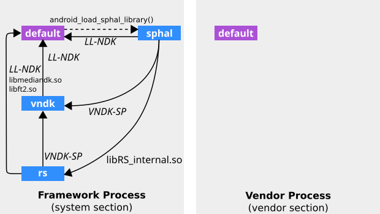

链接器命名空间隔离 (`ld.config.vndk_lite.txt`)

LL-NDK 和 VNDK-SP 代表以下共享库：

- LL-NDK
  - `libEGL.so`
  - `libGLESv1_CM.so`
  - `libGLESv2.so`
  - `libc.so`
  - `libdl.so`
  - `liblog.so`
  - `libm.so`
  - `libnativewindow.so`
  - `libstdc++.so`（不在 `ld.config.txt` 中）
  - `libsync.so`
  - `libvndksupport.so`
  - `libz.so`（已移到 `ld.config.txt` 中的 VNDK-SP）
- VNDK-SP
  - `android.hardware.graphics.common@1.0.so`
  - `android.hardware.graphics.mapper@2.0.so`
  - `android.hardware.renderscript@1.0.so`
  - `android.hidl.memory@1.0.so`
  - `libbase.so`
  - `libc++.so`
  - `libcutils.so`
  - `libhardware.so`
  - `libhidlbase.so`
  - `libhidlmemory.so`
  - `libhidltransport.so`
  - `libhwbinder.so`
  - `libion.so`
  - `libutils.so`

下表列出了框架进程的命名空间配置（摘自 `ld.config.vndk_lite.txt` 中的 `[system]` 部分）：

| 命名空间                    | 属性                                                         | 值                                                           |
| :-------------------------- | :----------------------------------------------------------- | :----------------------------------------------------------- |
| `default`                   | `search.paths`                                               | `/system/${LIB}` `/odm/${LIB}` `/vendor/${LIB}` `/product/${LIB}` |
| `isolated`                  | `false`                                                      |                                                              |
| `sphal`                     | `search.paths`                                               | `/odm/${LIB}` `/vendor/${LIB}`                               |
| `permitted.paths`           | `/odm/${LIB}` `/vendor/${LIB}`                               |                                                              |
| `isolated`                  | `true`                                                       |                                                              |
| `visible`                   | `true`                                                       |                                                              |
| `links`                     | `default,vndk,rs`                                            |                                                              |
| `link.default.shared_libs`  | *LL-NDK*                                                     |                                                              |
| `link.vndk.shared_libs`     | *VNDK-SP*                                                    |                                                              |
| `link.rs.shared_libs`       | `libRS_internal.so`                                          |                                                              |
| `vndk`（适用于 VNDK-SP）    | `search.paths`                                               | `/odm/${LIB}/vndk-sp` `/vendor/${LIB}/vndk-sp` `/system/${LIB}/vndk-sp-${VER}` |
| `permitted.paths`           | `/odm/${LIB}/hw` `/odm/${LIB}/egl` `/vendor/${LIB}/hw` `/vendor/${LIB}/egl` `/system/${LIB}/vndk-sp-${VER}/hw` |                                                              |
| `isolated`                  | `true`                                                       |                                                              |
| `visible`                   | `true`                                                       |                                                              |
| `links`                     | `default`                                                    |                                                              |
| `link.default.shared_libs`  | *LL-NDK*                                                     |                                                              |
| `rs`（适用于 Renderscript） | `search.paths`                                               | `/odm/${LIB}/vndk-sp` `/vendor/${LIB}/vndk-sp` `/system/${LIB}/vndk-sp-${VER}` `/odm/${LIB}` `/vendor/${LIB}` |
| `permitted.paths`           | `/odm/${LIB}` `/vendor/${LIB}` `/data`（适用于已编译的 RS 内核） |                                                              |
| `isolated`                  | `true`                                                       |                                                              |
| `visible`                   | `true`                                                       |                                                              |
| `links`                     | `default,vndk`                                               |                                                              |
| `link.default.shared_libs`  | *LL-NDK* `libmediandk.so` `libft2.so`                        |                                                              |
| `link.vndk.shared_libs`     | *VNDK-SP*                                                    |                                                              |

下表列出了供应商进程的命名空间配置（摘自 `ld.config.vndk_lite.txt` 中的 `[vendor]` 部分）：

| 命名空间   | 属性           | 值                                                           |
| :--------- | :------------- | :----------------------------------------------------------- |
| `default`  | `search.paths` | `/odm/${LIB}` `/odm/${LIB}/vndk` `/odm/${LIB}/vndk-sp` `/vendor/${LIB}` `/vendor/${LIB}/vndk` `/vendor/${LIB}/vndk-sp` `/system/${LIB}/vndk-${VER}` `/system/${LIB}/vndk-sp-${VER}` `/system/${LIB}`（已弃用） `/product/${LIB}`（已弃用） |
| `isolated` | `false`        |                                                              |

更多详情请见 `${android-src}/system/core/rootdir/etc/ld.config.vndk_lite.txt`。

### 文档历史记录

#### Android P 变更

-  Android P 中，`vndk` 链接器命名空间已添加到供应商进程，而且 VNDK 共享库已与默认链接器命名空间隔离开。

- 将 `PRODUCT_FULL_TREBLE` 替换为更具体的 `PRODUCT_TREBLE_LINKER_NAMESPACES`。

- Android P 更改了以下动态链接器配置文件的名称：

  | Android 8.x          | Android P               | 说明                                      |
  | :------------------- | :---------------------- | :---------------------------------------- |
  | ld.config.txt.in     | ld.config.txt           | 对于具有运行时链接器命名空间隔离的设备    |
  | ld.config.txt        | ld.config.vndk_lite.txt | 对于具有 VNDK-SP 链接器命名空间隔离的设备 |
  | ld.config.legacy.txt | ld.config.legacy.txt    | 对于搭载 Android 7.x 及更早版本的旧版设备 |

- 移除 `android.hardware.graphics.allocator@2.0.so`。

- 添加了 `product` 和 `odm` 分区。

## 目录，规则和sepolicy

本页面将介绍运行 Android 8.0 或更高版本系统的设备的目录布局，以及 VNDK 规则和关联的 sepolicy。

### 目录布局

退化目录布局由以下目录组成：

- `/system/lib[64]` 包含所有框架共享库，具体包括 LL-NDK、VNDK 和框架专用库（包括 LL-NDK-Private 和一些与 VNDK-SP 中的库同名的库）。
- `/system/lib[64]/vndk-sp` 包含适用于 Same-Process HAL 的 VNDK-SP 库。
- `/vendor/lib[64]` 包含供应商扩展的 VNDK 库（DXUA 库或 DXUX VNDK 库）、Same-Process HAL 实现，以及其他供应商共享库。
- `/vendor/lib[64]/vndk-sp` 可能包含供应商扩展的 VNDK-SP 库。

供应商模块从 `/system/lib[64]` 中加载 VNDK 库。

### VNDK 规则

本部分提供了完整的 VNDK 规则列表。

- 框架进程不得从供应商分区中加载非 SP-HAL 共享库（此规则从 Android 8.1 开始严格地强制实施）。
- 供应商进程不得从系统分区中加载非 LL-NDK 库、非 VNDK-SP 库和非 VNDK 库（Android O 中并未严格地强制实施此规则，但未来版本中会这么做）。
- **注意**：要想从未来版本（比 Android 8.0 更高的版本）仅针对框架的 OTA 中受益，就不得在搭载 Android 8.0 出厂的设备中违反此规则。

- 已安装的 VNDK 库必须是由 Google 定义的合格 VNDK 库的子集。
- SP-HAL 和 SP-HAL-Dep 的外部依赖项必须仅限于 LL-NDK 库或由 Google 定义的 VNDK-SP 库。
  - SP-HAL 共享库的依赖项必须仅限于 LL-NDK 库、由 Google 定义的 VNDK-SP 库、其他 SP-HAL 库和/或可标记为 SP-HAL-Dep 库的其他供应商共享库。
  - 只有当供应商共享库不是 AOSP 库，且其依赖项仅限于 LL-NDK 库、由 Google 定义的 VNDK-SP 库、SP-HAL 库和/或其他 SP-HAL-Dep 库时，才可标记为 SP-HAL-Dep 库。
- VNDK-SP 必须保持独立。在 Android 8.0 中，系统以一种特殊方式处理 `libRS_internal.so`，但在未来版本中，其处理方式会被重新考虑。
- 不得通过非 HIDL 接口（包括但不限于 Binder、套接字、共享内存、文件等）进行框架-供应商通信。
- 系统分区必须足够大，以便容纳所有符合条件的 VNDK 库的两个副本，以及不符合条件的框架共享库的一个副本。

### sepolicy

本部分中介绍的框架进程对应于 sepolicy 中的 `coredomain`，而供应商进程对应于 `non-coredomain`。例如，`/dev/binder` 只能在 `coredomain` 中被访问，而 `/dev/vndbinder` 只能在非 `coredomain` 中被访问。

类似政策会限制对系统分区和供应商分区上的共享库的访问。下表列出了访问不同类别的共享库时所需的权限：

| 类别                    | 分区   | 是否可从 coredomain 访问 | 是否可从 非 coredomain 访问 |
| :---------------------- | :----- | :----------------------- | :-------------------------- |
| LL-NDK                  | 系统   | 是                       | 是                          |
| LL-NDK-Private          | 系统   | 是                       | 是                          |
| VNDK-SP/VNDK-SP-Private | 系统   | 是                       | 是                          |
| VNDK-SP-Ext             | 供应商 | 是                       | 是                          |
| VNDK                    | 系统   | 是                       | 是                          |
| VNDK-Ext                | 供应商 | 否                       | 是                          |
| FWK-ONLY                | 系统   | 是                       | 否                          |
| FWK-ONLY-RS             | 系统   | 是                       | 否                          |
| SP-HAL                  | 供应商 | 是                       | 是                          |
| SP-HAL-Dep              | 供应商 | 是                       | 是                          |
| VND-ONLY                | 供应商 | 否                       | 是                          |

LL-NDK-Private 和 VNDK-SP-Private 必须从这两个域中都可访问，因为非 `coredomain` 会间接访问这些库。同样，SP-HAL-Dep 必须可从 `coredomain` 访问，因为 SP-HAL 依赖该域。

### `same_process_hal_file` 标签

供应商分区中包含下面几个库。确保这些库既可以从 `coredomain` 访问，又可以从非 `coredomain` 访问。

- VNDK-SP-Ext，位于 `/vendor/lib[64]/vndk-sp`
- SP-HAL，位于 `/vendor/lib[64]` 或 `/vendor/lib[64]/hw`
- SP-HAL-Dep，位于 `/vendor/lib[64]` 或 `/vendor/lib[64]/hw`

将这些文件明确标记为 `same_process_hal_file`。因为在默认情况下，从 `coredomain` 无法访问 `vendor` 分区中的任何内容。请向供应商特定的 `file_contexts` 文件中添加与以下命令行类似的命令行：

```
/vendor/lib(64)?/hw/libMySpHal\.so     u:object_r:same_process_hal_file:s0/vendor/lib(64)?/vndk-sp/libBase\.so    u:object_r:same_process_hal_file:s0/vendor/lib(64)?/libBaseInternal\.so    u:object_r:same_process_hal_file:s0
```

## 渲染脚本

RenderScript 是用于在 Android 上以高性能运行计算密集型任务的框架。RenderScript 专为数据并行计算而设计，不过串行工作负载也可以从中受益。RenderScript 运行时可以并行安排设备上可用的多个处理器（如多核 CPU 和 GPU）上的工作负载，使开发者能够专注于表达算法而不是调度工作。RenderScript 对于专注于图像处理、计算摄影或计算机视觉的应用来说尤其有用。

运行 Android 8.0 及更高版本的设备使用以下 RenderScript 框架和供应商 HAL：

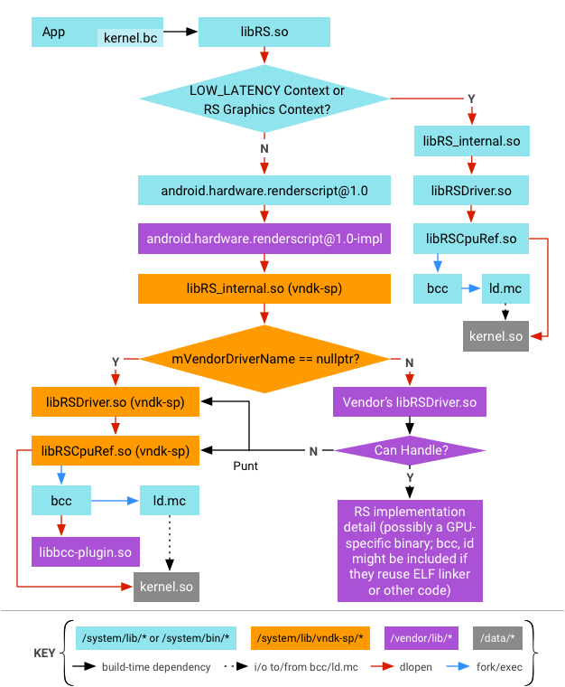

 与内部库相关联的供应商代码

与 Android 7.x 及更低版本中的 RenderScript 之间的区别包括：

- 一个进程中有两组 RenderScript 内部库的实例。一组用于 CPU 备用路径，直接来源于 `/system/lib`；另一组用于 GPU 路径，来源于 `/system/lib/vndk-sp`。
- `/system/lib` 中的 RS 内部库是作为平台的一部分构建的，会随着 `system.img` 的升级而更新。不过，`/system/lib/vndk-sp` 中的库是面向供应商构建的，不会随着 `system.img` 的升级而更新（虽然可以针对安全修复程序进行更新，但其 ABI 仍然保持不变）。
- 供应商代码（RS HAL、RS 驱动程序和 `bcc plugin`）与位于 `/system/lib/vndk-sp` 的 RenderScript 内部库相关联。它们无法与 `/system/lib` 中的库相关联，因为该目录中的库是面向平台构建的，可能与供应商代码不兼容（即，符号可能会被移除）。如此一来可能会导致仅针对框架的 OTA 无法实现。

有关详情，请参阅 developer.android.com 上的 [Renderscript](https://developer.android.com/guide/topics/renderscript/compute.html)。

### 设计

以下部分详细介绍了 Android 8.0 及更高版本中的 RenderScript 设计。

#### 供应商可使用的 RenderScript 库

本部分列出了向供应商代码开放且可与之关联的 RenderScript 库（称为供应商 NDK，适用于 Same-Process HAL 或 VNDK-SP）。此外，本部分还详细介绍了虽然与 RenderScript 无关但也已向供应商代码提供的其他库。

虽然以下库的列表可能会因 Android 版本而异，但对于特定的 Android 版本来说是不变的；有关可用库的最新列表，请参阅 `/system/etc/ld.config.txt`。

> **注意**：任何供应商代码都无法使用下面未列出的库；也就是说，供应商的 `bcc plugin` 无法使用 `libLLVM.so`，因为以下列表中不包含该库。

#### RenderScript 库

- `android.hardware.graphics.renderscript@1.0.so`
- `libRS_internal.so`
- `libRSCpuRef.so`
- `libblas.so`
- `libbcinfo.so`
- `libcompiler_rt.so`
- `libRSDriver.so`

#### 非 RenderScript 库

- `libc.so`
- `libm.so`
- `libdl.so`
- `libstdc++.so`
- `liblog.so`
- `libnativewindow.so`
- `libsync.so`
- `libvndksupport.so`
- `libbase.so`
- `libc++.so`
- `libcutils.so`
- `libutils.so`
- `libhardware.so`
- `libhidlbase.so`
- `libhidltransport.so`
- `libhwbinder.so`
- `liblzma.so`
- `libz.so`
- `libEGL.so`
- `libGLESv1_CM.so`
- `libGLESv2.so`

#### 链接器命名空间配置

系统会在运行时使用链接器命名空间，强制实施关联限制，阻止供应商代码使用 VNDK-SP 中未包含的库（有关详情，请参阅 [VNDK 设计](https://source.android.com/devices/architecture/images/VNDK.pdf)演示文稿）。

在运行 Android 8.0 或更高版本的设备上，除 RenderScript 之外的所有 Same-Process HAL (SP-HA) 都会在链接器命名空间 `sphal` 中加载。RenderScript 将被加载到 RenderScript 专用的命名空间 `rs` 中，该位置对 RenderScript 库的限制稍微宽松些。由于 RS 实现需要加载编译后的位码，因此系统会将 `/data/*/*.so` 添加到 `rs` 命名空间的路径中（不允许其他 SP-HAL 从该数据分区加载库）。

此外，`rs` 命名空间所允许的库要比其他命名空间提供的库多。`libmediandk.so` 和 `libft2.so` 将可用于 `rs` 命名空间，因为 `libRS_internal.so` 有一个对这些库的内部依赖项。

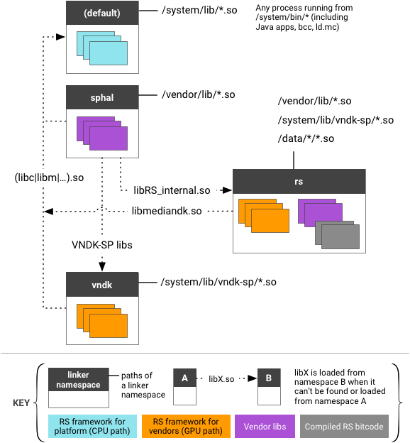

### 加载驱动程序

#### CPU 备用路径

根据在创建 RS 上下文时是否存在 `RS_CONTEXT_LOW_LATENCY` 位，可以选择 CPU 或 GPU 路径。选择 CPU 路径时，系统会直接从默认链接器命名空间（提供了 RS 库的平台版本）对 `libRS_internal.so`（RS 框架的主要实现）执行 `dlopen` 处理。

采用 CPU 备用路径时，系统根本不会使用来自供应商的 RS HAL 实现，而是通过空的 `mVendorDriverName` 创建一个 `RsContext` 对象。系统会对 `libRSDriver.so` 执行 `dlopen` 处理（默认情况下），且驱动程序库会从 `default` 名称空间加载，因为调用程序 (`libRS_internal.so`) 也会在 `default` 命名空间中加载。

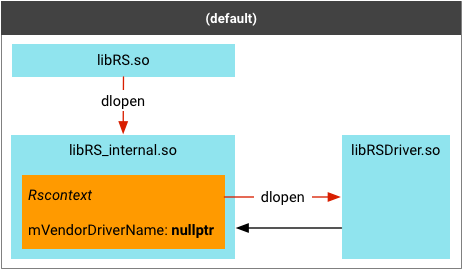

#### GPU 路径

对于 GPU 路径来说，系统会通过不同的方式加载 `libRS_internal.so`。首先，`libRS.so` 使用 `android.hardware.renderscript@1.0.so`（及其底层的 `libhidltransport.so`）将 `android.hardware.renderscript@1.0-impl.so`（一种 RS HAL 的供应商实现）加载到一个不同的链接器命名空间（名称为 `sphal`）。然后，RS HAL 在另一个名称为 `rs` 的链接器命名空间中对 `libRS_internal.so` 执行 `dlopen` 处理。

供应商可以通过设置编译时标记 `OVERRIDE_RS_DRIVER` 来提供自己的 RS 驱动程序，该标记嵌入在 RS HAL 实现 (`hardware/interfaces/renderscript/1.0/default/Context.cpp`) 中。然后，系统会在 GPU 路径的 RS 上下文中对该驱动程序名称执行 `dlopen` 处理。

`RsContext` 对象的创建被委派给 RS HAL 实现。HAL 使用 `rsContextCreateVendor()` 函数（并将驱动程序的名称用作参数）来回调 RS 框架。然后，RS 框架会在 `RsContext` 进行初始化时加载指定的驱动程序。在这种情况下，驱动程序库会加载到 `rs` 命名空间中，因为 `RsContext` 对象是在 `rs` 命名空间内创建的，而且 `/vendor/lib` 位于该命名空间的搜索路径中。

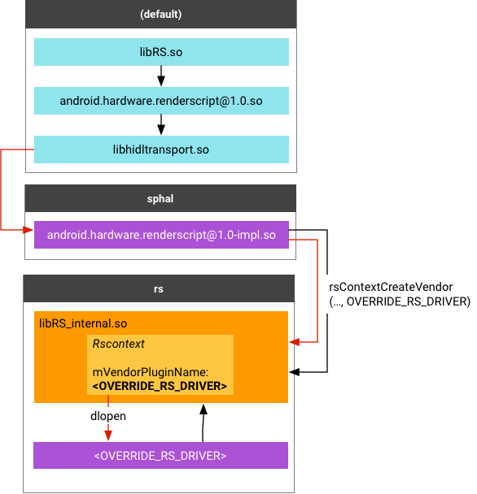

GPU 备用路径

从 `default` 命名空间转换为 `sphal` 命名空间时，`libhidltransport.so` 使用 `android_load_sphal_library()` 函数来明确指示动态链接器从 `sphal` 命名空间加载 `-impl.so` 库。

从 `sphal` 命名空间转换为 `rs` 命名空间时，加载由 `/system/etc/ld.config.txt` 中的以下行间接完成：

```
namespace.sphal.link.rs.shared_libs = libRS_internal.so
```

此行指定了以下规则：如果无法从 `sphal` 命名空间找到/加载目标库（这种情况一直会出现，因为 `sphal` 命名空间不会搜索 `libRS_internal.so` 所在的 `/system/lib/vndk-sp`），动态链接器应该从 `rs` 命名空间加载 `libRS_internal.so`。借助此配置，对 `libRS_internal.so` 进行简单的 `dlopen()` 调用就足以实现命名空间转换。

#### 加载 bcc 插件

`bcc plugin` 是由供应商提供的加载到 `bcc` 编译器中的库。由于 `bcc` 是 `/system/bin` 目录中的系统进程，因此 `bcc plugin` 可以被视为 SP-HAL（即，可以直接加载到系统进程中而无需 Binder 化的供应商 HAL）。作为 SP-HAL，`bcc-plugin` 库具有以下特点：

- 无法与框架专用库（如 `libLLVM.so`）相关联。
- 只能与面向供应商的 VNDK-SP 库相关联。

此限制是通过使用 `android_sphal_load_library()` 函数将 `bcc plugin` 加载到 `sphal` 命名空间来强制实施的。在之前的 Android 版本中，插件名称是使用 `-load` 选项指定的，而库是由 `libLLVM.so` 使用简单的 `dlopen()` 加载的。在 Android 8.0 及更高版本中，该名称在 `-plugin` 选项中指定，而库则直接由 `bcc` 本身加载。此选项可使开放源代码 LLVM 项目支持非 Android 专用路径。

加载 bcc 插件 - Android 7.x 及更低版本

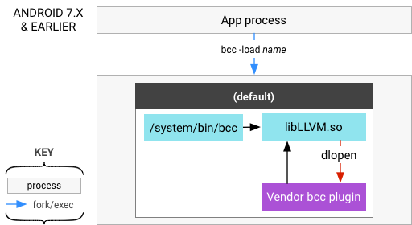

加载 bcc 插件 - Android 8.0 及更高版本

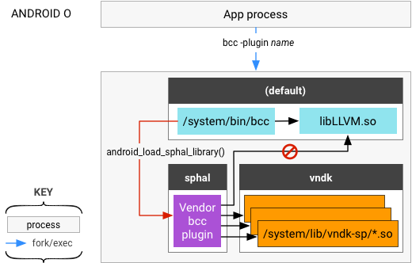

#### ld.mc 的搜索路径

在执行 `ld.mc` 时，系统会将某些 RS 运行时库作为输入提供给链接器。来自应用的 RS 位码会与运行时库相关联，当转换后的位码被加载到某个应用进程中时，会再次与运行时库动态关联。

运行时库包括：

- `libcompiler_rt.so`
- `libm.so`
- `libc.so`
- RS 驱动程序（`libRSDriver.so` 或 `OVERRIDE_RS_DRIVER`）

在将编译后的位码加载到应用进程中时，请提供与 `ld.mc` 所使用的完全相同的库。否则，编译后的位码可能无法找到它被关联时可供使用的那个符号。

为此，RS 框架在执行 `ld.mc` 时会针对运行时库使用不同的搜索路径，具体取决于 RS 框架本身是从 `/system/lib` 中还是 `/system/lib/vndk-sp` 中加载的。通过读取 RS 框架库的任意符号的地址，并使用 `dladdr()` 获取映射到该地址的文件路径，可以确定 RS 框架的加载位置。

#### SELinux 政策

由于 Android 8.0 及更高版本中的 SELinux 政策发生了变化，您在 `neverallows` 分区中标记额外的文件时必须遵循特定规则（通过 `vendor` 强制实施）：

- `vendor_file` 必须是 `vendor` 分区中所有文件的默认标签。平台政策要求使用此标签来访问直通式 HAL 实现。
- 通过供应商 SEPolicy 在 `vendor` 分区中添加的所有新 `exec_types` 均必须具有 `vendor_file_type` 属性。这一规则将通过 `neverallows` 强制实施。
- 为了避免与将来的平台/框架更新发生冲突，请避免在 `vendor` 分区中标记除 `exec_types` 之外的文件。
- AOSP 标识的 Same-Process HAL 的所有库依赖项均必须标记为 `same_process_hal_file`。

要详细了解 SELinux 政策，请参阅 [Android 中的安全增强型 Linux](https://source.android.com/security/selinux)。

#### 位码的 ABI 兼容性

如果没有添加新的 API（意味着无 HAL 版本递增），RS 框架将继续使用现有的 GPU (HAL 1.0) 驱动程序。

对于不会影响位码的 HAL 小更改 (HAL 1.1)，RS 框架应该回退到 CPU 以支持这些新添加的 API，并在其他地方继续使用 GPU (HAL 1.0) 驱动程序。

对于会影响位码编译/关联的 HAL 大更改 (HAL 2.0)，RS 框架应选择不加载供应商提供的 GPU 驱动程序，而是使用 CPU 或 Vulkan 路径以实现加速。

RenderScript 位码的使用发生在以下三个阶段：

| 阶段   | 详细信息                                                     |
| :----- | :----------------------------------------------------------- |
| *编译* | `bcc` 的输入位码 (.bc) 的格式必须是 `LLVM 3.2`，且 `bcc` 必须向后兼容现有的（旧版）应用。不过，.bc 中的元数据可能会发生变化（可能会有新的运行时函数，例如分配设置器和获取器、数学函数等）。部分运行时函数位于 `libclcore.bc` 中，部分位于 LibRSDriver 或供应商同类驱动程序中。对于新运行时函数或重大元数据更改，必须递增位码 API 级别。HAL 版本也必须递增，否则供应商驱动程序将无法使用它。供应商可能有自己的编译器，不过针对 `bcc` 的总结/要求也适用于这些编译器。 |
| *链接* | 编译后的 .o 将与供应商驱动程序相关联，例如 `libRSDriver_foo.so` 和 `libcompiler_rt.so`。CPU 路径将与 `libRSDriver.so` 相关联。如果 .o 需要来自 `libRSDriver_foo` 的新运行时 API，则供应商驱动程序必须进行更新，以便为其提供支持。某些供应商可能有自己的链接器，不过适用于 `ld.mc` 的参数也适用于这些链接器。 |
| *加载* | `libRSCpuRef` 会加载共享对象。如果此接口发生更改，则需要递增 HAL 版本。供应商可以依赖 `libRSCpuRef` 加载共享对象，也可以实现自己的对象。 |

除了 HAL 之外，运行时 API 和导出的符号也是接口。从 Android 7.0 (API 24) 开始，这两种接口均未发生更改，目前也没有在 Android 8.0 及更高版本中对其做出更改的计划。但是，如果接口发生更改，HAL 版本也会进行递增。

### 供应商实现

Android 8.0 及更高版本需要对 GPU 驱动程序做出一些更改，以便 GPU 驱动程序能够正常运行。

#### 驱动程序模块

- 驱动程序模块不得依赖[此列表](https://source.android.com/devices/architecture/vndk/renderscript#renderscript-libs-available-to-vendors)中未包含的任何系统库。
- 驱动程序必须提供自己的 `android.hardware.renderscript@1.0-impl_{NAME}`，或者将默认实现 `android.hardware.renderscript@1.0-impl` 声明为其依赖项。
- CPU 实现 `libRSDriver.so` 就是关于如何移除非 VNDK-SP 依赖项的一个很好的例子。

#### 位码编译器

您可以通过以下两种方式为供应商驱动程序编译 RenderScript 位码：

1. 在 `/vendor/bin/` 中调用供应商专用的 RenderScript 编译器（GPU 编译的首选方法）。与其他驱动程序模块类似，供应商编译器二进制文件不能依赖[面向供应商的 RenderScript 库](https://source.android.com/devices/architecture/vndk/renderscript#renderscript-libs-available-to-vendors)列表中未包含的任何系统库。
2. 使用供应商提供的 `bcc plugin` 调用系统 bcc：`/system/bin/bcc`；此插件不能依赖[面向供应商的 RenderScript 库](https://source.android.com/devices/architecture/vndk/renderscript#renderscript-libs-available-to-vendors)列表中未包含的任何系统库。

如果供应商 `bcc plugin` 需要干预 CPU 编译，并且它对 `libLLVM.so` 的依赖无法轻松解除，那么供应商应将 `bcc`（以及包括 `libLLVM.so` 和 `libbcc.so` 在内的所有非 LL-NDK 依赖项）复制到 `/vendor` 分区。

此外，供应商还需要做出以下更改：

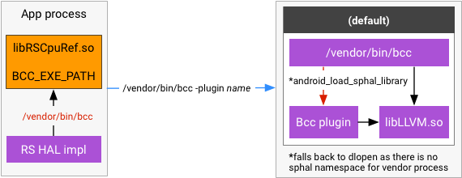

供应商驱动程序更改

1. 将 `libclcore.bc` 复制到 `/vendor` 分区。这样可以确保 `libclcore.bc`、`libLLVM.so` 和 `libbcc.so` 保持同步。
2. 在 RS HAL 实现中设置 `RsdCpuScriptImpl::BCC_EXE_PATH` 来更改 `bcc` 可执行文件的路径。

> **注意**：对 `/vendor/bin/*` 进程的限制并未完全实现。从理论上讲，可以只将 `bcc` 复制到 `/vendor/bin/` 而不复制其依赖项，但并不建议您这样做。

#### SELinux 政策

SELinux 政策会影响驱动程序和编译器可执行文件。所有驱动程序模块必须在设备的 `file_contexts` 中标记为 `same_process_hal_file`。例如：

```
/vendor/lib(64)?/libRSDriver_EXAMPLE\.so     u:object_r:same_process_hal_file:s0
```

编译器可执行文件必须能够由应用进程调用，bcc 的供应商副本 (`/vendor/bin/bcc`) 也是如此。例如：

```
device/vendor_foo/device_bar/sepolicy/file_contexts:
/vendor/bin/bcc                    u:object_r:same_process_hal_file:s0
```

#### 旧版设备

旧版设备是指满足以下条件的设备：

1. PRODUCT_SHIPPING_API_LEVEL 低于 26。
2. PRODUCT_FULL_TREBLE_OVERRIDE 未定义。

将旧版设备的系统升级到 Android 8.0 及更高版本时，不会强制执行这些限制，这意味着驱动程序可以继续与 `/system/lib[64]` 中的库相关联。不过，由于与 `OVERRIDE_RS_DRIVER` 相关的架构变更，您必须将 `android.hardware.renderscript@1.0-impl` 安装到 `/vendor` 分区；如果无法做到这一点，RenderScript 运行时会被强制回退到 CPU 路径。

## ABI 稳定性

应用二进制接口 (ABI) 稳定性是进行仅针对框架的更新的前提条件，因为供应商模块可能依赖于系统分区中的供应商原生开发套件 (VNDK) 共享库。新编译的 VNDK 共享库必须与之前发布的 VNDK 共享库保持 ABI 兼容性，以便供应商模块可以与这些库协同工作，而无需重新编译，也不会出现运行时错误。

为了确保实现 ABI 兼容性，Android 9 中添加了一个标头 ABI 检查工具，下文会对该工具进行介绍。

### 关于 VNDK 和 ABI 合规性

VNDK 是供应商模块可以关联到的一组受限库，用于实现仅针对框架的更新。ABI 合规性是指较新版本的共享库能够按预期与动态关联到它的模块协同工作（即像较旧版本的共享库那样正常工作）。

#### 关于导出的符号

导出的符号（也称为全局符号）是指满足以下所有条件的符号：

- 通过共享库的公开标头导出。
- 显示在与共享库对应的 `.so` 文件的 `.dynsym` 表中。
- 具有 WEAK 或 GLOBAL 绑定。
- 可见性为 DEFAULT 或 PROTECTED。
- 区块索引不是 UNDEFINED。
- 类型为 FUNC 或 OBJECT。

共享库的公开头文件是指通过以下属性提供给其他库/二进制文件使用的头文件：`export_include_dirs`、`export_header_lib_headers`、`export_static_lib_headers`、`export_shared_lib_headers` 和 `export_generated_headers` 属性（位于与共享库对应的模块的 `Android.bp` 定义中）。

#### 关于可到达类型

可到达类型是指可通过导出的符号直接或间接到达并且是通过公开标头导出的任何 C/C++ 内置类型或用户定义的类型。例如，`libfoo.so` 具有函数 `Foo`，该函数是一个导出的符合，可在 `.dynsym` 表中找到。`libfoo.so` 库包含以下内容：

##### foo_exported.h

```c
typedef struct foo_private foo_private_t;

typedef struct foo {
  int m1;
  int *m2;
  foo_private_t *mPfoo;
} foo_t;

typedef struct bar {
  foo_t mfoo;
} bar_t;

bool Foo(int id, bar_t *bar_ptr);
```

##### foo.private.h

```c
typedef struct foo_private {
  int m1;
  float mbar;
} foo_private_t;
```

##### Android.bp

```makefile
cc_library {
  name : libfoo,
  vendor_available: true,
  vndk {
    enabled : true,
  }
  srcs : ["src/*.cpp"],
  export_include_dirs : [
    "include"
  ],
}
```

| .dynsym 表 |         |        |        |        |       |       |                |
| :--------- | ------- | ------ | ------ | ------ | ----- | ----- | -------------- |
| `Num`      | `Value` | `Size` | `Type` | `Bind` | `Vis` | `Ndx` | `Name`         |
| `1`        | `0`     | `0`    | `FUNC` | `GLOB` | `DEF` | `UND` | `dlerror@libc` |
| `2`        | `1ce0`  | `20`   | `FUNC` | `GLOB` | `DEF` | `12`  | `Foo`          |

以 `Foo` 为例，直接/间接可到达类型包括：

| 类型      | 说明                                                         |
| :-------- | :----------------------------------------------------------- |
| `bool`    | `Foo` 的返回值类型。                                         |
| `int`     | 第一个 `Foo` 参数的类型。                                    |
| `bar_t *` | 第二个 Foo 参数的类型。`bar_t` 是经由 `bar_t *` 通过 `foo_exported.h` 导出的。  `bar_t` 包含类型 `foo_t`（通过 `foo_exported.h` 导出）的一个成员 `mfoo`，这会导致导出更多类型：`int :` 是 `m1` 的类型。`int * :` 是 `m2` 的类型。`foo_private_t * : `是 `mPfoo` 的类型。 不过，`foo_private_t` 不是可到达类型，因为它不是通过 `foo_exported.h` 导出的。（`foot_private_t *` 不透明，因此系统允许对 `foo_private_t` 进行更改）。 |

对于可通过基类指定符和模板参数到达的类型，也可给出类似解释。

### 确保 ABI 合规性

对于在对应的 `Android.bp` 文件中标有 `vendor_available: true` 和 `vndk.enabled: true` 的库，必须确保其 ABI 合规性。例如：

```c
cc_library {
    name: "libvndk_example",
    vendor_available: true,
    vndk: {
        enabled: true,
    }
}
```

对于可通过导出的函数直接或间接到达的数据类型，对库进行以下更改会破坏 ABI 合规性：

#### 数据类型

* 结构和类
  * 更改类类型或结构类型的大小。
  * 基类
    * 添加或移除基类。
    * 添加或移除虚拟继承的基类。
    * 更改基类的顺序。
  * 成员函数
    - 移除成员函数*。
    - 将参数添加到成员函数或从中移除参数。
    - 更改成员函数的参数类型或返回类型*。
    - 更改虚表布局。
  * 数据成员
    - 移除静态数据成员。
    - 添加或移除非静态数据成员。
    - 更改数据成员的类型。
    - 将偏移量更改为非静态数据成员**。
    - 更改数据成员的 `const`、`volatile` 和/或 `restricted` 限定符***。
    - 对数据成员的访问权限说明符进行降级***。
  * 更改模板参数。

* 联合
  * 添加或移除数据成员。
  * 更改联合类型的大小。
  * 更改数据成员的类型。
  * 更改数据成员的顺序。
* 枚举
  - 更改基础类型。
  - 更改枚举器的名称。
  - 更改枚举器的值。
* 全局符号
  * 移除通过公开头文件导出的符号。
  * 对于类型 FUNC 的全局符号
    - 添加或移除参数。
    - 更改参数类型。
    - 更改返回类型。
    - 对访问权限说明符进行降级***。
  * 对于类型 OBJECT 的全局符号
    - 更改相应的 C/C++ 类型。
    - 对访问权限说明符进行降级***。

***** 不得更改或移除公共和私有成员函数，因为公共内联函数可以引用私有成员函数。私有成员函数的符号引用可保存在调用程序二进制文件中。从共享库更改或移除私有成员函数会导致二进制文件向后不兼容。

***\*** 不得更改公共或私有数据成员的偏移量，因为内联函数可以在其函数主体中引用这些数据成员。更改数据成员偏移量会导致二进制文件向后不兼容。

***\**** 虽然这些操作不会更改类型的内存布局，但它们之间存在语义差异，可能导致库无法按预期正常运行。

### 使用 ABI 合规性工具

编译 VNDK 库时，系统会将其 ABI 与所编译 VNDK 的版本对应的 ABI 参考进行比较。参考 ABI 转储位于以下位置：

```bash
${ANDROID_BUILD_TOP}/prebuilts/abi-dumps/(v)ndk/<${PLATFORM_VNDK_VERSION}>/<BINDER_BITNESS>/<ARCH_ARCH-VARIANT>/source-based
```

例如，在为 VNDK 的 API 级别 27 编译 `libfoo` 时，系统会将 `libfoo` 的推断 ABI 与其参考进行比较，该参考位于以下位置：

```bash
${ANDROID_BUILD_TOP}/prebuilts/abi-dumps/(v)ndk/27/64/<ARCH_ARCH-VARIANT>/source-based/libfoo.so.lsdump
```

#### ABI 损坏错误

当 ABI 损坏时，编译日志会显示警告，其中包含警告类型以及 abi-diff 报告所在的路径。例如，如果 `libbinder` 的 ABI 有不兼容的更改，则编译系统会抛出错误，并显示类似以下的消息：

```bash
*****************************************************
error: VNDK library: libbinder.so's ABI has INCOMPATIBLE CHANGES
Please check compatibility report at:
out/soong/.intermediates/frameworks/native/libs/binder/libbinder/android_arm64_armv8-a_cortex-a73_vendor_shared/libbinder.so.abidiff
******************************************************
---- Please update abi references by running
platform/development/vndk/tools/header-checker/utils/create_reference_dumps.py -l libbinder ----
```

#### 编译 VNDK 库时进行的 ABI 检查

编译 VNDK 库时：

1. `header-abi-dumper` 会处理为了编译 VNDK 库（库本身的源文件以及通过静态传递依赖项沿用的源文件）而编译的源文件，以生成与各个源文件对应的 `.sdump` 文件。

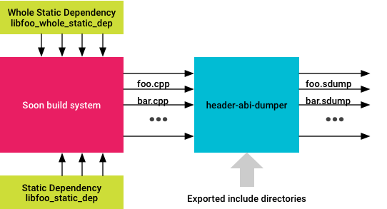

2. 然后，`header-abi-linker` 会处理 `.sdump` 文件（使用提供给它的版本脚本或与共享库对应的 `.so` 文件），以生成 `.lsdump` 文件，该文件用于记录与共享库对应的所有 ABI 信息。

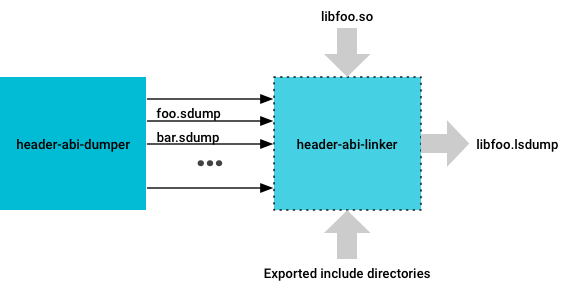`header-abi-diff` 会将 3. `.lsdump` 文件与参考 `.lsdump` 文件进行比较，以生成差异报告，该报告中会简要说明两个库的 ABI 之间存在的差异。

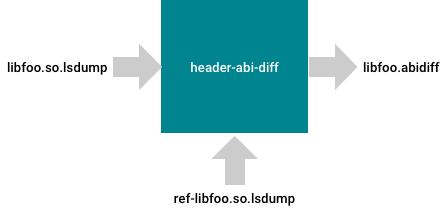

#### header-abi-dumper

`header-abi-dumper` 工具会解析 C/C++ 源文件，并将从该源文件推断出的 ABI 转储到一个中间文件。编译系统会对所有已编译的源文件运行 `header-abi-dumper`，同时还会建立一个库，其中包含来自传递依赖项的源文件。

目前，`.sdump` 文件采用 [Protobuf TextFormatted](https://developers.google.com/protocol-buffers/docs/reference/java/com/google/protobuf/TextFormat) 格式，我们无法保证该格式在未来版本中仍保持稳定。因此，`.sdump` 文件格式化应被视为编译系统的实现细节。

例如，`libfoo.so` 具有以下源文件 **`foo.cpp`**：

```c
#include <stdio.h>
#include <foo_exported.h>

bool Foo(int id, bar_t *bar_ptr) {
    if (id > 0 && bar_ptr->mfoo.m1 > 0) {
        return true;
    }
    return false;
}
```

您可以使用 `header-abi-dumper` 生成中间 `.sdump` 文件，该文件代表源文件使用以下命令提供的 ABI：

```bash
$ header-abi-dumper foo.cpp -I exported -o foo.sdump -- -x c++
```

该命令指示 `header-abi-dumper` 解析 `foo.cpp` 并发出 ABI 信息（显示在 `exported` 目录内的公开头文件中）。下面是 `header-abi-dumper` 生成的 **`foo.sdump`** 中的一部分（并非完整表示）：

```properties
record_types {
  type_info {
    name: "foo"
    size: 12
    alignment: 4
    referenced_type: "type-1"
    source_file: "foo/include/foo_exported.h"
    linker_set_key: "foo"
    self_type: "type-1"
  }
  fields {
    referenced_type: "type-2"
    field_offset: 0
    field_name: "m1"
    access: public_access
  }
  fields {
    referenced_type: "type-3"
    field_offset: 32
    field_name: "m2"
    access: public_access
  }
  fields {
    referenced_type: "type-5"
    field_offset: 64
    field_name: "mPfoo"
    access: public_access
  }
  access: public_access
  record_kind: struct_kind
  tag_info {
    unique_id: "_ZTS3foo"
  }
}
record_types {
  type_info {
    name: "bar"
    size: 12
    alignment: 4
    referenced_type: "type-6"
…
pointer_types {
  type_info {
    name: "bar *"
    size: 4
    alignment: 4
    referenced_type: "type-6"
    source_file: "foo/include/foo_exported.h"
    linker_set_key: "bar *"
    self_type: "type-8"
  }
}
builtin_types {
  type_info {
    name: "int"
    size: 4
    alignment: 4
    referenced_type: "type-2"
    source_file: ""
    linker_set_key: "int"
    self_type: "type-2"
  }
  is_unsigned: false
  is_integral: true
}
functions {
  return_type: "type-7"
  function_name: "Foo"
  source_file: "foo/include/foo_exported.h"
  parameters {
    referenced_type: "type-2"
    default_arg: false
  }
  parameters {
    referenced_type: "type-8"
    default_arg: false
  }
  linker_set_key: "_Z3FooiP3bar"
  access: public_access
}
```

`foo.sdump` 包含源文件 `foo.cpp` 提供的 ABI 信息，例如：

- `record_types`：指通过公开标头提供的结构、联合或类。每个记录类型都包含其字段、大小、访问权限指定符、所在标头文件等相关信息。
- `pointer_types`：指通过公开标头提供的记录/函数直接/间接引用的指针类型，以及指针指向的类型（通过 `type_info` 中的 `referenced_type` 字段）。对于限定类型、内置 C/C++ 类型、数组类型以及左值和右值参考类型（有关类型的此类记录信息允许递归差异），系统会在 `.sdump` 文件中记录类似信息。
- `functions`：表示通过公开标头提供的函数。它们还包含函数的重整名称、返回值类型、参数类型、访问权限指定符等相关信息。

> **提示**：要获取 `header-abi-dumper` 工具方面的帮助，请运行 `header-abi-dumper --help`。

#### header-abi-linker

`header-abi-linker` 工具会将 `header-abi-dumper` 生成的中间文件作为输入，然后关联以下文件：

| 输入 | `header-abi-dumper` 生成的中间文件<br>版本脚本/映射文件（可选）<br/>共享库的 .so 文件 |
| :--- | ------------------------------------------------------------ |
| 输出 | 用于记录共享库 ABI 的文件（例如，`libfoo.so.lsdump `表示 `libfoo` 的 ABI）。 |

该工具会将收到的所有中间文件中的类型图合并在一起，并会将不同转换单元之间的单一定义（完全限定名称相同的不同转换单元中由用户定义的类型可能在语义上有所不同）差异考虑在内。然后，该工具会解析版本脚本或解析共享库的 `.dynsym` 表（`.so` 文件），以创建导出符号列表。

例如，当 `libfoo` 将 `bar.cpp` 文件（用于提供 C 函数 `bar`）添加到其编译时，系统可能会调用 `header-abi-linker`，以创建 `libfoo` 的完整关联 ABI 转储，如下所示：

```bash
header-abi-linker -I exported foo.sdump bar.sdump \
                  -o libfoo.so.lsdump \
                  -so libfoo.so \
                  -arch arm64 -api current
```

**`libfoo.so.lsdump`** 中的命令输出示例：

```properties
record_types {
  type_info {
    name: "foo"
    size: 24
    alignment: 8
    referenced_type: "type-1"
    source_file: "foo/include/foo_exported.h"
    linker_set_key: "foo"
    self_type: "type-1"
  }
  fields {
    referenced_type: "type-2"
    field_offset: 0
    field_name: "m1"
    access: public_access
  }
  fields {
    referenced_type: "type-3"
    field_offset: 64
    field_name: "m2"
    access: public_access
  }
  fields {
    referenced_type: "type-4"
    field_offset: 128
    field_name: "mPfoo"
    access: public_access
  }
  access: public_access
  record_kind: struct_kind
  tag_info {
    unique_id: "_ZTS3foo"
  }
}
record_types {
  type_info {
    name: "bar"
    size: 24
    alignment: 8
...
builtin_types {
  type_info {
    name: "void"
    size: 0
    alignment: 0
    referenced_type: "type-6"
    source_file: ""
    linker_set_key: "void"
    self_type: "type-6"
  }
  is_unsigned: false
  is_integral: false
}
functions {
  return_type: "type-19"
  function_name: "Foo"
  source_file: "foo/include/foo_exported.h"
  parameters {
    referenced_type: "type-2"
    default_arg: false
  }
  parameters {
    referenced_type: "type-20"
    default_arg: false
  }
  linker_set_key: "_Z3FooiP3bar"
  access: public_access
}
functions {
  return_type: "type-6"
  function_name: "FooBad"
  source_file: "foo/include/foo_exported_bad.h"
  parameters {
    referenced_type: "type-2"
    default_arg: false
  }
parameters {
    referenced_type: "type-7"
    default_arg: false
  }
  linker_set_key: "_Z6FooBadiP3foo"
  access: public_access
}
elf_functions {
  name: "_Z3FooiP3bar"
}
elf_functions {
  name: "_Z6FooBadiP3foo"
}
```

`header-abi-linker` 工具将执行以下操作：

- 关联收到的 `.sdump` 文件（`foo.sdump` 和 `bar.sdump`），滤除位于 `exported` 目录的标头中不存在的 ABI 信息。
- 解析 `libfoo.so`，然后通过其 `.dynsym` 表收集通过库导出的符号的相关信息。
- 添加 `_Z3FooiP3bar` 和 `Bar`。

`libfoo.so.lsdump` 是最终生成的 `libfoo.so` ABI 转储。

> **提示**：要获取 `header-abi-linker` 工具方面的帮助，请运行 `header-abi-linker --help`。

#### header-abi-diff

`header-abi-diff` 工具会将代表两个库的 ABI 的两个 `.lsdump` 文件进行比较，并生成差异报告，其中会说明这两个 ABI 之间存在的差异。

| 输入 | 表示旧共享库的 ABI 的 `.lsdump` 文件。表示新共享库的 ABI 的 `.lsdump` 文件。 |
| :--- | ------------------------------------------------------------ |
| 输出 | 差异报告，其中会说明在比较两个共享库提供的 ABI 之后发现的差异。 |

ABI 差异文件会尽可能详细且便于读懂。格式在未来版本中可能会发生变化。例如，您有两个版本的 `libfoo`：`libfoo_old.so` 和 `libfoo_new.so`。在 `libfoo_new.so` 中的 `bar_t` 内，您将 `mfoo` 的类型从 `foo_t` 更改为 `foo_t *`。由于 `bar_t` 是直接可到达类型，因此这应该由 `header-abi-diff` 标记为会破坏 ABI 的更改。

要运行 `header-abi-diff`，请执行以下命令：

```bash
header-abi-diff -old libfoo_old.so.lsdump \
                -new libfoo_new.so.lsdump \
                -arch arm64 \
                -o libfoo.so.abidiff \
                -lib libfoo
```

**`libfoo.so.abidiff`** 中的命令输出示例：

```properties
lib_name: "libfoo"
arch: "arm64"
record_type_diffs {
  name: "bar"
  type_stack: "Foo-> bar *->bar "
  type_info_diff {
    old_type_info {
      size: 24
      alignment: 8
    }
    new_type_info {
      size: 8
      alignment: 8
    }
  }
  fields_diff {
    old_field {
      referenced_type: "foo"
      field_offset: 0
      field_name: "mfoo"
      access: public_access
    }
    new_field {
      referenced_type: "foo *"
      field_offset: 0
      field_name: "mfoo"
      access: public_access
    }
  }
}
```

`libfoo.so.abidiff` 包含一个报告，其中会注明 `libfoo` 中所有会破坏 ABI 的更改。`record_type_diffs` 消息表示记录发生了更改，并会列出不兼容的更改，其中包括：

- 记录大小从 `24` 个字节更改为 `8` 个字节。
- `mfoo` 的字段类型从 `foo` 更改为 `foo *`（去除了所有类型定义符）。

`type_stack` 字段用于指示 `header-abi-diff` 如何到达已更改的类型 (`bar`)。该字段可作如下解释：`Foo` 是一个导出的函数，接受 `bar *` 作为参数，该参数指向已导出且发生变化的 `bar`。

> **提示**：要获取 `header-abi-diff` 工具方面的帮助，请运行 `header-abi-diff --help`。您也可以参阅 `development/vndk/tools/header-checker/README.md`。

### 强制执行 ABI/API

要强制执行 VNDK 和 LLNDK 共享库的 ABI/API，必须将 ABI 参考签入到 `${ANDROID_BUILD_TOP}/prebuilts/abi-dumps/(v)ndk/` 中。要创建这些参考，请运行以下命令：

```bash
${ANDROID_BUILD_TOP}/development/vndk/tools/header-checker/utils/create_reference_dumps.py
```

创建参考后，如果对源代码所做的任何更改导致 VNDK 或 LLNDK 库中出现不兼容的 ABI/API 更改，则这些更改现在会导致编译错误。

要更新特定 VNDK 核心库的 ABI 参考，请运行以下命令：

```bash
${ANDROID_BUILD_TOP}/development/vndk/tools/header-checker/utils/create_reference_dumps.py -l <lib1> -l <lib2>
```

例如，要更新 `libbinder` ABI 参考，请运行以下命令：

```bash
${ANDROID_BUILD_TOP}/development/vndk/tools/header-checker/utils/create_reference_dumps.py -l libbinder
```

要更新特定 LLNDK 库的 ABI 参考，请运行以下命令：

```bash
${ANDROID_BUILD_TOP}/development/vndk/tools/header-checker/utils/create_reference_dumps.py -l <lib1> -l <lib2> --llndk
```

例如，要更新 `libm` ABI 参考，请运行以下命令：

```bash
${ANDROID_BUILD_TOP}/development/vndk/tools/header-checker/utils/create_reference_du
```

## 预编译ABI使用情况检查工具

Android 共享库会不时改进。使预编译二进制文件保持最新状态需要投入大量的努力。在 Android 9 或更早版本中，依赖于已移除的库或 ABI 的预编译二进制文件仅在运行时无法成功关联。开发者必须跟踪日志以查找过时的预编译二进制文件。Android 10 中引入了基于符号的 ABI 使用情况检查工具。该检查工具可以在编译时检测过时的预编译二进制文件，以便共享库开发者了解哪些预编译二进制文件可能会因更改而遭到破坏，以及哪些预编译二进制文件必须重新编译。

### 基于符号的 ABI 使用情况检查工具

基于符号的 ABI 使用情况检查工具可模拟主机上的 Android 动态链接器。该检查工具会将预编译的二进制文件与预编译的二进制文件的依赖项关联起来，并检查是否所有未定义符号均已解析。

首先，检查工具会检查预编译二进制文件的目标架构。如果预编译的二进制文件不以 ARM、AArch64、x86 或 x86-64 架构为目标，则检查工具将跳过该预编译二进制文件。

其次，必须在 `LOCAL_SHARED_LIBRARIES` 或 `shared_libs` 中列出预编译二进制文件的依赖项。编译系统会将模块名称解析为共享库的匹配变体（即 `core` 与 `vendor`）。

第三，检查工具会将 `DT_NEEDED` 条目与 `LOCAL_SHARED_LIBRARIES` 或 `shared_libs` 进行比较。尤其是，该检查工具会从每个共享库中提取 `DT_SONAME` 条目，并将这些 `DT_SONAME` 与预编译二进制文件中记录的 `DT_NEEDED` 条目进行比较。如果存在不匹配，则系统会发出错误消息。

第四，该检查工具会解析预编译二进制文件中未定义的符号。这些未定义的符号必须在一个依赖项中进行定义，并且符号绑定必须为 `GLOBAL` 或 `WEAK`。如果无法解析某个未定义的符号，则平台会发出错误消息。

### 预编译模块属性

必须在以下一项中指定预编译二进制文件的依赖项：

- Android.bp：`shared_libs: ["libc", "libdl", "libm"],`
- Android.mk：`LOCAL_SHARED_LIBRARIES := libc libdl libm`

如果预编译二进制文件具有一些**无法解析的未定义符号**，请指定以下内容之一：

- Android.bp：`allow_undefined_symbols: true,`
- Android.mk：`LOCAL_ALLOW_UNDEFINED_SYMBOLS := true`

要使预编译二进制文件跳过 ELF 文件检查，请指定以下内容之一：

- Android.bp：`check_elf_files: false,`
- Android.mk：`LOCAL_CHECK_ELF_FILES := false`

### 运行检查工具

要运行检查工具，请将环境变量 `CHECK_ELF_FILES` 设置为 `true`，并运行 `make check-elf-files`：

```
CHECK_ELF_FILES=true make check-elf-files
```

要默认启用检查工具，请将 `PRODUCT_CHECK_ELF_FILES` 添加到 `BoardConfig.mk`：

```
PRODUCT_CHECK_ELF_FILES := true
```

在 Android 的编译过程中会对预编译自动进行检查：

```
make
```