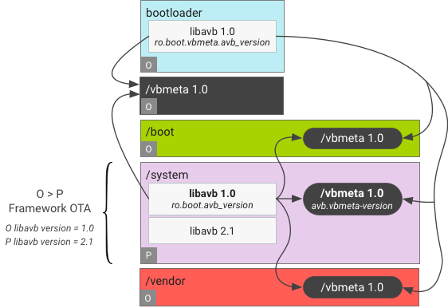

供应商接口对象

介绍供应商接口对象（VINTF 对象）的设计，该对象用于汇总设备的相关信息并通过可查询的 API 提供该信息。

## 概览

### VINTF 对象设计

VINTF 对象直接从设备中收集所需的一些信息。其他信息（如清单）以 XML 格式静态描述。


VINTF 对象设计为设备和框架组件提供以下内容：

| 对于设备                                                     | 对于框架                                                     |
| :----------------------------------------------------------- | :----------------------------------------------------------- |
| 定义静态组件（[设备清单文件](https://source.android.com/devices/architecture/vintf/objects#device-manifest-file)）的结构。添加构建时支持，以便定义给定设备的设备清单文件。在运行时定义相应[可查询的 API](https://source.android.com/devices/architecture/vintf/objects#queryable-api)，以用于检索设备清单文件（以及其他可在运行时收集的信息）并将其打包到查询结果中。 | 定义静态组件（[框架清单文件](https://source.android.com/devices/architecture/vintf/objects#framework-manifest-file)）的结构。在运行时定义相应[可查询的 API](https://source.android.com/devices/architecture/vintf/objects#queryable-api)，以用于检索框架清单文件并将其打包到查询结果中。 |

无论何时请求，VINTF 对象都必须稳定可靠且能提供相同的完整信息（请见[注意事项](https://source.android.com/devices/architecture/vintf/resources#caveats)）。

### 清单和矩阵

从 Android 8.0 开始，运行时 API 会查询设备上的内容并将该信息发送到[无线下载 (OTA)](https://source.android.com/devices/tech/ota) 更新服务器以及其他相关方（例如 CTS `DeviceInfo`）。有些信息会在运行时进行检索，而有些信息则是静态定义的信息。

- **设备清单**描述了设备可以为框架提供的静态组件。
- **框架兼容性矩阵**描述了 Android 框架从给定设备中期待获取的内容。此矩阵是一个静态实体，在开发下一个版本的 Android 框架期间会手动确定此矩阵的组成。
- **框架清单**描述了框架可以为设备提供的高级服务。
- **设备兼容性矩阵**描述了供应商映像需要框架提供的服务，在设备开发期间会手动确定此矩阵的组成。

这两对清单和矩阵必须在 OTA 时进行协调，以确保设备可以获取与设备功能兼容的框架更新。一般来说，清单描述了提供的内容，兼容性矩阵描述了需要的内容。

本部分包含有关清单和矩阵的以下详细信息：

- [清单](https://source.android.com/devices/architecture/vintf/objects)定义了设备清单、框架清单和清单文件架构。
- [兼容性矩阵](https://source.android.com/devices/architecture/vintf/comp-matrices)定义了兼容性矩阵的架构。
- [FCM 生命周期](https://source.android.com/devices/architecture/vintf/fcm)详细说明了如何弃用和移除 HIDL HAL 以及如何修改 FCM 文件以反映 HAL 版本的状态。
- [制定设备清单](https://source.android.com/devices/architecture/vintf/dm)描述了供应商如何在设备清单中为新设备定义和声明目标 FCM 版本，或如何在升级旧设备的供应商映像时实现新的 HAL 版本并递增目标 FCM 版本。
- [匹配规则](https://source.android.com/devices/architecture/vintf/match-rules)定义了兼容性矩阵与清单之间成功匹配的规则。

## 清单

VINTF 对象会在[运行时](https://source.android.com/devices/architecture/vintf/objects#runtime-data)汇总[设备清单](https://source.android.com/devices/architecture/vintf/objects#device-manifest-file)和[框架清单](https://source.android.com/devices/architecture/vintf/objects#framework-manifest-file)文件 (XML) 中的数据以及设备本身的数据。这两个清单采用同一种格式，不过并非所有元素都适用于两者（有关架构方面的详细信息，请参阅[清单文件架构](https://source.android.com/devices/architecture/vintf/objects#manifest-file-schema)）。

### 设备清单

设备清单（由设备提供）包含供应商清单和 ODM 清单。

- 供应商清单会指定 SoC 通用的 HAL、VNDK 版本等信息。建议将其放置在 Android 源代码树的 `device/VENDOR/DEVICE/manifest.xml` 中，但可以使用多个 Fragment 文件。有关详情，请参阅[从 Fragment 生成设备清单](https://source.android.com/devices/architecture/vintf/resources#manifest-fragments)。

- ODM 清单列出了产品专用的 HAL。VINTF 对象会按以下顺序加载 ODM 清单：

  1. `/odm/etc/vintf/manifest_SKU.xml`（如果定义了 `SKU`，其中 `SKU` 是属性 `ro.boot.product.hardware.sku` 的值）
  2. `/odm/etc/vintf/manifest.xml`
  3. `/odm/etc/manifest_SKU.xml`（如果定义了 `SKU`）
  4. `/odm/etc/manifest.xml`

- VINTF 对象会按以下顺序加载设备清单：

  1. 如果存在`/vendor/etc/vintf/manifest.xml`, 则合并以下内容：
     1. `/vendor/etc/vintf/manifest.xml`
     2. 可选的供应商清单 Fragment
     3. 可选的 ODM 清单
     4. 可选的 ODM 清单 Fragment
  2. 否则，如果存在 ODM 清单，则将 ODM 清单与可选的 ODM 清单 Fragment 合并在一起。
  3. `/vendor/manifest.xml`（旧版，无 Fragment）请注意：

  - 在旧版设备上，使用旧版供应商清单和 ODM 清单。ODM 清单可能会完全覆盖旧版供应商清单。
  - 在搭载 Android 9 的设备上，ODM 清单会与供应商清单合并。
  - 合并清单列表时，列表中后出现的清单可能会覆盖列表中先出现的清单中的标记，但前提是后出现的清单中的标记具有 `override="true"` 属性。例如，ODM 清单可能会覆盖供应商清单中的某些 `` 标记。请参阅以下属性 `override` 的文档。

此设置可让采用相同开发板的多个产品共用同一个供应商映像（用于提供通用 HAL），但具有不同的 ODM 映像（用于指定产品专用的 HAL）。

下面是一个示例供应商清单。

```xml
<?xml version="1.0" encoding="UTF-8"?>
<!-- Comments, Legal notices, etc. here -->
<manifest version="1.0" type="device" target-level="1">
    <hal>
        <name>android.hardware.camera</name>
        <transport>hwbinder</transport>
        <version>3.4</version>
        <interface>
            <name>ICameraProvider</name>
            <instance>legacy/0</instance>
            <instance>proprietary/0</instance>
        </interface>
    </hal>
    <hal>
        <name>android.hardware.nfc</name>
        <transport>hwbinder</transport>
        <version>1.0</version>
        <version>2.0</version>
        <interface>
            <name>INfc</name>
            <instance>nfc_nci</instance>
        </interface>
    </hal>
    <hal>
        <name>android.hardware.nfc</name>
        <transport>hwbinder</transport>
        <version>2.0</version>
        <interface>
            <name>INfc</name>
            <instance>default</instance>
        </interface>
    </hal>
    <hal>
        <name>android.hardware.drm</name>
        <transport>hwbinder</transport>
        <version>1.0</version>
        <interface>
            <name>ICryptoFactory</name>
            <instance>default</instance>
        </interface>
        <interface>
            <name>IDrmFactory</name>
            <instance>default</instance>
        </interface>
        <fqname>@1.1::ICryptoFactory/clearkey</fqname>
        <fqname>@1.1::IDrmFactory/clearkey</fqname>
    </hal>
    <hal format="native">
        <name>EGL</name>
        <version>1.1</version>
    </hal>
    <hal format="native">
        <name>GLES</name>
        <version>1.1</version>
        <version>2.0</version>
        <version>3.0</version>
    </hal>
    <sepolicy>
        <version>25.0</version>
    </sepolicy>
</manifest>
```

下面是一个示例 ODM 清单。

```xml
<?xml version="1.0" encoding="UTF-8"?>
<!-- Comments, Legal notices, etc. here -->
<manifest version="1.0" type="device">
    <!-- camera 3.4 in vendor manifest is ignored -->
    <hal override="true">
        <name>android.hardware.camera</name>
        <transport>hwbinder</transport>
        <version>3.5</version>
        <interface>
            <name>ICameraProvider</name>
            <instance>legacy/0</instance>
        </interface>
    </hal>
    <!-- NFC is declared to be disabled -->
    <hal override="true">
        <name>android.hardware.nfc</name>
        <transport>hwbinder</transport>
    </hal>
    <hal>
        <name>android.hardware.power</name>
        <transport>hwbinder</transport>
        <version>1.1</version>
        <interface>
            <name>IPower</name>
            <instance>default</instance>
        </interface>
    </hal>
</manifest>
```

下面是 OTA 软件包中的一个示例设备清单。

```xml
<?xml version="1.0" encoding="UTF-8"?>
<!-- Comments, Legal notices, etc. here -->
<manifest version="1.0" type="device" target-level="1">
    <!-- hals ommited -->
    <kernel version="4.4.176">
        <config>
            <key>CONFIG_ANDROID</key>
            <value>y</value>
        </config>
        <config>
            <key>CONFIG_ARM64</key>
            <value>y</value>
        </config>
    <!-- other configs ommited -->
    </kernel>
</manifest>
```

要了解更多详情，请参阅[设备清单开发](https://source.android.com/devices/architecture/vintf/dm)。

### 框架清单

框架清单文件（由 Google 提供）是手动生成的，位于 Android 源代码树的 `/system/libhidl/manifest.xml` 中。

下面是一个示例框架清单。

```xml
<?xml version="1.0" encoding="UTF-8"?>
<!-- Comments, Legal notices, etc. here -->
<manifest version="1.0" type="framework">
    <hal>
        <name>android.hidl.allocator</name>
        <transport>hwbinder</transport>
        <version>1.0</version>
        <interface>
            <name>IAllocator</name>
            <instance>ashmem</instance>
        </interface>
    </hal>
    <hal>
        <name>android.hidl.memory</name>
        <transport arch="32+64">passthrough</transport>
        <version>1.0</version>
        <interface>
            <name>IMapper</name>
            <instance>ashmem</instance>
        </interface>
    </hal>
    <hal>
        <name>android.hidl.manager</name>
        <transport>hwbinder</transport>
        <version>1.0</version>
        <interface>
            <name>IServiceManager</name>
            <instance>default</instance>
        </interface>
    </hal>
    <hal>
        <name>android.frameworks.sensorservice</name>
        <transport>hwbinder</transport>
        <version>1.0</version>
        <interface>
            <name>ISensorManager</name>
            <instance>default</instance>
        </interface>
    </hal>
    <vendor-ndk>
        <version>27</version>
    </vendor-ndk>
    <system-sdk>
        <version>27</version>
    </system-sdk>
</manifest>
```

### 清单 Fragment

在 Android 10 及更高版本中，您可以在构建系统中将清单条目与 HAL 模块相关联。这有助于在构建系统中有条件地包含 HAL 模块。

示例

在您的 `Android.bp` 或 `Android.mk` 文件中，将 `vintf_fragments` 添加到任意模块。例如，您可以修改实现了 HAL 的模块 (`my.package.foo@1.0-service-bar`)。

```protobuf
... {
    ...
    vintf_fragments: ["manifest_foo.xml"],
    ...
}
```

```properties
LOCAL_MODULE := ...
LOCAL_VINTF_FRAGMENTS := manifest_foo.xml
```

在名为 `manifest_foo.xml` 的文件中，为此模块创建清单。在构建时，此清单会添加到设备中。在此处添加条目与在设备的主清单中添加条目相同。这样，客户端就可以使用该接口，并允许 VTS 识别设备上的 HAL 实现。此清单会执行常规清单执行的任何操作。

下面的示例实现了安装到 `vendor` 分区的 `android.hardware.foo@1.0::IFoo/default`。如果安装到 `system` 分区，则改为使用 `framework` 类型，而不是 `device` 类型。

```xml
<manifest version="1.0" type="device">
    <hal format="hidl">
        <name>android.hardware.foo</name>
        <transport>hwbinder</transport>
        <version>1.0</version>
        <interface>
            <name>IFoo</name>
            <instance>default</instance>
        </interface>
    </hal>
</manifest>
```

### 清单文件架构

这一部分介绍了下列 XML 标记的含义。某些“必需”的标记可以在构建时由 `assemble_vintf` 写入，因此不一定要包含在 Android 源代码树中的源文件中。设备上的相应文件中必须有“必需”标记。

- `?xml`

  可选。只向 XML 解析器提供信息。

- `manifest.version`

  必需。**该**清单的元版本。描述该清单中应该存在的元素。与 XML 版本无关。

- `manifest.type`

  必需。该清单的类型。对于设备清单文件，其值为 `device`；对于框架清单文件，其值为`framework`。

- `manifest.target-level`

  对于设备清单而言是必需的。用于指定相应设备清单要兼容的框架兼容性矩阵 (FCM) 版本，也称为设备的 Shipping FCM 版本。

- `manifest.hal`

  可选且可重复。单个 HAL（HIDL 或本机，如 GL），具体取决于 `format` 属性。

- `manifest.hal.format`

  可选。值可以是：`hidl`：HIDL HAL。这是默认值。`native`：本机 HAL。

- `manifest.hal.override`

  可选。值可以是：`true`：覆盖其他具有相同 `` 和 Major 版本的 `` 元素。如果此 `` 元素中没有 `` 或 ``，则 `` 元素会声明此 HAL 将被停用。`false`：不覆盖其他具有相同 `` 和 Major 版本的 `` 元素。

- `manifest.hal.name`

  必需。HAL 的完全限定软件包名称。多个 HAL 条目可以使用相同的名称。示例：`android.hardware.camera` (HIDL HAL)`GLES`（本机 HAL，只需提供名称）

- `manifest.hal.transport`

  `manifest.hal.format == "hidl"` 时需要。在其他情况下，则不得存在。指明从服务管理器查询来自该软件包的接口时使用什么传输模式。值可以是：`hwbinder`：绑定模式`passthrough`：直通模式

- `manifest.hal.transport.arch`

  对于 `passthrough` 是必需的，对于 `hwbinder` 不得存在。描述正在提供的直通服务的位数。值可以是：`32`：32 位模式`64`：64 位模式`32+64`：两者

- `manifest.hal.version`

  可选且可重复。清单中 `hal` 标记的版本。格式为 `MAJOR.MINOR`。有关示例，请参阅 `hardware/interfaces`、`vendor/${VENDOR}/interfaces`、`framework/hardware/interfaces` 或 `system/hardware/interfaces`。  HIDL 和本机 HAL 可以使用多个版本字段，前提是它们代表**不同的 Major 版本**，并且提供的每个 Major 版本只有一个 Minor 版本。例如，3.1 和 3.2 不能共存，但 1.0 和 3.4 可以共存。这适用于所有同名的 `hal` 元素，除非 `override="true"`。

- `manifest.hal.interface`

  必需，可以在不重名的情况下重复。指明软件包中具有实例名称的接口。一个 `` 中可以有多个 `` 元素，但名称必须不同。

- `manifest.hal.interface.name`

  必需。接口的名称。

- `manifest.hal.interface.instance`

  必需且可重复。接口的实例名称。一个接口可以有多个实例，但不能有重复的 `` 元素。

- `manifest.hal.fqname`

  可选且可重复。为名称是 `manifest.hal.name` 的 HAL 指定实例的另一种方法。格式为 `@MAJOR.MINOR::INTERFACE/INSTANCE`。对于从 Android 8.x 升级的设备，此标记不可用于声明兼容性矩阵所需的实例。

- `manifest.sepolicy`

  必需。包含所有与 sepolicy 相关的条目。

- `manifest.sepolicy.version`

  对于设备清单而言是必需的。声明 SELinux 版本。格式为 `SDK_INT.PLAT_INT`。

- `manifest.vendor-ndk`

  必需且可重复；对于框架清单而言是必需的。不得出现在设备清单中。多个 `` 条目必须具有不同的 ``。用于描述框架提供的一组 VNDK 快照。

- `manifest.vendor-ndk.version`

  必需。一个正整数，表示 VNDK 快照的版本。

- `manifest.vendor-ndk.library`

  可选，可以在不重名的情况下重复。用于描述框架为此 VNDK 供应商快照提供的一组 VNDK 库。值是库的文件名，例如 `libjpeg.so`，包含前缀 `lib` 和后缀 `.so`。不允许添加路径组件。

- `manifest.system-sdk.version`

  可选，可以在不重名的情况下重复；仅供框架清单使用。用于描述框架为供应商应用提供的一组系统 SDK 版本。

- `manifest.kernel`

  可选。仅存在于 OTA 软件包元数据内的设备清单中。用于描述有关 OTA 软件包中内核的信息。此信息不存在于运行设备上的设备清单中，因为 VINTF 对象从内核接口提取内核信息。有关详情，请参阅[在 OTA 期间强制执行内核要求](https://source.android.com/devices/architecture/vintf/dm#ota-kernel-q)。

- `manifest.kernel.version`

  必需属性（如果存在 ``）。用于描述 OTA 软件包中的内核版本。

- `manifest.kernel.config`

  可选，可以在不重名的情况下重复。用于描述 OTA 软件包中的内核配置。

- `manifest.kernel.config.key`

  必需（如果存在 ``）。用于描述配置的键。

- `manifest.kernel.config.value`

  必需（如果存在 ``）。用于描述配置的值。

## 兼容性矩阵

介绍框架和设备兼容性矩阵以及[兼容性矩阵结构](https://source.android.com/devices/architecture/vintf/comp-matrices#compatibility-matrix-schema)。有关匹配规则，请参见[匹配规则](https://source.android.com/devices/architecture/vintf/match-rules)一文。

### 框架兼容性矩阵 (FCM)

框架兼容性矩阵说明了框架对运行它的设备的要求。矩阵文件与 Android 框架映像（位于 `system.img` 中）相关联。FCM 的要求应通过设备清单来满足（在启动和 OTA 时会强制执行相应要求）。

示例 FCM 文件：

```xml
<?xml version="1.0" encoding="UTF-8"?>
<!-- Comments, Legal notices, etc. here -->
<compatibility-matrix version="1.0" type="framework" level="3">
    <hal>
        <name>android.hardware.camera</name>
        <version>1.0</version>
        <version>3.1-4</version>
        <interface>
            <name>ICameraProvider</name>
            <instance>default</instance>
            <regex-instance>[a-z_]+/[0-9]+</regex-instance>
        </interface>
    </hal>
    <hal>
        <name>android.hardware.nfc</name>
        <version>1.0</version>
        <interface>
            <name>INfc</name>
            <instance>default</instance>
        </interface>
    </hal>
    <hal optional="true">
        <name>android.hardware.graphics.composer</name>
        <version>2.1</version>
    </hal>
    <hal format="native">
        <name>GL</name>
        <version>1.1</version>
        <version>3.0</version>
    </hal>
    <hal format="native">
        <name>EGL</name>
        <version>1.1</version>
    </hal>
    <kernel version="3.18.51">
        <!-- common configs -->
    </kernel>
    <kernel version="3.18.51">
        <!-- arm specific configs -->
        <condition>
            <config>
                <key>CONFIG_ARM</key>
                <value type="tristate">y</value>
            </config>
        <condition>
        <config>
            <key>CONFIG_A</key>
            <value type="string"></value>
        </config>
        <config>
            <key>CONFIG_B</key>
            <value type="tristate">y</value>
        </config>
    </kernel>
    <kernel version="4.1.22">
        <!-- common configs -->
        <config>
            <key>CONFIG_A</key>
            <value type="string">foo</value>
        </config>
        <config>
            <key>CONFIG_B2</key>
            <value type="int">1024</value>
        </config>
    </kernel>
    <sepolicy>
        <kernel-sepolicy-version>30</kernel-sepolicy-version>
        <sepolicy-version>25.0</sepolicy-version>
        <sepolicy-version>26.0-3</sepolicy-version>
    </sepolicy>
    <avb>
        <vbmeta-version>2.1</vbmeta-version>
    </avb>
    <xmlfile format="dtd">
        <name>media_profile</name>
        <version>1.0</version>
        <path>/system/etc/media_profile_V1_0.dtd</path>
    </xmlfile>
</compatibility-matrix>
```

有关详情，请参阅 [FCM 生命周期](https://source.android.com/devices/architecture/vintf/fcm)。

### 产品兼容性矩阵

产品 FCM 是产品分区中的框架兼容性矩阵文件。VINTF 对象在运行时会将产品 FCM 与系统分区中的 FCM 连接起来。

产品 FCM 是对设备专属 FCM（安装在系统分区中）的补充。设备 FCM 应反映系统分区中各模块的要求，而产品 FCM 应反映产品分区中各模块的要求。两者都应与原始设备制造商 (OEM) 对系统分区和产品分区中框架的修改保持一致。

例如，如果安装在产品分区中的应用使用某个 HAL 接口的供应商扩展，则应在产品 FCM 中声明该 HAL 接口的要求。

产品 FCM 文件示例：

```xml
<?xml version="1.0" encoding="UTF-8"?>
<!-- Comments, Legal notices, etc. here -->
<compatibility-matrix version="1.0" type="framework">
    <hal>
        <name>vendor.foo.camera</name>
        <version>1.0</version>
        <interface>
            <name>IBetterCamera</name>
            <instance>default</instance>
        </interface>
    </hal>
</compatibility-matrix> 
```

### 设备兼容性矩阵 (DCM)

设备兼容性矩阵说明了设备期望框架满足的一组要求（在启动和 OTA 时会强制执行相应要求）。

示例 DCM 文件：

```xml
<?xml version="1.0" encoding="UTF-8"?>
<!-- Comments, Legal notices, etc. here -->
<compatibility-matrix version="1.0" type="device">
    <hal>
        <name>android.hidl.manager</name>
        <version>1.0</version>
        <interface>
            <name>IServiceManager</name>
            <instance>default</instance>
        </interface>
    </hal>
    <hal>
        <name>android.hidl.memory</name>
        <version>1.0</version>
        <interface>
            <name>IMemory</name>
            <instance>ashmem</instance>
        </interface>
    </hal>
    <hal>
        <name>android.hidl.allocator</name>
        <version>1.0</version>
        <interface>
            <name>IAllocator</name>
            <instance>ashmem</instance>
        </interface>
    </hal>
    <hal>
        <name>android.framework.sensor</name>
        <version>1.0</version>
        <interface>
            <name>ISensorManager</name>
            <instance>default</instance>
        </interface>
    </hal>
    <vendor-ndk>
        <version>27</version>
    </vendor-ndk>
    <system-sdk>
        <version>27</version>
    </system-sdk>
</compatibility-matrix>
```

### 兼容性矩阵结构

这一部分介绍了下列 XML 标记的含义。Android 源代码树中的源文件可能会缺少某些“必需”的标记，这些标记可以在编译时由 `assemble_vintf` 写入。设备上的相应文件中必须有“必需”标记。

- `?xml`

  可选。它只向 XML 解析器提供信息。

- `compatibility-matrix.version`

  必需。此兼容性矩阵的元版本。描述兼容性矩阵中预期的元素。与 XML 版本无关。

- `compatibility-matrix.type`

  必需。该兼容性矩阵的类型：`"device"`：设备兼容性矩阵。`"framework"`：框架兼容性矩阵。

- `manifest.level`

  框架兼容性矩阵的必需标记。指定此文件的框架兼容性矩阵版本（FCM 版本）。不应在设备对应的框架兼容性矩阵（即 `DEVICE_FRAMEWORK_COMPATIBILITY_MATRIX_FILE`）中声明。

- `compatibility-matrix.hal`

  可选且可重复。列出兼容性矩阵（框架或设备）的所有者要求存在的单个 HAL（HIDL 或本机）。HAL 条目通过 `` 元素来区分，可以有多个同名的 HAL 条目（暗示“和”条件）。

- `compatibility-matrix.hal.format`

  可选。值可以是以下几项之一：`"hidl"`：HIDL HAL。这是默认值。`"native"`：本机 HAL。

- `compatibility-matrix.hal.optional`

  此属性是可选的，默认值为 false。指明该 HAL 对兼容性矩阵（框架或设备）的所有者来说是否为可选。如果将 `` 条目标记为可选，则表示在存在的情况下所有者可以使用该 HAL，但并非是必须存在。

- `compatibility-matrix.hal.name`

  必需。该 HAL 的完整软件包名称。示例：`android.hardware.camera` (HIDL HAL)`GLES`（本机 HAL，只需提供名称）

- `compatibility-matrix.hal.version`

  必需，可以在不重名的情况下重复。版本范围的列表（请参见 [HAL 匹配](https://source.android.com/devices/architecture/vintf/match-rules#hals)一节），用于定义兼容性矩阵（框架或设备）的所有者期望的版本。

- `compatibility-matrix.hal.interface`

  可选且可重复。该 HAL 的必需接口的列表。

- `compatibility-matrix.hal.interface.name`

  必需。接口的名称。

- `compatibility-matrix.hal.interface.instance`

  可选且可重复。该接口的必需实例的列表。

- `compatibility-matrix.hal.interface.regex-instance`

  可选且可重复。该接口上的必需实例名称模式的列表。使用[扩展正则表达式](http://man7.org/linux/man-pages/man7/regex.7.html)格式。

- `compatibility-matrix.kernel`

  可选且可重复。指定框架在每个内核版本上必需的内核配置的列表。 可以存在具有同一 `` 的多个 ``，暗含着“and”（与）的关系。每个 `` 都是需求的一个“片段”，相应需求只有在满足 `` 时才会得到支持。

- `compatibility-matrix.kernel.version`

  必需。内核版本。格式为 `VERSION.MAJOR_REVISION.MINOR_REVISION`。版本和主要修订版本必须完全匹配。次要修订版本定义框架期望的内核的最低 LTS 版本。

- `compatibility-matrix.kernel.condition`

  可选。对于每个版本的第一个 ``，必须不存在。指定了条件列表。只有满足条件时才会支持此 `` 片段中声明的需求。

- `compatibility-matrix.kernel.config`

  可选且可重复。列出该内核版本必须匹配的 `CONFIG` 项。每个 `CONFIG` 项是一个键值对，配置项通过键来区分。

- `compatibility-matrix.kernel.config.key`

  必需。`CONFIG` 项的键名称。以 `CONFIG_` 开头。

- `compatibility-matrix.kernel.config.value`

  必需。`CONFIG` 项的值。格式视类型而定：`string`：省略了引号。`int`：接受十进制和十六进制值（必须以 `0x` 或 `0X)` 开头）。解释为 64 位整数，溢出部分会被截断。（解析器接受从 -264 + 1 到 264 - 1 的值，会在第 65 位截断；有关详情，请参阅 [strtoull 手册页](http://man7.org/linux/man-pages/man3/strtoul.3.html)。）`range`：格式为 `[int]-[int]`，例如 `10-20`。接受十六进制值且值必须以 `0x` 或 `0X` 开头。两个边界必须是无符号的 64 位整数。`tristate`：有效值为 `y`、`m` 和 `n`。

- `compatibility-matrix.kernel.config.value.type`

  必需。`CONFIG` 项的值的类型，应该是以下几项之一：`string``int``range``tristate`

- `compatibility-matrix.sepolicy`

  必需。包含所有与 sepolicy 相关的条目。仅供框架兼容性矩阵使用。

- `compatibility-matrix.sepolicy.sepolicy-version`

  必需且可重复。描述对 sepolicy 版本的需求。与 `manifest.sepolicy.version` 相对应。元素的每个实例定义一系列 sepolicy 版本。

- `compatibility-matrix.sepolicy.kernel-sepolicy-version`

  必需。声明框架支持的 `policydb` 版本。

- `compatibility-matrix.avb.vbmeta-version`

  可选，仅供框架兼容性矩阵使用。声明用于对 `system.img` 签名的 [AVB 版本](https://source.android.com/devices/architecture/vintf/match-rules#avb-version)。在 Android 10 中已弃用。

- `compatibility-matrix.vendor-ndk`

  可选，仅供设备兼容性矩阵使用。声明 VNDK 供应商快照的要求。如果缺失，则系统映像对 VNDK 没有要求。

- `compatibility-matrix.vendor-ndk.version`

  必需。正整数，用于声明供应商映像所需的 VNDK 版本。

- `compatibility-matrix.vendor-ndk.library`

  可选且可重复。声明供应商映像所需的一组 VNDK 库。与 `manifest.vendor-ndk.library` 语义相同。

- `compatibility-matrix.system-sdk.version`

  可选且可重复，仅供设备兼容性矩阵使用。声明供应商应用对 System SDK 版本的要求。如果缺失，则系统映像对系统 SDK 没有要求。

## FCM生命周期

Android 框架版本具有多个框架兼容性矩阵 (FCM)，每个矩阵对应一个可升级的目标 FCM 版本，用于定义框架可以使用哪些内容以及目标 FCM 版本要求。在 FCM 生命周期中，Android 会弃用并移除 HIDL HAL，然后修改 FCM 文件，以反映 [HAL 版本](https://source.android.com/devices/architecture/vintf/fcm#hal-version-status)的状态。

要在自己的生态系统中启用仅针对框架的 OTA，扩展供应商接口的合作伙伴还应使用相同的方法弃用并移除 HIDL HAL。

>  **注意**：如需详细了解 HIDL HAL，请参阅[兼容性矩阵](https://source.android.com/devices/architecture/vintf/comp-matrices)、[匹配规则](https://source.android.com/devices/architecture/vintf/match-rules)和 [HIDL HAL 版本编号](https://source.android.com/devices/architecture/hidl/versioning)。

### 术语

| 框架兼容性矩阵 (FCM) | 一种 XML 文件，用于指定需要满足哪些框架要求才是合规的供应商实现。兼容性矩阵带有版本编号，对于每个框架版本，都会冻结一个新版本的兼容性矩阵。每个框架版本都包含多个 FCM。 |
| :------------------- | ------------------------------------------------------------ |
| 平台 FCM 版本 (SF)   | 框架版本中所有 FCM 版本的集合。框架适用于所有符合其中一个 FCM 的供应商实现。 |
| FCM 版本 (F)         | 在框架版本中，所有 FCM 中的最高版本。                        |
| 目标 FCM 版本 (V)    | 供应商实现符合的目标 FCM 版本（SF 中的版本），已在设备清单中明确声明。必须针对已发布的 FCM 生成供应商实现，即使它可能在其设备清单中声明了更高的 HAL 版本，也是如此。 |
| HAL 版本             | HAL 版本采用 `foo@x.y` 格式，其中 `foo` 是 HAL 名称，`x.y` 是具体版本；例如 `nfc@1.0`、`keymaster@3.0`（本文档中省略了根前缀，例如 `android.hardware`。） |
| 设备清单             | 一种 XML 文件，用于指定供应商映像提供了哪些 HAL 版本。设备清单的内容受设备的目标 FCM 版本限制，但可以列出与 V 对应的 FCM 相比更新的 HAL。 |

### 使用新 FCM 版本进行开发

Android 会针对每个框架版本递增 FCM 版本（如 Android 8、8.1 等）。在开发期间，会创建新的 `compatibility_matrix.current.xml` (`F`)，且不再更改现有的 `compatibility_matrix.f.xml`（其中 `f` < `F`）。

要开始使用新 FCM 版本 `F` 进行开发，请执行以下操作：

1. 将最新的 `compatibility_matrix..xml` 复制到 `compatibility_matrix.current.xml`。
2. 将文件中的 `level` 属性更新为 `F`。
3. 添加相应的编译规则，以便将此兼容性矩阵安装到设备。

### 引入新 HAL

在开发期间，为使用当前有效 FCM 版本 `F` 的 Android 引入新 HAL（WLAN、NFC 等）时，请将相应 HAL 添加到 `compatibility_matrix.current.xml`，并采用以下 `optional` 设置：

- `optional="false"`（如果搭载 `V = F` 的设备必须附带此 HAL），

  或者

- `optional="true"`（如果搭载 `V = F` 的设备可以不附带此 HAL）。

例如，Android 8.1 引入了 `cas@1.0` 作为可选 HAL。搭载 Android 8.1 的设备无需实现此 HAL，因此将以下条目添加到了 `compatibility_matrix.current.xml`（Android 8.1 发布后已改名为 `compatibility_matrix.2.xml`）中：

```xml
<hal format="hidl" optional="true">
    <name>android.hardware.cas</name>
    <version>1.0</version>
    <interface>
        <name>IMediaCasService</name>
        <instance>default</instance>
    </interface>
</hal>
```

### 升级 HAL (Minor)

开发期间，在当前有效 FCM 版本 `F` 下将 HAL 的 Minor 版本从 `x.z` 升级到 `x.(z+1)` 时，如果：

- 搭载 `V = F` 的设备必须使用此版本，则 `compatibility_matrix.current.xml` 必须声明 `x.(z+1)` 和 `optional="false"`。
- 搭载 `V = F` 的设备无需使用此版本，则 `compatibility_matrix.current.xml` 必须从 `compatibility_matrix..xml` 复制 `x.y-z` 和可选性，并将版本更改为 `x.w-(z+1)`（其中 `w >= y`）。

例如，Android 8.1 引入了 `broadcastradio@1.1` 作为 1.0 HAL 的 Minor 版本升级。对于搭载 Android 8.0 的设备，较旧版本 `broadcastradio@1.0` 是选用版本；对于搭载 Android 8.1 的设备，较新版本 `broadcastradio@1.1` 是选用版本。在 `compatibility_matrix.1.xml` 中：

```xml
<hal format="hidl" optional="true">
    <name>android.hardware.broadcastradio</name>
    <version>1.0</version>
    <interface>
        <name>IBroadcastRadioFactory</name>
        <instance>default</instance>
    </interface>
</hal>
```

此条目复制到了 `compatibility_matrix.current.xml`（Android 8.1 发布后已改名为 `compatibility_matrix.2.xml`），并进行了以下修改：

```xml
<hal format="hidl" optional="true">
    <name>android.hardware.broadcastradio</name>
    <version>1.0-1</version>
    <interface>
        <name>IBroadcastRadioFactory</name>
        <instance>default</instance>
    </interface>
</hal>
```

升级 HAL (Major)

在开发期间，当 HAL 有在当前有效 FCM 版本 `F` 下的 Major 版本升级时，新的 Major 版本 `x.0` 会添加到 `compatibility_matrix.current.xml`，并会采用以下 `optional` 设置：

- `optional="false"` 且仅包含版本 `x.0`（如果搭载 `V = F` 的设备必须附带 `x.0`）。
- `optional="false"`，但与较旧的 Major 版本位于同一个 `` 标记中（如果搭载 `V = F` 的设备必须附带此 HAL，但可以附带较旧的 Major 版本）。
- `optional="true"`（如果搭载 `V = F` 的设备无需附带此 HAL）。

例如，Android 9 引入了 `health@2.0` 作为 1.0 HAL 的 Major 版本升级，并弃用了 1.0 HAL。对于搭载 Android 8.0 和 Android 8.1 的设备，较旧版本 `health@1.0` 是选用版本。搭载 Android 9 的设备不得提供已弃用的 1.0 HAL，必须改为提供新的 2.0 版本。在 `compatibility_matrix.legacy.xml`、`compatibility_matrix.1.xml`和 `compatibility_matrix.2.xml` 中：

```xml
<hal format="hidl" optional="true">
    <name>android.hardware.health</name>
    <version>1.0</version>
    <interface>
        <name>IHealth</name>
        <instance>default</instance>
    </interface>
</hal>
```

此条目复制到了 `compatibility_matrix.current.xml`（在 Android 9 版本中已改名为 `compatibility_matrix.3.xml`），并进行了以下修改：

```xml
<hal format="hidl" optional="false">
    <name>android.hardware.health</name>
    <version>2.0</version>
    <interface>
        <name>IHealth</name>
        <instance>default</instance>
    </interface>
</hal>
```

限制条件：

- 由于 2.0 HAL 在 `compatibility_matrix.3.xml` 中且 `optional="false"`，因此搭载 Android 9 的设备必须附带 2.0 HAL。
- 由于 1.0 HAL 不在 `compatibility_matrix.3.xml` 中，因此搭载 Android 9 的设备不得提供 1.0 HAL（因为此 HAL 会被视为已弃用）。
- 由于 1.0 HAL 作为选用 HAL 存在于 legacy/1/2.xml（Android 9 可以支持的较旧 FCM 版本）中，因此 Android 9 框架仍可以支持 1.0 HAL（不会被视为已移除的 HAL 版本）。

### 新 FCM 版本

FCM 版本的发布过程是在 AOSP 发布时由 Google 单独完成的，包含以下步骤：

1. 将 `compatibility_matrix.current.xml` 改名为 `compatibility_matrix.F.xml`。
2. 确保该文件具有属性 `level="F"`。
3. 修改相应[编译规则](https://android.googlesource.com/platform/hardware/interfaces/+/2d8442c76270b2c32816d1dac56bbd536b0bf790/compatibility_matrices/Android.mk)，以反映文件名更改。
4. 确保所有设备都已编译并启动。
5. [更新 VTS 测试](https://android.googlesource.com/platform/test/vts-testcase/hal/+/95e09aca7711cace6184077debc556b05335a8b1/treble/vintf/vts_treble_vintf_test.cpp#87)，确保附带最新框架（基于 Shipping API 级别）的设备搭载的目标 FCM 版本 `V >= F`。
6. 将文件发布到 AOSP。

此文件一经改名并发布，便**无法**更改。例如，在 Android 9 开发期间，针对 `hardware/interfaces/compatibility_matrices/` [编译](https://android.googlesource.com/platform/hardware/interfaces/+/241e5aba9ebfe85a9599b333f89be51905148f81/compatibility_matrices/Android.mk)了以下文件：

- `compatibility_matrix.legacy.xml`
- `compatibility_matrix.1.xml`
- `compatibility_matrix.2.xml`
- `compatibility_matrix.current.xml`

Android 9 发布后，`compatibility_matrix.current.xml` 改名为 `compatibility_matrix.3.xml`，并针对 `hardware/interfaces/compatibility_matrices/` 编译了以下文件：

- `compatibility_matrix.legacy.xml`
- `compatibility_matrix.1.xml`
- `compatibility_matrix.2.xml`
- `compatibility_matrix.3.xml`

[VTS 测试](https://android.googlesource.com/platform/test/vts-testcase/hal/+/95e09aca7711cace6184077debc556b05335a8b1/treble/vintf/vts_treble_vintf_test.cpp#435)旨在确保搭载 Android 9 的设备的目标 FCM 版本 >= 3。

### HAL 版本弃用

是否弃用 HAL 版本由开发者决定（例如，是否弃用 AOSP HAL 由 Google 决定）。发布较高版本的 HAL（无论是 Minor 版本还是 Major 版本）时，可能需要做出此类决定。如果在 FCM 版本 `F` 下弃用指定 HAL `foo@x.y`，则意味着任何搭载目标 FCM 版本 `V = F` 或更高版本的设备都不得在 `x.y` 或任何低于 `x.y` 的版本下实现 `foo`。框架仍支持已弃用的 HAL 版本，以便升级设备。

FCM 版本 `F` 发布后，如果目标 FCM 版本 `V = F` 对应的最新 FCM 中未明确声明 HAL 版本 `foo@x.y`，则该版本会被视为已弃用。对于搭载 `V` 的设备，以下条件之一为 true：

- 框架需要较高版本（Major 版本或 Minor 版本）；
- 框架不再需要该 HAL。

例如，Android 9 中引入了 `health@2.0` 作为 1.0 HAL 的 Major 版本升级。`health@1.0` 已从 `compatibility_matrix.3.xml` 中移除，但存在于 `compatibility_matrix.legacy.xml`、`compatibility_matrix.1.xml` 和 `compatibility_matrix.2.xml` 中。因此，`health@1.0` 被视为已弃用。

### 取消对目标 FCM 版本的支持

当搭载某个目标 FCM 版本 `V` 的有效设备数量降至特定阈值以下时，应将该目标 FCM 版本从下一个框架版本的 SF 集中移除。方法是从编译规则中移除 `compatibility_matrix.V.xml`（以便它不再安装在系统映像中），并删除用于实现或依赖于已移除功能的所有代码。如果设备搭载的目标 FCM 版本不在指定框架版本的 SF 之内，则无法升级到该版本。

### HAL 版本状态

下文介绍了 HAL 版本的可能状态（按时间先后顺序）。

#### 未发布

如果 HAL 版本不在任何公开且冻结的兼容性矩阵中，则被视为未发布且可能正在开发中。这包括仅在 `compatibility_matrix.current.xml` 中的 HAL 版本。示例：

- 在 Android 9 开发期间（在 `compatibiility_matrix.current.xml` 改名为 `compatibility_matrix.3.xml` 之前），`health@2.0` HAL 被视为未发布的 HAL。
- `teleportation@1.0` HAL 不在任何已发布的兼容性矩阵中，也被视为未发布的 HAL。

#### 已发布且当前有效

如果 HAL 版本位于任何公开且冻结的兼容性矩阵中，则为已发布版本。例如，FCM 版本 3 冻结（当 `compatibiility_matrix.current.xml` 已改名为 `compatibility_matrix.3.xml` 时）并发布到 AOSP 后，`health@2.0` HAL 会被视为已发布且当前有效的 HAL 版本。

如果 HAL 版本位于包含最高 FCM 版本的公开且冻结兼容性矩阵中（`compatibility_matrix.current.xml` 除外），则 HAL 版本为当前有效版本（即未弃用版本）。例如，如果现有的 HAL 版本（例如，在 `compatibility_matrix.legacy.xml` 中引入的 `nfc@1.0`）继续存在于 `compatibility_matrix.3.xml` 中，则也会被视为已发布且当前有效的 HAL 版本。

#### 已发布但已弃用

当且仅当存在以下情况时，HAL 版本会被视为已弃用：

- 已发布；
- 不在包含最高 FCM 版本的公开且冻结兼容性矩阵中；
- 在框架仍支持的公开且冻结兼容性矩阵中。

示例：

- `health@1.0` HAL 在 `compatibility_matrix.legacy.xml`、`compatibility_matrix.1.xml` 和 `compatibility_matrix.2.xml` 中，但不在 `compatibility_matrix.3.xml` 中。因此，它在 Android 9 中被视为已弃用。
- 电量 HAL 在 Android 9 中有 Minor 版本升级，但`power@1.0`仍在`compatibility_matrix.3.xml`中。
  - `power@1.0` 在 `compatibility_matrix.legacy.xml`、`compatibility_matrix.1.xml`和 `compatibility_matrix.2.xml` 中。
  - `compatibility_matrix.3.xml` 包含 `power@1.0-1`。

因此，在 Android 9 中，`power@1.0` 为当前有效版本，而**不是**已弃用版本。

#### 已移除

当且仅当存在以下情况时，HAL 版本会被视为已移除：

- 之前已发布；
- 不在框架支持的任何公开且冻结兼容性矩阵中。

不受框架支持的公开且冻结兼容性矩阵会保留在代码库中，以便指定已移除的 HAL 版本集，从而可以写入 VTS 测试，确保新设备上没有已移除的 HAL。

### 旧版 FCM

对于所有不支持 Treble 的设备，旧版目标 FCM 版本是一个特殊值。旧版 FCM `compatibility_matrix.legacy.xml` 列出了框架对旧版设备（即搭载 Android 8.0 之前版本的设备）的要求。

如果版本为 `F` 的 FCM 具有此文件，则任何不支持 Treble 的设备均可升级到 `F`，但前提是其设备清单与此文件兼容。移除旧版 FCM 的程序与移除其他目标 FCM 版本对应的 FCM 的程序相同（在搭载 8.0 之前版本的有效设备数量降至特定阈值以下后移除）。

## 制定设备清单

在开发和发布新设备时，供应商可以在设备清单 (DM) 中定义和声明目标 FCM 版本。升级旧设备的供应商映像时，供应商可以选择实现新的 HAL 版本并递增目标 FCM 版本。

### 开发新设备

在为新设备定义设备目标 FCM 版本时：

1. 不要定义 `DEVICE_MANIFEST_FILE` 和 `PRODUCT_ENFORCE_VINTF_MANIFEST`。
2. 为目标 FCM 版本实现 HAL。
3. 编写正确的设备清单文件。
4. 将目标 FCM 版本写入设备清单文件。
5. 设置 `DEVICE_MANIFEST_FILE`。
6. 将 `PRODUCT_ENFORCE_VINTF_MANIFEST` 设置为 `true`。

### 发布新设备

发布新设备时，需要确定设备的初始目标 FCM 版本，并在设备清单中通过顶级 `` 元素中的“`target-level`”属性予以声明。

例如，搭载 Android 9 的设备的目标 FCM 版本必须为 3（目前已提供更高版本）。您可通过以下命令在设备清单中予以声明：

```xml
<manifest version="1.0" type="device" target-level="3">
    <!-- ... -->
</manifest>
```

### 升级供应商映像

升级旧设备的供应商映像时，供应商可以选择实现新的 HAL 版本并递增目标 FCM 版本。

#### 升级 HAL

在供应商映像升级期间，供应商可以实现新的 HAL 版本，前提是 HAL 名称、接口名称和实例名称均相同。例如：

- Google Pixel 2 和 Pixel 2 XL 设备发布时目标 FCM 版本为 2，实现了所需的音频 2.0 HAL `android.hardware.audio@2.0::IDeviceFactory/default`。
- 对于随 Android 9 发布的音频 4.0 HAL，Google Pixel 2 和 Pixel 2 XL 设备可以通过完整 OTA 升级至 4.0 HAL，其中实现了 `android.hardware.audio@4.0::IDeviceFactory/default`。
- 尽管 `compatibility_matrix.2.xml` 仅指定了音频 2.0，但由于 Android 9 框架（FCM 版本为 3）认为音频 4.0 在功能方面可以替代音频 2.0 HAL，因此对采用目标 FCM 版本 2 的供应商映像的要求已放宽。

简而言之，鉴于 `compatibility_matrix.2.xml` 需要音频 2.0，而 `compatibility_matrix.3.xml` 需要音频 4.0，应遵循以下要求：

| FCM 版本（系统） | 目标 FCM 版本（供应商） | 要求            |
| :--------------- | :---------------------- | :-------------- |
| 2 (8.1)          | 2 (8.1)                 | 音频 2.0        |
| 3 (9)            | 2 (8.1)                 | 音频 2.0 或 4.0 |
| 3 (9)            | 3 (9)                   | 音频 4.0        |

#### 升级目标 FCM 版本

在供应商映像升级期间，供应商还可以递增目标 FCM 版本，以指定可与升级后的供应商映像配合使用的目标 FCM 版本。要达到设备的目标 FCM 版本，供应商需要：

1. 为目标 FCM 版本实现所有需要的新 HAL 版本。
2. 在设备清单文件中修改 HAL 版本。
3. 在设备清单文件中修改目标 FCM 版本。
4. 移除已弃用的 HAL 版本。

例如，Google Pixel 和 Pixel XL 设备搭载的是 Android 7.0，因此它们的目标 FCM 版本一定至少是旧版。不过，[设备清单](https://android.googlesource.com/device/google/marlin/+/0a276ad8b98fde395ed99a4b303434800c07049e/manifest.xml#1)中声明了目标 FCM 版本为 2，这是因为供应商映像已更新以符合 `compatibility_matrix.2.xml`：

```xml
<manifest version="1.0" type="device" target-level="2">
```

如果供应商未实现所有需要的新 HAL 版本或未移除弃用的 HAL 版本，则无法升级目标 FCM 版本。

例如，Google Pixel 2 和 Pixel 2 XL 设备采用的是目标 FCM 版本 2。虽然它们实现了 `compatibility_matrix.3.xml` 所需的一些 HAL（例如音频 4.0、health 2.0 等），但未移除在 FCM 版本 3 (Android 9) 中弃用的 `android.hardware.radio.deprecated@1.0`。因此，这些设备无法将目标 FCM 版本升级至 3。

### 在 OTA 期间强制执行内核要求

从 Android 9 或更低版本更新设备

如果设备接收的是 Android 9 更新，请先按需挑选以下 CL，然后再生成 OTA 更新软件包：

- [CL 722283](https://android-review.googlesource.com/722283)
- [CL 722284](https://android-review.googlesource.com/722284)
- [CL 722345](https://android-review.googlesource.com/722345)

这些更改引入了编译标记 `PRODUCT_OTA_ENFORCE_VINTF_KERNEL_REQUIREMENTS`，并让该标记保持未设置状态（针对搭载 Android 9 或更低版本的设备）。搭载 Android 9 或更低版本的设备上的 OTA 客户端无法正确检查 OTA 软件包中的内核要求。需要执行这些更改才能舍弃生成的 OTA 软件包中的内核要求。要详细了解此编译标记，请参阅[从 Android 10 更新设备](https://source.android.com/devices/architecture/vintf/dm#ota-kernel-q)。

这些更改已合并到 Android 10 中，因此如果设备是更新到 Android 10，则不用按需挑选更改。不过，请让 `PRODUCT_OTA_ENFORCE_VINTF_KERNEL_REQUIREMENTS` 保持未设置状态。

#### 从 Android 10 更新设备

Android 10 引入了一个新的编译标记 `PRODUCT_OTA_ENFORCE_VINTF_KERNEL_REQUIREMENTS`。对于搭载 Android 10 的设备，此标记会自动设置为 `true`。当该标记设置为 `true` 时，脚本会从已安装的内核映像中提取内核版本和内核配置，并将此信息写入 OTA 软件包元数据。搭载 Android 10 或更高版本的设备上的 OTA 客户端会读取此信息以检查兼容性。

如果脚本无法针对内核映像提取此信息，请执行以下操作**之一**：

- 将 `BOARD_KERNEL_VERSION` 设置为内核版本，并将 `BOARD_KERNEL_CONFIG_FILE` 设置为编译的内核配置文件 `.config` 的路径。更新内核映像时，必须更新这两个变量。
- 或者，将 `PRODUCT_OTA_ENFORCE_VINTF_KERNEL_REQUIREMENTS` 设置为 `false`，以从 OTA 软件包中移除内核要求。

可以查看内核信息提取脚本 [`extract_kernel.py`](https://android.googlesource.com/platform/build/+/refs/heads/master/tools/extract_kernel.py) 的源代码。

## 匹配规则

两对兼容性矩阵和清单旨在 [OTA](https://source.android.com/devices/tech/ota) 更新时进行协调，以验证框架和供应商实现是否可以相互协同工作。当框架兼容性矩阵与设备清单之间以及框架清单与设备兼容性矩阵之间匹配时，便成功通过此验证。下面几部分将详细介绍各种组件使用的匹配规则。

### 框架兼容性矩阵版本匹配

要使设备清单与框架兼容性矩阵相匹配，`manifest.target-level` 指定的 Shipping FCM 版本必须与 `compatibility-matrix.level` 指定的 FCM 版本完全相同。否则，这二者将不匹配。

如果使用 `libvintf` 请求框架兼容性矩阵，则此匹配始终都会成功，因为 `libvintf` 会打开设备清单，检索 Shipping FCM 版本，并返回该 Shipping FCM 版本的框架兼容性矩阵（以及更高 FCM 版本的兼容性矩阵中的一些可选 HAL）。

### HAL 匹配

HAL 匹配规则可以识别清单文件中被视为受相应兼容性矩阵的所有者支持的 `hal` 元素的版本。

- 多个 `` 元素具有 **AND** 关系。
- 同一个 `` 中的多个 `` 元素具有 **OR** 关系。如果指定了两个或两个以上版本，则只需要实现其中一个版本（请参见下面的 [DRM 示例](https://source.android.com/devices/architecture/vintf/match-rules#DRM)）。
- 同一个 `` 中的多个 `` 和 `` 元素具有 **AND** 关系（请参见下面的 [DRM 示例](https://source.android.com/devices/architecture/vintf/match-rules#DRM)）。

**示例**：相机模块的成功 HAL 匹配

对于 2.5 版的 HAL，匹配规则如下：

| 矩阵    | 匹配清单                                                     |
| :------ | :----------------------------------------------------------- |
| `2.5`   | 2.5-2.∞. 2.5-5 的简写形式。                                  |
| `2.5-7` | 2.5-2.∞. 表示以下含义： 2.5 是要求的最低版本，这意味着提供 HAL 2.0-2.4 的清单不兼容。2.7 是可以请求的最高版本，这意味着兼容性矩阵（框架或设备）的所有者将不会请求超过 2.7 的版本。请求版本 2.7 时，匹配清单的所有者仍然可以提供版本 2.10（以此为例）。兼容性矩阵所有者只知道请求的服务与 API 版本 2.7 兼容。-7 仅供参考，不影响 OTA 更新流程。因此，如果某个设备的清单文件中的 HAL 版本为 2.10，而某个框架的兼容性矩阵中指明 `camera:``2.5-7`，则该设备与该框架保持兼容。 |

**示例**：DRM 模块的成功 HAL 匹配

框架兼容性矩阵指明了 DRM HAL 的以下版本信息：

```xml
<hal>
    <name>android.hardware.drm
    <version>1.0</version>
    <version>3.1-2</version>
    <interface>
        <name>IDrmFactory</name>
        <instance>default</instance>
        <instance>specific</instance>
    </interface>
</hal>
<hal>
    <name>android.hardware.drm
    <version>2.0</version>
    <interface>
        <name>ICryptoFactory</name>
        <instance>default</instance>
        <regex-instance>[a-z]+/[0-9]+</regex-instance>
    </interface>
</hal>
```

供应商必须实现以下实例之一：

```
android.hardware.drm@1.x::IDrmFactory/default          // where x >= 0
android.hardware.drm@1.x::IDrmFactory/specific         // where x >= 0
```

或

```
android.hardware.drm@3.y::IDrmFactory/default          // where y >= 1
android.hardware.drm@3.y::IDrmFactory/specific         // where y >= 1
```

并且还必须实现以下所有实例：

```
android.hardware.drm@2.z::ICryptoFactory/default       // where z >= 0
android.hardware.drm@2.z::ICryptoFactory/${INSTANCE}
            // where z >= 0 and ${INSTANCE} matches [a-z]+/[0-9]+
            // e.g. legacy/0
```

### 内核匹配

框架兼容性矩阵的 `` 部分说明了框架对设备上 Linux 内核的要求。该信息用于在 OTA 时与设备的 VINTF 对象报告的内核相关[信息](https://source.android.com/devices/architecture/vintf/objects#runtime-collectible-information)进行匹配。

矩阵可以包括多个 `` 部分，每个部分使用不同的 `version` 属性，格式如下：

```bash
${ver}.${major_rev}.${kernel_minor_rev}
```

OTA 只会将具有相同 `${ver}` 和 `${major_rev}` 的 `` 部分视为设备内核（即 `version="${ver}.${major_rev}.${matrix_minor_rev}")`），而忽略其他部分。此外，内核的次要修订版本必须是兼容性矩阵 (`${kernel_minor_rev} >= ${matrix_minor_rev}`) 中的值。如果没有 `` 部分满足这些要求，则不匹配。

如果 `` 部分匹配，则该过程接下来会尝试将 `config` 元素与 `/proc/config.gz` 进行匹配。对于兼容性矩阵中的每个配置元素，系统将查找 `/proc/config.gz` 以查看该配置是否存在。如果某个配置项在匹配的 `` 部分的兼容性矩阵中设置为 `n`，便不得在 `/proc/config.gz` 中出现。最后，不在兼容性矩阵中的配置项不一定会包含在 `/proc/config.gz` 中。

匹配示例：

- `bar` 与 `"bar"` 匹配。引号在兼容性矩阵中会被忽略，但会包含在 `/proc/config.gz` 中。
- `4096` 与 `4096`、`0x1000` 或 `0X1000` 匹配。
- `0x1000` 与 `4096`、`0x1000` 或 `0X1000` 匹配。
- `0X1000` 与 `4096`、`0x1000` 或 `0X1000` 匹配。
- `y` 与 `y` 匹配。
- `m` 与 `m` 匹配。
- `n` 表示配置项不得存在于 `/proc/config.gz` 中。
- `1-0x3` 与 `1`、`2`、`3` 或十六进制对等数字匹配。

**示例**：成功的内核匹配

框架兼容性矩阵包含以下内核信息：

```xml
<kernel version="4.14.42">
   <config>
      <key>CONFIG_TRI</key>
      <value type="tristate">y</value>
   </config>
   <config>
      <key>CONFIG_NOEXIST</key>
      <value type="tristate">n</value>
   </config>
   <config>
      <key>CONFIG_DEC</key>
      <value type="int">4096</value>
   </config>
   <config>
      <key>CONFIG_HEX</key>
      <value type="int">0XDEAD</value>
   </config>
   <config>
      <key>CONFIG_STR</key>
      <value type="string">str</value>
   </config>
   <config>
      <key>CONFIG_EMPTY</key>
      <value type="string"></value>
   </config>
</kernel>
```

首先匹配内核版本。如果 `uname()` 中的设备报告：

- 4.9.84（除非有一个含有 `` 的单独内核部分且其中的 `x <= 84`，否则与矩阵不匹配）
- 4.14.41（与矩阵不匹配，小于 `version`）
- 4.14.42（与矩阵匹配）
- 4.14.43（与矩阵匹配）
- 4.1.22（除非有一个含有 `` 的单独内核部分且其中的 `x <= 22`，否则与矩阵不匹配）

选择适当的 `` 部分后，对于值不为 `n` 的每个 `` 项，我们预计对应条目会存在于 `/proc/config.gz` 中；对于值为 `n` 的每个 `` 项，我们预计对应条目不会存在于 `/proc/config.gz` 中。我们预计 `` 的内容与等号后面的文本（包括引号）完全匹配，直到换行符或 `#`，开头和结尾的空格被截断。

以下内核配置是成功匹配的示例：

```
# comments don't matter
CONFIG_TRI=y
# CONFIG_NOEXIST shouldn't exist
CONFIG_DEC = 4096 # trailing comments and whitespaces are fine
CONFIG_HEX=57005  # 0XDEAD == 57005
CONFIG_STR="str"
CONFIG_EMPTY=""   # empty string must have quotes
CONFIG_EXTRA="extra config items are fine too"
```

以下内核配置是不成功匹配的示例：

```
CONFIG_TRI="y"   # mismatch: quotes
CONFIG_NOEXIST=y # mismatch: CONFIG_NOEXIST exists
CONFIG_HEX=0x0   # mismatch; value doesn't match
CONFIG_DEC=""    # mismatch; type mismatch (expect int)
CONFIG_EMPTY=1   # mismatch; expects ""
# mismatch: CONFIG_STR is missing
```

### SE 策略匹配

SE 策略需要以下匹配：

- `` 定义了每个主要版本的次要版本的封闭范围。设备报告的 sepolicy 版本必须属于这些范围之一才能与框架兼容。匹配规则类似于 HAL 版本；如果 sepolicy 版本高于或等于范围内的最低版本，则匹配。最高版本仅供参考。
- ``（即 policydb 版本）必须低于设备报告的 `security_policyvers()`。

**示例**：成功的 SE 策略匹配

框架兼容性矩阵指明了以下 sepolicy 信息：

```xml
<sepolicy>
    <kernel-sepolicy-version>30</kernel-sepolicy-version>
    <sepolicy-version>25.0</sepolicy-version>
    <sepolicy-version>26.0-3</sepolicy-version>
</sepolicy>
```

在设备上：

* `security_policyvers()`返回的值必须大于或等于 30。否则，不匹配。例如：
  * 如果设备返回 29，则不匹配。
  * 如果设备返回 31，则匹配。

- SE 策略版本必须为 25.0-∞ 和 26.0-∞ 其中之一。否则，不匹配（“`26.0`”后面的“`-3`”仅供参考）。

### AVB 版本匹配

AVB 版本包含 MAJOR 版本和 MINOR 版本，格式为 MAJOR.MINOR（例如 1.0 和 2.1）。有关详细信息，请参阅[版本管理和兼容性](https://android.googlesource.com/platform/external/avb/#Versioning-and-compatibility)。AVB 版本具有以下系统属性：

- `ro.boot.vbmeta.avb_version` 是引导加载程序中的 `libavb` 版本
- `ro.boot.avb_version` 是 Android 操作系统中的 `libavb` 版本 (`init/fs_mgr`)

仅当已使用对应的 libavb 验证 AVB 元数据（并且返回 OK）时，才会显示该系统属性。如果验证失败（或根本没有执行验证），则不会显示该系统属性。

兼容性匹配将比较以下内容：

- sysprop`ro.boot.vbmeta.avb_version`与框架兼容性矩阵中的`avb.vbmeta-version`
  - `ro.boot.vbmeta.avb_version.MAJOR == avb.vbmeta-version.MAJOR`
  - `ro.boot.vbmeta.avb_version.MINOR >= avb.vbmeta-version.MINOR`
- sysprop`ro.boot.avb_version`与框架兼容性矩阵中的`avb.vbmeta-version`
  - `ro.boot.avb_version.MAJOR == avb.vbmeta-version.MAJOR`
  - `ro.boot.avb_version.MINOR >= avb.vbmeta-version.MINOR`

引导加载程序或 Android 操作系统可能包含 `libavb` 库的两个副本，每个副本具有不同的 MAJOR 版本，用于升级设备和启动设备。在这种情况下，可以共享同一个未签名的系统映像，但最终的签名系统映像则不同（具有不同的 `avb.vbmeta-version`）：


成功的 AVB 版本匹配



框架兼容性矩阵指明了以下 AVB 信息：

```xml
<avb>
    <vbmeta-version>2.1</vbmeta-version>
</avb>
```

在设备上：

```java
ro.boot.avb_version              == 1.0 &&
ro.boot.vbmeta.avb_version       == 2.1  mismatch 

ro.boot.avb_version              == 2.1 &&
ro.boot.vbmeta.avb_version       == 3.0  mismatch 

ro.boot.avb_version              == 2.1 &&
ro.boot.vbmeta.avb_version       == 2.3  match 

ro.boot.avb_version        == 2.3 &&
ro.boot.vbmeta.avb_version    == 2.1  match 
```

#### 在 OTA 期间匹配 AVB 版本

对于搭载 Android 9 或更低版本的设备，在 OTA 期间，系统会将框架兼容性矩阵中的 AVB 版本要求与设备上的当前 AVB 版本进行匹配。如果 AVB 版本在 OTA 期间进行主要版本升级（例如，从 0.0 升级到 1.0），则 OTA 中的检查不会反映 OTA 之后的兼容性。

为了缓解这个问题，原始设备制造商 (OEM) 可以在 OTA 软件包 (`compatibility.zip`) 中放置一个假 AVB 版本来通过检查。为此，请执行以下操作：

1. 择优挑选以下 CL 并将其添加到 Android 9 源代码树中：
   - [CL 732261](https://android-review.googlesource.com/732261)
   - [CL 732262](https://android-review.googlesource.com/732262)
2. 为设备定义 `BOARD_OTA_FRAMEWORK_VBMETA_VERSION_OVERRIDE`。其值应该等于 OTA 之前的 AVB 版本，即设备启动时的 AVB 版本。
3. 重新构建 OTA 软件包。

这些更改会自动将 `BOARD_OTA_FRAMEWORK_VBMETA_VERSION_OVERRIDE` 作为 `compatibility-matrix.avb.vbmeta-version` 放置在以下文件中：

- 设备上的 `/system/compatibility_matrix.xml`（未在 Android 9 中使用）
- OTA 软件包中 `compatibility.zip` 内的 `system_matrix.xml`

这些更改不会影响其他框架兼容性矩阵，包括 `/system/etc/vintf/compatibility_matrix.xml`。在 OTA 之后，`/system/etc/vintf/compatibility_matrix.xml` 中的新值将用于进行兼容性检查。

### VNDK 版本匹配

设备兼容性矩阵在 `compatibility-matrix.vendor-ndk.version` 中声明所需的 VNDK 版本。如果设备兼容性矩阵没有 `` 标记，则系统不会实施任何要求，因此始终将其视为匹配项。

如果设备兼容性矩阵具有 `` 标记，则系统会从框架在框架清单中提供的 VNDK 供应商快照集中查找具有匹配 `` 的 `` 条目。如果不存在此类条目，则没有匹配项。

如果确实存在此类条目，则设备兼容性矩阵中枚举的库集必须是框架清单中声明的一组库的子集；否则，系统不会将此类条目视为匹配项。

- 一种特殊情况是，如果设备兼容性矩阵中未枚举任何库，则系统会始终将该条目视为匹配项，因为空集是任何集的子集。

**示例**：成功的 VNDK 版本匹配

如果设备兼容性矩阵在 VNDK 上声明了以下要求：

```xml
<!-- Example Device Compatibility Matrix -->
<vendor-ndk>
    <version>27</version>
    <library>libjpeg.so</library>
    <library>libbase.so</library>
</vendor-ndk>
```

在框架清单中，系统仅会考虑具有版本 27 的条目。

```xml
<!-- Framework Manifest Example A -->
<vendor-ndk>
    <version>27</version>
    <library>libjpeg.so</library>
    <library>libbase.so</library>
    <library>libfoo.so</library>
</vendor-ndk>
```

示例 A 是匹配项，因为 VNDK 版本 27 在框架清单中，并且 `{libjpeg.so, libbase.so, libfoo.so} ⊇ {libjpeg.so, libbase.so}`。

```xml
<!-- Framework Manifest Example B -->
<vendor-ndk>
    <version>26</version>
    <library>libjpeg.so</library>
    <library>libbase.so</library>
</vendor-ndk>
<vendor-ndk>
    <version>27</version>
    <library>libbase.so</library>
</vendor-ndk>
```

示例 B 不是匹配项。即使 VNDK 版本 27 在框架清单中，该快照中的框架也不支持 `libjpeg.so`。VNDK 版本 26 将被忽略。

### 系统 SDK 版本匹配

设备兼容性矩阵在 `compatibility-matrix.system-sdk.version` 中声明一组所需的系统 SDK 版本。只有当该集合是所提供的系统 SDK 版本（在框架清单的 `manifest.system-sdk.version` 中声明）的子集时，才存在匹配项。

- 一种特殊情况是，如果设备兼容性矩阵中未枚举任何系统 SDK 版本，则系统会始终将该条目视为匹配项，因为空集是任何集的子集。

**示例**：成功的系统 SDK 版本匹配

如果设备兼容性矩阵在系统 SDK 上声明了以下要求：

```xml
<!-- Example Device Compatibility Matrix -->
<system-sdk>
    <version>26</version>
    <version>27</version>
</system-sdk>
```

然后，框架必须提供系统 SDK 版本 26 和 27 才能匹配。

```xml
<!-- Framework Manifest Example A -->
<system-sdk>
    <version>26</version>
    <version>27</version>
</system-sdk>
```

示例 A 是匹配项。

```xml
<!-- Framework Manifest Example B -->
<system-sdk>
    <version>26</version>
    <version>27</version>
    <version>28</version>
</system-sdk>
```

示例 B 是匹配项。

```xml
<!-- Framework Manifest Example C -->
<system-sdk>
    <version>26</version>
</system-sdk>
```

示例 C 不是匹配项，因为未提供系统 SDK 版本 27。

## 资源

介绍了代码位置、工具、测试和许可信息。

### 可查询的代码位置

可查询的供应商接口对象的代码位于 `system/libvintf`（请参阅[可查询的 API](https://source.android.com/devices/architecture/vintf/objects#queryable-api)）。

### 工具

手写清单文件和兼容性矩阵可能很难。您可以使用以下工具来生成样板清单/兼容性矩阵，从其入手。

#### LSHAL

LSHAL 是一种设备端工具，可以列出向 `hwservicemanager` 注册的所有 HAL 以及设备上所有可用的直通实现（例如 `android.hardware.foo@1.0-impl.so`）。它还可以根据该列表生成**设备清单**文件：

```bash
adb shell su 0 /system/bin/lshal --init-vintf
```

请注意以下几点：

1. 如果发现某个软件包既向 `hwservicemanager` 进行了注册，又发现其属于直通 HAL，则将 `` 设置为 `hwbinder`。
2. 没有任何 SELinux 版本写入清单中。建议通过 `assemble_vintf` 注入该元素（如下所述）。
3. 生成的 HAL 清单文件可能不准确。需要手动对比来更正设备清单与 `vendor.img` 实际提供的内容之间的不一致。

#### ASSEMBLE_VINTF

`assemble_vintf` 是一种主机端工具，可以执行以下操作：

1. 验证兼容性矩阵或清单文件是否有效。
2. 将变量注入到编译时可用的清单/兼容性矩阵，并生成应该安装到设备上的新文件。
3. 检查生成的文件与其双重文件之间的兼容性。
4. 如果给出了清单文件，则可以视需要生成与该清单文件兼容的样板兼容性矩阵。

**示例：**从框架清单文件生成**设备兼容性矩阵**

```bash
assemble_vintf -m --hals-only \
    -i system/libhidl/manifest.xml \
    -o device/manufacturer/device_name/compatibility_matrix.xml
```

请注意，所有 HAL 都设置为 `optional="true"`。

**示例：**从设备清单文件生成骨架框架兼容性矩阵

```powershell
assemble_vintf -m --hals-only \
    -i device/foo/bar/manifest.xml \
    -o path/to/place/output/compatibility_matrix.xml
```

请注意，所有 HAL 都设置为 `optional="true"`。

**示例：**从变量生成设备清单 XML 文件

编译时，如果在 `device/manufacturer/device_name/BoardConfig.mk` 中定义了以下变量：

```properties
# Vendor manifest is named DEVICE_MANIFEST_FILE for legacy reasons.
DEVICE_MANIFEST_FILE := \
    device/manufacturer/device_name/vendor_manifest.xml
ODM_MANIFEST_FILES := \
    device/manufacturer/device_name/odm_manifest.xml
ODM_MANIFEST_SKUS := sku1 sku2
ODM_MANIFEST_SKU1_FILES := \
    device/manufacturer/device_name/odm_manifest_sku1.xml
ODM_MANIFEST_SKU2_FILES := \
    device/manufacturer/device_name/odm_manifest_sku2.xml
```

然后，执行以下命令（已在编译系统中修改为省略实现详细信息），以生成设备清单 XML 文件：

```properties
# vendor manifest; only when DEVICE_MANIFEST_FILE is set
BOARD_SEPOLICY_VERS=$(BOARD_SEPOLICY_VERS) assemble_vintf \
    $(addprefix,-i ,$(DEVICE_MANIFEST_FILE)) \
    -o $(TARGET_OUT_VENDOR)/etc/vintf/manifest.xml

# ODM manifests
assemble_vintf \
    $(addprefix,-i ,$(ODM_MANIFEST_FILES)) \
    -o $(TARGET_OUT_ODM)/etc/vintf/manifest.xml

# ODM manifests for each sku
assemble_vintf \
    $(addprefix,-i ,$(ODM_MANIFEST_SKU1_FILES)) \
    -o $(TARGET_OUT_ODM)/etc/vintf/manifest_sku1.xml
assemble_vintf \
    $(addprefix,-i ,$(ODM_MANIFEST_SKU2_FILES)) \
    -o $(TARGET_OUT_ODM)/etc/vintf/manifest_sku2.xml
```

在运行时，VINTF 对象会将供应商清单和 ODM 清单结合为设备清单。如需了解详情，请参阅[设备清单](https://source.android.com/devices/architecture/vintf/objects#device-manifest-file)。

**示例：**从变量生成设备兼容性矩阵 XML 文件

编译时，如果在 `device/manufacturer/device_name/BoardConfig.mk` 中定义了以下变量：

```properties
# vendor compatibility matrix is named DEVICE_MATRIX_FILE for legacy reasons.
DEVICE_MATRIX_FILE := \
    device/manufacturer/device_name/vendor_compatibility_matrix.xml \
    device/manufacturer/device_name/vendor_compatibility_matrix_additional.xml
```

然后，执行以下命令（已在编译系统中修改为省略实现详细信息），以生成设备兼容性矩阵 XML 文件：

```properties
# vendor compatibility matrix; only when DEVICE_MATRIX_FILE is set
assemble_vintf \
    $(addprefix,-i ,$(DEVICE_MATRIX_FILE)) \
    -o $(TARGET_OUT_VENDOR)/etc/vintf/compatibility_matrix.xml
```

在运行时，VINTF 对象将供应商兼容性矩阵用作设备兼容性矩阵。如需了解详情，请参阅[设备兼容性矩阵](https://source.android.com/devices/architecture/vintf/comp-matrices#device-compatibility-matrix)。

**示例：**从变量生成框架清单 XML 文件

可以在 `device/manufacturer/device_name/BoardConfig.mk` 中定义以下变量：

```properties
# Device-specific system manifest is named DEVICE_FRAMEWORK_MANIFEST_FILE for legacy reasons
DEVICE_FRAMEWORK_MANIFEST_FILE := \
    device/manufacturer/device_name/device_system_manifest.xml

# Product manifest
PRODUCT_MANIFEST_FILES := \
    device/manufacturer/device_name/product_manifest.xml
```

执行以下命令（已在编译系统中修改为省略实现详细信息），以生成框架清单 XML 文件：

```properties
# system manifest
assemble_vintf \
    -i system/libhidl/vintfdata/manifest.xml \
    $(addprefix,-i ,$(DEVICE_FRAMEWORK_MANIFEST_FILE)) \
    -o $(TARGET_OUT)/etc/vintf/manifest.xml

# product manifest
assemble_vintf \
    $(addprefix,-i ,$(PRODUCT_MANIFEST_FILES)) \
    -o $(TARGET_OUT_PRODUCT)/etc/vintf/manifest.xml
```

在运行时，VINTF 对象会将系统清单、系统清单 Fragment、产品清单和产品清单 Fragment 结合为框架清单。如需了解详情，请参阅[框架清单](https://source.android.com/devices/architecture/vintf/objects#framework-manifest-file)。

**示例：**从变量生成框架兼容性矩阵 XML 文件

可以在 `device/manufacturer/device_name/BoardConfig.mk` 中定义以下变量：

```properties
DEVICE_PRODUCT_COMPATIBILITY_MATRIX_FILE := \
    device/manufacturer/device_name/product_compatibility_matrix.xml
# Device-specific system compatibility matrix is named
# DEVICE_FRAMEWORK_COMPATIBILITY_MATRIX_FILE for legacy reasons.
DEVICE_FRAMEWORK_COMPATIBILITY_MATRIX_FILE := \
    device/manufacturer/device_name/device_system_compatibility_matrix.xml
```

执行以下命令（已在编译系统中修改为省略实现详细信息），以生成框架兼容性矩阵 XML 文件：

```properties
# common system compatibility matrix for each FCM version
BOARD_SEPOLICY_VERS=$(BOARD_SEPOLICY_VERS) \
POLICYVERS=$(POLICYVERS) \
BOARD_AVB_VBMETA_VERSION=$(BOARD_AVB_VBMETA_VERSION)
assemble_vintf \
    -i hardware/interfaces/compatibility_matrices/compatibility_matrix.empty.xml
    $(addprefix,-i ,$(DEVICE_FRAMEWORK_COMPATIBILITY_MATRIX_FILE)) \
    -o $(TARGET_OUT)/etc/vintf/compatibility_matrix.device.xml

# framework compatibility matrixes at each FCM version
assemble_vintf
    -i hardware/interfaces/compatibility_matrices/compatibility_matrix.{level}.xml \
    -o $(TARGET_OUT)/etc/vintf/compatibility_matrix.{level}.xml \
    --kernel=...

# product framework compatibility matrix; only when
# DEVICE_PRODUCT_COMPATIBILITY_MATRIX_FILE is set
assemble_vintf
    -i $(DEVICE_PRODUCT_COMPATIBILITY_MATRIX_FILE)
    -o $(TARGET_OUT_PRODUCT)/etc/vintf/compatibility_matrix.xml
```

在运行时，VINTF 对象将部分系统兼容性矩阵和产品兼容性矩阵结合为框架兼容性矩阵。如需了解详情，请参阅[框架兼容性矩阵](https://source.android.com/devices/architecture/vintf/comp-matrices#framework-compatibility-matrix)。

**示例：**从 Fragment 生成供应商清单

多个供应商清单 Fragment 可以在编译时捆绑。例如：

```
<!-- device/manufacturer/device_name/manifest_common.xml -->
<manifest version="1.0" type="device">
    <!-- common HALs here -->
</manifest>
<!-- device/manufacturer/device_name/ir.xml -->
<manifest version="1.0" type="device">
    <hal>
        <name>android.hardware.ir</name>
        <version>1.0</version>
        <!-- other fields -->
    </hal>
</manifest>
# device/manufacturer/device_name/BoardConfig.mk
DEVICE_MANIFEST_FILE := device/manufacturer/device_name/manifest_common.xml
ifdef BOARD_ENABLE_IR
    DEVICE_MANIFEST_FILE += device/manufacturer/device_name/ir.xml
endif
```

然后，如果定义了 `BOARD_ENABLE_IR`，则 `assemble_vintf` 将 IR HAL 添加到供应商清单；如果未定义 `BOARD_ENABLE_IR`，则将其省略。执行以下命令（已修改为省略实现详细信息）来生成供应商清单：

```
# if BOARD_ENABLE_IR is defined
BOARD_SEPOLICY_VERS=10000.0 assemble_vintf \
    -i device/manufacturer/device_name/manifest_common.xml:device/manufacturer/device_name/ir.xml \
    -o $(TARGET_OUT_VENDOR)/manifest.xml

# if BOARD_ENABLE_IR is not defined
BOARD_SEPOLICY_VERS=10000.0 assemble_vintf \
    -i device/manufacturer/device_name/manifest_common.xml \
    -o $(TARGET_OUT_VENDOR)/manifest.xml
```

如需了解详情，请参阅：

```
assemble_vintf --help
```

### 测试

`platform/system/libvintf` 项目使用 [GTest](https://github.com/google/googletest) 进行序列化、反序列化和兼容性检查。

### 许可

- `tinyxml2` (external/tinyxml2) 用于将对象序列化到 XML 或从 XML 反序列化对象。类似于 BSD 的许可证。
- `libselinux` (external/selinux/libselinux) 用于获取 policydb 版本。公共网域许可证。
- `libz` (external/zlib) 用于解压缩 `/proc/config.gz`。类似于 BSD 的许可证。
- `libvintf` 项目使用 Apache 2.0 许可证（具有适当的 MODULE_LICENSE_APACHE2 和 NOTICE 文件）。