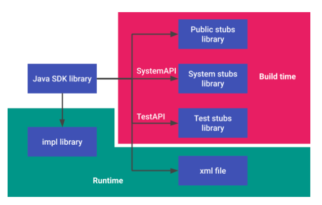

# 实现 Java SDK 库

Android 平台包含大量共享 Java 库，可以使用应用清单中的 `` 标记选择性将其纳入应用的类路径中。由于应用链接到这些库，因此在兼容性、API 审核和工具支持方面，应将其视为 Android API 的其余部分。不过，大多数库都没有这些功能。

Android 10 引入了 `java_sdk_library`，这是一个新的编译规则，可修复共享 Java 库的兼容性问题。设备制造商可以将此机制用于自己的共享 Java 库，以维护其 API 的向后兼容性。如果设备制造商通过 `` 标记（而不是 bootclass 路径）使用自己的共享 Java 库，则 `java_sdk_library` 可以验证这些 Java 库是否具备 API 稳定性。

`java_sdk_library` 是一个 Java 库，为应用实现可选的 SDK API。通过 make 文件 (`Android.bp`) 中的 `java_sdk_library` 实现的库执行以下操作：

- 生成存根库以包括 `stubs`、`stubs.system` 和 `stubs.test`。系统通过识别 `@hide`、`@SystemApi` 和 `@TestApi` 注释创建这些存根库。在编译时，当 SDK 版本分别为 `current`、`system_current` 和 `test_current` 时，它们会自动进行引用。
- Android 通过存根文件获取 API 列表，并通过将 master 中的当前 API 列表与最新发布的 Android 版本中的 API 列表进行比较来验证 API 是否以向后兼容的方式进行维护。
- 如果安装了运行时的实现库，则会生成并安装 XML 文件。



## 示例和来源

存根库的最小组件是必需的 `srcs` 和 `api_packages` 属性。

```
java_sdk_library {
        name: "com.android.future.usb.accessory",
        srcs: ["src/**/*.java"],
        api_packages: ["com.android.future.usb"],
    }
```

要编译用于运行时的 impl 库，请填充所有 `java_library` 属性，例如 `hostdex`、`compile_dex` 和 `errorprone`。

```
java_sdk_library {
        name: "android.test.base",

        srcs: ["src/**/*.java"],

        errorprone: {
          javacflags: ["-Xep:DepAnn:ERROR"],
        },

        hostdex: true,

        api_packages: [
            "android.test",
            "android.test.suitebuilder.annotation",
            "com.android.internal.util",
            "junit.framework",
        ],

        compile_dex: true,
    }
```

要创建存根库，请填充 `droidstubs` 属性，例如 `srcs_lib`、`srcs_lib_whitelist_dirs`、`srcs_lib_whitelist_pkgs`、`merge_annotations_dirs` 和 `merge_inclusion_annotations_dirs`。您还可以将以下属性用于存根库：

- `api_srcs`：可选源文件列表，属于 API，但不属于运行时库。
- `stubs_only_libs`：编译存根时类路径中的 Java 库列表。
- `hidden_api_packages`：必须从 API 隐藏的软件包名称列表。
- `droiddoc_options`：metalava 的附加参数。`java_sdk_library {     name: "android.test.mock",     srcs: ["src/**/*.java"],     api_packages: [       "android.test.mock",     ],     srcs_lib: "framework",     srcs_lib_whitelist_dirs: ["core/java"],     srcs_lib_whitelist_pkgs: ["android"],     compile_dex: true,   }`

### 保持向后兼容性

编译系统通过在编译时将最新的 API 文件与生成的 API 文件进行比较来检查 API 是否保持向后兼容性。此操作通过名为 `prebuilt_apis` 的新编译规则完成，该规则会创建预编译的存根库模块及 API 列表模块。使用 `java_sdk_library` 编译的所有库必须在 `prebuilt_apis` 中最新版本的 `api_dirs` 中包含 API 文件。当您发布版本时，可以使用 `PRODUCT-sdk_phone_armv7-sdk` 通过 dist build 获取 API 列表文件和存根库。

`api_dirs` 属性是 `prebuilt_apis` 中的 API 版本目录列表。API 版本目录应位于与 `Android.bp` 相同的目录级。

```
prebuilt_apis {
        name: "sdk",
        api_dirs: [
            "1",
            "2",
              ....
            "28",
            "current",
        ],
    }
```

在 prebuilts 目录下配置 `version/scope/api/` 结构的目录。`version` 对应于 API 级别，并且 `scope` 确定目录是公共、系统还是测试。

- `version/scope` 包含 Java 库。
- `version/scope/api` 包含 API `.txt` 文件。在此处创建名为 `module_name.txt` 和 `module_name-removed.txt` 的空文本文件。

```
├── 28
      │   ├── public
      │   │   ├── api
      │   │   │   ├── android.test.base-removed.txt
      │   │   │   └── android.test.base.txt
      │   │   └── android.test.base.jar
      │   ├── system
      │   │   ├── api
      │   │   │   ├── android.test.base-removed.txt
      │   │   │   └── android.test.base.txt
      │   │   └── android.test.base.jar
      │   └── test
      │       ├── api
      │       │   ├── android.test.base-removed.txt
      │       │   └── android.test.base.txt
      │       └── android.test.base.jar
      └── Android.bp
```